# WPF 源代码 从零开始写一个 UI 框架

需要知道 WPF 是一个 UI 框架，作为一个 UI 框架，最主要的就是交互。也就是 UI 框架需要有渲染显示和处理用户输入的功能。

如果直接告诉大家 WPF 里面有哪些类，估计没有几位小伙伴会听下去，要么就是讲的类太简单，看过去我也就知道了，要么就是这个类可能我一直都不会用到他，即使可能会用到也早就忘了。

本文不会直接告诉大家 WPF 的源代码是如何写的，而是从零开始一起来写一个 UI 框架，在写的过程就会了解到为什么 WPF 可以这样写，为什么需要这样写，和 WPF 这样写的好处。

本文适合 WPF 的开发者同样也适合其他语言希望自己写一个 UI 框架的小伙伴。

<!--more-->
<!-- CreateTime:2019/5/24 15:54:36 -->

<!-- csdn -->

这个故事的开始是有一天，前端的小伙伴在问我桌面端可以做的界面能否在前端也做出来。熟悉的小伙伴都认识我，我是不会前端的。于是我就向他请教，在前端里面有没有调用一个函数就可以做到在某个起点开始画圆？调用函数在某个起点画线段？调用函数在某个起点画点？画文字？画几何图形？画图片？ 他说有啊，有一个叫 Canvas 的控件，可以在里面做这些。我说那很棒，基本都可以做到。

<!-- 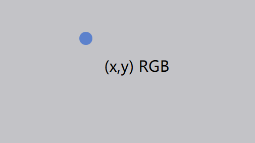 -->


前端小伙伴问那难不难，我就再问他，有没有一个东西，这个东西里面支持画点画线画文字这些，然后这个东西可以被画到 Canvas 的任何一个地方？虽然这句话比较饶，大概的意思就是 Canvas 可以嵌套 Canvas 类似的东西不？被嵌套的 Canvas 能否在任意的坐标开始画。解释清楚之后，前端小伙伴说可以啊。

于是我就回答他，那我可以写出一个框架，这样其他开发者就可以简单的进行开发了。

然后他问我，那么一个框架大概要写多久。我说三年……

……

当然，一个UI框架写三年速度是十分快的。好在本文是 WPF 的源代码，而不是手把手教大家如何写一个 UI 框架，所以本文不会写三年。为什么我会询问前端的小伙伴这些问题？因为我问的是绘制原语，只要能满足绘制原语，就可以做出一个 UI 框架的渲染显示部分。

更多的小伙伴关注的是渲染显示而不是输入层，实际上在渲染显示框架做好了之后，输入层也差不多完成了。本文的顺序就是先开始渲染显示框架是如何做的，然后在告诉大家输入层是如何做的。

一个UI框架实际就是包含渲染和交互两方面，其他的都是细节。

<!-- 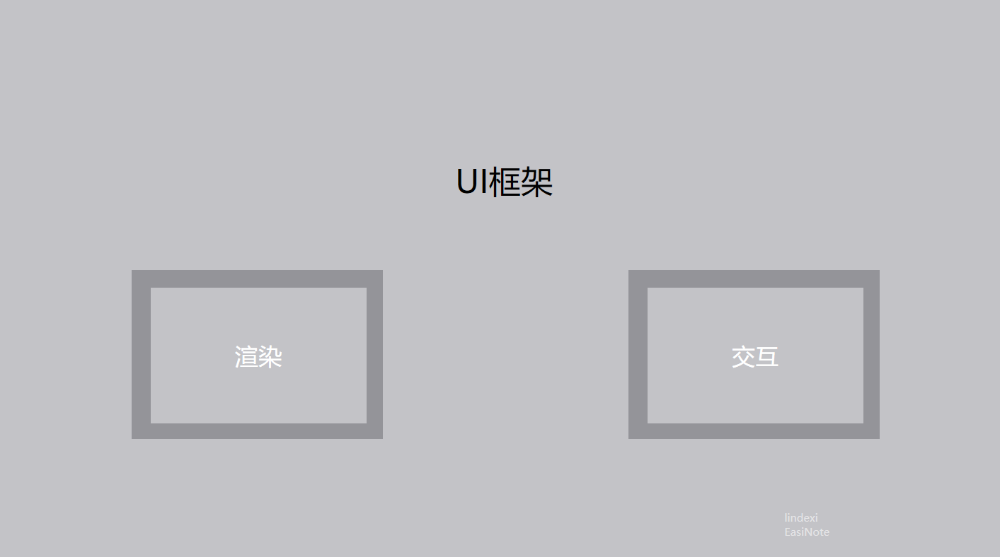 -->


刚才说道了绘制原语，需要解释一下，不知有没小伙伴不知道拼音的？如果学会了拼音，就可以使用拼音拼出普通话。电脑知道绘制原语就画出界面。从计算机图形学上，支持绘制原语就基本会画出所有的界面。

<!-- 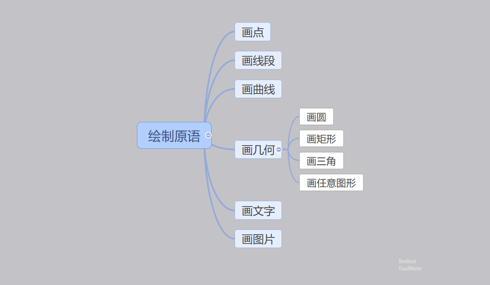 -->


能知道在任意坐标，画出任意颜色的点，理论上就可以画出任何的界面。如果还可以在任意的坐标，画出任意颜色的几何，几何包括填充或描线两个方式，就可以高效画出任何界面。至于其他的画圆、画文字、画图片这些，如果有，开发起来会更加简单。如果没有原生的支持，那么想要做一个高性能的UI框架是很难的。

本文不会告诉大家如何通过只能画点封装出来画圆、画图片这些。先假设底层已经支持了绘制原语，现在开始封装一个 UI 框架。

在开始之前，需要引用画布的概念。假设一个界面就是一个画布，这个画布的左上角就是(0,0)的点，坐标就是从左向右 x 变大，从上到下 y 变大。具体请看下图。

<!-- 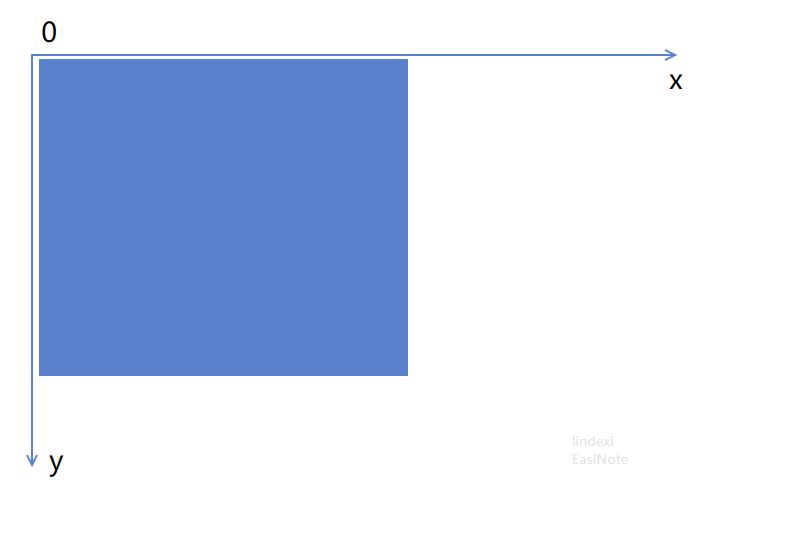 -->


再引入元素的概念，元素的边框就是一个矩形，元素将可以在自己的矩形之内使用绘制原语画出元素。元素的概念属于框架级的，也就是原生是没有这个概念，原生只有绘制原语的概念。

有了元素之后，一个 UI 框架的最简单的实现就已经完成了。但是这样的元素还无法做到灵活的画出界面，只是基本要求可以满足。虽然说简单，这部分的代码还是需要讲一下。

下面的代码是对应到 WPF 的布局和 UIElement 的 OnRender 方法，在看完本文就知道 UIElement 为什么需要 OnRender 的设计，以及 OnRender 设计的好处。

元素声明自己的坐标，只要不添加布局元素就可以不声明自己的宽度和高度。所有的在元素内部的绘制都是相对于元素自身的左上角坐标。

刚才说道的简单的绘制原语里面是在任意的坐标画出，而不是特定坐标，如果想要依靠元素的左上角，就需要再做一层封装。

还记得刚才的第二个问题，是否存在某个东西，这个东西可以在上面绘制，然后这个东西本身也可以被绘制到画布的任何坐标的问题。这个问题就是询问原生是否有支持在设置绘制原语的坐标的左上角为元素的左上角的东西，然后根据元素所在画布的坐标，画出这个东西。

如果有的话，就可以少封装一些内容，如果没有自己写也是可以的。于是先来写出这个东西的封装，一旦封装了这个东西，就需要同时封装了整个绘制原语。封装有一个好处，如果某个实现的原生框架不支持某个绘制原语还可以通过这一层进行实现。想要实现他就需要给一个命名，在 WPF 里面这个叫 DrawingContext 于是这里来实现一套。

需要注意本文下面实现的是简单版的 DrawingContext 里面包含了 WPF 布局的部分代码

```csharp
    public class DrawingContext
    {
        /// <inheritdoc />
        public DrawingContext(Point elementPoint, Board board)
        {
            ElementPoint = elementPoint;
            Board = board;
        }

        public Point ElementPoint { get; }

        public Board Board { get; }

        public void DrawEllipse(Point point, double radiusX, double radiusY, Color? pen, Color? brush)
        {
            
        }
    }
```

从上面代码可以看到，这个 DrawingContext 包含了以下属性。这里是为了提供为其他语言的小伙伴可以知道设计 DrawingContext 需要哪些内容 

 - 元素所在上一层的 x y 坐标
 - 画布本身

和提供了绘制原语的方法，大家也不会想看到每个的实现，所以我就使用画椭圆为例子。

这个 DrawingContext 里的属性都是注入的，因为现在的 UI 框架只有画布和元素两个，所以注入 DrawingContext 就需要在画布中做。

定义一个画布 Board 这个画布里面拥有直接调用原生的绘制原语的方法，画布里面可以包含元素。定义的代码请看下面

```csharp
    public class Board
    {
        public List<Element> ElementList { get; } = new List<Element>();

        public IPlatformVisual PlatformVisual { get; set; }

        public void InvalidateVisual()
        {
            foreach (var temp in ElementList)
            {
                var dc = new DrawingContext(temp.Point, this);
                temp.OnRender(dc);
            }
        }
    }
```

画布包含的属性列表是

 - 元素集合

 - 原生的绘制类

画布现在就包含一个方法

 - 渲染方法 调用这个方法就会触发渲染

这里的原生的绘制的类，是需要根据不同的平台来做的，有一些平台，如 OPG 是只有调用方法，于是就需要自己封装一个类包含这些方法，进行注入。

从上面的代码可以看到，画布的渲染方法 InvalidateVisual 需要被调用才可以绘制，实际的 WPF 框架也是这样，在 WPF 是通过 dx 的垂直同步或者 `WM_Paint` 消息进行绘制的。在 WPF 可以通过监听 CompositionTarget.Rendering 事件获得 WPF 进行渲染。

因为使用了元素，为了写出画布的渲染方法需要先告诉大家元素的定义。

```csharp
    public class Element
    {
        public Point Point { get; set; }

        public virtual void OnRender(DrawingContext dc)
        {
        }
    }
```

元素的定义属性只有元素的坐标，元素的方法也只有渲染方法

现在开始填充画板的渲染方法代码，和元素的渲染方法代码

```csharp
    public interface IPlatformVisual
    {
        void DrawEllipse(Point point, double radiusX, double radiusY, Color? pen, Color? brush);
    }

    public class Board
    {
        public void DrawEllipse(Point point, double radiusX, double radiusY, Color? pen, Color? brush)
        {
            PlatformVisual.DrawEllipse(point, radiusX, radiusY, pen, brush);
        }
    }
```

元素的渲染是通过 DrawingContext 渲染，在 DrawEllipse 方法需要将元素给的画出来的坐标加上元素的坐标，然后就直接调用 Board 的方法

```csharp
    public class DrawingContext
    {

        public void DrawEllipse(Point point, double radiusX, double radiusY, Color? pen, Color? brush)
        {
            point = new Point(ElementPoint.X + point.X, ElementPoint.Y + point.Y);
            Board.DrawEllipse(point, radiusX, radiusY, pen, brush);
        }
    }

```
现在一个最简单的 UI 框架已经完成，虽然还没有写输入的代码，验证这个 UI 框架是否可行，可以使用真实的代码跑一下。

我使用 win2d 作为原生的绘制方法，除了 win2d 其他的代码都是我自己写的。

第一步就是封装一下 win2d 的代码，这样 win2d 的概念在下面也就不会提及了。即使有提交也只是 win2d 的 [CanvasCommandList](https://blog.lindexi.com/post/win2d-CanvasCommandList-%E4%BD%BF%E7%94%A8%E6%96%B9%E6%B3%95.html) 刚才封装的画板的渲染方法，需要支持元素在某个坐标绘制写了很多代码，而在 win2d 因为存在了[CanvasCommandList](https://lindexi.gitee.io/post/win2d-CanvasCommandList-%E4%BD%BF%E7%94%A8%E6%96%B9%E6%B3%95.html)只需要使用很少量的代码就可以做到，因为[CanvasCommandList](https://lindexi.gitee.io/post/win2d-CanvasCommandList-%E4%BD%BF%E7%94%A8%E6%96%B9%E6%B3%95.html)支持在里面绘制，然后在 Canvas 的任意坐标画出[CanvasCommandList](https://lindexi.gitee.io/post/win2d-CanvasCommandList-%E4%BD%BF%E7%94%A8%E6%96%B9%E6%B3%95.html) 这样就可以完成画布的渲染方法。

这里的 IPlatformVisual 就是平台的元素渲染接口，本文使用 win2d 需要继承这个接口实现一个类

```csharp
   public class DrawVisual : IPlatformVisual
    {
        /// <inheritdoc />
        public void DrawEllipse(Point point, double radiusX, double radiusY, Color? pen, Color? brush)
        {
            DrawVisualList.Add(ds =>
            {
                if (pen != null)
                {
                    ds.DrawEllipse((float) point.X, (float) point.Y, (float) radiusX, (float) radiusY, pen.Value);
                }

                if (brush != null)
                {
                    ds.FillEllipse((float) point.X, (float) point.Y, (float) radiusX, (float) radiusY, brush.Value);
                }
            });
        }

        public List<Action<CanvasDrawingSession>> DrawVisualList { get; } = new List<Action<CanvasDrawingSession>>();
    }
```

这个 DrawVisual 类的实现是将调用的方法暂时放在列表，等待调用才画出。在不同的平台可以使用不同的实现，只要调用了对应的方法就可以在界面画出就可以

第二步是创建一个元素继承元素，创建的元素就叫椭圆，这个元素就是画出椭圆。

```csharp
    public class Ellipse : Element
    {
        public override void OnRender(DrawingContext dc)
        {
            dc.DrawEllipse(new Point(10, 10), 5, 5, null, Colors.Black);
        }
    }
```

第三步尝试在画板画出元素，创建一个 Board 出来，这就是画布。然后给画布注入渲染平台，也就是 `board.PlatformVisual = new DrawVisual()` 然后添加进入元素，接着调用 InvalidateVisual 方法触发绘制

```csharp
            var board = new Board();

            board.PlatformVisual = new DrawVisual();

            board.ElementList.Add(new Ellipse());

            board.InvalidateVisual();
```

为了真的进行绘制，需要在 Win2D 的绘制方法做一点处理，因为调用 InvalidateVisual 是制作委托的方法进行绘制，也就是在 Board 里面调用元素的 OnRender 方法实际在 OnRender 方法调用 DrawVisual 的 DrawEllipse 不是立刻绘制到 win2d 而是将绘制存放到 DrawVisualList 里面，在实际的 Win2D 绘制的时候就需要拿到绘制，下面是 Win2D 的画布的 Draw 事件的代码

```csharp
       private void Canvas_OnDraw(CanvasControl sender, CanvasDrawEventArgs args)
        {
            using (var ds = args.DrawingSession)
            {
                foreach (var temp in ((DrawVisual) board.PlatformVisual).DrawVisualList)
                {
                    temp(ds);
                }
            }
        }
```

运行一下，已经可以看到最简单的UI框架的元素已经完成，只是在 WPF 中调用 DrawContext 也不是进行立刻绘制，是需要发送到另一个线程进行绘制，和上面使用的方法差不多。调用绘制方法是存放如何绘制，只有在另一个线程才是读取绘制如何绘制画出元素。

那么为什么需要经过 DrawingContext 的中转？请看下面的介绍，因为不是所有小伙伴都可以看懂 C# 的代码，所以就尽量使用说明的方式而不是真的写一个 UI 框架

刚才只是实现了画布和元素的绘制，但是元素是有基础元素和组合元素，上面所说的元素都是基础元素，基础元素就只包括绘制原语绘制出来的一个图形。

<!-- 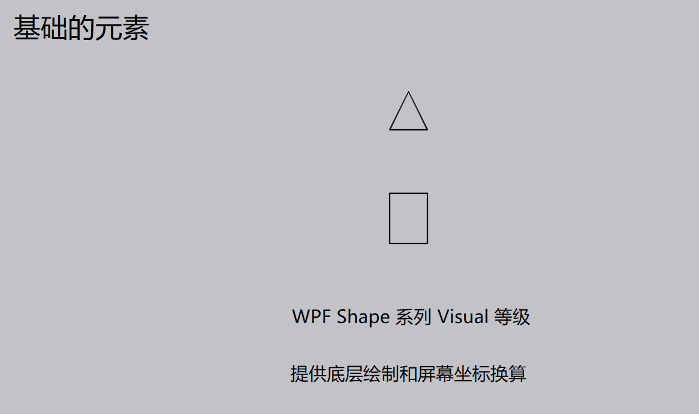 -->


这里定义简单元素和组合元素，简单元素是由多个基础元素组成

<!-- 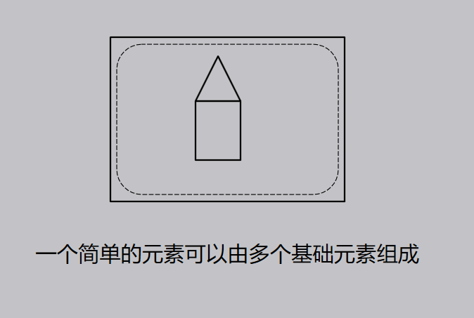 -->


多个简单的元素可以作为一个复杂元素，复杂元素实际就是 WPF 的按钮等元素

<!-- 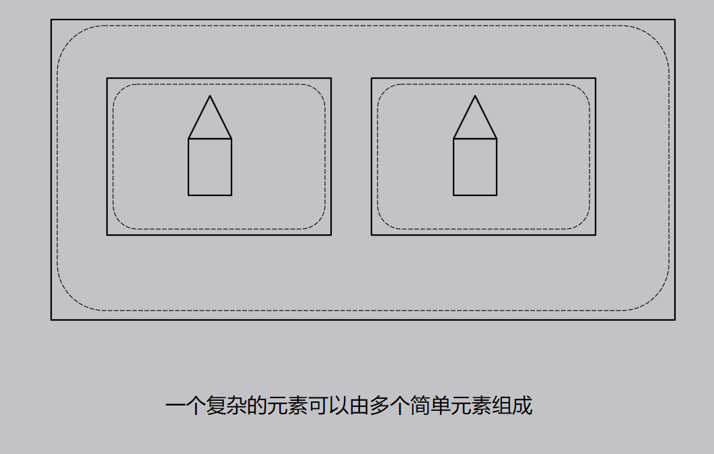 -->


从定义可以看到，如果是一个简单元素，基础元素之间如何确定坐标？难道需要知道基础元素构成的简单元素所在画布的坐标，然后再计算基础元素相对于简单元素的内部坐标画在画布上？

<!-- 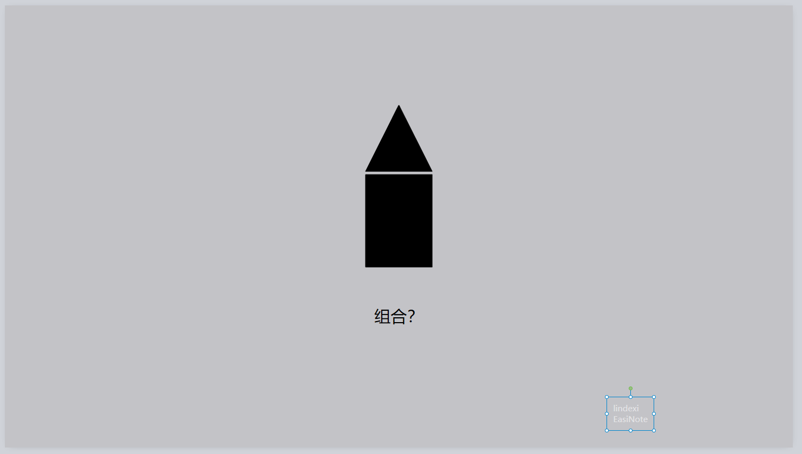 -->


框架就是用来做这部分的封装，这时需要引入容器的概念。

<!-- 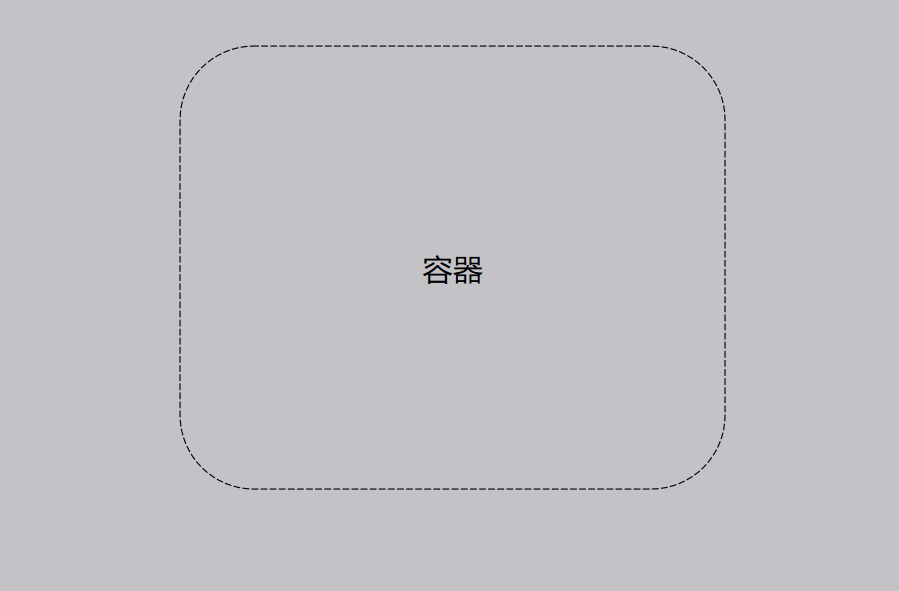 -->


容器本身在画布上是有 Bounds 的概念，也就是容器相对于画布的坐标和容器本身的宽度和高度，同时容器提供容器内的坐标。

<!-- 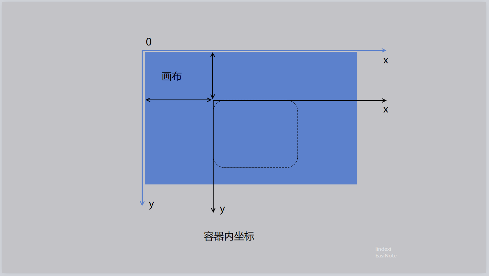 -->


如果在容器内部放一个元素，元素只需要知道容器，不需要知道容器之外。元素知道元素在容器内部的坐标就可以，容器知道容器在画布的坐标，于是画出元素就只需要将元素的坐标加上容器的坐标

<!-- 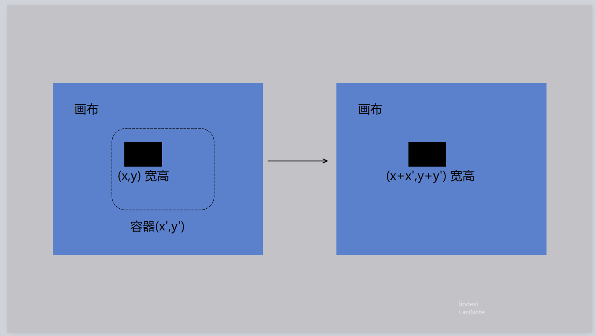 -->


现在可以看到画布有坐标、宽高的概念，容器有坐标、宽高的概念，元素也有坐标和宽高的概念，有了这些就可以开始做布局

<!-- 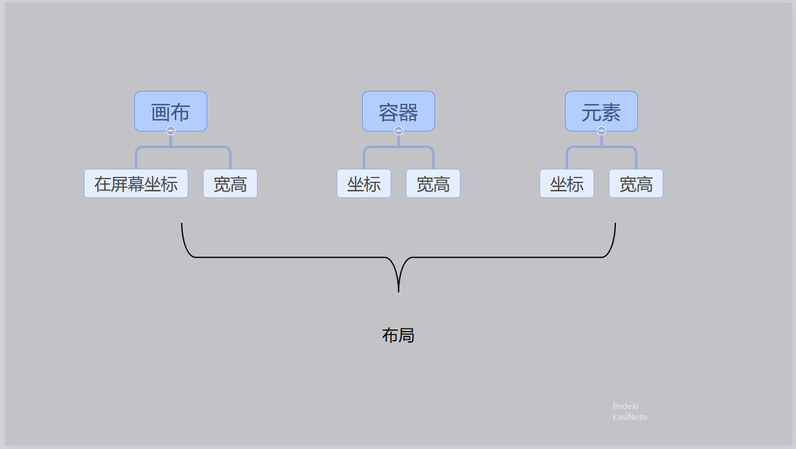 -->


这里布局的方法是采用矩形布局的方法，矩形布局就是将所有的元素和容器都看做矩形，对矩形进行布局。当前的 WPF 就是使用矩形布局的方法，这个方法的性能很高。当然本文不会考虑旋转，不规则元素和透明元素的布局。

刚才看到了画布和容器都有相同的概念，于是可以将画布和容器抽象为容器

<!-- 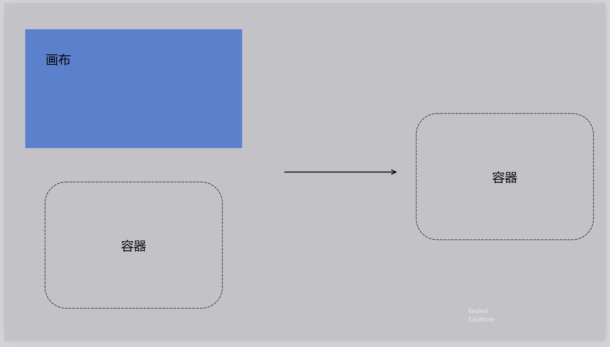 -->


容器和复杂元素都可以抽象为元素，容器里面可以放元素，元素里面可以通过容器再放元素。就和WPF的控件一样，在 WPF 的用户控件是可以放 Grid 的，这是一个面板控件，里面还可以继续套普通的元素或者再套一个 Grid 控件

<!--  -->


这里是将容器看做特殊的元素，因为容器本身可以放元素，如果放的元素是容器，那么容器内部就可以嵌套容器。

于是一个复杂的元素，实际上就是容器和简单元素的组合

<!-- 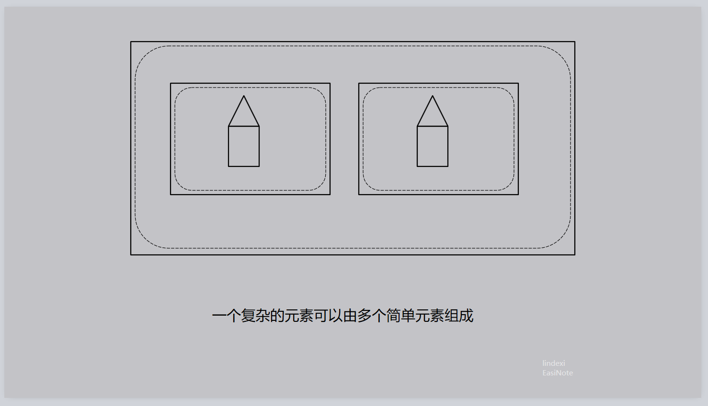 -->


现在容器的概念已经清楚了，布局做的就是解决容器内部的元素如何排列的问题

<!-- 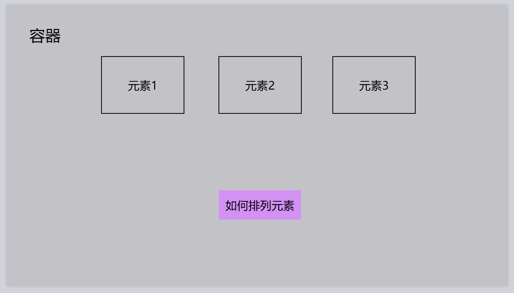 -->


在 WPF 中有很多布局的控件，布局的控件如 Grid 等这些，实际上就是按照一定的规则排列元素

<!-- 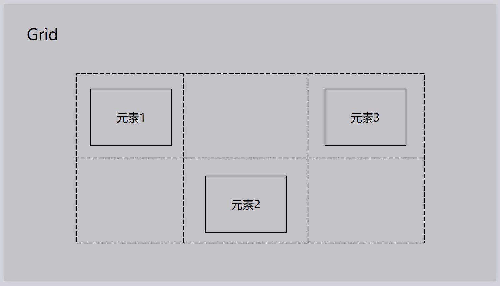 -->


但是如 StackPanel 的控件，在排列元素布局之前，是需要知道元素的宽高和大小的

<!-- 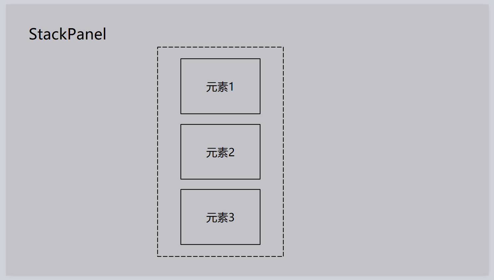 -->


于是容器在布局之前是需要先做测量，测量就是获得容器里面的元素的宽度和高度。但是容器里面的元素假如是容器，就需要递归询问元素

<!-- 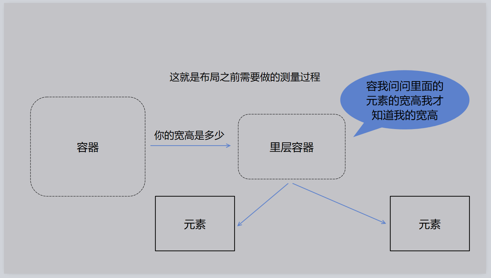 -->


在知道了每个元素的宽高，如何布局就是业务的事情，这里就不是框架内部需要做的

<!-- 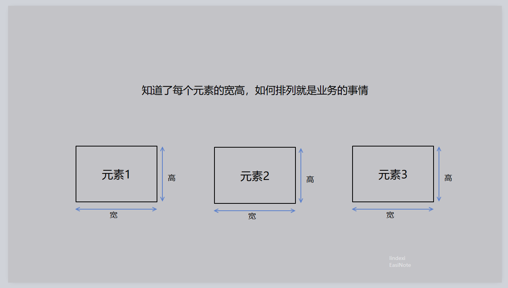 -->


布局完成了，渲染也就是十分简单了，如有一个基础的元素，需要在画布渲染，只需要将这个元素外层所有容器的坐标和元素自己相对于容器的坐标加起来就可以计算出元素在画布的坐标，画出元素就可以了。

这样将一层层容器和元素组成的树就成为视觉树

<!-- 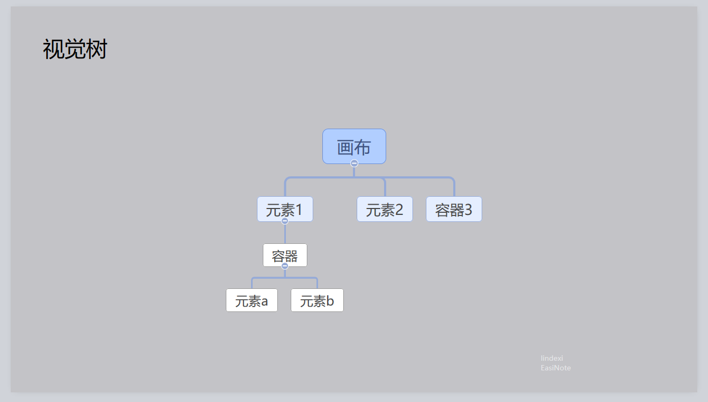 -->


渲染的时候需要一层层遍历视觉树，然后加上坐标。当然这些都应该在框架内部做，还记得刚才创建基础元素的 DrawingContext 不？

在 DrawingContext 很重要的就是包含元素坐标，也就是外层坐标，表示元素相对于外层画布的坐标。这个坐标不会让用户进行设置，需要框架内部进行设置

<!-- 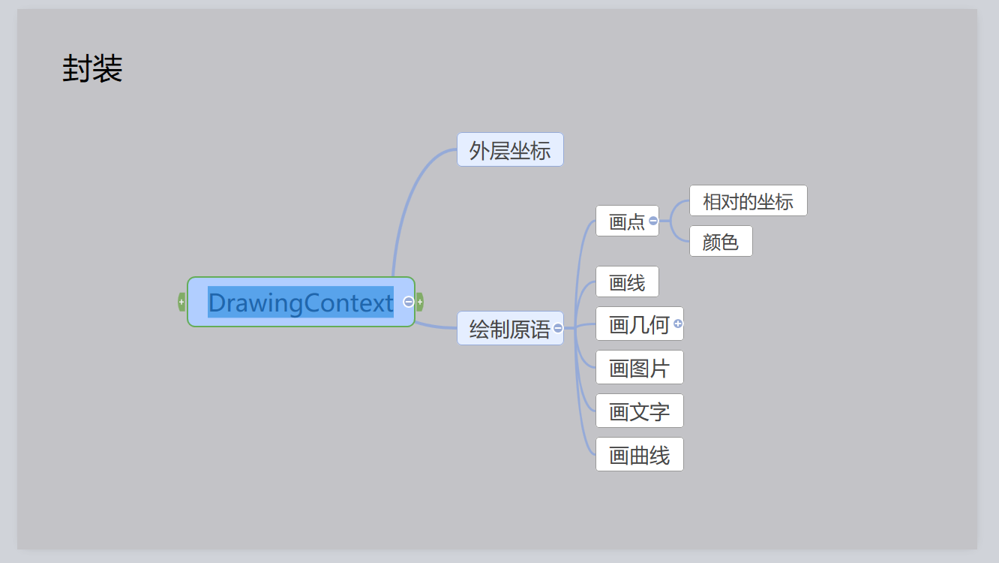 -->


在上面已经实现了画椭圆的方法，其他的方法假设都已经实现了。绘制的时候都是按照元素自己的坐标进行绘制椭圆的，但是在绘制的时候需要加上元素的外层坐标才可以在画布的正确的坐标进行绘制

那么这个 DrawingContext 是从哪里创建的，这个 DrawingContext 是从画布开始创建，然后一层层封装传进每一个元素。

<!-- 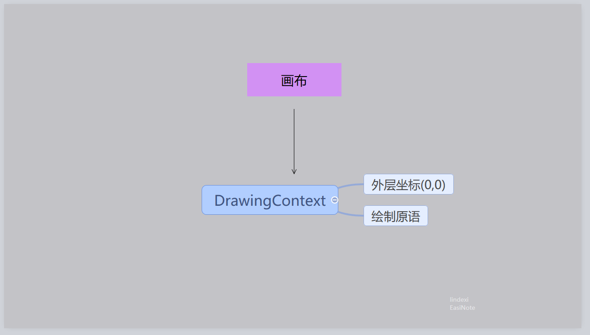 -->


于是画布会找到画布里面的所有元素，对每个元素都创建一个 DrawingContext 给他，但是绘制原语部分都是引用相同的平台绘制

<!-- 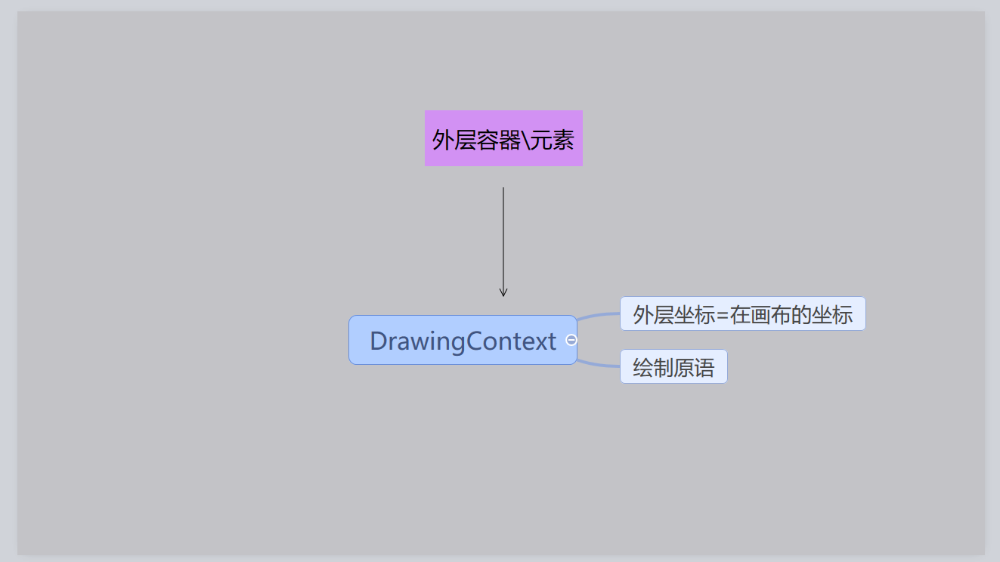 -->


对于容器里面的元素，就需要递归给每个元素创建一个新的 DrawingContext 叠加上容器本身的外层坐标加上元素在容器的偏移的坐标

<!-- 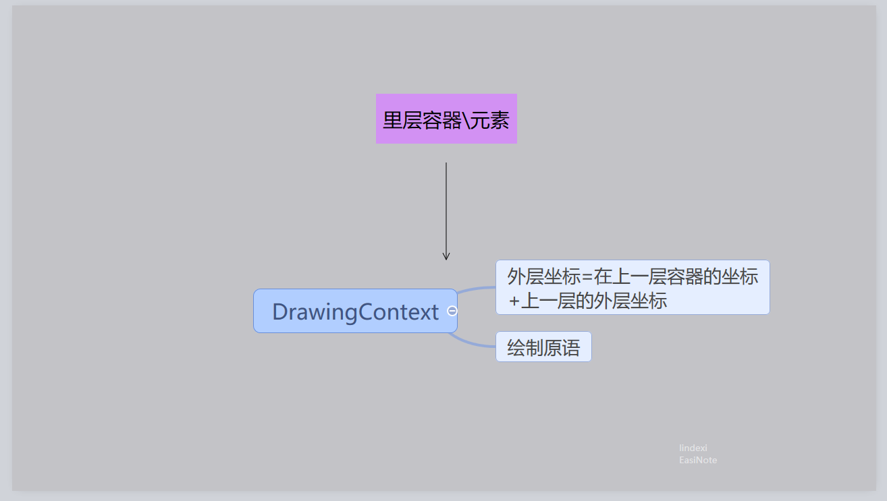 -->


于是这样一层层加上去就可以做到传给基础元素的时候已经计算好了基础元素相对于画布的坐标

这就是为什么元素需要有一个 OnRender 方法的原因，在每个元素的 OnRender 方法都可以让外层的容器注入 DrawingContext 在传入的 DrawingContext 里面添加元素相对于外层容器的坐标和外层容器的外层坐标的信息，从而投影元素到画布上

<!-- 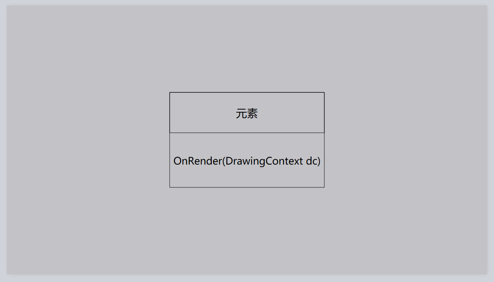 -->


从原理就可以知道如何封装绘制的接口，在元素进行渲染的时候，需要判断元素是否基础元素，如果不是基础元素就需要封装 DrawingContext 传入元素里面的元素，也就是外层容器拿到自己的 DrawingContext 封装为给每个元素的 DrawingContext 传入元素的绘制方法

<!-- 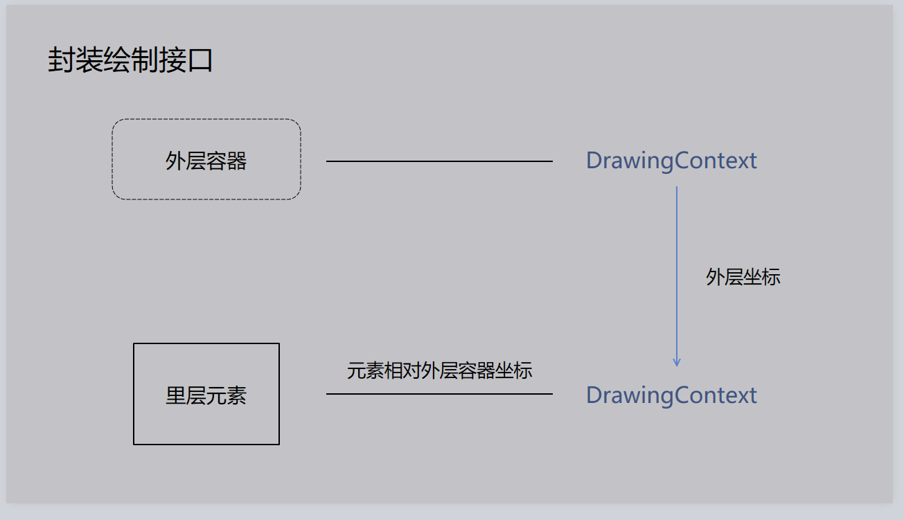 -->


此时对于基础元素只需要关注元素内部的坐标进行绘制，如绘制一个三角形，就需要知道三角形是在元素的哪里进行绘制，而不需要关注这个元素是被放在哪里

<!-- 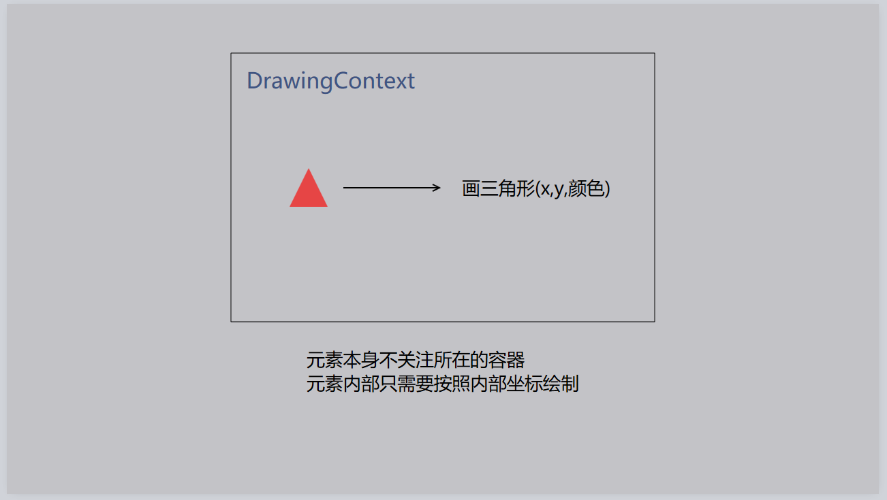 -->


但是元素调用的绘制方法，如上面的代码实际是掉基础渲染的方法，在基础渲染的方法修改坐标加上外层坐标

<!-- 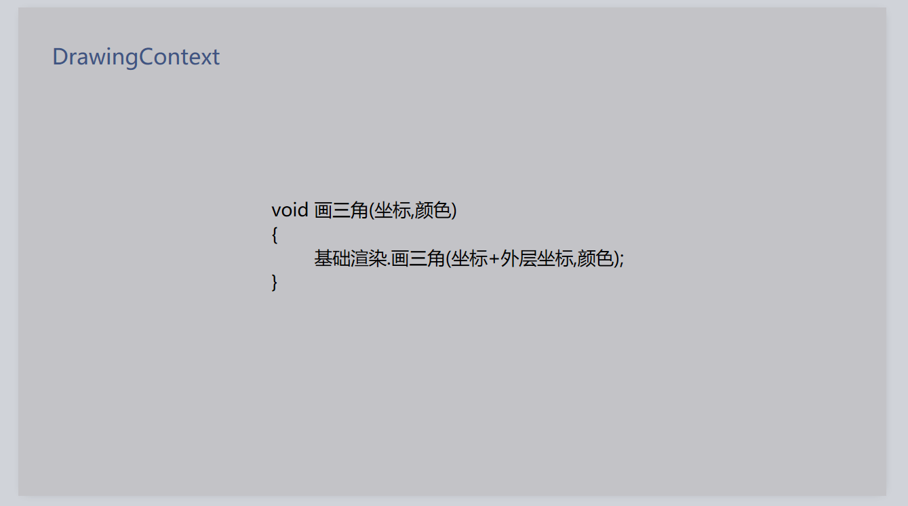 -->


框架的工作就是将画布视为容器，将容器视为元素，递归调用元素渲染，同时在调用的过程不断根据元素封装 DrawingContext 的坐标，当然对于基础元素就直接调用绘制的方法

<!-- 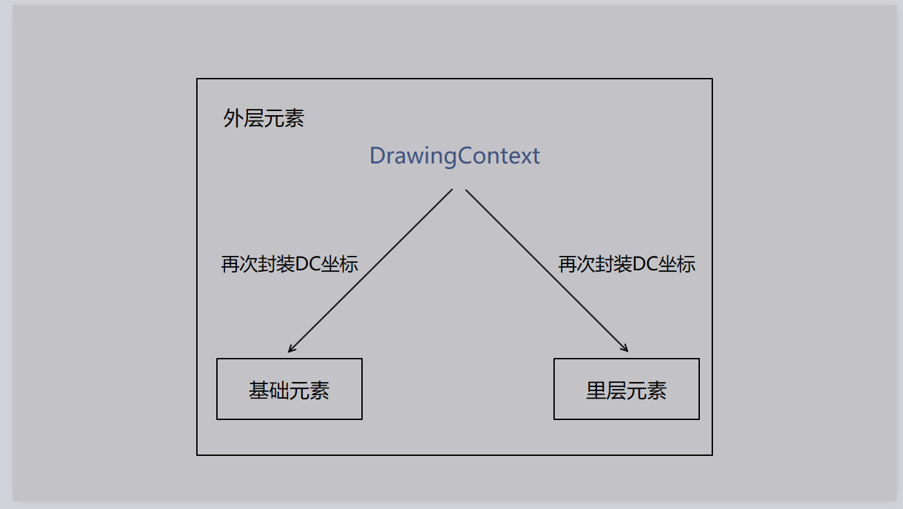 -->


这样就可以将元素投影到画布上，在渲染的时候是没有容器的概念，也没有复杂元素的概念，只有基础的元素的概念

<!-- 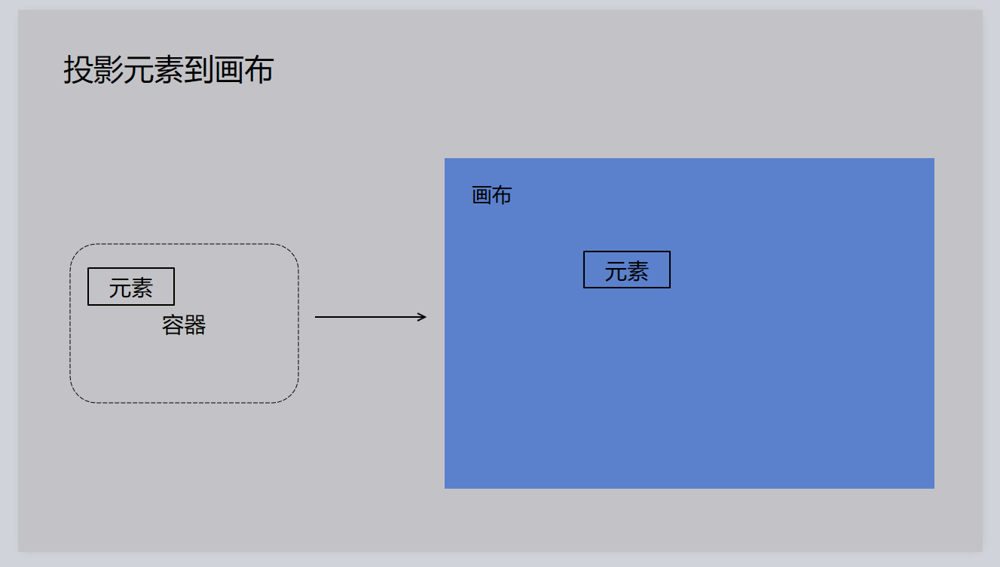 -->


等等，是不是忘了什么，元素的层级怎么办？

元素的层级需要在控件布局的时候确定，实际上元素的层级只是调用元素渲染的顺序而已，按照调用顺序的不同从而确定了元素的层级。

<!-- 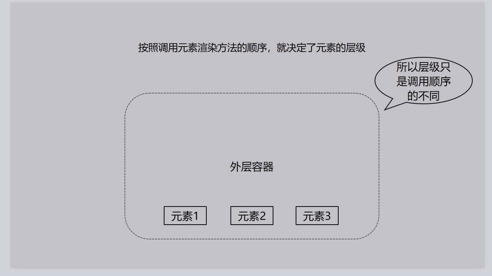 -->


现在就可以说，布局完成了，渲染也就完成了。

实际上布局完成了，交互也就完成了。

因为在这个框架，交互是非常好做的，每个元素都可以认为是矩形，进行矩形布局，加入有用户点击了画布的某个点

<!-- 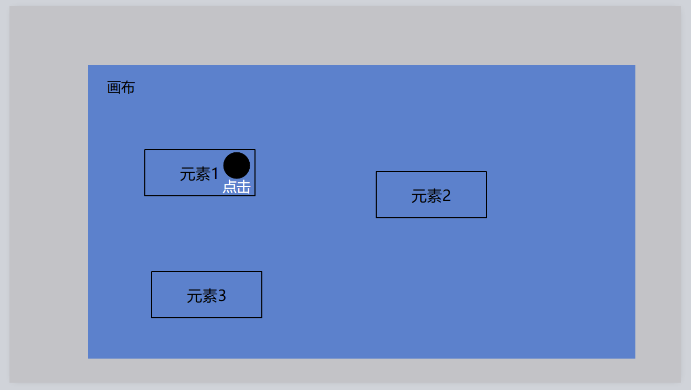 -->


此时需要按照元素的层级排序，因为顶层的元素会挡住底层的元素，需要先计算顶层元素的命中测试才能计算底层的元素。当然在层级排序的时候需要去掉不做交互的元素。

<!-- 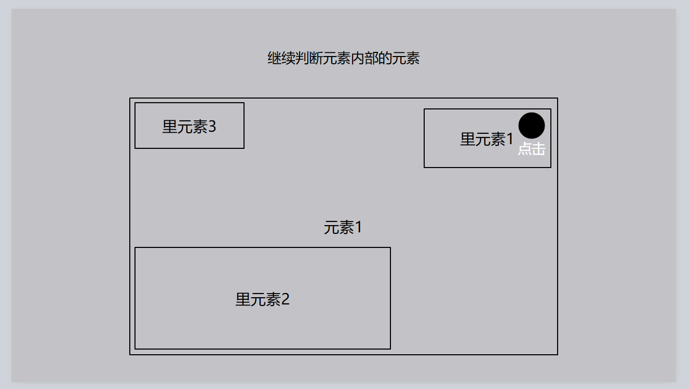 -->


元素的命中测试就是判断点击是否在元素的矩形内，如果在元素的矩形内，就在元素内部再寻找是否在元素里面的元素的矩形内，递归找到最底层的元素，然后告诉他，被命中了。

在寻找的一路，同时需要记录上来，到时候就一层层元素进行触发。

当触发到某一层元素发现这一层元素可以处理的时候，就停止了事件往上发送，这就是路由事件的做法。先一层层往下寻找，然后再一层层往上冒泡

<!-- 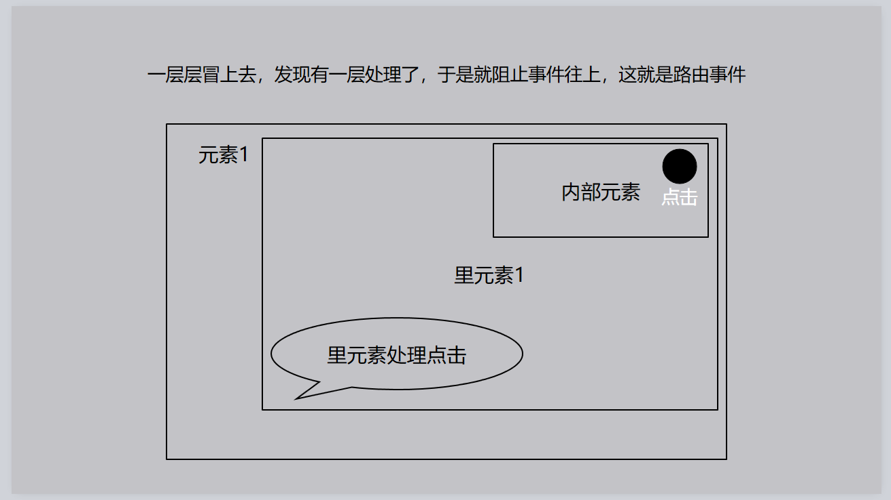 -->


总结一下，框架主要包含的就是对基础的渲染进行封装，元素的概念，在元素之上做了容器，有了容器就可以用来做布局。有了布局就可以让基础元素不需要关注外层的坐标，同时有了布局容器可以做注入渲染，有了注入渲染需要进行封装接口，同时布局之后可以按照调用渲染的顺序做出元素的层级。在布局完成了也就确定了每个元素的矩形范围，这时就可以用来做命中测试

<!-- 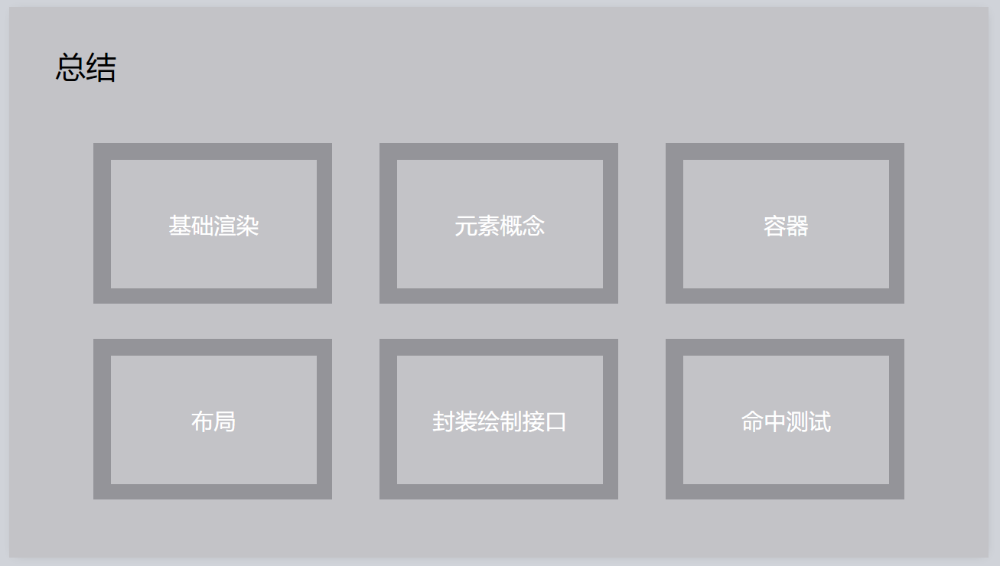 -->


这就是 UI 框架最核心的内容，看起来还是很简单的，对照博客看看 WPF 的源代码，其实很容易就理解 WPF 是如何封装。对应起来的就是 Visual 提供了对基础的渲染的封装，其实写一个 DrawingVisual 去查看里面的方法，在 RenderDataDrawingContext 里面就对底层的绘制进行了封装。在 WPF 底层的绘制提供的是 RenderData 的方法进行收集，之后发送给渲染线程，但是通过 RenderDataDrawingContext 继承抽象的 DrawingContext 的类可以封装为容易使用的方法

如果想要做跨平台就是需要抽象平台提供的绘制方法，从而注入到 DrawingContext 里面，对于平台没有提供的绘制方法可以通过计算的方式做出来。

在 WPF 对应的元素的概念就是 UIElement 的概念，在容器对应 Panel 的概念，可以看到 Panel 是继承 UIElement 的，在布局上就是通过 FrameworkElement 进行限制的布局，当然基础的 UIElement 也是可以参加布局，这里和本文没有直接的对应。

在 WPF 做出一个漂亮的界面有基础的框架是不够的，还需要有动画、样式和很多基础的方法才可以做出来，做一个框架时间最长的也就是这些细节，而不是框架的核心。

关于 WPF 的渲染 [WPF 渲染原理](https://blog.lindexi.com/post/WPF-%E6%B8%B2%E6%9F%93%E5%8E%9F%E7%90%86.html )

从 [WPF 触摸到事件](https://blog.lindexi.com/post/WPF-%E8%A7%A6%E6%91%B8%E5%88%B0%E4%BA%8B%E4%BB%B6.html ) 也可以了解 WPF 是有多厉害，同时一个大的框架也会存在很多坑，现在 WPF 已经开源了，如果遇到问题，可以在 github 上面提 issus 或者直接修改

[https://github.com/dotnet/wpf/issues](https://github.com/dotnet/wpf/issues)

课程视频

<!--  -->

[](https://r302.cc/jLj33n)

<a rel="license" href="http://creativecommons.org/licenses/by-nc-sa/4.0/"></a><br />本作品采用<a rel="license" href="http://creativecommons.org/licenses/by-nc-sa/4.0/">知识共享署名-非商业性使用-相同方式共享 4.0 国际许可协议</a>进行许可。欢迎转载、使用、重新发布，但务必保留文章署名[林德熙](http://blog.csdn.net/lindexi_gd)(包含链接:http://blog.csdn.net/lindexi_gd )，不得用于商业目的，基于本文修改后的作品务必以相同的许可发布。如有任何疑问，请与我[联系](mailto:lindexi_gd@163.com)。
