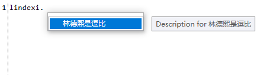

# WPF 用 AvalonEdit 开发简单的代码编辑器 支持高亮自动提示

用 WPF 开发一个代码编辑器的难度很低，因为行业里面有很多小伙伴开发过，这些小伙伴将自己的代码开源了，发布到 NuGet 上，所以让我开发一个代码编辑器的难度实在太低。在不要有奇特的要求情况下，通过 AvalonEdit 可以快速开发出自己想要的代码编辑器

<!--more-->
<!-- CreateTime:2020/1/22 17:11:30 -->

<!-- 发布 -->

第一步通过 NuGet 安装 [AvalonEdit](https://www.nuget.org/packages/AvalonEdit ) 打开 xaml 界面，添加控件，此时可以在界面设置代码高亮方式等

```xml
        <avalonEdit:TextEditor
            xmlns:avalonEdit="http://icsharpcode.net/sharpdevelop/avalonedit"
            Name="TextEditor"
            SyntaxHighlighting="C#"
            FontFamily="Consolas"
            FontSize="10pt" 
            LineNumbersForeground="Black" 
            ShowLineNumbers="True">
            <avalonEdit:TextEditor.Options>
                <avalonEdit:TextEditorOptions ShowSpaces="True" >
                    <avalonEdit:TextEditorOptions.ColumnRulerPosition>
                        <system:Int32>10</system:Int32>
                    </avalonEdit:TextEditorOptions.ColumnRulerPosition>
                </avalonEdit:TextEditorOptions>
            </avalonEdit:TextEditor.Options>
        </avalonEdit:TextEditor>
```

下面是详细一点的参数含义

第二句话的 `xmlns:avalonEdit="http://icsharpcode.net/sharpdevelop/avalonedit"` 是命名空间

设置 AvalonEdit 进行代码高亮，可以自定义高亮颜色等，设置对 C# 代码进行高亮方法是 `SyntaxHighlighting="C#"` 而对 xml 高亮的方法自然就是将 C# 修改为 XML 请看代码

```csharp
            SyntaxHighlighting="XML"
```

设置 AvalonEdit 的代码字体和大小分别是 FontFamily 和 FontSize 属性

很多代码编辑器都有行号，通过 `ShowLineNumbers` 属性让自己用 WPF 写的代码编辑器可以显示行号

```csharp
ShowLineNumbers="True"
```

作为代码编辑器，还有一项功能是需要将空格用 `·` 显示，通过设置 TextEditorOptions 的方法

```xml
            <avalonEdit:TextEditor.Options>
                <avalonEdit:TextEditorOptions ShowSpaces="True" >
                    <avalonEdit:TextEditorOptions.ColumnRulerPosition>
                        <system:Int32>10</system:Int32>
                    </avalonEdit:TextEditorOptions.ColumnRulerPosition>
                </avalonEdit:TextEditorOptions>
            </avalonEdit:TextEditor.Options>
```

代码对齐很重要，最简单的代码对齐就是继承上一行的空格数量，通过下面属性让 AvalonEdit 支持设置继承上一行的行首空格

```xml
            <avalonEdit:TextEditor.Options>
                <avalonEdit:TextEditorOptions ShowSpaces="True" WordWrapIndentation="4" InheritWordWrapIndentation="true">
                    <avalonEdit:TextEditorOptions.ColumnRulerPosition>
                        <system:Int32>10</system:Int32>
                    </avalonEdit:TextEditorOptions.ColumnRulerPosition>
                </avalonEdit:TextEditorOptions>
            </avalonEdit:TextEditor.Options>
```

作为代码编辑器，如何能不自动提示？自动提示也就是用户输入特殊字符时，如空格和 `.` 提示用户可以输入的内容

在用户输入特殊字符触发特定事件可以通过下面代码

```csharp
        public MainWindow()
        {
            InitializeComponent();
            TextEditor.TextArea.TextEntered += TextAreaOnTextEntered;
        }

        private void TextAreaOnTextEntered(object sender, TextCompositionEventArgs e)
        {
            if (e.Text == ".")
            {
            }
        }
```

上面代码将会在用户输入 `.` 进入判断

在 AvalonEdit 通过 CompletionWindow 类做到代码自动补全，需要先自己继承 ICompletionData 接口创建提示数据

```csharp
    public class CompletionData : ICompletionData
    {
        public CompletionData(string text)
        {
            Text = text;
        }

        public ImageSource Image => null;

        public string Text { get;  }

        public object Content => Text;

        public object Description => "Description for " + this.Text;

        /// <inheritdoc />
        public double Priority { get; }

        public void Complete(TextArea textArea, ISegment completionSegment,
            EventArgs insertionRequestEventArgs)
        {
            textArea.Document.Replace(completionSegment, Text);
        }
    }
```

基本上看到参数大家都理解这是用来做什么

创建CompletionWindow然后显示代码如下

```csharp
        private void TextAreaOnTextEntered(object sender, TextCompositionEventArgs e)
        {
            if (e.Text == ".")
            {
                _completionWindow = new CompletionWindow(TextEditor.TextArea);

                var completionData = _completionWindow.CompletionList.CompletionData;
                completionData.Add(new CompletionData("林德熙是逗比"));
                _completionWindow.Show();

                _completionWindow.Closed += (o, args) => _completionWindow = null;
            }
        }

        private CompletionWindow _completionWindow;
```

大概的效果如下

<!--  -->


本文的代码放在 [github](https://github.com/lindexi/lindexi_gd/tree/7d40e0de674f9892b6fce9014f07074de47bfe75/NakacehenaHemqawhearlel) 欢迎小伙伴访问

<a rel="license" href="http://creativecommons.org/licenses/by-nc-sa/4.0/"></a><br />本作品采用<a rel="license" href="http://creativecommons.org/licenses/by-nc-sa/4.0/">知识共享署名-非商业性使用-相同方式共享 4.0 国际许可协议</a>进行许可。欢迎转载、使用、重新发布，但务必保留文章署名[林德熙](http://blog.csdn.net/lindexi_gd)(包含链接:http://blog.csdn.net/lindexi_gd )，不得用于商业目的，基于本文修改后的作品务必以相同的许可发布。如有任何疑问，请与我[联系](mailto:lindexi_gd@163.com)。
