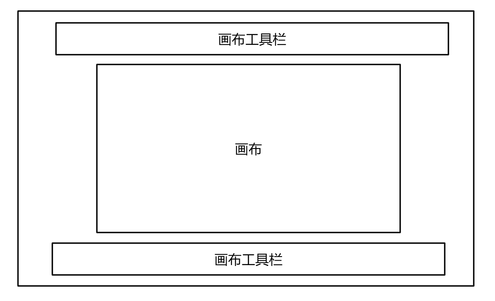

# WPF 画布工具栏的可扩展设计

我在写一个和 PS 差很多的工具，这个工具中间有一个画布，而我需要写一个扩展很好做的工具栏集合，这个工具栏设计上需要支持可以让小伙伴愉快的拆卸，功能足够独立，使用方便。本文就来告诉大家我的这个设计方案

<!--more-->
<!-- 发布 -->

大概的软件的界面如下图

<!--  -->


我期望在代码上，这个库可以方便被大家使用，而小伙伴使用的时候最多的是扩展工具栏。如添加一个自己的工具栏。此时遇到的问题是如何让工具栏能知道画布的存在？毕竟工具栏的作用就是更改画布的内容等

当然，最简单的方法是在后台代码里面使用属性赋值的方法，但是属性赋值的方法意味着在 XAML 写完还必须在后台代码里面添加属性赋值的代码

如我有一个用来管理画布的类，定义如下

```csharp
    public class BoardManagerGrid : Grid
    {
        /// <inheritdoc />
        protected override void OnInitialized(EventArgs e)
        {
            var boardList = Children.OfType<Board>().ToList();
            if (boardList.Count != 1)
            {
                // 告诉开发者只能添加一个画布
                return;
            }

            CurrentBoard = boardList[0];

            base.OnInitialized(e);
        }


        public Board CurrentBoard { private set; get; }
    }
```

而画布类的定义如下，下面都是空的类，只是为了说明本文的方案

```csharp
    /// <summary>
    /// 画布
    /// </summary>
    public class Board : Canvas
    {
    }
```

而此时我有一个新的工具栏，工具栏里面需要获取当前的画布才能做工具栏业务

```csharp
    public class FooToolBar : Grid
    {
        public Board CurrentBoard { set; get; }
    }
```

请问我可以如何做才能让这个工具栏在使用的时候足够简单？比较期望的是在 XAML 添加代码就能自动应用上，无需任何后台代码

```xml
    <Grid>
        <local:BoardManagerGrid>
            <local:Board></local:Board>
            <local:FooToolBar></local:FooToolBar>
        </local:BoardManagerGrid>
    </Grid>
```

这是比较期望的写法，但是如果按照上面的代码，是需要在后台代码里面给 FooToolBar 设置画布，而为了给 FooToolBar 设置，也就是需要还需要给这个工具栏命名，给画布命名

```xml
        <local:BoardManagerGrid>
            <local:Board x:Name="Board"></local:Board>
            <local:FooToolBar x:Name="FooToolBar"></local:FooToolBar>
        </local:BoardManagerGrid>
```

在后台添加赋值的代码

```csharp
        public MainWindow()
        {
            InitializeComponent();

            FooToolBar.CurrentBoard = Board;
        }
```

这对于一个库来说，不是很好的设计，至少这让开发者用起来不开森，同时也让 FooToolBar 的属性设计不安全，不知道在哪里会被修改为空值

为了提升工具栏的对画布的属性的安全性，应该让这个属性作为私有的，至少设置方法应该是私有的

```csharp
    public class FooToolBar : Grid
    {
        private Board CurrentBoard { set; get; }
    }
```

这样的一个坑是如何给这个属性赋值，如果是放在构造函数，那么这个工具栏就不能写到 XAML 上，只能放在后台代码。而通过 EndInit 方法判断设置又解决不了属性赋值问题

而另一个方式是通过全局静态属性的方法获取，这是当前我团队的一个古老的项目使用的方法，这样就提升了耦合度，存在的坑是我需要在这个项目里面多添加一个画布的时候就发现原有的工具栏无法进行复用


有什么方法可以让开发者只需要在 BoardManagerGrid 里面添加新的工具栏，就知道自动让这个工具栏找到对应的画布？其实可以使用附加属性的方法

附加属性可以支持继承，也就是上层容器，如 Grid 等这些容器控件设置的属性，将会被容器内的所有控件获得。也就是我在上层的 Grid 设置一个可以继承的附加属性，此时在 Grid 里面的所有控件就都能获取这个在 Grid 上设置的属性

设置附加属性的方法是通过将 PropertyMetadata 修改为 FrameworkPropertyMetadata 添加设置 FrameworkPropertyMetadataOptions.Inherits 属性

本文的方案是在 BoardManagerGrid 添加附加属性，这个附加属性就是自己设置自己

```csharp
        public static readonly DependencyProperty BoardManagerProperty = DependencyProperty.RegisterAttached(
            "BoardManager", typeof(BoardManagerGrid), typeof(BoardManagerGrid),
            new FrameworkPropertyMetadata(null, FrameworkPropertyMetadataOptions.Inherits));

        public static void SetBoardManager(DependencyObject element, BoardManagerGrid value)
        {
            element.SetValue(BoardManagerProperty, value);
        }

        public static BoardManagerGrid GetBoardManager(DependencyObject element)
        {
            return (BoardManagerGrid) element.GetValue(BoardManagerProperty);
        }
```

这样所有在 BoardManagerGrid 里面的控件就能获取到所在的 BoardManagerGrid 的实例，也就是某个控件可以了解到当前所在的画布所在的容器是哪个

在 BoardManagerGrid 构造函数就需要设置附加属性

```csharp
        public BoardManagerGrid()
        {
            SetBoardManager(this, this);
        }
```

接下来是在 BoardManagerGrid 里面找到容器里面的画布控件，按照业务要求，这里的画布只有一个

```csharp
        /// <inheritdoc />
        protected override void OnInitialized(EventArgs e)
        {
            var boardList = Children.OfType<Board>().ToList();
            if (boardList.Count != 1)
            {
                // 告诉开发者只能添加一个画布
                return;
            }

            CurrentBoard = boardList[0];

            base.OnInitialized(e);
        }


        public Board CurrentBoard { private set; get; }
```

上面注释的内容请小伙伴只是完善

此时在工具栏就可以在 Loaded 之后通过附加属性的方式拿到画布请看代码

```csharp
        public FooToolBar()
        {
            Loaded += FooToolBar_Loaded;
        }

        private void FooToolBar_Loaded(object sender, RoutedEventArgs e)
        {
            var boardManager = BoardManagerGrid.GetBoardManager(this);
            // 自动获得画布
            CurrentBoard = boardManager.CurrentBoard;
        }
```

这样实现的框架可以让工具栏本文可以随意扩展，只要是一个 UIElement 就能加入到画布控制里面，然后在 Loaded 里面拿到画布，使用的方法也简单


本文代码放在[github](https://github.com/lindexi/lindexi_gd/tree/367b4ddd17cb3ee1a92849239911d140e5112a7b/FallkucearwallnelRufefawgem)欢迎小伙伴访问

<a rel="license" href="http://creativecommons.org/licenses/by-nc-sa/4.0/"></a><br />本作品采用<a rel="license" href="http://creativecommons.org/licenses/by-nc-sa/4.0/">知识共享署名-非商业性使用-相同方式共享 4.0 国际许可协议</a>进行许可。欢迎转载、使用、重新发布，但务必保留文章署名[林德熙](http://blog.csdn.net/lindexi_gd)(包含链接:http://blog.csdn.net/lindexi_gd )，不得用于商业目的，基于本文修改后的作品务必以相同的许可发布。如有任何疑问，请与我[联系](mailto:lindexi_gd@163.com)。
