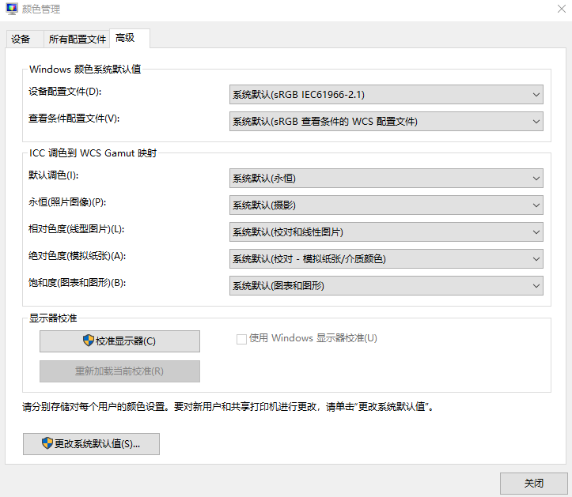

# WPF 界面打不开提示 System.ArithmeticException Overflow or underflow in the arithmetic operation 异常

本文告诉大家如何解决界面打不开，抛出 System.ArithmeticException: Overflow or underflow in the arithmetic operation 异常的修复方法

<!--more-->
<!-- 发布 -->
<!-- 博客 -->

这个问题是用户的电脑的颜色系统设备配置文件的问题，修复方法是进入 颜色管理 设置。进入的方法可以是搜 颜色管理 即可，或者是进入 设置->系统->高级显示设置->显示器1的显示适配器属性->进入颜色管理->点击颜色管理

实在不知道的话，自己百度搜如何进入颜色管理即可

点击进入高级页面，如下图

<!--  -->

英文版本的页面如下

要求你的应用的配置和我的相同，例如设备配置文件里，推荐是 sRGB IEC61996-2.1 的等

改完之后，点击关闭即可。另外值得一提的是这个界面是当前用户的配置，如果想要改本机的，可以进入更改系统默认值进行设置

修改完成之后，推荐重启电脑

