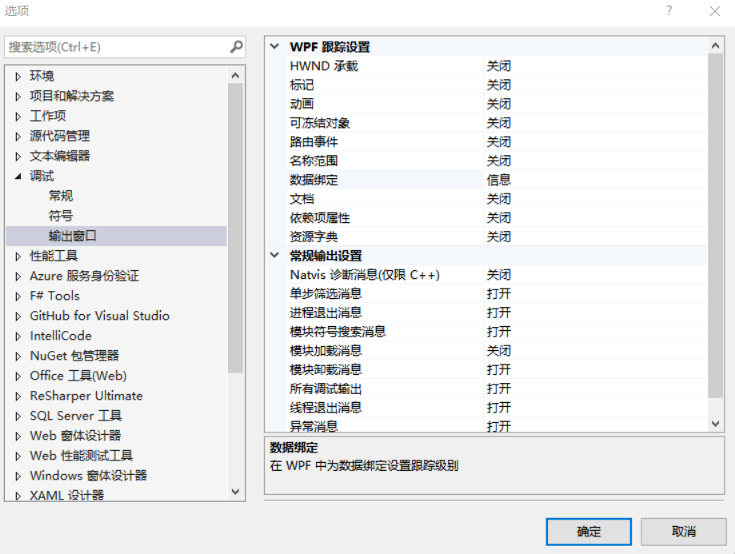

# WPF 笔刷绑定不上可能的原因

在 WPF 中如背景色等都是使用笔刷，在使用绑定的时候可能绑定不上，本文告诉大家绑定不上可能的原因和调试方法

<!--more-->
<!-- CreateTime:2019/11/29 8:46:22 -->

<!-- csdn -->

有小伙伴问我为什么他的背景绑定不上，他的代码如下

```xaml
    <Window.Resources>
        <local:StateToColorConverter x:Key="StateToColorConverter"></local:StateToColorConverter>
    </Window.Resources>
    <Grid >
        <Grid Background="{Binding Path=Width,Converter={StaticResource StateToColorConverter}}"></Grid>
    </Grid>
```

其中后台代码如下

```csharp
    public partial class MainWindow : Window
    {
        public MainWindow()
        {
            InitializeComponent();
            DataContext = this;
        }
    }

    public class StateToColorConverter : IValueConverter
    {
        public object Convert(object value, Type targetType, object parameter, CultureInfo culture)
        {
            switch (value)
            {
               
                default:
                    return Brushes.Transparent.Color;
            }
        }

        public object ConvertBack(object value, Type targetType, object parameter, CultureInfo culture)
        {
            throw new NotImplementedException();
        }
    }
```

这是简化的版本

原因是在小伙伴在转换器里面绑定的返回值是 Color 而 Background 的需要的值是 Brush 所以绑定不上

修复方法是不返回 Color 应该返回 Brush 就可以

调试 XAML 绑定可以通过在 VisualStudio 的选项开启输出绑定信息

<!--  -->

在工具 选项 调试 输出窗口 可以看到绑定的输出，将这一项设置为详细就可以输出很多调试信息，如上面代码将会输出绑定返回值

```
System.Windows.Data Information: 10 : Cannot retrieve value using the binding and no valid fallback value exists; using default instead. BindingExpression:Path=Width; DataItem=null; target element is 'Grid' (Name=''); target property is 'Background' (type 'Brush')

```

翻译一下

```csharp
System.Windows.Data Information: 10 : 无法接受绑定的返回值，同时没有设置绑定失败使用的值；将使用默认值代替。绑定表达式是 Path=Width 数据项是没有，绑定的元素是 Grid 绑定的属性是 Background 这个属性的类型是 Brush 类型
```

如果不想每次都设置 VisualStudio 可以使用 [WPF 如何调试 binding](https://blog.lindexi.com/post/WPF-%E5%A6%82%E4%BD%95%E8%B0%83%E8%AF%95-binding.html )

<a rel="license" href="http://creativecommons.org/licenses/by-nc-sa/4.0/"></a><br />本作品采用<a rel="license" href="http://creativecommons.org/licenses/by-nc-sa/4.0/">知识共享署名-非商业性使用-相同方式共享 4.0 国际许可协议</a>进行许可。欢迎转载、使用、重新发布，但务必保留文章署名[林德熙](http://blog.csdn.net/lindexi_gd)(包含链接:http://blog.csdn.net/lindexi_gd )，不得用于商业目的，基于本文修改后的作品务必以相同的许可发布。如有任何疑问，请与我[联系](mailto:lindexi_gd@163.com)。
