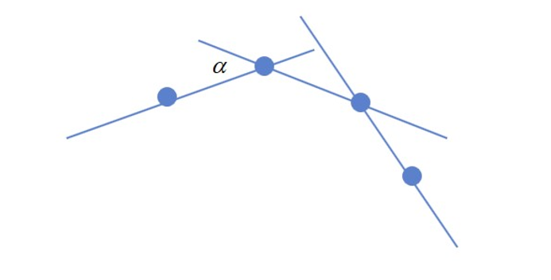

# WPF 笔迹算法 从点集转笔迹轮廓

本文将告诉大家一些笔迹算法，从用户输入的点集，即鼠标轨迹点或触摸轨迹点等，转换为一个可在界面绘制显示笔迹画面的基础数学算法。尽管本文标记的是 WPF 的笔迹算法，然而实际上本文更侧重基础数学计算，理论上可以适用于任何能够支持几何绘制的 UI 框架上，包括 UWP 或 WinUI 或 UNO 或 MAUI 或 Eto 等框架

<!--more-->
<!-- CreateTime:2023/10/10 8:49:27 -->


<!-- 发布 -->
<!-- 博客 -->

我将从简单到复杂的顺序描述笔迹算法，本文属于比较偏算法底层，阅读之前请先确保初中的数学知识还没忘了

本文适合于想要了解笔迹绘制更多细节的伙伴，以及期望自己设计出更好看的笔迹的伙伴，以及没事干摸鱼看博客的伙伴

## 最简单的笔迹轨迹算法

大家都知道，无论是鼠标还是触摸还是笔，所产生的数据基本都是点数据。根据点集创建一条笔迹轨迹的一个实现方式是创建一条几何图形，将几何图形绘制到界面上。在 UI 框架的底层里，是不存在笔迹的概念的，只有画图、画文本、画几何图形等基础绘制原语而已。从点集构建出一条几何轨迹最简单的方法是构建一条折线，代码也非常简单，只是将所有的输入点当成折线即可

也就是创建一个 Polyline 对象，不断将输出的点集加入到折线里面。以下是例子代码，先新建一个空 WPF 项目，在 MainWindow.xaml 里添加事件监听，如以下代码

```xml
<Window x:Class="YegeenurcairwheBeahealelbewe.MainWindow"
        xmlns="http://schemas.microsoft.com/winfx/2006/xaml/presentation"
        xmlns:x="http://schemas.microsoft.com/winfx/2006/xaml"
        xmlns:d="http://schemas.microsoft.com/expression/blend/2008"
        xmlns:mc="http://schemas.openxmlformats.org/markup-compatibility/2006"
        xmlns:local="clr-namespace:YegeenurcairwheBeahealelbewe"
        mc:Ignorable="d"
        Title="MainWindow" Height="450" Width="800" StylusDown="MainWindow_OnStylusDown" StylusMove="MainWindow_OnStylusMove" StylusUp="MainWindow_OnStylusUp">
    <Canvas x:Name="InkCanvas">

    </Canvas>
</Window>
```

在后台代码里面，实现事件，以下的代码很简单，相信大家一看就明白

```csharp
public partial class MainWindow : Window
{
    public MainWindow()
    {
        InitializeComponent();
    }

    private void MainWindow_OnStylusDown(object sender, StylusDownEventArgs e)
    {
        var polyline = new Polyline()
        {
            Stroke = Brushes.Black,
            StrokeThickness = 5
        };
        InkCanvas.Children.Add(polyline);

        _pointCache[e.StylusDevice.Id] = polyline;

        foreach (var stylusPoint in e.GetStylusPoints(this))
        {
            polyline.Points.Add(stylusPoint.ToPoint());
        }
    }

    private void MainWindow_OnStylusMove(object sender, StylusEventArgs e)
    {
        if (_pointCache.TryGetValue(e.StylusDevice.Id,out var polyline))
        {
            foreach (var stylusPoint in e.GetStylusPoints(this))
            {
                polyline.Points.Add(stylusPoint.ToPoint());
            }
        }
    }

    private void MainWindow_OnStylusUp(object sender, StylusEventArgs e)
    {
        if (_pointCache.Remove(e.StylusDevice.Id, out var polyline))
        {
            foreach (var stylusPoint in e.GetStylusPoints(this))
            {
                polyline.Points.Add(stylusPoint.ToPoint());
            }
        }
    }

    private readonly Dictionary<int/*StylusDeviceId*/, Polyline> _pointCache=new Dictionary<int, Polyline>();
}
```

以上的代码放在[github](https://github.com/lindexi/lindexi_gd/tree/d76fffd214ed5b3aeb99f3593c441b7a12f10d55/HallgaiwhiyiwaLejucona/YegeenurcairwheBeahealelbewe) 和 [gitee](https://gitee.com/lindexi/lindexi_gd/tree/d76fffd214ed5b3aeb99f3593c441b7a12f10d55/HallgaiwhiyiwaLejucona/YegeenurcairwheBeahealelbewe) 欢迎访问

可以通过如下方式获取本文的源代码，先创建一个空文件夹，接着使用命令行 cd 命令进入此空文件夹，在命令行里面输入以下代码，即可获取到本文的代码

```
git init
git remote add origin https://gitee.com/lindexi/lindexi_gd.git
git pull origin d76fffd214ed5b3aeb99f3593c441b7a12f10d55
```

以上使用的是 gitee 的源，如果 gitee 不能访问，请替换为 github 的源。请在命令行继续输入以下代码

```
git remote remove origin
git remote add origin https://github.com/lindexi/lindexi_gd.git
git pull origin d76fffd214ed5b3aeb99f3593c441b7a12f10d55
```

获取代码之后，进入 HallgaiwhiyiwaLejucona\YegeenurcairwheBeahealelbewe 文件夹

尽管以上的代码很简单，但是大家将会发现笔迹不够顺滑，至少比 [WPF 最简逻辑实现多指顺滑的笔迹书写](https://blog.lindexi.com/post/WPF-%E6%9C%80%E7%AE%80%E9%80%BB%E8%BE%91%E5%AE%9E%E7%8E%B0%E5%A4%9A%E6%8C%87%E9%A1%BA%E6%BB%91%E7%9A%84%E7%AC%94%E8%BF%B9%E4%B9%A6%E5%86%99.html) 调用 WPF 自带的笔迹绘制的方法不顺滑好多，而且绘制速度也差好多

<!--  -->


先忘掉 WPF 的上层调用，假如现在咱想要自己编写算法来画一条比 WPF 不会差太多的笔迹轨迹，可以如何做呢。接下来我将继续从简单到复杂的顺序告诉大家不同的算法

## 用两条折线绘制笔迹

上文使用折线的方式可以很简单绘制出笔迹，但是无法实现一条粗细变化的笔迹轨迹。笔迹的粗细变更一般来说和触摸压感相关，换句话说，想要实现跟随触摸压感变更而变更粗细的笔迹轨迹轮廓就需要用到至少比折线更加复杂的方式

接下来介绍的方式是用两条线段绘制笔迹，可以将笔迹元素理解为一个由两条折线构成的闭合 Path 几何形状。如下图所示，笔迹轨迹就是一个 Path 几何形状的填充

<!--  -->


这里如果看完还没理解的话，推荐先暂停下来，先想一想。因为这里有点难描述哈

在这个的基础上，咱的问题就转换为根据输入的点集转换为 Path 几何形状

接下来我将介绍根据输入的点集转换为 Path 几何形状的最简单方法之一，期望以下的方法能够给大家带来一些启示。我将快速给出一些图和文字描述给到大家，方便快速理解整体的思想。然后再给出具体的实现

下图的蓝色的点表示的是当前所输入收到的点集

<!--  -->


接下来求每个点与下一个点相连的射线向量，再算出射线向量的法线方向，在此法线方向上以触摸点的中心向法线两端延伸线段，延伸的线段长度由笔迹粗细配置以及当前触摸点的压感系数决定，如下图，蓝色的线就是射线向量，黄色的线是射线向量的法线方向延伸的线段

<!--  -->


再获取线段的两个端点，如下图，红色的圆点就是延伸的线段的两个端点

<!--  -->


接着将各个线段的端点按照如下图的方式连接起来，各个线段的两个端点分别按照两边连接成两条折线，再将这两条折线和起始点和结束点连接到一起，构成闭合的 Path 几何形状，红色的折线就可以被当成笔迹轨迹的 Path 几何形状

<!--  -->


最后将红色的折线组成的笔迹轨迹的 Path 几何形状填充，填充之后看起来的效果还行

<!--  -->


相信大家看到这里就理解了用两条折线绘制笔迹的方法

接下来我将告诉大家如何使用具体的代码实现用两条折线绘制笔迹

原本我是想继续采用 WPF 项目完成此步骤的演示，但刚好我打开了一个 UNO 框架的项目，于是我就使用 UNO 框架项目作为演示。这里需要说明的是 UNO 和 WPF 之间的关系不是重复的存在，而是相互引用的关系，如下图可以看到 UNO 可以处于 WPF 的上层，换句话说就是使用 UNO 框架时可以将 WPF 当成底层，从这个方面来说，最后构建输出的也依然是一个 WPF 应用

<!--  -->


新建一个 UNO 项目，在 MainPage.xaml 里面监听事件，制作一些准备辅助笔迹绘制的界面逻辑，简单的代码如下

```xml
<Canvas x:Name="InkCanvas" Background="Transparent" PointerPressed="InkCanvas_OnPointerPressed" PointerMoved="InkCanvas_OnPointerMoved" PointerReleased="InkCanvas_OnPointerReleased" PointerCanceled="InkCanvas_OnPointerCanceled"/>
```

在 MainPage.xaml.cs 后台代码里面，根据输入事件的监听，获取到当前的输入点集。这部分代码预计大家一看就明白，我这里就快速跳过

```csharp
    private void InkCanvas_OnPointerPressed(object sender, PointerRoutedEventArgs e)
    {
        var pointerPoint = e.GetCurrentPoint(InkCanvas);
        Point position = pointerPoint.Position;

        var inkInfo = new InkInfo();
        _inkInfoCache[e.Pointer.PointerId] = inkInfo;
        inkInfo.PointList.Add(position);

        DrawStroke(inkInfo);
    }


    private void InkCanvas_OnPointerMoved(object sender, PointerRoutedEventArgs e)
    {
        if (_inkInfoCache.TryGetValue(e.Pointer.PointerId, out var inkInfo))
        {
            var pointerPoint = e.GetCurrentPoint(InkCanvas);
            Point position = pointerPoint.Position;

            inkInfo.PointList.Add(position);
            DrawStroke(inkInfo);
        }
    }

    private void InkCanvas_OnPointerReleased(object sender, PointerRoutedEventArgs e)
    {
        if (_inkInfoCache.Remove(e.Pointer.PointerId, out var inkInfo))
        {
            var pointerPoint = e.GetCurrentPoint(InkCanvas);
            Point position = pointerPoint.Position;
            inkInfo.PointList.Add(position);
            DrawStroke(inkInfo);
        }
    }

    private void InkCanvas_OnPointerCanceled(object sender, PointerRoutedEventArgs e)
    {
        if (_inkInfoCache.Remove(e.Pointer.PointerId, out var inkInfo))
        {
            RemoveInkElement(inkInfo.InkElement);
        }
    }

    private void RemoveInkElement(FrameworkElement? inkElement)
    {
        if (inkElement != null)
        {
            InkCanvas.Children.Remove(inkElement);
        }
    }

    private readonly Dictionary<uint /*PointerId*/, InkInfo> _inkInfoCache = new Dictionary<uint, InkInfo>();

public class InkInfo
{
    public FrameworkElement? InkElement { set; get; }
    public List<StrokePoint> PointList { get; } = new List<StrokePoint>();
}

public readonly record struct StrokePoint(Point Point, float Pressure = 0.5f)
{
    public static implicit operator StrokePoint(Point point) => new StrokePoint(point);
}
```

以上代码没给出的 DrawStroke 则是核心算法，在 InkInfo 里面存放了 PointList 点集。在 DrawStroke 需要根据此点集信息构建出一个 FrameworkElement 类型的对象，这个对象就是笔迹元素对象。按照本文以上的算法原理描述，这个笔迹对象就是在数学上由两段折线组合而成的闭合 Path 几何形状。这里为了简单使用，就使用了内建的 `Microsoft.UI.Xaml.Shapes.Polygon` 类型

使用 Polygon 类型时，最重要的就是获取按照预期顺序的笔迹轮廓点，也就是上文的各个线段的两个端点，也就是如下图里黄色的点

<!--  -->


为了计算笔迹轮廓点集，以下代码封装了 GetOutlinePointList 方法，这个方法需要传入 InkInfo 的 PointList 点集，也就是输入的点集，以及笔迹的大小

```csharp
    public static Point[] GetOutlinePointList(List<StrokePoint> pointList, int inkSize)
    {
        ... // 忽略代码
    }
```

由于咱需要计算射线向量方向，这就意味着至少需要两个点才能计算，于是先加上如下判断逻辑

```csharp
    public static Point[] GetOutlinePointList(List<StrokePoint> pointList, int inkSize)
    {
        if (pointList.Count < 2)
        {
            throw new ArgumentException("小于两个点的无法应用算法");
        }

        ... // 忽略代码
    }
```

如上文的算法，可以看到输出的笔迹轮廓点集，也就是 GetOutlinePointList 的返回值，的元素个数将会是 `pointList` 点集的两倍加二。为什么会是 `pointList` 点集的两倍加二的值？因为如上文的算法，每个原始输入点都可以算出两个端点，再加上最后将首末两个点一共就是两倍加二的值

```csharp
        var pointCount = pointList.Count * 2 /*两边的笔迹轨迹*/ + 1 /*首点重复*/ + 1 /*末重复*/;

        var outlinePointList = new Point[pointCount];
```

接着进行输入的原始点集的循环，计算每个点的射线向量

```csharp
        for (var i = 0; i < pointList.Count; i++)
        {
            var currentPoint = pointList[i];
            var nextPoint = pointList[i + 1]; // 先忽略最后一个点的错误计算

            var x = nextPoint.Point.X - currentPoint.Point.X;
            var y = nextPoint.Point.Y - currentPoint.Point.Y;

            // 拿着纸笔自己画一下吧，这个是简单的数学计算
            double angle = Math.Atan2(y, x) - Math.PI / 2;
        }
```

以上代码的 angle 就是向量角度，于是再计算端点距离输入原始点的距离，即可算出端点坐标

```csharp
            // 笔迹粗细的一半，一边用一半，合起来就是笔迹粗细了
            var halfThickness = inkSize / 2d;

            // 压感这里是直接乘法而已
            halfThickness *= currentPoint.Pressure;
            // 不能让笔迹粗细太小
            halfThickness = Math.Max(0.01, halfThickness);

            var leftX = currentPoint.Point.X + (Math.Cos(angle) * halfThickness);
            var leftY = currentPoint.Point.Y + (Math.Sin(angle) * halfThickness);

            var rightX = currentPoint.Point.X - (Math.Cos(angle) * halfThickness);
            var rightY = currentPoint.Point.Y - (Math.Sin(angle) * halfThickness);

            outlinePointList[i + 1] = new Point(leftX, leftY);
            outlinePointList[pointCount - i - 1] = new Point(rightX, rightY);
```

以上代码只是简单的初中函数计算，相信大家一看就知道

以上的代码实际上是不能运行的，因为最后一个点的计算还没有加上。这里就简单将最后一个点的向量方向记录为前一个点的方向，修改之后的代码如下

```csharp
        double angle = 0.0;
        for (var i = 0; i < pointList.Count; i++)
        {
            var currentPoint = pointList[i];

            // 如果不是最后一点，那就可以和笔迹当前轨迹点的下一点进行计算向量角度
            if (i < pointList.Count - 1)
            {
                var nextPoint = pointList[i + 1];

                var x = nextPoint.Point.X - currentPoint.Point.X;
                var y = nextPoint.Point.Y - currentPoint.Point.Y;

                // 拿着纸笔自己画一下吧，这个是简单的数学计算
                angle = Math.Atan2(y, x) - Math.PI / 2;
            }

            // 笔迹粗细的一半，一边用一半，合起来就是笔迹粗细了
            var halfThickness = inkSize / 2d;

            // 压感这里是直接乘法而已
            halfThickness *= currentPoint.Pressure;
            // 不能让笔迹粗细太小
            halfThickness = Math.Max(0.01, halfThickness);

            var leftX = currentPoint.Point.X + (Math.Cos(angle) * halfThickness);
            var leftY = currentPoint.Point.Y + (Math.Sin(angle) * halfThickness);

            var rightX = currentPoint.Point.X - (Math.Cos(angle) * halfThickness);
            var rightY = currentPoint.Point.Y - (Math.Sin(angle) * halfThickness);

            outlinePointList[i + 1] = new Point(leftX, leftY);
            outlinePointList[pointCount - i - 1] = new Point(rightX, rightY);
        }
```

接着再加上首末两个点就完成了方法

```csharp
    public static Point[] GetOutlinePointList(List<StrokePoint> pointList, int inkSize)
    {
        if (pointList.Count < 2)
        {
            throw new ArgumentException("小于两个点的无法应用算法");
        }

        var pointCount = pointList.Count * 2 /*两边的笔迹轨迹*/ + 1 /*首点重复*/ + 1 /*末重复*/;

        var outlinePointList = new Point[pointCount];

        // 用来计算笔迹点的两点之间的向量角度
        double angle = 0.0;
        for (var i = 0; i < pointList.Count; i++)
        {
            var currentPoint = pointList[i];

            // 如果不是最后一点，那就可以和笔迹当前轨迹点的下一点进行计算向量角度
            if (i < pointList.Count - 1)
            {
                var nextPoint = pointList[i + 1];

                var x = nextPoint.Point.X - currentPoint.Point.X;
                var y = nextPoint.Point.Y - currentPoint.Point.Y;

                // 拿着纸笔自己画一下吧，这个是简单的数学计算
                angle = Math.Atan2(y, x) - Math.PI / 2;
            }

            // 笔迹粗细的一半，一边用一半，合起来就是笔迹粗细了
            var halfThickness = inkSize / 2d;

            // 压感这里是直接乘法而已
            halfThickness *= currentPoint.Pressure;
            // 不能让笔迹粗细太小
            halfThickness = Math.Max(0.01, halfThickness);

            var leftX = currentPoint.Point.X + (Math.Cos(angle) * halfThickness);
            var leftY = currentPoint.Point.Y + (Math.Sin(angle) * halfThickness);

            var rightX = currentPoint.Point.X - (Math.Cos(angle) * halfThickness);
            var rightY = currentPoint.Point.Y - (Math.Sin(angle) * halfThickness);

            outlinePointList[i + 1] = new Point(leftX, leftY);
            outlinePointList[pointCount - i - 1] = new Point(rightX, rightY);
        }

        outlinePointList[0] = pointList[0].Point;
        outlinePointList[pointList.Count + 1] = pointList[^1].Point;
        return outlinePointList;
    }
```

在通过 GetOutlinePointList 拿到笔迹轮廓点之后，即可构建出 Polygon 对象，如以下代码

```csharp
    public static Polygon CreatePath(InkInfo inkInfo, int inkSize)
    {
        List<StrokePoint> pointList = inkInfo.PointList;
        var outlinePointList = GetOutlinePointList(pointList, inkSize);

        var polygon = new Polygon();

        foreach (var point in outlinePointList)
        {
            polygon.Points.Add(point);
        }
        polygon.Fill = new SolidColorBrush(Colors.Red);
        return polygon;
    }
```

尽管以上代码是在 UNO 框架下编写的，但可以直接拷贝代码在 UWP 应用上直接运行

拿到 Polygon 对象之后，将此对象加入到界面里面，如以下代码，即可完成笔迹的绘制。在不断落点输入点数据过程中，将不断执行 Polygon 的 Points 的清理和重新添加，于是就可以不断跟随落点更新笔迹内容，完成笔迹书写的功能

```csharp
    private void DrawStroke(InkInfo inkInfo)
    {
        var pointList = inkInfo.PointList;
        if (pointList.Count < 2)
        {
            // 小于两个点的无法应用算法
            return;
        }

        var inkElement = MyInkRender.CreatePath(inkInfo, inkSize);

        if (inkInfo.InkElement is null)
        {
            InkCanvas.Children.Add(inkElement);
        }

        inkInfo.InkElement = inkElement;
    }
```

完成到这里，其实就算完成了一个简单的在绘制的过程，可根据压感参数变更笔迹粗细的算法了

但是一般的输入设备，比如鼠标或者渣触摸屏都是没有压感的，或者是没有正确的压感的，那这个时候似乎体现不出以上算法的优势。这时候可以继续和大家介绍另一个有趣的功能实现，模拟笔锋

很多人都喜欢写字的时候带笔锋，无论是写中文还是写英文的时候。模拟笔锋也许可以让用户感谢写出来的字更好看，通过压感模拟笔锋是一个非常简单的实现。实现思路就是从笔尖到笔身的顺序，让输入的点集的压感从小到大，大概如下图所示，如此即可做出类似笔锋的效果

<!--  -->


大概的实现代码如下

```csharp
        // 模拟笔锋

        // 用于当成笔锋的点的数量
        var tipCount = 20;

        for (int i = 0; i < pointList.Count; i++)
        {
            if ((pointList.Count - i) < tipCount)
            {
                pointList[i] = pointList[i] with
                {
                    Pressure = (pointList.Count - i) * 1f / tipCount
                };
            }
            else
            {
                pointList[i] = pointList[i] with
                {
                    Pressure = 1.0f
                };
            }
        }
```

加上模拟笔锋之后，即可使用以上的算法画出如下图的笔迹效果

<!--  -->


上图是我开了调试模式的效果，调试模式就是在原笔迹元素的基础上，绘制出蓝色的原始输入的点集，以及黄色的端点

以上的代码放在[github](https://github.com/lindexi/lindexi_gd/tree/8d59a96e0d4e390ae78946ff556a759901961856/HallgaiwhiyiwaLejucona) 和 [gitee](https://gitee.com/lindexi/lindexi_gd/tree/8d59a96e0d4e390ae78946ff556a759901961856/HallgaiwhiyiwaLejucona) 欢迎访问

可以通过如下方式获取本文的源代码，先创建一个空文件夹，接着使用命令行 cd 命令进入此空文件夹，在命令行里面输入以下代码，即可获取到本文的代码

```
git init
git remote add origin https://gitee.com/lindexi/lindexi_gd.git
git pull origin 8d59a96e0d4e390ae78946ff556a759901961856
```

以上使用的是 gitee 的源，如果 gitee 不能访问，请替换为 github 的源。请在命令行继续输入以下代码

```
git remote remove origin
git remote add origin https://github.com/lindexi/lindexi_gd.git
git pull origin 8d59a96e0d4e390ae78946ff556a759901961856
```

获取代码之后，进入 HallgaiwhiyiwaLejucona 文件夹

欢迎大家将代码拉下来，运行看试试效果。以上代码是写在 UNO 框架里的，可以在 Windows 平台上使用 WinUI 或 WPF 运行，也可以在 Linux 系统使用 GTK 运行

但大家也可以很轻松就看出来以上算法存在的不足还是有很多的，比如是采用折线连接笔迹轮廓的点集，这就导致了在触摸采样不够密或鼠标精度很低的情况下，画出来的笔迹存在很明显的折线效果，不够顺滑。另外，从以上的简单数学计算上，也存在着输入轨迹大角度的折弯时存在计算错误

接下来我将和大家介绍更加进阶的算法，解决以上简单算法所遇到的问题

## 顺滑的笔迹算法

以上的用两条折线绘制笔迹的算法被我称为十字法笔迹算法，这是一个简单的算法，无法作出顺滑的笔迹效果。接下来将和大家介绍被我命名为米字法笔迹算法的算法

接下来介绍的米字法笔迹算法是为触摸设计的笔迹书写轨迹算法，可以实现比较顺滑的笔迹绘制效果，同时可以有多组参数可配置，配合高阶拟合函数可以写出特别多不同的笔迹效果，比如毛笔字、钢笔字等

以下介绍的算法被我申请了专利保护，现在专利已经公开授权，我就不放出来具体的代码了。原本专利里面是有详细公开信息的，但是专利本身写得难以阅读，为了让大家能够更清晰知道具体的笔迹实现算法，我就准备使用更白话的方式向大家介绍算法内容

必须提醒大家的是，如果在商业软件上使用，必须绕过本文接下来介绍的方法，本文接下来介绍的方法只能借鉴不能抄哦。不然等你大赚时，法务小姐姐会去找你麻烦的

当然，非商业用途等不怕专利的情况，那就随意咯

接下来介绍的方法按照顺序分别是 [CN109284059A](https://patents.google.com/patent/CN109284059A) 和 [CN115373534A](https://analytics.zhihuiya.com/patent-view/abst?patentId=6d9e390f-a67f-48fa-a1e0-745a97a30898) 两篇专利里面包含的内容，你可以认为本文只是记录读了以上两篇专利之后的自己所学到的内容。我自己发布博客在我自己的非盈利非商业的博客上是可以的，属于非营利实施，但是如果有伙伴想要在商业用途上转载本文，那就是侵犯专利的权利，违法的哦

本文以下介绍的算法部分只介绍大概思路，不会包含具体实现细节以及代码，更详细的实施方法还请自行参阅专利的内容

本文以下的算法将默认是为触摸设计的笔迹书写轨迹算法，输入的原始点被称为原始触摸点。触摸点数据将包含 X Y 信息，以及可选的压感和宽度高度信息，还有一个隐含的速度信息。如下图，蓝色的点就是触摸过来的触摸点信息，触摸点是一些离散的点。我这里产品里主打的触摸框都是红外触摸框，红外触摸框从原理上也只能获取到离散的触摸点，但如果点足够密，那将离散的点视为连续的线段也是没有问题的

<!--  -->


在进入实际算法之前，还需要进行一步点的过滤。也就是将一些奇怪的点给过滤掉，比如在一些渣触摸框上，可能存在报点存在离群点的情况，或者是出现在 0 0 点的情况，需要自己根据具体的硬件设备进行丢点处理。这一步不是必须的，基本只有在大屏幕触摸框下才需要进行

### 骨架计算

完成点集的处理之后，即可开始计算笔迹的骨架。可以将笔迹骨架认为是一个最简单展示一段顺滑笔迹的轨迹，也就是当笔迹各处的粗细都一致时，即没有棱角和笔锋时的一段几何轨迹。实际上的算法后续的棱角和笔锋、跟随压感变更等等都是在笔迹的骨架的基础上，修改笔迹某一段的粗细变化。骨架的计算十分简单，可以采用贝塞尔等算法将收到的触摸点进行平滑计算，此过程如果需要补点，即在触摸点不够密集时进行补点，则可以自己再叠加一些魔改的贝塞尔算法，比如 [一种简单的贝塞尔拟合算法_贝塞尔曲线拟合-CSDN博客](https://blog.csdn.net/Iron_Ye/article/details/82949401 ) 介绍的方法

一般是将收集到的触摸点每两个点的中心做定点，使用收集到的触摸点做控制点，如下图

<!--  -->


对于许多业务情况来说，只需要到这一步就可以算画出一段平滑的笔迹了

接下来的步骤将和大家介绍如何画出更好看的笔迹效果

### 棱角优化

棱角优化步骤是一个专门为中文书写笔迹轨迹优化的方法。用途是让写出来的汉字比较有棱角，适合用户手写类似黑体或楷体，不适合用在草书的情况。大概的算法思路如下，假定有类似如下的输入触摸点

<!--  -->


这时需要把这些点分为两个线段，分为两个线段的大概效果如下图

<!--  -->


对于汉字而言，我认为如果以上两个线段构成的内角在 90 度以下时，有棱的好看，超过 90 度时，使用圆角的好看

<!--  -->


通过输入可以拿到触摸点，按照两个触摸点连接为线，求相邻线段的夹角，判断角度可以知道用户是否希望画出棱还是画出圆。加上这个优化之后就可以在写汉字时，比微软默认的 WPF 或 UWP 的笔迹算法在棱角方面处理更好

<!--  -->


如图的 α 就是两个线段的角度，判卷角度如果大于 90° 就是用户希望画圆的角，使用贝塞尔算法。如果小于 90° 那就可以判断用户希望画有棱的，直接把点分开为两个线段

当然了，上文提到的 90° 是我自己测试发现的数值，大家可以根据自己的实际需要修改参数。在不需要让笔迹有笔锋以及跟随压感时，以上的棱角优化步骤可以用在骨架计算的步骤上，直接作用到使用骨架绘制出的笔迹上。也可以在带压感时的在下文继续介绍的更复杂的米字法笔迹算法的最后呈现时使用

### 笔迹轨迹宽度优化

无论是否有压感，都可以应用上笔迹轨迹宽度的优化，笔迹轨迹的宽度可以认为是在骨架的基础上，进行填充，让原本只有骨架的很细的笔迹变粗。可以认为在骨架计算步骤拿到的是一条没有宽度的线条，进行笔迹轨迹宽度优化计算就可以画出更好看的笔迹效果。比如说写一个汉字的“一”字，就可以写出两端宽度比较大，中间宽度比较小的笔效果

<!--  -->


简单的笔迹轨迹宽度优化算法大概如下，下面将会用到一点点公式，相信大家一看就明白，以下使用到的公式

<!--  -->


用户可以设置笔迹轨迹线条的宽度，这个设置的宽度为初始宽度，将用户设置的笔迹粗细宽度记为 T 参数。速度参数 v 的计算有些取巧，因为收集到的点的时间间隔是只有很小的误差，为了优化计算，就把两个点直接的距离作为用户的画线速度

上图公式里面的 u(v) 函数计算方法就是取用户正常最慢速度，记为 w 值，这里的 w 为常量 1 的值。为了防止在静止距离获得最小的点为负数，这里使用 u(v)=Max(v-w,x) 限制最小值为 x 的值，按照经验，这里取 x 为常量 2 的值。为了防止用户的画线速度太快，所以按照经验取最高的速度只能是 5 的值。以上的效果就是在用户书写速度超过最高速度 5 单位长度 1 毫秒的时候取 80% 的用户设置粗细。在用户使用很慢速度画线的时候采用120%的用户设置粗细

最后的常量 a 我按照经验取的是 `T/0.12` 的值

以上的常量部分指的不是 C# 里面的常量，而是参与数学计算公式里面的常量，即和自变量对应的常量。这些常量大家都可以根据自己的经验进行修改，或者写一个修改参数的工具让美工或设计师去优化

经过这一个步骤之后，就可以实现在用户使用快速画线，画出来的线就会变细，在用户画线的速度变慢，就会画出宽度比较大的线

### 米字法

这部分属于写出顺滑的笔迹的核心算法。在经过了笔迹轨迹宽度优化之后，尽管看起来已经有些顺滑了，其实依然无法写出毛笔字效果，比如刀锋等效果，最多只能写出有粗细变更的笔迹。接下来的算法部分将使用到棱角优化步骤处理的骨架轨迹算出的骨架点，以及笔迹轨迹宽度优化步骤输出的每个点的笔迹粗细大小信息，进行更高级的优化

通过上文的描述，大家也知道笔迹元素可以由笔迹轮廓两边的曲线组合而成，因此求笔迹的几何图形本质就是求笔迹的轮廓线，由笔迹的轮廓线填充即可获取笔迹。如下图，只需要将如下两条曲线相连接，那么将获得一条笔迹的几何图形

<!--  -->


在经过骨架计算步骤之后，即可拿到骨架轨迹，通过骨架轨迹即可拿到相应的骨架点。拿到相应的骨架点的算法不固定，可以是求均匀的距离下的骨架轨迹上的点，也可以求对原始触摸点的骨架校正点。如果难以理解如何通过骨架轨迹拿到相应的骨架点，那可以将骨架点当成原始的触摸点来看，因为缺少骨架点这一步不用影响对接下来的算法的理解

如下图，假定以下拿到的蓝色的点就是骨架点

<!--  -->


根据触摸点的每个点的状态可以决定骨架点的每个点的状态，对应的就是每个点的上下左右边距，如下图。决定每个点的上下左右边距算法叫做惯性边距算法，这个惯性边距算法将放在下文再描述

<!--  -->


经过了惯性边距算法，可以获取骨架点的上下左右边距，取边距的端点，作为笔廓点。如下图，笔廓点就是蓝色的圆圈

<!--  -->


如下图，连接笔迹的笔廓点就可以获得笔迹的轮廓线，也就是获得笔迹的几何图形。但仅仅采用如上述算法，可以看到笔迹的轮廓相对粗糙，虽然比上文给的算法好了一点，但也没好多少。想要实现更好的效果，还需要继续添加更多逻辑

<!--  -->


在开始介绍算法之前，需要引入不对称椭圆的概念，默认的椭圆都是对称的，如上下对称或左右对称。而不对称椭圆是上下左右都不对称的椭圆。如下图，从不对称椭圆的圆心的上下左右四个方向有着不同的长度

<!--  -->


不对称椭圆的算法相当于绘制出四个对称的椭圆，分别取其中的四分之一拼接起来的椭圆

<!--  -->


如下图，是将绘制出来的四个对称的椭圆各取四分之一部分拼接起来，其中填充部分就是非对称椭圆

<!--  -->


这里的非对称椭圆是用在将笔迹的骨架点按照惯性边距算法上下左右分别采用不同的长度，创建出来的椭圆

<!--  -->


沿着椭圆的切线方向连接的线段就可以作出平滑的笔迹轮廓线，如下图。下图绘制仅仅只是参考，部分线段连接不是采用椭圆的切线

<!--  -->


特别的，为了性能优化部分，因为笔迹的粗细一般都很小，在笔迹粗细很小的时候，可以使用多边形近似代替椭圆。因为对多边形的求值计算的性能要远远高于椭圆，同时求椭圆切线的代码也不好写。如下图，采用如 米 字的方式代替椭圆

<!--  -->


只需要连接椭圆的外接轮廓点即可作出笔迹效果，如下图

<!--  -->


当骨架点足够密集的时候，这时候连接椭圆的外接轮廓点使用线段连接，再将这个线段组成闭合的折线即可写出十分顺滑的笔迹效果了。经过我的实际测试，通过骨架轨迹算出比较密集的骨架点，从而让外接轮廓点连接画出的笔迹效果，既顺滑且渲染性能高。在骨架点不够密集时，如直接将触摸点当骨架点时，可以使用贝赛尔曲线形式连接外接轮廓点，从而画出顺滑的笔迹效果，但经过实际测试我发现此方法无论是笔迹的顺滑还是渲染性能都不如让骨架点足够密集的方法

此算法除了能够让笔迹效果十分顺滑之外，还能实现笔迹刀锋效果。核心实现是根据惯性边距算法可以决定边距，通过边距的不同，可以实现出如毛笔的刀锋效果，如下图所示。在运笔绘制刀锋效果时，如图情况将会更改左边距距离，让笔迹的一边贴近直线而另一边是曲线的效果。采用此算法可以做到更好的写出毛笔字效果

<!--  -->


惯性边距算法就是通过一系列的代码处理，决定每个骨架点的上下左右边距的值，比如运动轨迹方向，比如运动速度，比如预测字形等等。这部分更多的是靠设计师或美工进行优化

以下是我给出的一个认为简单的算法例子，大家也可以自行发挥

在笔迹轨迹宽度优化的基础上，将笔迹轨迹宽度优化的输出结果作为笔迹粗细参考值。将每个骨架点的上下左右边距先采用笔迹粗细的一半作为基准值，然后分别附加各自的缩放系数。根据笔迹的运动轨迹方向，可以将方向分为上下左右四个方向，再按照运动的速度以及多个笔迹点的偏移累计值决定缩放系数的值。如上图，按照笔迹轨迹是向左下方向，将会取笔迹的多个触摸点，计算累计的偏移值，如取笔迹的距离当前的前n个触摸点，如上图是取5个触摸点的坐标，求出距离当前坐标的偏移值也就是相当于求当前点和前第5个点的距离。如果在这前5个触摸点中，有方向不一致的触摸点存在，如第三个触摸点的方向和其他点的触摸方向不同，那么将偏移值减去方向不一致的触摸点的相对于其下一个触摸点的距离。再根据触摸偏移值决定对应方向的缩放系数，决定缩放系数的方法就是取n个触摸点的对应方向的最大距离数，如发现是存在左右方向的偏移那么取水平方向距离值，将距离值减去偏移值除的值处以距离值乘以给特定触摸框优化的常数，即可获取方向上的触摸偏移缩放系数。根据不同的上下左右边距的不同缩放系数就可以实现如上图的效果。同样的，采用此方法进行不同缩放系数最终还是需要乘以笔迹触摸点压感变化的缩放系数，才是最终的各个方向的缩放系数

通过以上的算法即可实现比较好看的笔迹效果

本文只讨论了笔迹的算法，而不包含如何优化笔迹绘制的性能以及更多的触摸相关内容。如果大家对这部分感兴趣，请参阅 [WPF 触摸相关](https://blog.lindexi.com/post/WPF-%E8%A7%A6%E6%91%B8%E7%9B%B8%E5%85%B3.html )