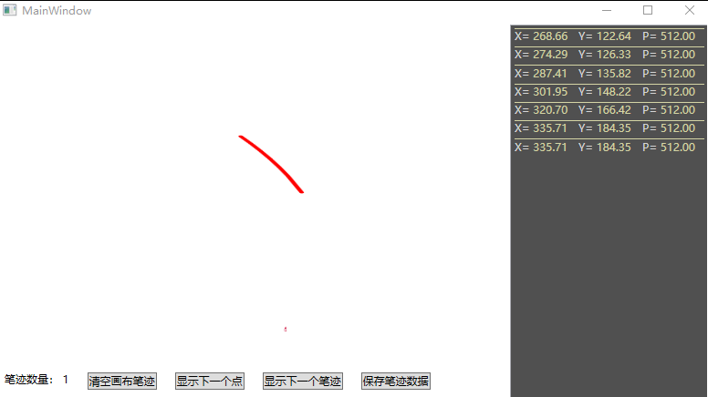

# WPF 笔迹触摸点收集工具

本文来安利大家一个工具，可以用来收集笔迹的触摸点，这个工具完全开源

<!--more-->

<!-- 发布 -->

在开始之前先看一下工具的界面

<!--  -->

实现方式其实就在触摸的时候收集触摸点信息，上面的工具有很多功能都没有实现的。笔迹绘制的功能使用 [WPF 最简逻辑实现多指顺滑的笔迹书写](https://blog.lindexi.com/post/WPF-%E6%9C%80%E7%AE%80%E9%80%BB%E8%BE%91%E5%AE%9E%E7%8E%B0%E5%A4%9A%E6%8C%87%E9%A1%BA%E6%BB%91%E7%9A%84%E7%AC%94%E8%BF%B9%E4%B9%A6%E5%86%99.html) 博客的方法实现

这个工具代码完全开源，可以在 [github](https://github.com/lindexi/lindexi_gd/tree/f522613b/KelerbelaChukoqayhi ) 或 [gitee](https://gitee.com/lindexi/lindexi_gd/tree/f522613b/KelerbelaChukoqayhi ) 下载全部代码

更多笔迹相关请看

- [WPF 渲染原理](https://lindexi.gitee.io/post/WPF-%E6%B8%B2%E6%9F%93%E5%8E%9F%E7%90%86.html )
- [高性能笔迹原理](https://blog.lindexi.com/post/%E9%AB%98%E6%80%A7%E8%83%BD%E7%AC%94%E8%BF%B9%E5%8E%9F%E7%90%86.html)
- [WPF 高性能笔](https://blog.lindexi.com/post/WPF-%E9%AB%98%E6%80%A7%E8%83%BD%E7%AC%94.html ) 
- [WPF 高速书写 StylusPlugIn 原理](https://blog.lindexi.com/post/WPF-%E9%AB%98%E9%80%9F%E4%B9%A6%E5%86%99-StylusPlugIn-%E5%8E%9F%E7%90%86.html )
- [WPF 最小的代码使用 DynamicRenderer 书写](https://blog.lindexi.com/post/WPF-%E6%9C%80%E5%B0%8F%E7%9A%84%E4%BB%A3%E7%A0%81%E4%BD%BF%E7%94%A8-DynamicRenderer-%E4%B9%A6%E5%86%99.html )
- [WPF 使用 Composition API 做高性能渲染](https://blog.lindexi.com/post/WPF-%E4%BD%BF%E7%94%A8-Composition-API-%E5%81%9A%E9%AB%98%E6%80%A7%E8%83%BD%E6%B8%B2%E6%9F%93.html )
- [WPF 使用 Win2d 渲染](https://blog.lindexi.com/post/WPF-%E4%BD%BF%E7%94%A8-Win2d-%E6%B8%B2%E6%9F%93.html )
- [win10 uwp win2d CanvasVirtualControl 与 CanvasAnimatedControl](https://blog.lindexi.com/post/win10-uwp-win2d-CanvasVirtualControl-%E4%B8%8E-CanvasAnimatedControl.html )
- [WPF 最简逻辑实现多指顺滑的笔迹书写](https://blog.lindexi.com/post/WPF-%E6%9C%80%E7%AE%80%E9%80%BB%E8%BE%91%E5%AE%9E%E7%8E%B0%E5%A4%9A%E6%8C%87%E9%A1%BA%E6%BB%91%E7%9A%84%E7%AC%94%E8%BF%B9%E4%B9%A6%E5%86%99.html)

 本作品采用<a rel="license" href="http://creativecommons.org/licenses/by-nc-sa/4.0/">知识共享署名-非商业性使用-相同方式共享 4.0 国际许可协议</a>进行许可。欢迎转载、使用、重新发布，但务必保留文章署名[林德熙](http://blog.csdn.net/lindexi_gd)(包含链接:http://blog.csdn.net/lindexi_gd )，不得用于商业目的，基于本文修改后的作品务必以相同的许可发布。如有任何疑问，请与我[联系](mailto:lindexi_gd@163.com)。
