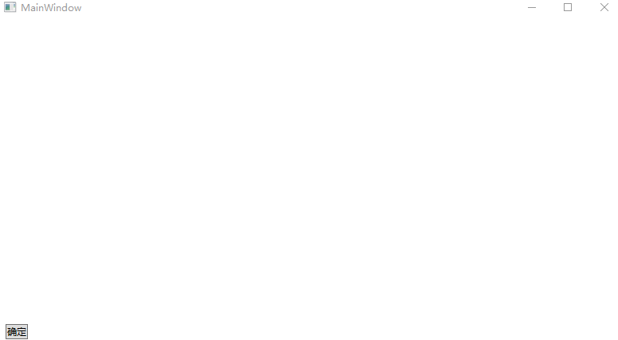

# WPF 简易手绘笔迹支持回放的方法

手绘笔迹实际上就是需要支持回放的，手绘笔迹指的是在应用程序里面支持回放出手绘出来的笔迹。本文来告诉大家一个简易的方法

<!--more-->

<!-- 发布 -->

啥都不说，先来一张图

<!--  -->


在抬手的时候绘制出刚才所画的笔迹，做动画画出笔迹，就和手绘差不多的效果

下面来告诉大家核心的原理

在 WPF 中，可以使用一个叫路径动画的功能，通过这个功能可以传入一个 Path 路径就能动画出这个轨迹

在 WPF 中，笔迹的底层绘制是使用 Geometry 进行绘制。而刚好 Geometry 就是 Path 的数据层，也就是手绘出来的笔迹可以拿到 Geometry 然后创建出 Path 路径进行轨迹动画

在 WPF 中，有 OpacityMask 可以实现蒙层，这个蒙层的功能就是只要蒙层里面有非透明的像素部分，将会显示原本元素上的这部分像素。这个蒙层是做刮刮卡的好工具，大概效果如下图

<!--  -->


依靠上面三个机制就能实现手绘笔迹支持回放轨迹的动画功能

当然，第一步是需要支持笔迹书写的功能，这部分功能还请看 [WPF 最简逻辑实现多指顺滑的笔迹书写](https://blog.lindexi.com/post/WPF-%E6%9C%80%E7%AE%80%E9%80%BB%E8%BE%91%E5%AE%9E%E7%8E%B0%E5%A4%9A%E6%8C%87%E9%A1%BA%E6%BB%91%E7%9A%84%E7%AC%94%E8%BF%B9%E4%B9%A6%E5%86%99.html) 这篇博客的内容

而第二步就是构建出路径动画出来，在开始下面代码之前，还需要在 [WPF 最简逻辑实现多指顺滑的笔迹书写](https://blog.lindexi.com/post/WPF-%E6%9C%80%E7%AE%80%E9%80%BB%E8%BE%91%E5%AE%9E%E7%8E%B0%E5%A4%9A%E6%8C%87%E9%A1%BA%E6%BB%91%E7%9A%84%E7%AC%94%E8%BF%B9%E4%B9%A6%E5%86%99.html) 这篇博客先抄笔迹的实现代码，大概 150 行不到就可以完成了

对之前代码做一点更改，在手指抬起的时候触发一下动画。在触发动画之前需要保存这个笔迹，用来给动画使用，如下面代码

```csharp
        private void MainWindow_StylusUp(object sender, StylusEventArgs e)
        {
            _currentStroke = StrokeVisualList[e.StylusDevice.Id].Stroke;
            StrokeVisualList.Remove(e.StylusDevice.Id);
            StartAnimation();
        }

        private Stroke _currentStroke;
```

在 StartAnimation 方法里面将会播放动画，在开始写这部分代码之前，还需要做一点准备的知识。动画放在 XAML 编写框架将会比较简单，如下面代码

```xml
    <Window.Resources>
        <Storyboard x:Key="StrokePointAnimation" AutoReverse="False">
            <PointAnimationUsingPath Storyboard.TargetName="StrokePointGeometry" Storyboard.TargetProperty="Center" />
        </Storyboard>
    </Window.Resources>

        <Grid Grid.Row="0" x:Name="StrokeGrid">
            <Path Fill="Transparent">
                <Path.Data>
                    <EllipseGeometry x:Name="StrokePointGeometry" RadiusX="{Binding StrokePointThickness}"
                                     RadiusY="{Binding StrokePointThickness}" />
                </Path.Data>
            </Path>
        </Grid>
```

如上面代码，将会使用动画移动 Path 元素，作用是修改 StrokePointGeometry 的中心点的坐标，修改坐标做路径动画

上面代码的重点是 PointAnimationUsingPath 这句代码，让 StrokePointGeometry 的中心点的坐标做 Path 动画

定义完成动画的框架之后，需要在后台代码先获取这个定义的动画框架的资源，如下面代码

```csharp
        private Storyboard GetAnimationStoryboard()
        {
            _storyboard = Resources["StrokePointAnimation"] as Storyboard;
            return _storyboard;
        }
        private Storyboard _storyboard;
```

上面代码有很大的优化空间，还请大家忽略这部分细节，咱继续开发动画部分的逻辑

在刚才保存的 `_currentStroke` 里面获取 Geometry 的方法十分简单，请看下面代码

```csharp
        private Geometry GetCurrentGeometry()
        {
            return _currentStroke.GetGeometry();
        }
```

在拿到 Geometry 就可以开始路径动画了，请看下面代码

```csharp
        private void StartAnimation()
        {
            var geometry = GetCurrentGeometry();

            var storyboard = GetAnimationStoryboard();
            if (storyboard.Children[0] is PointAnimationUsingPath pointAnimationUsingPath)
            {
                pointAnimationUsingPath.PathGeometry = geometry.GetFlattenedPathGeometry();
                pointAnimationUsingPath.Duration = TimeSpan.FromMilliseconds(3000);
            }

            storyboard.Begin();
        }
```

可以看到代码非常简单，只是当前运行的时候啥都看不到，因为在 XAML 中的 Path 的颜色被我设置为透明。现在为了调试方便，咱将这个颜色修改一下，如下面代码所示

```csharp
        <Grid Grid.Row="0" x:Name="StrokeGrid">
            <Path Fill="Red">
                <Path.Data>
                    <EllipseGeometry x:Name="StrokePointGeometry" RadiusX="{Binding StrokePointThickness}"
                                     RadiusY="{Binding StrokePointThickness}" />
                </Path.Data>
            </Path>
        </Grid>
```

<!--  -->


为了做到如本文一开始给大家看的效果，需要添加一点代码，在做动画的时候，顺便如做刮刮卡一样的功能，让上面这个红点经过的路径的蒙层显示出后面的内容。而刚好这个点的轨迹就是笔迹的几何，因此只需要在笔迹上面放一个蒙层，然后在点做动画的时候实时更改这个蒙层就可以

为了拿到点在做动画的时候的值，可以使用如下代码注册事件

```csharp
        private void RegisterStoryboardHandler()
        {
            var descriptor =
                DependencyPropertyDescriptor.FromProperty(System.Windows.Media.EllipseGeometry.CenterProperty,
                    typeof(EllipseGeometry));
            descriptor.RemoveValueChanged(StrokePointGeometry, StrokeAnimating);
            descriptor.AddValueChanged(StrokePointGeometry, StrokeAnimating);
        }
```

这里的 StrokeAnimating 方法就是做蒙层的方法，请看代码

```csharp
        private bool _isFirst = true;

        private void StrokeAnimating(object sender, EventArgs e)
        {
            var animatedStrokeGrid = StrokeGrid;
            if (_isFirst)
            {
                _isFirst = false;
                // 设置背景这句话是重要的哦，否则Grid不会撑开宽度和高度
                animatedStrokeGrid.Background = Brushes.Transparent;

                var mask = new DrawingBrush
                {
                    TileMode = TileMode.None, Stretch = Stretch.None, AlignmentX = AlignmentX.Left,
                    AlignmentY = AlignmentY.Top
                };
                var geoMask = new GeometryGroup {FillRule = FillRule.Nonzero};
                mask.Drawing = new GeometryDrawing {Geometry = geoMask, Brush = Brushes.Black};
                geoMask.Children.Add(new RectangleGeometry(new Rect(0, 0, 1, 1)));

                animatedStrokeGrid.OpacityMask = mask;
            }

            var group = (GeometryGroup) ((GeometryDrawing) ((DrawingBrush) animatedStrokeGrid.OpacityMask).Drawing)
                .Geometry;
            var center = StrokePointGeometry.Center;
            var x = StrokePointGeometry.RadiusX;
            var y = StrokePointGeometry.RadiusY;
            group.Children.Add(new System.Windows.Media.EllipseGeometry(center, x, y));
        }
```

如上面代码，在 StrokeGrid 上面添加一个 DrawingBrush 作为 OpacityMask 的内容，此时在 OpacityMask 上面的任何绘制，都会修改蒙层的内容

这就是整个的实现方法了

而有很多细节需要继续处理的，包括笔迹的颜色，以及动画的速度。动画的速度是靠时间决定的，也就是需要计算不同长度的几何笔迹所需的时间等。还有做动画的圆点的宽度和高度以及笔迹粗细。如果这是作为文档的，还需要考虑笔迹的保存等内容，而在给用户写的时候，还需要考虑撤销重做。更高级一点的是需要考虑一下音效等

以上其实就是来画手绘软件的手绘部分的 WPF 版的大概实现方法了，这是在 2018 的时候 邵猛 哥和我吹的时候告诉我的一个方法，详细请看 [UWP 手绘视频创作工具技术分享系列](https://www.cnblogs.com/shaomeng/p/7474128.html)

本文的代码放在 [github](https://github.com/lindexi/lindexi_gd/tree/f068bda307dd92ce470dc716a312680ce676e2c3/CacearkurfoFawferehacheele) 欢迎小伙伴访问


<a rel="license" href="http://creativecommons.org/licenses/by-nc-sa/4.0/"></a><br />本作品采用<a rel="license" href="http://creativecommons.org/licenses/by-nc-sa/4.0/">知识共享署名-非商业性使用-相同方式共享 4.0 国际许可协议</a>进行许可。欢迎转载、使用、重新发布，但务必保留文章署名[林德熙](http://blog.csdn.net/lindexi_gd)(包含链接:http://blog.csdn.net/lindexi_gd )，不得用于商业目的，基于本文修改后的作品务必以相同的许可发布。如有任何疑问，请与我[联系](mailto:lindexi_gd@163.com)。
