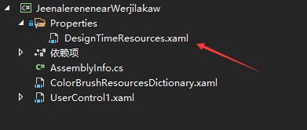
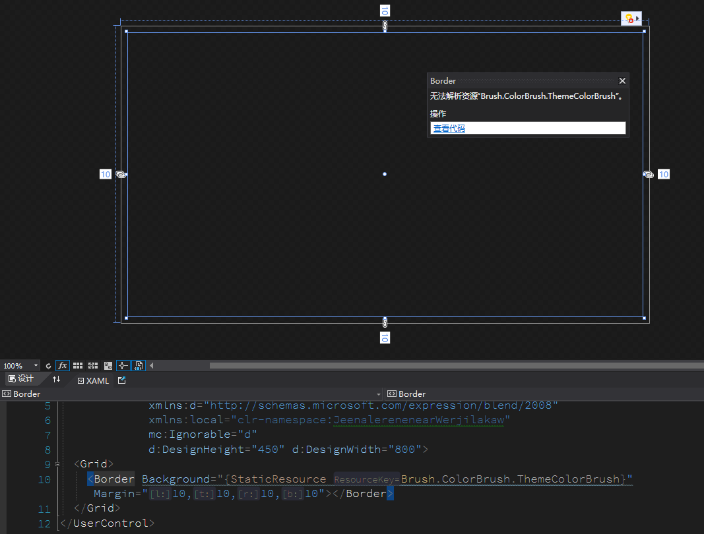
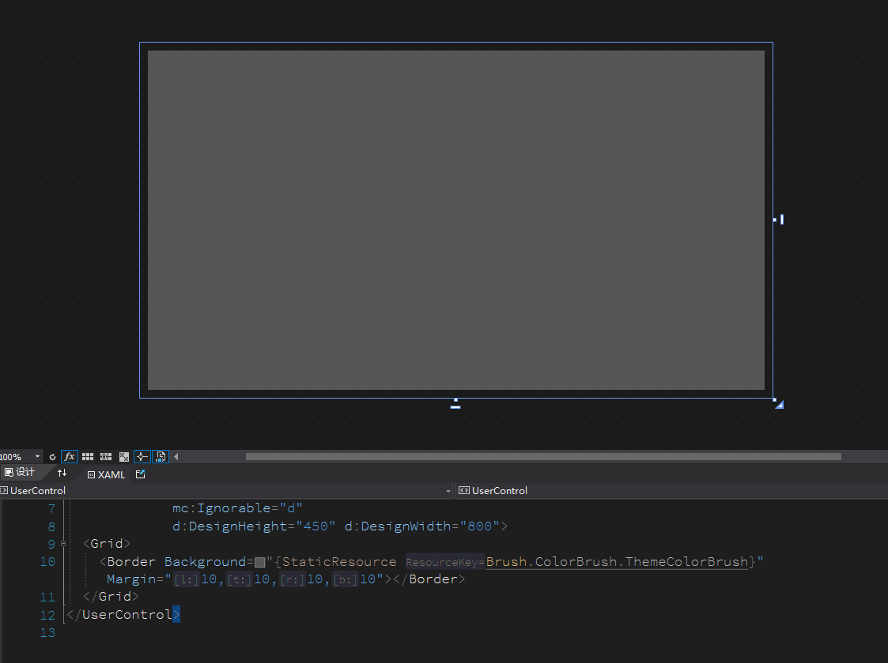

# WPF 给类库设置设计时使用的资源字典

在开发 WPF 类库时，由于类库里面没有存在 App.xaml.cs 文件，而在对单个 XAML 进行开发时，设计器将会因为找不到资源文件的存在，而拿不到资源。本文告诉大家简单的方法，给设计器设置仅在设计时引用的资源

<!--more-->
<!-- CreateTime:2021/4/22 8:44:19 -->

<!-- 发布 -->

在 WPF 的 XAML 中，如果对每个 XAML 控件都引用相同的资源，此时设计时将可以愉快的跑起来，然而在运行时将会重复创建资源影响性能。在开发 WPF 应用时，在入口项目里面，因为入口处有 App.xaml 文件，在这个文件里面加上了各个项目的引用，此时设计器就能知道当前项目引用的 XAML 资源字典，因此设计器就能工作

但是在开发类库的时候，类库不知道最终的入口项目是哪个，因此也就不知道当前程序在运行的时候，将会找不到引用

最佳的方法是和 Blend 一样，在设计时让设计器引用上某些资源，这样设计器就能工作

实现方法是在类库里面添加特殊的文件，这个特殊的文件有文件夹和命名的要求，这是在 VisualStudio 的设计器里面写常量固定的路径

在项目里面新建 `Properties` 文件夹，在 `Properties` 文件夹里面新建 DesignTimeResources.xaml 资源字典文件，大概如下

<!--  -->


这个文件的命名规则是有约定的，不推荐自己修改。在 csproj 上添加如下代码

```xml
  <ItemGroup>
    <Page Update="Properties\DesignTimeResources.xaml">
      <Generator>MSBuild:Compile</Generator>
      <SubType>Designer</SubType>
      <ContainsDesignTimeResources>true</ContainsDesignTimeResources>
    </Page>
  </ItemGroup>
```

上面代码核心就是 ContainsDesignTimeResources 这个属性。理论上可以给任意的 xaml 文件设置这个属性，但是 XAML 设计器在很多 VS 版本上只读取此路径的文件

在 DesignTimeResources.xaml 资源字典添加对其他资源字典的引用，即可实现让类库的设计器找到资源，而在运行时是不会加载资源到内存

例如我新建了类库项目 JeenalerenenearWerjilakaw 项目。我在 JeenalerenenearWerjilakaw 项目里面添加了资源字典 ColorBrushResourcesDictionary.xaml 资源字典，在里面存放颜色画刷，代码如下

```xml
<ResourceDictionary xmlns="http://schemas.microsoft.com/winfx/2006/xaml/presentation"
                    xmlns:x="http://schemas.microsoft.com/winfx/2006/xaml"
                    xmlns:local="clr-namespace:JeenalerenenearWerjilakaw">
    <SolidColorBrush x:Key="Brush.ColorBrush.ThemeColorBrush">#FF565656</SolidColorBrush>
</ResourceDictionary>
```

而我期望在 JeenalerenenearWerjilakaw 项目的自定义控件 UserControl1.xaml 上使用这个 Brush.ColorBrush.ThemeColorBrush 资源，如下面代码

```xml
  <Grid>
    <Border Background="{StaticResource Brush.ColorBrush.ThemeColorBrush}" Margin="10,10,10,10"></Border>
  </Grid>
```

此时的设计器和代码都不能工作，将会在设计器提示找不到资源

<!--  -->


接下来新建 `Properties\DesignTimeResources.xaml` 资源字典文件，在这个资源字典文件里面添加如下代码

```xml
<ResourceDictionary xmlns="http://schemas.microsoft.com/winfx/2006/xaml/presentation"
                    xmlns:x="http://schemas.microsoft.com/winfx/2006/xaml">
    <ResourceDictionary.MergedDictionaries>
        <ResourceDictionary Source="../ColorBrushResourcesDictionary.xaml"></ResourceDictionary>
    </ResourceDictionary.MergedDictionaries>
</ResourceDictionary>
```

在 JeenalerenenearWerjilakaw 的 csproj 添加如下代码

```xml
  <ItemGroup>
    <Page Update="Properties\DesignTimeResources.xaml">
      <Generator>MSBuild:Compile</Generator>
      <SubType>Designer</SubType>
      <ContainsDesignTimeResources>true</ContainsDesignTimeResources>
    </Page>
  </ItemGroup>
```

当前的 csproj 的所有代码看起来如下

```xml
<Project Sdk="Microsoft.NET.Sdk.WindowsDesktop">

  <PropertyGroup>
    <TargetFramework>netcoreapp3.1</TargetFramework>
    <UseWPF>true</UseWPF>
  </PropertyGroup>

  <ItemGroup>
    <Page Update="Properties\DesignTimeResources.xaml">
      <Generator>MSBuild:Compile</Generator>
      <SubType>Designer</SubType>
      <ContainsDesignTimeResources>true</ContainsDesignTimeResources>
    </Page>
  </ItemGroup>
</Project>
```

以上代码是用在 SDK 风格的 csproj 文件上，如果当前项目文件非 sdk 风格，请参阅 [从以前的项目格式迁移到 VS2017 新项目格式](https://blog.lindexi.com/post/%E4%BB%8E%E4%BB%A5%E5%89%8D%E7%9A%84%E9%A1%B9%E7%9B%AE%E6%A0%BC%E5%BC%8F%E8%BF%81%E7%A7%BB%E5%88%B0-VS2017-%E6%96%B0%E9%A1%B9%E7%9B%AE%E6%A0%BC%E5%BC%8F.html )

接下来保存代码，然后关闭 VisualStudio 清理缓存文件，打开 VisualStudio 可以看到，当前设计器和代码都能工作

<!--  -->


本文代码放在 [github](https://github.com/lindexi/lindexi_gd/tree/41f631f0/HallnebubeaChelnawjecere ) 和 [gitee](https://gitee.com/lindexi/lindexi_gd/tree/41f631f0/HallnebubeaChelnawjecere) 欢迎下载执行

[WPF Design Time Support (Part 2) · jbe2277/waf Wiki](https://github.com/jbe2277/waf/wiki/WPF-Design-Time-Support-(Part-2) )

然而在有 Resharper 的 VisualStudio 上，这个配置在 Resharper 2020 的一些版本是不认识的，此时将会让 Resharper 找不到资源引用，而没有自动跳转和补全的功能。好在 Resharper 对于项目格式的支持不够好，咱可以使用黑科技来解决此问题。在 Resharper 的 2021 版本也修了这个问题，因此在新版本的 Resharper 是不需要加以下代码

在 Resharper 中，将会根据 ApplicationDefinition 定义去读取应用资源文件，但是在读取时将会忽略 Condition 内容。于是咱就可以尝试创建一个叫 `App_MakeReshaperHappy.xaml` 的文件，用来让 Resharper 开森。在 csproj 中添加如下代码，用来引用应用资源，但实际上又不会用上此资源

```xml
    <ApplicationDefinition Include="App_MakeReshaperHappy.xaml" Condition="false">
      <Generator>MSBuild:Compile</Generator>
      <SubType>Designer</SubType>
    </ApplicationDefinition>
```

上面代码中，使用了 Condition 为 false 让构建时实际忽略了此文件，否则将会在构建时报告不能在 WPF 类库中定义 ApplicationDefinition 元素。为什么不能叫 App.xaml 文件？原因是在 SDK 风格的 csproj 中，默认将会加上 EnableDefaultApplicationDefinition 自动加上默认的 ApplicationDefinition 元素。只要有文件叫 App.xaml 的，那么将会自动识别为 ApplicationDefinition 元素，此元素将会让 WPF 构建时报告不能在类库中定义。而如果设置 EnableDefaultApplicationDefinition 为 false 那 Resharper 又会不认此文件，经过了 [lsj](https://blog.sdlsj.net) 工具人的摸索，发现使用上文方法是最稳的

在 `App_MakeReshaperHappy.xaml` 文件里面存放以下代码，用来让 Resharper 智能感知能在设计时找到资源

```xml
<Application x:Class="App_MakeReshaperHappy" xmlns="http://schemas.microsoft.com/winfx/2006/xaml/presentation"
                    xmlns:x="http://schemas.microsoft.com/winfx/2006/xaml">
    <!--这个文件只是为了让Reshaper的智能感知开心-->
    <Application.Resources>
        <ResourceDictionary>
            <ResourceDictionary.MergedDictionaries>
                <!--以下替换为你自己的路径，我推荐引用的是设计时资源文件-->
                <ResourceDictionary Source="Properties/DesignTimeResources.xaml" />
            </ResourceDictionary.MergedDictionaries>
        </ResourceDictionary>
    </Application.Resources>
</Application>
```

以上代码必须要自己定义类型，然后继承 Application 同时有 `x:Class` 内容才可以。这个文件的文件名和类名要求一定包含 App 这三个字符，同时文件名和类名需要相同

以上代码放在 [github](https://github.com/lindexi/lindexi_gd/tree/b771e3f0/HallnebubeaChelnawjecere ) 和 [gitee](https://gitee.com/lindexi/lindexi_gd/tree/b771e3f0/HallnebubeaChelnawjecere) 欢迎下载执行

<a rel="license" href="http://creativecommons.org/licenses/by-nc-sa/4.0/"></a><br />本作品采用<a rel="license" href="http://creativecommons.org/licenses/by-nc-sa/4.0/">知识共享署名-非商业性使用-相同方式共享 4.0 国际许可协议</a>进行许可。欢迎转载、使用、重新发布，但务必保留文章署名[林德熙](http://blog.csdn.net/lindexi_gd)(包含链接:http://blog.csdn.net/lindexi_gd )，不得用于商业目的，基于本文修改后的作品务必以相同的许可发布。如有任何疑问，请与我[联系](mailto:lindexi_gd@163.com)。
