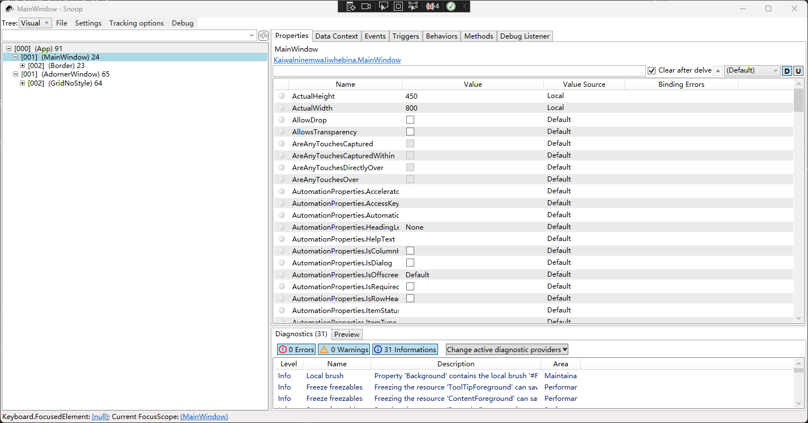

# WPF 自定义控件入门 Focusable 与焦点

自定义控件时，如果自定义的控件需要用来接收键盘消息或者是输入法的输入内容，那就需要关注到控件的焦点

<!--more-->
<!-- 发布 -->
<!-- 博客 -->

默认情况下的自定义控件是没有带可获取焦点的功能的，例如编写一个继承 FrameworkElement 的名为 Foo 的用来演示的自定义控件，通过 Focus 方法其实也是无法给此控件设置上焦点了

为了方便演示，咱来新建一个空 WPF 项目。在项目里面写入一个继承 FrameworkElement 的名为 Foo 的用来演示的自定义控件，代码如下

```csharp
public class Foo : FrameworkElement
{

}
```

为了了解 Foo 是否获取到了控件，在界面上放一个 TextBox 控件。由于 TextBox 控件默认是可以获取键盘输入焦点的，如果焦点被 Foo 抢走了，自然就会让 TextBox 失去输入焦点

编辑 MainWindow.xaml 添加以下代码

```xml
    <Grid>
        <Grid.ColumnDefinitions>
            <ColumnDefinition />
            <ColumnDefinition />
        </Grid.ColumnDefinitions>

        <Border Background="Blue">
            <local:Foo x:Name="Foo"></local:Foo>
        </Border>
        <TextBox Grid.Column="1" VerticalAlignment="Center"></TextBox>
    </Grid>
```

接着回到 MainWindow.xaml.cs 文件，在 MainWindow 的鼠标按下时，设置 Foo 的焦点，代码如下

```csharp
public partial class MainWindow : Window
{
    public MainWindow()
    {
        InitializeComponent();
    }

    protected override void OnMouseDown(MouseButtonEventArgs e)
    {
        Foo.Focus();

        var focusedElement = Keyboard.FocusedElement;
    }
}
```

运行程序，先点击 TextBox 设置键盘输入焦点在 TextBox 上。再点击空白的地方

预期就是 OnMouseDown 方法被进入，而且也调用了 UIElement.Focus 方法。但是却发现 TextBox 的焦点没有被抢走，依然还可以接收键盘的输入

调试当前的获取焦点的元素，可以通过 `Keyboard.FocusedElement` 静态属性，通过此静态属性的内容可以了解到当前的键盘焦点是在哪个元素上

通过此 `Keyboard.FocusedElement` 属性，可以看到当前的键盘焦点元素依然是 TextBox 元素。也就是 `Foo.Focus` 函数调用是无效的

这是因为 Foo 没有设置可获取焦点，只需要设置 `Foo.Focusable = true` 即可让 Foo 获取到焦点，修改之后的代码如下

```csharp
    protected override void OnMouseDown(MouseButtonEventArgs e)
    {
        Foo.Focusable = true;

        Foo.Focus();

        var focusedElement = Keyboard.FocusedElement;
    }
```

继续运行项目，此时可以发现点击空白处可以将键盘焦点设置到 Foo 元素，让 TextBox 丢失键盘输入焦点

对于一个明确是可以获取键盘焦点的自定义控件来说，许多时候都是重写 FocusableProperty 依赖属性的默认值来设置的，而不是对每个实例单独进行设置。修改 Foo 的代码如下，在静态构造函数添加 `FocusableProperty.OverrideMetadata` 设置默认值即可

```csharp
public class Foo : FrameworkElement
{
    static Foo()
    {
        FocusableProperty.OverrideMetadata(typeof(Foo), new UIPropertyMetadata(true));
    }
}
```

调试焦点问题时，推荐使用 [snoop](https://blog.lindexi.com/post/%E8%AE%A9-snoop-%E6%94%AF%E6%8C%81-.NET-Core-WPF-%E8%B0%83%E8%AF%95.html ) 工具，只需要关注 snoop 的下方状态栏写的当前焦点元素即可

<!--  -->


上图就是使用 [snoop](https://blog.lindexi.com/post/%E8%AE%A9-snoop-%E6%94%AF%E6%8C%81-.NET-Core-WPF-%E8%B0%83%E8%AF%95.html ) 工具调试的界面

本文以上代码放在[github](https://github.com/lindexi/lindexi_gd/tree/e603df1d70b9fc0ccf9d0e51d1ff74ebafe9cd8f/KaiwalninemwaJiwhebina) 和 [gitee](https://gitee.com/lindexi/lindexi_gd/tree/e603df1d70b9fc0ccf9d0e51d1ff74ebafe9cd8f/KaiwalninemwaJiwhebina) 欢迎访问

可以通过如下方式获取本文的源代码，先创建一个名为 KaiwalninemwaJiwhebina 的空文件夹，接着使用命令行 cd 命令进入此空文件夹，在命令行里面输入以下代码，即可获取到本文的代码

```
git init
git remote add origin https://gitee.com/lindexi/lindexi_gd.git
git pull origin e603df1d70b9fc0ccf9d0e51d1ff74ebafe9cd8f
```

以上使用的是 gitee 的源，如果 gitee 不能访问，请替换为 github 的源。请在命令行继续输入以下代码

```
git remote remove origin
git remote add origin https://github.com/lindexi/lindexi_gd.git
git pull origin e603df1d70b9fc0ccf9d0e51d1ff74ebafe9cd8f
```

获取代码之后，进入 KaiwalninemwaJiwhebina 文件夹
