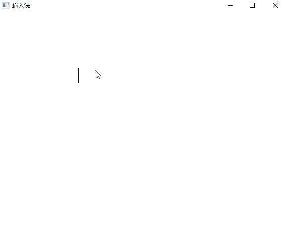

# WPF 自定义文本框输入法 IME 跟随光标

本文告诉大家在 WPF 写一个自定义的文本框，如何实现让输入法跟随光标

<!--more-->
<!-- CreateTime:2022/2/17 20:46:10 -->

<!-- 发布 -->
<!-- 博客 -->

本文非小白向，本文适合想开发自定义的文本框，从底层开始开发的文本库的伙伴。在开始之前，期望了解了文本库开发的基础知识

本文实现的效果如下

<!--  -->


## 实现

本文的方法参考了 [WPF 官方仓库](https://github.com/dotnet/wpf)的逻辑，可以在 WPF 仓库的 `wpf\src\Microsoft.DotNet.Wpf\src\PresentationFramework\System\Windows\Documents\ImmComposition.cs` 文件看到官方是如何让 TextBox 控件获取输入法焦点，和在输入光标变更时，修改输入法的输入框坐标

先了解一下输入法的相关知识。在 Windows 编程开发里，输入法框架有三套，其中用的最多的是第二套。第二套是采用 IMM 进行对接的。所谓 IMM 就是 Input Method Manager 也就是 输入法管理器

相关的另一个缩写词 IME 则是 Input Method Editor 或者是 Input Method Engine 的缩写，含义是输入法编辑器或输入法引擎

应用程序可以通过 IMM 对接输入法。所用的 win32 的 API 重点是如下几个

- ImmGetContext 获取输入法上下文，用于后续所有的其他函数调用
- ImmAssociateContext 关联输入法和对应的窗口，让输入法了解在哪个窗口输入
- ImmSetCompositionWindow 用来设置输入法的窗口的坐标，也是本文最重要的函数

本文接下来将告诉大家如何一步步实现封装对 IME 输入法调用，在本文最后将会给出所有的源代码

这部分对输入法的逻辑可以封装为一个类，这样上层就可以不关注细节逻辑。如例子代码，放在 IMESupporter 类型里

为了方便文本框的接入，咱再定义一个接口，用于设置文本框需要实现一些方法，用来提供参数给 IMESupporter 使用才能进行接入

```csharp
    /// <summary>
    /// 表示控件支持被输入法
    /// </summary>
    interface IIMETextEditor
    {
        /// <summary>
        /// 获取当前使用的字体名
        /// </summary>
        /// <returns></returns>
        string GetFontFamilyName();

        /// <summary>
        /// 获取字号大小，单位和 WPF 的 FontSize 相同
        /// </summary>
        /// <returns></returns>
        int GetFontSize();

        /// <summary>
        /// 获取输入框的左上角的点，用于设置输入法的左上角。此点相对于 <see cref="IIMETextEditor"/> 所在元素坐标。对大部分控件来说，都应该是 0,0 点
        /// </summary>
        /// <returns></returns>
        Point GetTextEditorLeftTop();

        /// <summary>
        /// 获取光标的输入左上角的点。此点相对于 <see cref="IIMETextEditor"/> 所在元素坐标
        /// </summary>
        /// <returns></returns>
        Point GetCaretLeftTop();
    }
```

对于如微软拼音等输入法，是支持设置输入法的文本大小和字体。因此就需要文本框提供 GetFontFamilyName 和 GetFontSize 方法

而 GetCaretLeftTop 自然就是用来让输入法跟随的。为了让文本框可以做更多的定制，也需要 GetTextEditorLeftTop 方法，这个方法的返回值对大部分自定义的文本框控件来说，都应该是 0,0 点

在 IMESupporter 类型构造函数，期望传入文本框控件，如此可以解决初始化值和监听的锅

```csharp
    internal class IMESupporter<T> where T : UIElement, IIMETextEditor
    {
        // ReSharper disable InconsistentNaming
        public IMESupporter(T editor)
        {
            Editor = editor;
            // 忽略代码
        }
    }
```

为了同时约束传入的文本框控件继承 UIElement 和 IIMETextEditor 接口，用了泛形

在文本框控件 Editor 获取焦点的时候，将需要唤起输入法进行输入。在 Editor 失去焦点的时候，就应该告诉输入法当前不进行输入

```csharp
        public IMESupporter(T editor)
        {
            Editor = editor;
            Editor.GotKeyboardFocus += Editor_GotKeyboardFocus;
            Editor.LostKeyboardFocus += Editor_LostKeyboardFocus;
        }

        private T Editor { get; }
```


根据 WPF 的约定，对自定义的支持输入法的控件，需要设置 IsInputMethodSuspendedProperty 附加属性，如下面代码

```csharp
            InputMethod.SetIsInputMethodSuspended(editor, true);
```

在 `Editor_GotKeyboardFocus` 需要实现的逻辑是调起输入法和设置初始的输入框的坐标。如上文，开始之前，需要先拿到输入法上下文。在拿到输入法上下文之前，可以先获取默认的 IME 类窗口句柄。先获取默认的 IME 类窗口句柄是为了在多进程嵌入窗口时，让微软拼音输入法的输入框跟随输入光标而不是在左上角

```csharp
            _defaultImeWnd = IMENative.ImmGetDefaultIMEWnd(IntPtr.Zero);
```

以上的 `_defaultImeWnd` 是一个字段，在 IMESupporter 里定义如下字段和属性

```csharp
        private T Editor { get; }

        private IntPtr _defaultImeWnd;
        private IntPtr _currentContext;
        private IntPtr _previousContext;
        private HwndSource? _hwndSource;

        private bool _isUpdatingCompositionWindow;
```

这里有一个细节是 ImmGetDefaultIMEWnd 也许会返回 0x00 空值。什么时候会返回空值？如打开一个 Win32Dialog 窗口，如 OpenFileDialog 或 SaveFileDialog 等，之后关闭，那么此时也许 ImmGetDefaultIMEWnd 将会返回空值

拿到空值，需要重新绑定输入法，告诉输入法当前的窗口获取输入焦点，可以使用如下代码，通过修改附加属性的值，通过附加属性变更调用到 WPF 框架的逻辑，从而修复此问题

```csharp
            if (_defaultImeWnd == IntPtr.Zero)
            {
                // 如果拿到了空的默认 IME 窗口了，那么此时也许是作为嵌套窗口放入到另一个进程的窗口
                // 拿不到就需要刷新一下。否则微软拼音输入法将在屏幕的左上角上
                RefreshInputMethodEditors();

                // 忽略代码
            }

        /// <summary>
        /// 刷新 IME 的 ITfThreadMgr 状态，用于修复打开 Win32Dialog 之后关闭，输入法无法输入中文问题
        /// </summary>
        /// 原因是在打开 Win32Dialog 之后，将会让 ITfThreadMgr 失去焦点。因此需要使用本方法刷新，通过 InputMethod 的 IsInputMethodEnabledProperty 属性调用到 InputMethod 的 EnableOrDisableInputMethod 方法，在这里面调用到 TextServicesContext.DispatcherCurrent.SetFocusOnDefaultTextStore 方法，从而调用到 SetFocusOnDim(DefaultTextStore.Current.DocumentManager) 的代码，将 DefaultTextStore.Current.DocumentManager 设置为 ITfThreadMgr 的焦点，重新绑定 IME 输入法
        /// 但是即使如此，依然拿不到 <see cref="_defaultImeWnd"/> 的初始值。依然需要重新打开和关闭 WPF 窗口才能拿到
        /// [Can we public the `DefaultTextStore.Current.DocumentManager` property to create custom TextEditor with IME · Issue #6139 · dotnet/wpf](https://github.com/dotnet/wpf/issues/6139 )
        private void RefreshInputMethodEditors()
        {
            if (InputMethod.GetIsInputMethodEnabled(Editor))
            {
                InputMethod.SetIsInputMethodEnabled(Editor, false);
            }

            if (InputMethod.GetIsInputMethodSuspended(Editor))
            {
                InputMethod.SetIsInputMethodSuspended(Editor, false);
            }

            InputMethod.SetIsInputMethodEnabled(Editor, true);
            InputMethod.SetIsInputMethodSuspended(Editor, true);
        }
```

除了给 ImmGetDefaultIMEWnd 传入 IntPtr.Zero 可以获取之外，还可以传入当前的 Editor 所在的 `HwndSource` 进行获取，这里的 HwndSource 就相当于或者说大多数时候是等于 Editor 所在的窗口

```csharp
            _hwndSource = (HwndSource) (PresentationSource.FromVisual(Editor) ??
                                       throw new ArgumentNullException(nameof(Editor)));

            if (_defaultImeWnd == IntPtr.Zero)
            {
                // 如果拿到了空的默认 IME 窗口了，那么此时也许是作为嵌套窗口放入到另一个进程的窗口
                // 拿不到就需要刷新一下。否则微软拼音输入法将在屏幕的左上角上
                RefreshInputMethodEditors();

                // 尝试通过 _hwndSource 也就是文本所在的窗口去获取
                _defaultImeWnd = IMENative.ImmGetDefaultIMEWnd(_hwndSource.Handle);

                // 忽略代码
            }
```

如果继续获取不到，那么可以尝试使用 GetForegroundWindow 获取。使用 GetForegroundWindow 获取到的也许不是正确的，但是能进入此分支，也好过没有输入法

```csharp
                _defaultImeWnd = IMENative.ImmGetDefaultIMEWnd(_hwndSource.Handle);

                if (_defaultImeWnd == IntPtr.Zero)
                {
                    // 如果依然获取不到，那么使用当前激活的窗口，在准备输入的时候
                    // 当前的窗口大部分都是对的
                    // 进入这里，是尽可能恢复输入法，拿到的 GetForegroundWindow 虽然预计是不对的
                    // 也好过没有输入法
                    _defaultImeWnd = IMENative.ImmGetDefaultIMEWnd(Win32.User32.GetForegroundWindow());
                }
```

接下来通过 `_defaultImeWnd` 获取输入法上下文，如下面代码

```csharp
            // 使用 DefaultIMEWnd 可以比较好解决微软拼音的输入法到屏幕左上角的问题
            _currentContext = IMENative.ImmGetContext(_defaultImeWnd);
```

如果从 `_defaultImeWnd` 拿不到，则使用 `_hwndSource.Handle` 获取

```csharp
            _currentContext = IMENative.ImmGetContext(_defaultImeWnd);
            if (_currentContext == IntPtr.Zero)
            {
                _currentContext = IMENative.ImmGetContext(_hwndSource.Handle);
            }
```

获取上下文之后，将输入法上下文和当前窗口关联起来。对于只实现第二套输入法框架的输入法，应用程序调用 ImmAssociateContext 关联，即可调起此输入法在关联的窗口输入

```csharp
            // 对 Win32 使用第二套输入法框架的输入法，可以采用 ImmAssociateContext 关联
            // 但是对实现 TSF 第三套输入法框架的输入法，在应用程序对接第三套输入法框架
            // 就需要调用 ITfThreadMgr 的 SetFocus 方法。刚好 WPF 对接了
            _previousContext = IMENative.ImmAssociateContext(_hwndSource.Handle, _currentContext);
```

输入法在输入过程中，将会通过 Windows 消息和当前窗口进行通讯，如获取输入框所需的坐标和输入文本等。因此咱需要加上 Hook 消息，用于告诉输入法坐标。但不需要处理输入的文本的逻辑，因为输入文本的逻辑等在 WPF 已有处理

```csharp
            _previousContext = IMENative.ImmAssociateContext(_hwndSource.Handle, _currentContext);
            _hwndSource.AddHook(WndProc);
```

关于 WndProc 的函数逻辑，咱放在后面

在 WPF 框架里，会对第三套输入法有进行支持，于是就需要调用 `ITfThreadMgr` 这个 COM 组件进行关联焦点，如下面代码

```csharp
            // 尽管文档说传递null是无效的，但这似乎有助于在与WPF共享的默认输入上下文中激活IME输入法
            // 这里需要了解的是，在 WPF 的逻辑，是需要传入 DefaultTextStore.Current.DocumentManager 才符合预期
            IMENative.ITfThreadMgr? threadMgr = IMENative.GetTextFrameworkThreadManager();
            threadMgr?.SetFocus(IntPtr.Zero);
```

初始化的过程还需要给输入法的输入框一个初始化的坐标，可使用 Win32 的 ImmSetCompositionWindow 进行设置。在进行设置之前，需要获取到文本框的输入光标相对于窗口的坐标，用于给输入法使用

下面代码从文本框获取文本框实现接口的获取光标和输入框左上角

```csharp
            var textEditorLeftTop = Editor.GetTextEditorLeftTop();
            var caretLeftTop = Editor.GetCaretLeftTop();
```

接下来使用如下代码将坐标转换为相对于窗口的

```csharp
            var hIMC = _currentContext;
            HwndSource source = _hwndSource;

            var textEditorLeftTop = Editor.GetTextEditorLeftTop();
            var caretLeftTop = Editor.GetCaretLeftTop();

            var transformToAncestor = Editor.TransformToAncestor(source.RootVisual);

            var textEditorLeftTopForRootVisual = transformToAncestor.Transform(textEditorLeftTop);
            var caretLeftTopForRootVisual = transformToAncestor.Transform(caretLeftTop);
```

对 surface 设备来说，需要进行更多的处理

```csharp
            //解决surface上输入法光标位置不正确
            //现象是surface上光标的位置需要乘以2才能正确，普通电脑上没有这个问题
            //且此问题与DPI无关，目前用CaretWidth可以有效判断
            caretLeftTopForRootVisual = new Point(caretLeftTopForRootVisual.X / SystemParameters.CaretWidth,
                caretLeftTopForRootVisual.Y / SystemParameters.CaretWidth);
```

获取到的坐标传入到 ImmSetCompositionWindow 方法

```csharp
            //const int CFS_DEFAULT = 0x0000;
            //const int CFS_RECT = 0x0001;
            const int CFS_POINT = 0x0002;
            //const int CFS_FORCE_POSITION = 0x0020;
            //const int CFS_EXCLUDE = 0x0080;
            //const int CFS_CANDIDATEPOS = 0x0040;

            var form = new IMENative.CompositionForm();
            form.dwStyle = CFS_POINT;
            form.ptCurrentPos.x = (int) Math.Max(caretLeftTopForRootVisual.X, textEditorLeftTopForRootVisual.X);
            form.ptCurrentPos.y = (int) Math.Max(caretLeftTopForRootVisual.Y, textEditorLeftTopForRootVisual.Y);
            //if (_isSoftwarePinYinOverWin7)
            //{
            //    form.ptCurrentPos.y += (int) characterBounds.Height;
            //}

            IMENative.ImmSetCompositionWindow(hIMC, ref form);
```

以上注释的 `_isSoftwarePinYinOverWin7` 的逻辑是判断在系统版本大于 Win7 的系统，如 Win10 系统上，使用微软拼音输入法，微软拼音输入法在几个版本，需要修改 Y 坐标，加上输入的行高才可以。但是在一些 Win10 版本，通过补丁又修了这个问题

以上就完成了输入法的初始化逻辑

接下来就是需要处理 Windows 消息了，如在收到 `WM_INPUTLANGCHANGE` 消息时，需要重新获取输入法上下文

```csharp
        private IntPtr WndProc(IntPtr hWnd, int msg, IntPtr wParam, IntPtr lParam, ref bool handled)
        {
            switch (msg)
            {
            	// 忽略代码
                case IMENative.WM_INPUTLANGCHANGE:
                    if (_hwndSource != null)
                    {
                        CreateContext();
                    }

            	// 忽略代码
                    break;
            }

            return IntPtr.Zero;
        }
```

以上获取输入法上下文 CreateContext 方法是获取 `_currentContext` 的逻辑

在收到 `WM_IME_COMPOSITION` 消息，需要更新输入法的输入框的坐标

```csharp
        private IntPtr WndProc(IntPtr hWnd, int msg, IntPtr wParam, IntPtr lParam, ref bool handled)
        {
            switch (msg)
            {
            	// 忽略代码
                case IMENative.WM_IME_COMPOSITION:
                    UpdateCompositionWindow();
                    break;
            	// 忽略代码
            }

            return IntPtr.Zero;
        }
```

以上的 UpdateCompositionWindow 方法是调用 ImmSetCompositionWindow 方法设置坐标的方法

关于此 IMESupporter 类型的所有代码，可以从下文获取

接下来是对接 IMESupporter 和具体的文本框

先在自定义的文本框 TextEditor 控件上继承 IIMETextEditor 接口。为了方便调试，咱先写测试逻辑，获取的输入光标就是上次鼠标点击的点以及固定的字体字号

```csharp
    public partial class TextEditor : FrameworkElement, IIMETextEditor
    {
        // 忽略代码

        protected override void OnRender(DrawingContext drawingContext)
        {
            drawingContext.DrawRectangle(Brushes.Black,null,new Rect(MouseDownPoint,new Size(3,30)));
            base.OnRender(drawingContext);
        }

        protected override HitTestResult HitTestCore(PointHitTestParameters hitTestParameters)
        {
        	// 让控件接收点击
            return new PointHitTestResult(this, hitTestParameters.HitPoint);
        }

        protected override void OnMouseDown(MouseButtonEventArgs e)
        {
            MouseDownPoint = e.GetPosition(this);
            Focus();
            InvalidateVisual();
        }
        
        private Point MouseDownPoint { get; set; }

        string IIMETextEditor.GetFontFamilyName()
        {
            return "微软雅黑";
        }

        int IIMETextEditor.GetFontSize()
        {
            return 30;
        }

        Point IIMETextEditor.GetTextEditorLeftTop()
        {
            // 相对于当前输入框的坐标
            return new Point(0, 0);
        }

        Point IIMETextEditor.GetCaretLeftTop()
        {
            return MouseDownPoint;
        }
    }
```

在 OnMouseDown 方法里面，需要调用 Focus 获取焦点，同时更新一下模拟的光标。模拟的光标是在 OnRender 方法里面，使用画出一个矩形模拟的，没有做闪烁

为了让控件能接收键盘消息，需要设置 FocusableProperty 属性。为了接收 Tab 键，而不是被切到其他控件，需要设置 KeyboardNavigation 的 IsTabStopProperty 和 TabNavigationProperty 附加属性。因为这是作用在所有的自定义文本框 TextEditor 控件上的，因此可以在 TextEditor 的静态构造函数，进行更改默认值，代码如下

```csharp
        static TextEditor()
        {
            // 用于接收 Tab 按键，而不是被切换焦点
            KeyboardNavigation.IsTabStopProperty.OverrideMetadata(typeof(TextEditor),
                new FrameworkPropertyMetadata(true));
            KeyboardNavigation.TabNavigationProperty.OverrideMetadata(typeof(TextEditor),
                new FrameworkPropertyMetadata(KeyboardNavigationMode.None));

            // 用于获取焦点逻辑
            FocusableProperty.OverrideMetadata(typeof(TextEditor),
                new FrameworkPropertyMetadata(true));
        }
```

完成 TextEditor 控件的配置，就可以对接 IMESupporter 类，对接方法是创建即可

```csharp
        public TextEditor()
        {
            // 忽略代码

            _imeSupporter = new IMESupporter<TextEditor>(this);
        }

        private readonly IMESupporter<TextEditor> _imeSupporter;
```

这样就完成了文本框让输入法跟随输入的功能

## 代码

本文所有代码放在[github](https://github.com/lindexi/lindexi_gd/tree/b3a1fffece8284d0b84407aa13d949de6a2f1536/) 和 [gitee](https://gitee.com/lindexi/lindexi_gd/tree/b3a1fffece8284d0b84407aa13d949de6a2f1536/) 欢迎访问

可以通过如下方式获取本文的源代码，先创建一个空文件夹，接着使用命令行 cd 命令进入此空文件夹，在命令行里面输入以下代码，即可获取到本文的代码

```
git init
git remote add origin https://gitee.com/lindexi/lindexi_gd.git
git pull origin b3a1fffece8284d0b84407aa13d949de6a2f1536
```

以上使用的是 gitee 的源，如果 gitee 不能访问，请替换为 github 的源

```
git remote remove origin
git remote add origin https://github.com/lindexi/lindexi_gd.git
```

获取代码之后，打开 LightTextEditorPlus.sln 文件

## 参考文档

[WPF 简单聊聊如何使用 DrawGlyphRun 绘制文本](https://blog.lindexi.com/post/WPF-%E7%AE%80%E5%8D%95%E8%81%8A%E8%81%8A%E5%A6%82%E4%BD%95%E4%BD%BF%E7%94%A8-DrawGlyphRun-%E7%BB%98%E5%88%B6%E6%96%87%E6%9C%AC.html )

[Can we public the `DefaultTextStore.Current.DocumentManager` property to create custom TextEditor with IME · Issue #6139 · dotnet/wpf](https://github.com/dotnet/wpf/issues/6139 )

[自己写了一个输入法, Windows下的五笔](https://baohaojun.github.io/blog/2013/10/05/0-My-Own-Win32-Input-Method.html )

[我的Win32输入法编程心得](https://baohaojun.github.io/blog/2013/10/04/0-Win32-IME-Programming.html )

[文档管理器 - Win32 apps Microsoft Docs](https://docs.microsoft.com/zh-cn/windows/win32/tsf/document-manager )

[分段 - Win32 apps Microsoft Docs](https://docs.microsoft.com/zh-cn/windows/win32/tsf/compartments )

[输入法编辑器 (IME) 要求 - Windows apps Microsoft Docs](https://docs.microsoft.com/zh-cn/windows/apps/design/input/input-method-editor-requirements )

[CefSharp/WpfIMEKeyboardHandler.cs at bfa8ccf24c7694a80ec42b8f3d6d1683b144ec68 · cefsharp/CefSharp](https://github.com/cefsharp/CefSharp/blob/bfa8ccf24c7694a80ec42b8f3d6d1683b144ec68/CefSharp.Wpf/Experimental/WpfIMEKeyboardHandler.cs )

[ITfContextOwnerCompositionSink (msctf.h) - Win32 apps Microsoft Docs](https://docs.microsoft.com/en-us/windows/win32/api/msctf/nn-msctf-itfcontextownercompositionsink )

[WM_IME_SETCONTEXT message (Winuser.h) - Win32 apps Microsoft Docs](https://docs.microsoft.com/en-us/windows/win32/intl/wm-ime-setcontext )

[IME Level 3 app equivalent with Text services](https://microsoft.public.win32.programmer.international.narkive.com/QRO6yEDm/ime-level-3-app-equivalent-with-text-services )

[ITfThreadMgr::AssociateFocus (msctf.h) - Win32 apps Microsoft Docs](https://docs.microsoft.com/en-us/windows/win32/api/msctf/nf-msctf-itfthreadmgr-associatefocus )

[ITfThreadMgr::SetFocus (msctf.h) - Win32 apps Microsoft Docs](https://docs.microsoft.com/en-us/windows/win32/api/msctf/nf-msctf-itfthreadmgr-setfocus )

[ImmSetCompositionStringA function (imm.h) - Win32 apps Microsoft Docs](https://docs.microsoft.com/en-us/windows/win32/api/imm/nf-imm-immsetcompositionstringa )

[WM_IME_COMPOSITION message (Winuser.h) - Win32 apps Microsoft Docs](https://docs.microsoft.com/en-us/windows/win32/intl/wm-ime-composition )

[LOGFONTA (wingdi.h) - Win32 apps Microsoft Docs](https://docs.microsoft.com/en-us/windows/win32/api/wingdi/ns-wingdi-logfonta )

[ImmGetContext function (imm.h) - Win32 apps Microsoft Docs](https://docs.microsoft.com/en-us/windows/win32/api/imm/nf-imm-immgetcontext )

[Input Context - Win32 apps Microsoft Docs](https://docs.microsoft.com/en-us/windows/win32/intl/input-context )

[About Input Method Manager - Win32 apps Microsoft Docs](https://docs.microsoft.com/en-us/windows/win32/intl/about-input-method-manager )

[Developing IME-Aware Multiple-thread Applications - Win32 apps Microsoft Docs](https://docs.microsoft.com/en-us/windows/win32/intl/developing-ime-aware-multiple-thread-applications )

[c++ - ImmGetContext returns zero always - Stack Overflow](https://stackoverflow.com/questions/64280975/immgetcontext-returns-zero-always )

[[AHK]输入法状态提示，中文状态提示“中”，英文状态提示“EN”[转] - 生命在等待中延续 - 博客园](https://www.cnblogs.com/guyk/p/10923952.html )

<a rel="license" href="http://creativecommons.org/licenses/by-nc-sa/4.0/"></a><br />本作品采用<a rel="license" href="http://creativecommons.org/licenses/by-nc-sa/4.0/">知识共享署名-非商业性使用-相同方式共享 4.0 国际许可协议</a>进行许可。欢迎转载、使用、重新发布，但务必保留文章署名[林德熙](http://blog.csdn.net/lindexi_gd)(包含链接:http://blog.csdn.net/lindexi_gd )，不得用于商业目的，基于本文修改后的作品务必以相同的许可发布。如有任何疑问，请与我[联系](mailto:lindexi_gd@163.com)。
