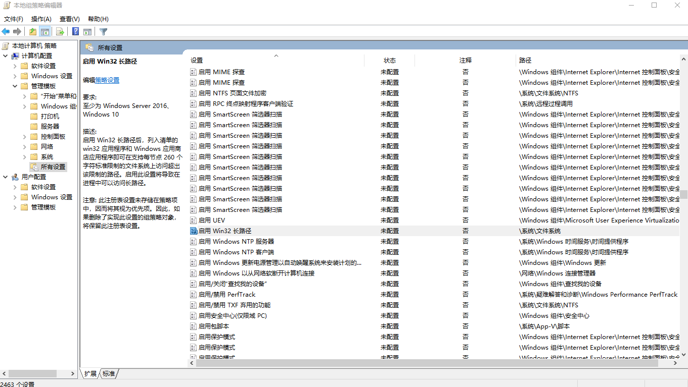
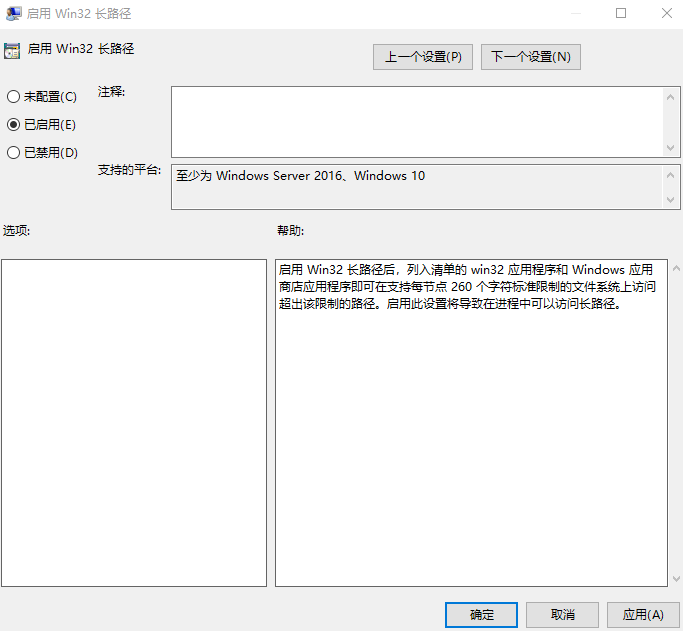

# WPF 解决 PathTooLongException 路径太长

在进行访问文件的时候，可能会因为文件的路径太长无法创建访问文件

本文告诉大家如何支持长路径的读写

<!--more-->
<!-- CreateTime:2019/12/6 9:15:06 -->

<!-- csdn -->

先创建简单的程序，在界面放一个按钮，在按钮点击的事件尝试写一个文件名很长的文件

```csharp
        private void Button_OnClick(object sender, RoutedEventArgs e)
        {
            string str = "E:\\the long long path {0}.txt";
            str = string.Format(str, new string(Enumerable.Range(0, 300).Select(temp => 'x').ToArray()));
            var file = new FileInfo(str);
            using (var stream = file.CreateText())
            {
                stream.WriteLine("欢迎访问我博客 http://lindexi.gitee.io 里面有大量 UWP WPF 博客");
            }
        }
```

运行程序点击按钮会发现 `var file = new FileInfo(str);` 说文件名太长

```csharp
System.IO.PathTooLongException:“指定的路径或文件名太长，或者两者都太长。完全限定文件名必须少于 260 个字符，并且目录名必须少于 248 个字符。”
```

可以通过限定路径的方法解决

在运行输入 gpedit.msc 打开策略编辑器

点击计算机配置-管理模板-所有设置，找到启用win32长路径选项

<!--  -->


点击编辑策略设置，启用

<!--  -->

如果要在应用程序可以使用长的文件名，当然单个文件名不能超过 265 字符，但是文件所在路径可以超过。需要在 .NET 4.6.2 以上，添加清单

在清单 app.manifest 添加下面代码

```csharp
  <application xmlns="urn:schemas-microsoft-com:asm.v3">
      <windowsSettings xmlns:ws2="https://schemas.microsoft.com/SMI/2016/WindowsSettings">
          <ws2:longPathAware>true</ws2:longPathAware>
      </windowsSettings>
  </application>
```

此时可以尝试写长路径

```csharp
        static void Main(string[] args)
        {
            var folder = Path.GetTempPath();

            for (int i = 0; i < 300; i++)
            {
                folder = Path.Combine(folder, i.ToString());
                Directory.CreateDirectory(folder);
            }

            var file = new FileInfo(Path.Combine(folder, "1.txt"));
            var fileStream = file.Create();
        }
```

[Naming Files, Paths, and Namespaces - Windows applications](https://docs.microsoft.com/en-us/windows/desktop/FileIO/naming-a-file#maxpath )

[Long Paths in .NET, Part 1 of 3 [Kim Hamilton] – BCL Team Blog](https://blogs.msdn.microsoft.com/bclteam/2007/02/13/long-paths-in-net-part-1-of-3-kim-hamilton/ )

[Long Paths in .NET, Part 2 of 3: Long Path Workarounds [Kim Hamilton] – BCL Team Blog](https://blogs.msdn.microsoft.com/bclteam/2007/03/26/long-paths-in-net-part-2-of-3-long-path-workarounds-kim-hamilton/ )

[Long Paths in .NET, Part 3 of 3 Redux [Kim Hamilton] – BCL Team Blog](https://blogs.msdn.microsoft.com/bclteam/2008/07/07/long-paths-in-net-part-3-of-3-redux-kim-hamilton/ )

[Using long paths in .NET](https://corengen.wordpress.com/2008/04/06/using-long-paths-in-net/ )

[More on new .NET path handling – Jeremy Kuhne's Blog](https://blogs.msdn.microsoft.com/jeremykuhne/2016/06/21/more-on-new-net-path-handling/ )

<a rel="license" href="http://creativecommons.org/licenses/by-nc-sa/4.0/"></a><br />本作品采用<a rel="license" href="http://creativecommons.org/licenses/by-nc-sa/4.0/">知识共享署名-非商业性使用-相同方式共享 4.0 国际许可协议</a>进行许可。欢迎转载、使用、重新发布，但务必保留文章署名[林德熙](http://blog.csdn.net/lindexi_gd)(包含链接:http://blog.csdn.net/lindexi_gd )，不得用于商业目的，基于本文修改后的作品务必以相同的许可发布。如有任何疑问，请与我[联系](mailto:lindexi_gd@163.com)。
