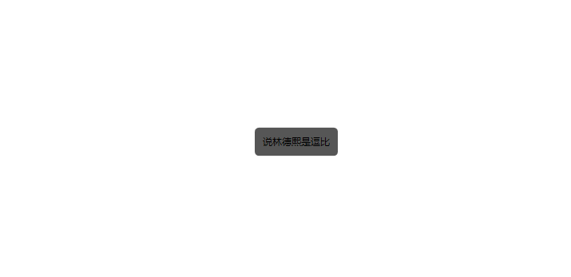
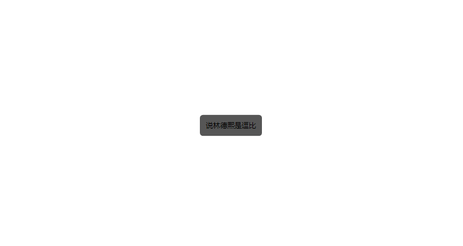
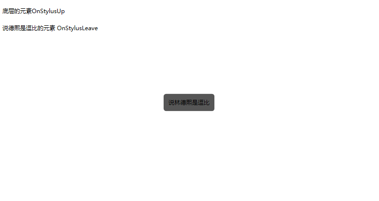
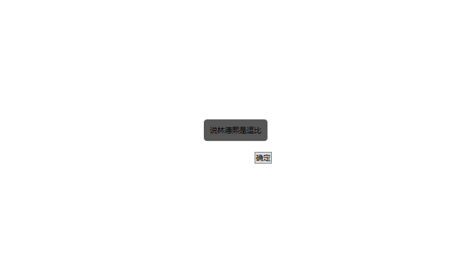

# WPF 解决 StylusPlugIn 点击穿透问题

在使用 StylusPlugIn 的时候会出现这样的坑，只要一个元素附加有 StylusPlugIn 加入到视觉树，在这个元素上面放另一个没有附加 StylusPlugIn 的元素，点击上面的元素，下面的元素的 StylusPlugIn 还是可以收到触摸的消息

<!--more-->
<!-- CreateTime:2019/10/18 20:55:35 -->

<!-- csdn -->
<!-- 标签：WPF，笔迹 -->

如果写一个简单的 StylusPlugIn 附加到元素上，可以很快知道我说的问题

```csharp
    public class JallsiniPeagelJurnarbe : StylusPlugIn
    {
        /// <inheritdoc />
        protected override void OnStylusDown(RawStylusInput rawStylusInput)
        {
            Trace();
            base.OnStylusDown(rawStylusInput);
        }

        /// <inheritdoc />
        protected override void OnStylusMove(RawStylusInput rawStylusInput)
        {
            Trace();
            base.OnStylusMove(rawStylusInput);
        }

        /// <inheritdoc />
        protected override void OnStylusUp(RawStylusInput rawStylusInput)
        {
            Trace();
            base.OnStylusUp(rawStylusInput);
        }

        private void Trace([CallerMemberName] string name = "")
        {
            Debug.WriteLine(name);
        }

    }
```

再创建一个 UIElement 附加这个 JallsiniPeagelJurnarbe 将 UIElement 添加到界面，就可以在触摸的时候看到输出

```csharp
    public class MeexikelelHaiwurbe : UIElement
    {
        /// <inheritdoc />
        public MeexikelelHaiwurbe()
        {
            var dynamicRenderer = new JallsiniPeagelJurnarbe();
            StylusPlugIns.Add(dynamicRenderer);
        }
    }
```

现在摸一下屏幕，可以看到不断输出

但是如果在这个元素上面再放一个元素会怎样？

下面创建一个用户控件，这个用户控件非常简单，我就不放代码了

```csharp
        <local:MeexikelelHaiwurbe></local:MeexikelelHaiwurbe>

        <local:NabayparKawquheTea HorizontalAlignment="Center" VerticalAlignment="Center"></local:NabayparKawquheTea>

```

<!--  -->


此时摸到了 `林德熙是逗比` 的元素，在 JallsiniPeagelJurnarbe 还是可以收到触摸的消息，如果是通过 JallsiniPeagelJurnarbe 做书写，那么就会发现在 `林德熙是逗比` 的元素后面进行了书写，此时在 `林德熙是逗比` 的元素的 Down Move 函数使用 `e.Handle = true` 也没有用，因为 StylusPlugIn 走的不是路由事件

这个问题就是 StylusPlugIn 点击穿透问题，虽然在元素上面放了另一个元素，但是在触摸的时候就像上面的元素不存在一样

一个解决方法是在上面的元素上创建一个空白的 StylusPlugIn 这样就可以防止点击穿透

刚才创建的 `林德熙是逗比` 的元素，在这个元素的构造函数添加一个空白的 StylusPlugIn 就可以解决这个问题

```csharp
   public partial class NabayparKawquheTea : UserControl
    {
        public NabayparKawquheTea()
        {
            InitializeComponent();
            StylusPlugIns.Add(new LihemtugeJootrasLeresu());
        }
    }

    public class LihemtugeJootrasLeresu : StylusPlugIn
    {
    }
```

现在的触摸将会很诡异，为了说明这时的触摸是怎样的，需要再添加一点代码

现在白色部分是底层的元素，灰色的说德熙是逗比的元素放在底层元素上面，然后进行一次触摸

从底层元素按下，然后移动到说德熙是逗比的元素上，接着移到底层元素上抬起


<!--  -->

```csharp
底层的元素OnStylusEnter
底层的元素OnStylusDown
说德熙是逗比的元素 OnStylusEnter
说德熙是逗比的元素 OnStylusLeave
说德熙是逗比的元素 OnStylusEnter
说德熙是逗比的元素 OnStylusLeave
底层的元素OnStylusUp
```

此时移动到说德熙是逗比的元素上在底层的元素依然可以接收到 Move 的消息

如果是从说德熙是逗比的元素上按下，然后移动到底层元素，请看下图


<!--  -->

```csharp
底层的元素OnStylusEnter
底层的元素OnStylusDown
说德熙是逗比的元素 OnStylusEnter
说德熙是逗比的元素 OnStylusDown
说德熙是逗比的元素 OnStylusLeave
说德熙是逗比的元素 OnStylusEnter
说德熙是逗比的元素 OnStylusLeave
底层的元素OnStylusUp
```

虽然说德熙是逗比的元素的层级比底层的元素高，但是首先命中的是底层的元素然后才是 `说德熙是逗比` 的元素收到 down 如果此时在底层的元素抬手，那么就会在底层的元素收到 up 而在说德熙是逗比的元素上没有收到消息

通过这个方法可以只要 `说德熙是逗比` 的元素有触摸，就设置底层的元素失去焦点，通过在 底层的元素 添加一个方法，调用这个方法就不处理当前的触摸

在使用 StylusPlugIns 集合，使用框架的方法判断是通过在 `_plugInCollectionList` 字段拿到所有的集合，也就是先添加到视觉树的控件，将会在 `PenContexts.AddStylusPlugInCollection` 加入到字段。所以遍历的顺序和视觉树顺序无关，而是和加入视觉树的顺序有关。详细请看 [
    WPF 高速书写 StylusPlugIn 原理](https://blog.lindexi.com/post/WPF-%E9%AB%98%E9%80%9F%E4%B9%A6%E5%86%99-StylusPlugIn-%E5%8E%9F%E7%90%86.html)

那么在 WPF 的 DynamicRenderer 是如何处理的？

在 StylusPlugIn 有一个方法是 OnStylusDownProcessed 通过这个方法可以判断在 UI 线程命中测试的附加元素有没有收到输入，通过判断参数 `targetVerified` 的值就可以知道

如果在 UI 线程的元素刚好也收到了触摸的消息，这里的 `targetVerified` 就是 true 否则就是 false 当然这个方法要求在 down 的时候调用 NotifyWhenProcessed 方法才可以

```csharp
        protected override void OnStylusDown(RawStylusInput rawStylusInput)
        {
            Trace();

            // 调用这个方法之后才会触发 OnStylusDownProcessed 在主线程收到触摸
            // 如果附加的元素收到了路由触摸，参数 targetVerified 为 true 通过这个方法可以判断当前的点击的元素是否在上面有其他元素
            rawStylusInput.NotifyWhenProcessed("林德熙是逗比");

            base.OnStylusDown(rawStylusInput);
        }
```

这里的 NotifyWhenProcessed 传入的参数将会是在 OnStylusDownProcessed 的第一个参数 callbackData 返回，在 DynamicRenderer 就是传入了 StrokeInfo 然后在这个函数判断


<!--  -->

所以解决这个问题有两个方法，第一个就是在元素上面添加一个 StylusPlugIn 如果收到了消息就设置另一个元素的 StylusPlugIn 失去焦点，另一个方法是在元素通过 NotifyWhenProcessed 设置如果主线程的元素可以收到触摸的方法

第一个方法是需要在其他所有元素上面添加 StylusPlugIn 有代码耦合

第二个方法需要等待主线程收到消息，在笔迹就出现点击的时候出现了闪烁，因为触摸线程比主线程先收到点击

代码 [WPF 解决 StylusPlugIn 点击穿透问题-CSDN下载](https://download.csdn.net/download/lindexi_gd/10903908 )

[WPF 高性能笔](https://lindexi.oschina.io/lindexi/post/WPF-%E9%AB%98%E6%80%A7%E8%83%BD%E7%AC%94.html )

<a rel="license" href="http://creativecommons.org/licenses/by-nc-sa/4.0/"></a><br />本作品采用<a rel="license" href="http://creativecommons.org/licenses/by-nc-sa/4.0/">知识共享署名-非商业性使用-相同方式共享 4.0 国际许可协议</a>进行许可。欢迎转载、使用、重新发布，但务必保留文章署名[林德熙](http://blog.csdn.net/lindexi_gd)(包含链接:http://blog.csdn.net/lindexi_gd )，不得用于商业目的，基于本文修改后的作品务必以相同的许可发布。如有任何疑问，请与我[联系](mailto:lindexi_gd@163.com)。 
