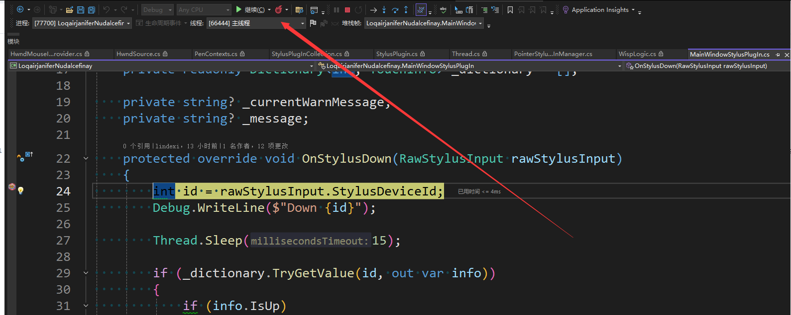
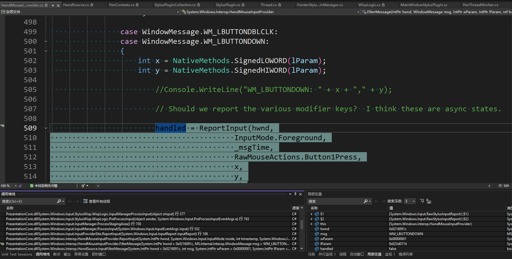

# WPF 警惕 StylusPlugIn 的多线程安全问题

在 WPF 里面，可以通过 StylusPlugIn 直接从触摸线程获取触摸消息，不需要经过 UI 线程。如此可以实现更低的触摸延迟。但是 StylusPlugIn 的 OnStylusDown\Move\Up 方法都可能是从触摸线程或 UI 线程调入，需要警惕这里的多线程安全问题 

<!--more-->
<!-- 发布 -->
<!-- 博客 -->

在 WPF 里面，即使是相同的触摸 Id 值，都可能分别在触摸线程或 UI 线程调入，由于多线程调度问题，可能发生触摸事件是先 Up 后 Down 的情况

为什么在 WPF 里面，可能在 UI 线程将触摸消息调入 StylusPlugIn 里面？复现步骤是什么？

本质的机制问题是 StylusPlugIn 附加到 UIElement 上，触摸线程和 UI 线程之间无法完全实时同步状态，如当 UI 线程执行布局等逻辑时，将会影响触摸线程尝试命中的结果，直接可能就是原本应该命中到给定 UIElement 上的点没有真的命中到。为了解决此问题，在 WPF 里面添加了兜底实现逻辑，那就是在 UI 线程判断当前消息是否已经通过 StylusPlugIn 引发了，如果未引发，则补充引发。如此就能规避丢点或不成对 Down Up 的问题

但此兜底逻辑却带来了线程安全问题。这是因为 UI 线程判断消息是否引发是通过时机来决定，如果刚好此时触摸线程没有被 CPU 调度，让 UI 线程更早执行。则 UI 线程判定 StylusPlugIn 没有引发事件，由 UI 线程执行触发。尽管在 WPF 框架层确保相同的事件不会重复在 UI 和触摸线程同时引发，但从原理上无法保证 Down 和 Up 的顺序

其线程安全表现就是可能在 StylusPlugIn 收到先 Move 后 Up 再 Down 的情况。其中 Move 和 Up 在一个线程引发，而 Down 在另一个线程引发

复现步骤很简单，只需要让 StylusPlugIn 足够卡顿即可，最简复现代码就是随意编写一个类型继承 StylusPlugIn 类，在 OnStylusDown\Move\Up 方法使用 `Thread.Sleep` 模拟卡顿即可。我将最简复现 Demo 代码放在本文末尾

再进一步，通过具体的源代码了解此问题复现机制原理

如下图所示，此时触摸消息进入 OnStylusDown 方法的是主线程

<!--  -->


一路追踪堆栈，可见这是从主线程的鼠标消息进入触发的，如下图所示

<!--  -->


其调用堆栈如下

```csharp
 LoqairjaniferNudalcefinay.dll!LoqairjaniferNudalcefinay.MainWindowStylusPlugIn.OnStylusUp(System.Windows.Input.StylusPlugIns.RawStylusInput rawStylusInput = {System.Windows.Input.StylusPlugIns.RawStylusInput}) 行 87  C#
  PresentationCore.dll!System.Windows.Input.StylusPlugIns.StylusPlugIn.RawStylusInput(System.Windows.Input.StylusPlugIns.RawStylusInput rawStylusInput) 行 107 C#
  PresentationCore.dll!System.Windows.Input.StylusPlugIns.StylusPlugInCollection.FireRawStylusInput.AnonymousMethod__0() 行 372  C#
  PresentationCore.dll!System.Windows.Input.StylusPlugIns.StylusPlugInCollection.ExecuteWithPotentialLock(System.Action action) 行 478 C#
  PresentationCore.dll!System.Windows.Input.StylusPlugIns.StylusPlugInCollection.FireRawStylusInput(System.Windows.Input.StylusPlugIns.RawStylusInput args = {System.Windows.Input.StylusPlugIns.RawStylusInput}) 行 370 C#
  PresentationCore.dll!System.Windows.Input.StylusWisp.WispLogic.VerifyStylusPlugInCollectionTarget(System.Windows.Input.RawStylusInputReport rawStylusInputReport = {System.Windows.Input.RawStylusInputReport}) 行 2719  C#
  PresentationCore.dll!System.Windows.Input.StylusWisp.WispLogic.PreNotifyInput(object sender, System.Windows.Input.NotifyInputEventArgs e = {System.Windows.Input.NotifyInputEventArgs}) 行 1049  C#
  PresentationCore.dll!System.Windows.Input.InputManager.ProcessStagingArea() 行 753 C#
  PresentationCore.dll!System.Windows.Input.InputManager.ProcessInput(System.Windows.Input.InputEventArgs input) 行 552  C#
  PresentationCore.dll!System.Windows.Input.StylusWisp.WispLogic.InputManagerProcessInput(object oInput) 行 377  C#
  WindowsBase.dll!System.Windows.Threading.ExceptionWrapper.InternalRealCall(System.Delegate callback, object args, int numArgs)  未知
  WindowsBase.dll!System.Windows.Threading.ExceptionWrapper.TryCatchWhen(object source = {System.Windows.Threading.Dispatcher}, System.Delegate callback, object args, int numArgs, System.Delegate catchHandler = null)  未知
  WindowsBase.dll!System.Windows.Threading.DispatcherOperation.InvokeImpl() 未知
  WindowsBase.dll!System.Windows.Threading.DispatcherOperation.InvokeInSecurityContext(object state)  未知
  WindowsBase.dll!MS.Internal.CulturePreservingExecutionContext.CallbackWrapper(object obj) 未知
  System.Private.CoreLib.dll!System.Threading.ExecutionContext.RunInternal(System.Threading.ExecutionContext executionContext, System.Threading.ContextCallback callback, object state) 行 137 C#
  WindowsBase.dll!MS.Internal.CulturePreservingExecutionContext.Run(MS.Internal.CulturePreservingExecutionContext executionContext = {MS.Internal.CulturePreservingExecutionContext}, System.Threading.ContextCallback callback, object state)  未知
  WindowsBase.dll!System.Windows.Threading.DispatcherOperation.Invoke() 未知
  WindowsBase.dll!System.Windows.Threading.Dispatcher.ProcessQueue()  未知
  WindowsBase.dll!System.Windows.Threading.Dispatcher.WndProcHook(System.IntPtr hwnd, int msg, System.IntPtr wParam, System.IntPtr lParam, ref bool handled)  未知
  WindowsBase.dll!MS.Win32.HwndWrapper.WndProc(System.IntPtr hwnd = 0x04190b72, int msg, System.IntPtr wParam = 0x00000000, System.IntPtr lParam = 0x00000000, ref bool handled = false)  未知
  WindowsBase.dll!MS.Win32.HwndSubclass.DispatcherCallbackOperation(object o) 未知
  WindowsBase.dll!System.Windows.Threading.ExceptionWrapper.InternalRealCall(System.Delegate callback, object args, int numArgs)  未知
  WindowsBase.dll!System.Windows.Threading.ExceptionWrapper.TryCatchWhen(object source = {System.Windows.Threading.Dispatcher}, System.Delegate callback, object args, int numArgs, System.Delegate catchHandler = null)  未知
  WindowsBase.dll!System.Windows.Threading.Dispatcher.LegacyInvokeImpl(System.Windows.Threading.DispatcherPriority priority, System.TimeSpan timeout, System.Delegate method, object args, int numArgs) 未知
  WindowsBase.dll!MS.Win32.HwndSubclass.SubclassWndProc(System.IntPtr hwnd = 0x04190b72, int msg, System.IntPtr wParam = 0x00000000, System.IntPtr lParam = 0x00000000) 未知
  [本机到托管的转换]  
  [托管到本机的转换]  
  WindowsBase.dll!System.Windows.Threading.Dispatcher.PushFrameImpl(System.Windows.Threading.DispatcherFrame frame = {System.Windows.Threading.DispatcherFrame})  未知
  WindowsBase.dll!System.Windows.Threading.Dispatcher.PushFrame(System.Windows.Threading.DispatcherFrame frame) 未知
  WindowsBase.dll!System.Windows.Threading.Dispatcher.Run() 未知
  PresentationFramework.dll!System.Windows.Application.RunDispatcher(object ignore) 未知
  PresentationFramework.dll!System.Windows.Application.RunInternal(System.Windows.Window window)  未知
  PresentationFramework.dll!System.Windows.Application.Run()  未知
  LoqairjaniferNudalcefinay.dll!LoqairjaniferNudalcefinay.App.Main()  未知
```

为什么正常情况下，不会有 UI 线程调入呢？这是因为在 `WispLogic.VerifyStylusPlugInCollectionTarget` 里面的 `sendRawStylusInput` 局部变量不为 true 值。什么时候 `sendRawStylusInput` 会为 true 值导致 UI 线程兜底逻辑执行触发 StylusPlugIn 的方法？如以下有删减的代码所示

```csharp
        private void VerifyStylusPlugInCollectionTarget(RawStylusInputReport rawStylusInputReport)
        {
            StylusPlugInCollection targetPIC = null;
            UIElement newTarget = InputElement.GetContainingUIElement(rawStylusInputReport.StylusDevice.DirectlyOver as DependencyObject) as UIElement;
            if (newTarget != null)
            {
                targetPIC = rawStylusInputReport.PenContext.Contexts.FindPlugInCollection(newTarget);
            }

               bool sendRawStylusInput = false;
               if (targetPIC != null && rawStylusInputReport.RawStylusInput == null)
               {
                   ... // 忽略其他代码

                   sendRawStylusInput = true;
               }
            ... // 忽略其他代码
        }
```

通过以上代码清晰可见，只有在 `newTarget` 能够获取 StylusPlugInCollection 对象，且 `rawStylusInputReport.RawStylusInput` 为空时才会设置 `sendRawStylusInput` 变量为 true 值

如果一个 UIElement 已经附加了 StylusPlugIn 了，自然就能让 `targetPIC` 变量非空。那什么时候会出现 `rawStylusInputReport.RawStylusInput == null` 的情况？那就是如触摸线程因为布局时机问题，导致无法拿到 StylusPlugIn 进而导致此是空。这预计就是 WPF 兜底逻辑最核心解决的问题了。但本文提到的是另一个情况，那就是触摸线程卡顿，导致没有执行。没有执行导致 `rawStylusInputReport.RawStylusInput` 为空。于是此时 UI 线程代为触发

本文代码放在 [github](https://github.com/lindexi/lindexi_gd/tree/107caecee7f847355d23744bf6fc7b970d5e8c69/WPFDemo/LoqairjaniferNudalcefinay) 和 [gitee](https://gitee.com/lindexi/lindexi_gd/tree/107caecee7f847355d23744bf6fc7b970d5e8c69/WPFDemo/LoqairjaniferNudalcefinay) 上，可以使用如下命令行拉取代码。我整个代码仓库比较庞大，使用以下命令行可以进行部分拉取，拉取速度比较快

先创建一个空文件夹，接着使用命令行 cd 命令进入此空文件夹，在命令行里面输入以下代码，即可获取到本文的代码

```
git init
git remote add origin https://gitee.com/lindexi/lindexi_gd.git
git pull origin 107caecee7f847355d23744bf6fc7b970d5e8c69
```

以上使用的是国内的 gitee 的源，如果 gitee 不能访问，请替换为 github 的源。请在命令行继续输入以下代码，将 gitee 源换成 github 源进行拉取代码。如果依然拉取不到代码，可以发邮件向我要代码

```
git remote remove origin
git remote add origin https://github.com/lindexi/lindexi_gd.git
git pull origin 107caecee7f847355d23744bf6fc7b970d5e8c69
```

获取代码之后，进入 WPFDemo/LoqairjaniferNudalcefinay 文件夹，即可获取到源代码

更多技术博客，请参阅 [博客导航](https://blog.lindexi.com/post/%E5%8D%9A%E5%AE%A2%E5%AF%BC%E8%88%AA.html )