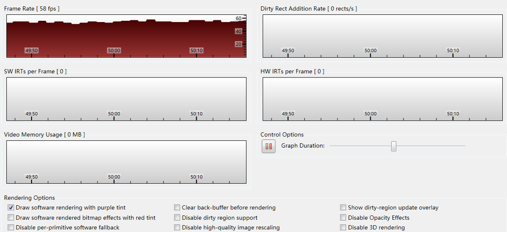

# WPF 设置纯软件渲染

最近看到有小伙伴说 WPF 使用硬件渲染，如何让 WPF 不使用硬件渲染，因为他觉得性能太好了。万一这个版本发布了，产品经理说下个版本要提升性能就不好了。于是就找到一个快速的方法，让程序不使用硬件渲染这样下个版本要优化就让程序使用硬件渲染。

<!--more-->
<!-- CreateTime:2019/10/31 8:59:02 -->

<!-- 标签：WPF,渲染 -->

设置 WPF 使用软件渲染的方法是在 .net framework 3.5 之后才可以的。使用方法很简单，在 Loaded 之后，添加下面代码

```csharp
HwndSource hwndSource = PresentationSource.FromVisual(this) as HwndSource;
HwndTarget hwndTarget = hwndSource.CompositionTarget;
hwndTarget.RenderMode = RenderMode.SoftwareOnly;
```

默认的 RenderMode 是 默认，也就是如果判断有硬件就在硬件渲染，如果没有就在 CPU 渲染。

如果设置 SoftwareOnly 就不在硬件渲染。

除了想降低性能，估计没有人会设置这个。

上面的方法是开启窗口级的软渲染，如果想要在进程级设置开启软渲染，请使用这个代码

```csharp
RenderOptions.ProcessRenderMode = RenderMode.SoftwareOnly; 
```

如果想要在整个设备运行 WPF 程序都使用软渲染，那么可以通过修改注册表的方法

在 `HKEY_CURRENT_USER\Software\Microsoft\Avalon.Graphics` 里面添加一个项，这个项是 `dword` 命名是 `DisableHWAcceleration` 使用默认值 0 就可以

那么如何判断当前的软件是使用软渲染的？

通过 [WPF Performance Suite](https://docs.microsoft.com/en-us/previous-versions/aa969767(v=vs.110) ) 运行之后附加到打开的进程调试，勾选 Draw software renderingwith purple tint 观察原有进程是否被一个诡异的颜色放在上面，如果是那么就是开启软渲染了

在[Performance Profiling Tools for WPF](https://docs.microsoft.com/en-us/previous-versions/aa969767(v=vs.110) ) 的 Draw software renderingwith purple tint 就是使用高亮的矩形覆盖在使用软渲染的范围，如果整个进程都是使用软渲染，那么整个进程都会被高亮

注意，除了设置使用软渲染之外打开高亮矩形可能会显示在使用 bitmap effects 的元素上或通过RenderTargetBitmap渲染的内容等使用软渲染的元素

<!--  -->


现在微软已经不开放[Performance Profiling Tools for WPF](https://docs.microsoft.com/en-us/previous-versions/aa969767(v=vs.110) )下载，请点击这个[链接](https://download.microsoft.com/download/A/6/A/A6AC035D-DA3F-4F0C-ADA4-37C8E5D34E3D/setup/WinSDKPerformanceToolKit_amd64/wpt_x64.msi)下载

最近在做渲染优化，更多博客请看 [渲染相关](https://blog.lindexi.com/post/%E6%B8%B2%E6%9F%93.html )

[WPF 渲染级别](https://blog.lindexi.com/post/WPF-%E6%B8%B2%E6%9F%93%E7%BA%A7%E5%88%AB.html )

[WPF 使用 Direct2D1 画图入门](https://blog.lindexi.com/post/WPF-%E4%BD%BF%E7%94%A8-Direct2D1-%E7%94%BB%E5%9B%BE%E5%85%A5%E9%97%A8.html )

[Video Rendering Issues for WPF Windows - Rick Strahl's Web Log](https://weblog.west-wind.com/posts/2017/Feb/13/Video-Rendering-Issues-for-WPF-Windows )

[Enable Software Rendering in WPF programmatically](https://codeblitz.wordpress.com/2010/09/15/enable-software-rendering-in-wpf-programmatically/ )

[Software Rendering Usage in WPF – WPF Performance and .NET Framework Client Profile](https://blogs.msdn.microsoft.com/jgoldb/2010/06/22/software-rendering-usage-in-wpf/ )

<a rel="license" href="http://creativecommons.org/licenses/by-nc-sa/4.0/"></a><br />本作品采用<a rel="license" href="http://creativecommons.org/licenses/by-nc-sa/4.0/">知识共享署名-非商业性使用-相同方式共享 4.0 国际许可协议</a>进行许可。欢迎转载、使用、重新发布，但务必保留文章署名[林德熙](http://blog.csdn.net/lindexi_gd)(包含链接:http://blog.csdn.net/lindexi_gd )，不得用于商业目的，基于本文修改后的作品务必以相同的许可发布。如有任何疑问，请与我[联系](mailto:lindexi_gd@163.com)。  
