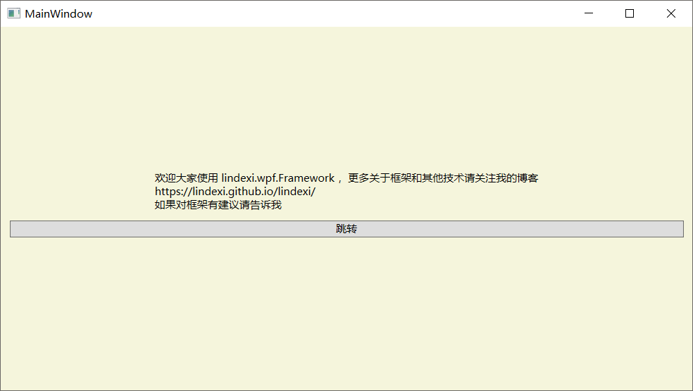

# WPF 轻量级 MVVM 框架入门 2.1.2

本文告诉大家如何使用本金鱼的 MVVM 轻量框架。

一个好的框架是不需要解释就可以让大家使用，但是本金鱼没有这个能力，所以就写了这个文章告诉大家如何使用。

<!--more-->
<!-- CreateTime:2019/11/29 10:16:10 -->

<!-- csdn -->

<!-- 标签：WPF,mvvm -->
<div id="toc"></div>

本文的框架主要是简单，可以快速解耦 ViewModel 和 View 依赖，解耦 ViewModel 之间依赖，减少 ViewModel 的代码量。

具体的思想是使用消息发送的方法，多个 ViewModel 之间使用发送消息解除依赖。把原来很多需要写在 ViewModel 的代码通过发送指定的消息，在其他类处理，减少 ViewModel 代码。

下面来告诉大家如何使用这个框架。

首先是安装库


## 安装

首先需要从 Nuget 安装两个库

 - lindexi.wpf.Framework

 - lindexi.MVVM.Framework

第一个库是使用 wpf 的封装，因为我还有 UWP 的封装，实际上在使用，用 WPF 或 UWP 是差不多的。只要存在 UWP 和 WPF 不相同的库，我就把这写封装在不同的库。

因为 Nuget 可以找到依赖库，所以只需要安装 lindexi.wpf.Framework 就会自动安装 lindexi.MVVM.Framework 。如果现在使用的是 Xarmain ，那么安装 lindexi.MVVM.Framework 就可以，这个库使用 dotnet framework 4.5 和 dotnet standard 2.0 ，所以在很多项目都可以使用。

## 项目要求

安装这个库要求最低版本是 dotnet framework 4.5 以上，对于 dotnet framework 4.0 的项目无法使用。

## 创建主页面

和使用 [win10 uwp 轻量级 MVVM 框架入门 2.1.5.3199](https://lindexi.github.io/lindexi/post/win10-uwp-%E8%BD%BB%E9%87%8F%E7%BA%A7-MVVM-%E6%A1%86%E6%9E%B6%E5%85%A5%E9%97%A8-2.1.5.3199.html ) 差不多，先创建一个项目，然后在这个项目的 MainWindow.xaml 放一个 Frame 作为跳转

创建 ViewModel 类，并且 MainWindow 在使用 ViewModel 属性，在 MainWindow 构造函数调用下面函数

```csharp
            ViewModel.OnNavigatedTo(this, frame);
```

这里的 frame 就是 MainWindow 创建的 Frame，需要在 ViewModel 类继承 NavigateViewModel ，然后写 OnNavigatedTo 代码

```csharp
        public override void OnNavigatedTo(object source, object e)
// 忽略代码

                    Content = new NavigateFrame((Frame) e);

```

这里可以看到 NavigateFrame 在 UWP 的框架和在 WPF 框架都存在，但是两个类的实现不相同。

这里设置 Content 可以让之后的页面进行导航。

## 找到 ViewModel

现在在创建的 ViewModel 推荐在 App.xaml 作为资源，因为 WPF 的页面跳转没有和 UWP 一样可以获得参数，需要通过自己的方式拿到。打开 App.xaml 在里面添加 ViewModel 作为静态属性

```csharp
<Application x:Class="lindexi.Mvvm.App"
             xmlns="http://schemas.microsoft.com/winfx/2006/xaml/presentation"
             xmlns:x="http://schemas.microsoft.com/winfx/2006/xaml"
             xmlns:local="clr-namespace:lindexi.Mvvm"
             StartupUri="MainWindow.xaml">
    <Application.Resources>
         <local:ViewModel x:Key="ViewModel"></local:ViewModel>
    </Application.Resources>
</Application>
```

现在打开 MainWindow.xaml 绑定 DataContext

```csharp
        DataContext="{StaticResource ViewModel}"
```

在 MainWindow 的构造函数拿到 ViewModel ，需要强转

```csharp
        public MainWindow()
        {
            InitializeComponent();
            ViewModel = (ViewModel) DataContext;
            ViewModel.OnNavigatedTo(this, frame);
        }

        public ViewModel ViewModel { get; set; }
```

这样在被跳转的页面就可以通过 ` var viewModel = ViewModel["xx"];` 获得 ViewModel 。

## 通过附加属性找到 ViewModel

第二个方法是通过附加属性的方法找到 ViewModel ，因为在 WPF 是可以定义可继承的附加属性，而在 UWP 是不可以自己定义可以继承的附加属性。在 WPF 可以通过定义附加属性的方式让页面拿到上一级的 ViewModel ，那么两个方法的不同在哪？如果定义为资源，那么使用比较简单。如果定义为附加属性，可以在相同的 ViewModel 被不同的地方使用，支持一个程序有多个可跳转的 ViewModel 可以做出比较复杂的程序。

打开 MainWindow.xaml.cs 定义一个附加属性

```csharp
        public MainWindow()
        {
            InitializeComponent();
        
            ViewModel = (ViewModel) GetValue(ViewModelProperty);
            ViewModel.OnNavigatedTo(this, frame);
            DataContext = ViewModel;
        }

        public ViewModel ViewModel { get; set; }

        public static readonly DependencyProperty ViewModelProperty = DependencyProperty.RegisterAttached(
            "ViewModel", typeof(NavigateViewModel), typeof(MainWindow),
            new FrameworkPropertyMetadata(new ViewModel(), FrameworkPropertyMetadataOptions.Inherits));
```

这样被跳转的页面就可以通过附加属性拿到值，可以通过 ` var viewModel = ViewModel["xx"];` 获得

## 跳转页面

现在来多创建两个页面 A 页面和 B 页面，并且创建两个页面的 ViewModel 添加到 ViewModel 的列表。

```csharp
   public class ViewModel : NavigateViewModel
    {
        /// <inheritdoc />
        public override void OnNavigatedTo(object sender, object obj)
        {
            ViewModelPage = new List<ViewModelPage>()
            {
                new ViewModelPage(new NavigatableViewModel<AModel>(), new NavigatablePage<A>()),
                new ViewModelPage(new NavigatableViewModel<BModel>(), new NavigatablePage<B>())
            };

            Content = new NavigateFrame((Frame) obj);

            Navigate("AModel", null);
        }


    }

    public class AModel : ViewModelMessage
    {
        /// <inheritdoc />
        public override void OnNavigatedFrom(object sender, object obj)
        {
        }

        /// <inheritdoc />
        public override void OnNavigatedTo(object sender, object obj)
        {
        }
    }

    public class BModel : ViewModelMessage
    {
        /// <inheritdoc />
        public override void OnNavigatedFrom(object sender, object obj)
        {
        }

        /// <inheritdoc />
        public override void OnNavigatedTo(object sender, object obj)
        {
        }
    }
```

添加 ViewModel 到 ViewModelPage 的方法就是通过创建 ViewModelPage 合并，创建的时候提供两个方法，一个是输入 Type 的方法，另一个是泛型。输入 Type 的方法是用来反射，很少推荐使用。

修改 A 页面的背景，可以用来看到被跳转到 A 页面

<!--  -->


本文使用的是上面的第一个方式拿到 ViewModel 所以需要在 A 页面添加一些代码获得 ViewModel 。

在 A 页面的 xaml 添加下面代码

```csharp
      DataContext="{Binding Source={StaticResource ViewModel},Path=[AModel]}"

```

这样就可以通过 `NavigateViewModel["xx"]` 的方法获得 ViewModel 

## 跳转命令

可以看到在　Ａ 页面有跳转按钮，点击这个按钮可以用来跳转到 B 页面

因为界面很简单，我就不告诉大家了。

打开 AModel 添加一个函数，在这个函数就是按钮点击下去调用的函数

```csharp
            Send(new NavigateMessage(this, nameof(BModel)));

```

从代码可以看到跳转到 B 页面只需要发送一个 NavigateMessage ，具体怎么跳转是不需要写的

## 自定义命令

现在可以尝试使用框架的用法，自己定义消息和处理

在 B 页面发送文字到 MainWindow 显示，不让 BModel 和 ViewModel 有耦合，减少在 BModel 和在 ViewModel 的代码。

如果 ViewModel 要让 MainWindows 显示文字，就需要在 ViewModel 添加属性

```csharp
 	        public string SawbelChaceredis
        {
            get => _sawbelChaceredis;
            set
            {
                _sawbelChaceredis = value;
                OnPropertyChanged();
            }
        }

        private string _sawbelChaceredis;
``` 

这个属性是我随意定义，因为也不知道这个属性叫什么

在 ViewModel 有特殊的属性，可以定义一个接口，表示这个 ViewModel 有 属性 SawbelChaceredis ，定义的代码

```csharp
    public interface ISawbelChaceredisModel : IViewModel
    {
        string SawbelChaceredis { get; set; }
    }
```

在 MainWindow 绑定这个属性

```csharp
        <TextBlock Margin="10,200,10,10" Text="{Binding SawbelChaceredis,Mode=OneWay}" />

```

已经让 ViewModel 绑定了页面，这时的 ViewModel 和界面没有耦合

定义消息用来发送字符串到 ISawbelChaceredisModel ，定义的方法请看代码

```csharp
    public class TextMessage : Message
    {
        /// <inheritdoc />
        public TextMessage(ViewModelBase source, string str) : base(source)
        {
            SawbelChaceredis = str;
            Goal = new PredicateInheritViewModel(typeof(ISawbelChaceredisModel));
        }

        public string SawbelChaceredis { get; }
    }
```

定义的消息使用了 PredicateInheritViewModel 表示这个消息会发送到 ISawbelChaceredisModel ，如果没有找到 ISawbelChaceredisModel 就没有处理消息

定义了消息还需要定一个类告诉如何处理这个消息

```csharp
    public class SawbelChaceredisComposite : Composite
    {
        /// <inheritdoc />
        public SawbelChaceredisComposite()
        {
            Message = typeof(TextMessage);
        }

        /// <inheritdoc />
        public override void Run(IViewModel source, IMessage message)
        {
            var viewModel = (ISawbelChaceredisModel) source;
            viewModel.SawbelChaceredis = ((TextMessage) message).SawbelChaceredis;
        }
    }
```

定义了这个类就告诉哪个消息可以处理，在构造函数的代码。然后使用 Run 处理这个消息。因为 SawbelChaceredisComposite 和消息是耦合的，只有处理知道消息，所以这里可以转换 ViewModel 因为这时知道是哪个收到

这里的处理还可以继承`Composite<T>` 这里的泛型就是消息的类型，可以把上面的代码减小，不需要写构造函数

```csharp
    public class SawbelChaceredisComposite : Composite<TextMessage>
    {
        /// <inheritdoc />
        protected override void Run(IViewModel source, TextMessage message)
        {
            var viewModel = (ISawbelChaceredisModel) source;
            viewModel.SawbelChaceredis = message.SawbelChaceredis;
        }
    }
```

在 B 页面点击时，发送消息

```csharp
    public class BModel : ViewModelMessage
    {
        /// <inheritdoc />
        public override void OnNavigatedFrom(object sender, object obj)
        {
        }

        /// <inheritdoc />
        public override void OnNavigatedTo(object sender, object obj)
        {
        }

        public void SendText()
        {
            Send(new TextMessage(this, "欢迎来我博客 https://lindexi.github.io/lindexi/ 有很多无聊博客"));
        }
    }
```

通过发送消息就可以把消息发送到界面

代码：[WPF 轻量级 MVVM 框架入门 2.1.2-CSDN下载](https://download.csdn.net/download/lindexi_gd/10510505 )

参见：

[win10 uwp MVVM入门](https://blog.lindexi.com/post/win10-uwp-MVVM%E5%85%A5%E9%97%A8.html )

[win10 uwp MVVM 轻量框架](https://lindexi.gitee.io/post/win10-uwp-MVVM-%E8%BD%BB%E9%87%8F%E6%A1%86%E6%9E%B6.html )

[win10 uwp MVVM 语义耦合](https://lindexi.gitee.io/post/win10-uwp-MVVM-%E8%AF%AD%E4%B9%89%E8%80%A6%E5%90%88.html )


<a rel="license" href="http://creativecommons.org/licenses/by-nc-sa/4.0/"></a><br />本作品采用<a rel="license" href="http://creativecommons.org/licenses/by-nc-sa/4.0/">知识共享署名-非商业性使用-相同方式共享 4.0 国际许可协议</a>进行许可。欢迎转载、使用、重新发布，但务必保留文章署名[林德熙](http://blog.csdn.net/lindexi_gd)(包含链接:http://blog.csdn.net/lindexi_gd )，不得用于商业目的，基于本文修改后的作品务必以相同的许可发布。如有任何疑问，请与我[联系](mailto:lindexi_gd@163.com)。
