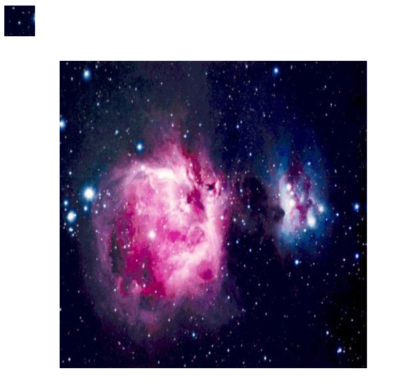
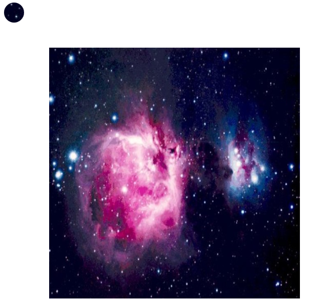

# WPF 通过 DrawingContext DrawImage 绘制图片

本文告诉大家如何通过 DrawingContext 绘制图片，同时指定绘制图片在画布的某个区域和绘制出来的图片大小，如何裁剪图片

<!--more-->
<!-- CreateTime:2018/11/26 16:13:14 -->

<!-- csdn -->

在 WPF 中可以使用 DrawingVisual 进行底层的绘制，底层的绘制的效率是比较高的，但是因为 WPF 的界面需要的是 UIElement 如果想要添加 DrawingVisual 还需要写一个帮助类

```csharp
    public class Element : UIElement
    {
        /// <inheritdoc />
        public Element()
        {
            ContainerVisual = new ContainerVisual();
            AddVisualChild(ContainerVisual);
        }

        /// <inheritdoc />
        protected override Visual GetVisualChild(int index)
        {
            return ContainerVisual;
        }

        public ContainerVisual ContainerVisual { get; }

        /// <inheritdoc />
        protected override int VisualChildrenCount => 1;
    }

```

将这个 Element 加入到界面

```csharp
    <Grid>
        <local:Element x:Name="Element"></local:Element>
    </Grid>
```

然后在构造函数添加一张图片，这时需要拖动一张图片进入解决方案

```csharp
        public MainWindow()
        {
            InitializeComponent();

            var bitmapImage = new BitmapImage(new Uri("pack://application:,,,/1.jpg"));
            var drawingVisual = new DrawingVisual();
            using (DrawingContext dc = drawingVisual.RenderOpen())
            {
                dc.DrawImage(bitmapImage, new Rect(100, 100, 50, 50));
            }

            Element.ContainerVisual.Children.Add(drawingVisual);
        }
```

现在可以看到图片在 100,100 的坐标画出，此时图片为被缩放到 50x50 也就是缩放画图片到指定的 Rect 上

## 裁剪图片

如果只是需要画出被裁剪的图片，可以使用 CroppedBitmap 进行裁剪

在 CroppedBitmap 的构造可以传入需要裁剪的图片和如何裁剪，裁剪是进行矩形的裁剪

如下面代码是裁剪矩形从图片的左上角 50x50 范围

```csharp
                var croppedBitmap = new CroppedBitmap(bitmapImage, new Int32Rect(0, 0, 50, 50));

```

将两个图片同时画出来

```csharp
        public MainWindow()
        {
            InitializeComponent();

            var bitmapImage = new BitmapImage(new Uri("pack://application:,,,/1.jpg"));
            var drawingVisual = new DrawingVisual();
            using (DrawingContext dc = drawingVisual.RenderOpen())
            {
                // 裁剪图片的 50x50 部分
                var croppedBitmap = new CroppedBitmap(bitmapImage, new Int32Rect(0, 0, 50, 50));
                dc.DrawImage(croppedBitmap, new Rect(10, 10, 50, 50));
                dc.DrawImage(bitmapImage, new Rect(100, 100, 500, 500));
            }

            Element.ContainerVisual.Children.Add(drawingVisual);
        }
```

<!--  -->


需要需要裁剪圆形，可以依靠 PushClip 裁剪

下面代码裁剪一个圆形的范围，从圆心 30x30 开始裁剪半径为 20 的范围

```csharp
                dc.PushClip(new EllipseGeometry(new Point(30, 30), 20, 20));
```

使用裁剪之后的图片

```csharp
        public MainWindow()
        {
            InitializeComponent();

            var bitmapImage = new BitmapImage(new Uri("pack://application:,,,/1.jpg"));
            var drawingVisual = new DrawingVisual();
            using (DrawingContext dc = drawingVisual.RenderOpen())
            {
                dc.PushClip(new EllipseGeometry(new Point(30, 30), 20, 20));
                // 裁剪图片的 50x50 部分
                var croppedBitmap = new CroppedBitmap(bitmapImage, new Int32Rect(0, 0, 50, 50));
                dc.DrawImage(croppedBitmap, new Rect(10, 10, 50, 50));
                dc.Pop();

                dc.DrawImage(bitmapImage, new Rect(100, 100, 500, 500));
            }

            Element.ContainerVisual.Children.Add(drawingVisual);
        }
```

<!--  -->


<a rel="license" href="http://creativecommons.org/licenses/by-nc-sa/4.0/"></a><br />本作品采用<a rel="license" href="http://creativecommons.org/licenses/by-nc-sa/4.0/">知识共享署名-非商业性使用-相同方式共享 4.0 国际许可协议</a>进行许可。欢迎转载、使用、重新发布，但务必保留文章署名[林德熙](http://blog.csdn.net/lindexi_gd)(包含链接:http://blog.csdn.net/lindexi_gd )，不得用于商业目的，基于本文修改后的作品务必以相同的许可发布。如有任何疑问，请与我[联系](mailto:lindexi_gd@163.com)。
