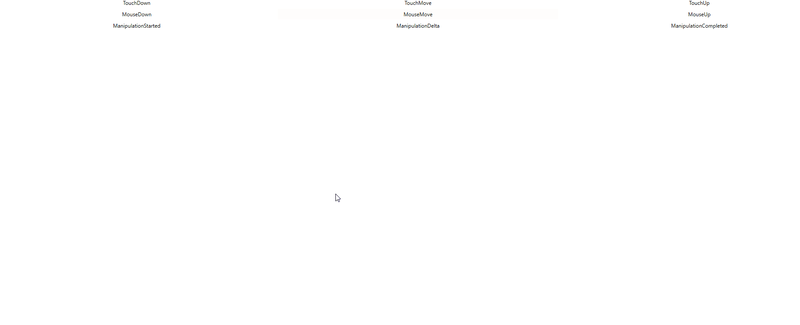

# WPF 通过 InputManager 模拟调度触摸事件

在 WPF 中，框架可以分为两个部分，一个是渲染，另一个是交互。交互的入口是在 InputManager 里面，而实际的交互实现需要通过渲染布局和交互的路由事件才能完成。在输入管理提供了调度事件的方法，这个方法可以被传入路由事件，传入的路由事件将会被调度到路由事件指定的元素上进行触发。本文告诉大家如何模拟调度一个触摸事件

<!--more-->
<!-- CreateTime:5/23/2020 10:27:24 AM -->


本文的内容属于没有任何官方文档的支持的内容，以下是我看 WPF 源代码了解到的用法

在输入管理里面可以通过 System.Windows.Input.InputManager.Current 拿到当前的输入管理，这个属性默认和 Dispatcher.CurrentDispatcher.InputManager 是相同的对象，只有在初始化的时候 Dispatcher.CurrentDispatcher.InputManager 会是空拿不到值，而通过 System.Windows.Input.InputManager.Current 将会自动创建

此时就可以回答这个 InputManager.Current 是针对进程还是线程的问题了，请问 CurrentDispatcher 是针对进程还是线程呢

在拿到输入管理，就可以调用 ProcessInput 方法传入一个 InputEventArgs 了，可以传入一个路由事件，此时路由事件将会加入触发队列，在调度方法的核心是通过  `Stack _stagingArea` 字段做到栈的方式的调度

```csharp
        /// <summary>
        ///     Synchronously processes the specified input.
        /// </summary>
        /// <remarks>
        ///     The specified input is processed by all of the filters and
        ///     monitors, and is finally dispatched to the appropriate
        ///     element as an input event.
        /// </remarks>
        /// <returns>
        ///     Whether or not any event generated as a consequence of this
        ///     event was handled.
        /// </returns>
        public bool ProcessInput(InputEventArgs input)
        {
//             VerifyAccess();

            if(input == null)
            {
                throw new ArgumentNullException("input");
            }

            // Push a marker indicating the portion of the staging area
            // that needs to be processed.
            PushMarker();

            // Push the input to be processed onto the staging area.
            PushInput(input, null);

            // Post a work item to continue processing the staging area
            // in case someone pushes a dispatcher frame in the middle
            // of input processing.
            RequestContinueProcessingStagingArea();

            // Now drain the staging area up to the marker we pushed.
            bool handled = ProcessStagingArea();
            return handled;
        }
```

上面代码核心的逻辑是 ProcessStagingArea 方法

简化的代码应该和下面差不多

```csharp
 while((item = PopInput()) != null)
 {
    // 忽略 Pre-Process 逻辑

    // Raise the input event being processed.
    InputEventArgs input = item.Input;

    // Some input events are explicitly associated with an element.  Those that are not are associated with the target of the input device for this event.
    // 有些输入的元素是和输入事件关联的，此时和输入设备没有关系
    // 上面的注释说的是先通过 input.Source 获取和输入事件关联的元素，如果不能获取到，那么也许输入元素是和输入设备关联的，尝试从输入设备获取
    DependencyObject eventSource = input.Source as DependencyObject;

    if (eventSource == null)
    {
        eventSource = input.Device.Target as DependencyObject;
    }


    if (InputElement.IsUIElement(eventSource))
    {
        UIElement e = (UIElement)eventSource;

        e.RaiseEvent(input, true); // Call the "trusted" flavor of RaiseEvent. 
    }
    else if (InputElement.IsContentElement(eventSource))
    {
        ContentElement ce = (ContentElement)eventSource;

        ce.RaiseEvent(input, true);// Call the "trusted" flavor of RaiseEvent.
    }
    else if (InputElement.IsUIElement3D(eventSource))
    {
        UIElement3D e3D = (UIElement3D)eventSource;

        e3D.RaiseEvent(input, true); // Call the "trusted" flavor of RaiseEvent
    }    
 }
```

上面的 PopInput 方法如下

```csharp
        internal StagingAreaInputItem PopInput()
        {
            object input = null;

            if(_stagingArea.Count > 0)
            {
                input = _stagingArea.Pop();
            }

            return input as StagingAreaInputItem;
        }
```

也就是本质上都是调用了元素的 RaiseEvent 方法，里面没有什么判断逻辑

按照上面的逻辑，咱可以尝试自己模拟触发触摸事件。不过创建一个 TouchEventArgs 还是比较复杂的逻辑，需要用 [WPF 模拟触摸设备](https://blog.lindexi.com/post/WPF-%E6%A8%A1%E6%8B%9F%E8%A7%A6%E6%91%B8%E8%AE%BE%E5%A4%87.html )

但是简单的测试是可以通过触摸一下屏幕，保存触摸事件的参数

```csharp
        private void OnTouchDown(object sender, TouchEventArgs e)
        {
            _lastEventArgs = e;
        }

        private TouchEventArgs _lastEventArgs;
```

下面尝试在鼠标按下的时候触发这个事件

```csharp
        private void OnMouseDown(object sender, MouseButtonEventArgs e)
        {
            if (e.StylusDevice != null)
            {
            }
            else
            {
                System.Windows.Input.InputManager.Current.ProcessInput(_lastEventArgs);
            }
        }
```

在触摸之后点击鼠标，可以看到鼠标点击的时候同样触发了触摸按下事件

那如果想要模拟触发触摸移动的事件呢？可以尝试修改 RoutedEvent 属性

```csharp
_lastEventArgs.RoutedEvent = PreviewTouchDownEvent;
System.Windows.Input.InputManager.Current.ProcessInput(_lastEventArgs);
_lastEventArgs.RoutedEvent = PreviewTouchMoveEvent;
System.Windows.Input.InputManager.Current.ProcessInput(_lastEventArgs);
_lastEventArgs.RoutedEvent = PreviewTouchUpEvent;
System.Windows.Input.InputManager.Current.ProcessInput(_lastEventArgs);
```

<!--  -->


上面图片是测试工具 [ManipulationDemo](https://github.com/dotnet-campus/ManipulationDemo/) 的显示，这个工具会在事件触发的时候修改对应事件颜色，也就是在鼠标点击的时候触发了触摸的按下和移动和抬起

用这个方法就可以从路由事件这一层调度事件

上面的代码放在 [GitHub](https://github.com/dotnet-campus/ManipulationDemo/tree/7ab5024d30b3174af77e5328f5a6afae8196005f/ManipulationDemo/MainWindow.xaml.cs) 上，小伙伴打开代码需要关注的是 OnMouseDown 方法的代码

根据上面的源代码可以知道框架里面其实也是调用了 RaiseEvent 方法，也就是不使用交互框架的调度自己触发是否可以？实际上也是可以的

只需要将 `System.Windows.Input.InputManager.Current.ProcessInput(_lastEventArgs)` 替换为 `((UIElement)_lastEventArgs.Source).RaiseEvent(_lastEventArgs)` 请看代码

```csharp
_lastEventArgs.RoutedEvent = PreviewTouchDownEvent;
((UIElement)_lastEventArgs.Source).RaiseEvent(_lastEventArgs);
//System.Windows.Input.InputManager.Current.ProcessInput(_lastEventArgs);
_lastEventArgs.RoutedEvent = PreviewTouchMoveEvent;
((UIElement)_lastEventArgs.Source).RaiseEvent(_lastEventArgs);
//System.Windows.Input.InputManager.Current.ProcessInput(_lastEventArgs);
_lastEventArgs.RoutedEvent = PreviewTouchUpEvent;
((UIElement)_lastEventArgs.Source).RaiseEvent(_lastEventArgs);
//System.Windows.Input.InputManager.Current.ProcessInput(_lastEventArgs);
```

此时运行测试项目也可以看到和 ProcessInput 一样的效果

本文其实是补充 [WPF 触摸到事件](https://blog.lindexi.com/post/WPF-%E8%A7%A6%E6%91%B8%E5%88%B0%E4%BA%8B%E4%BB%B6.html ) 的后半部分，从 WPF 触摸到路由事件，是如何从触摸事件让对应的元素触发

本文的方法仅是模拟事件的触发，如果想要修改触摸的点的坐标等，需要自己实现 TouchDevice 类，请看 [WPF 模拟触摸设备](https://blog.lindexi.com/post/WPF-%E6%A8%A1%E6%8B%9F%E8%A7%A6%E6%91%B8%E8%AE%BE%E5%A4%87.html )

更多触摸请看 [WPF 触摸相关](https://blog.lindexi.com/post/WPF-%E8%A7%A6%E6%91%B8%E7%9B%B8%E5%85%B3.html )

<a rel="license" href="http://creativecommons.org/licenses/by-nc-sa/4.0/"></a><br />本作品采用<a rel="license" href="http://creativecommons.org/licenses/by-nc-sa/4.0/">知识共享署名-非商业性使用-相同方式共享 4.0 国际许可协议</a>进行许可。欢迎转载、使用、重新发布，但务必保留文章署名[林德熙](http://blog.csdn.net/lindexi_gd)(包含链接:http://blog.csdn.net/lindexi_gd )，不得用于商业目的，基于本文修改后的作品务必以相同的许可发布。如有任何疑问，请与我[联系](mailto:lindexi_gd@163.com)。
