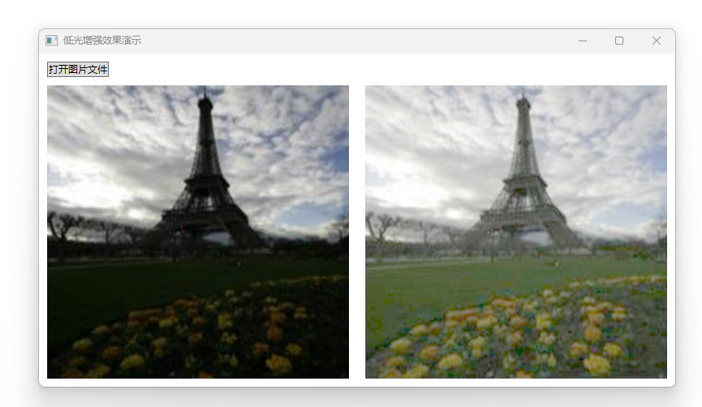
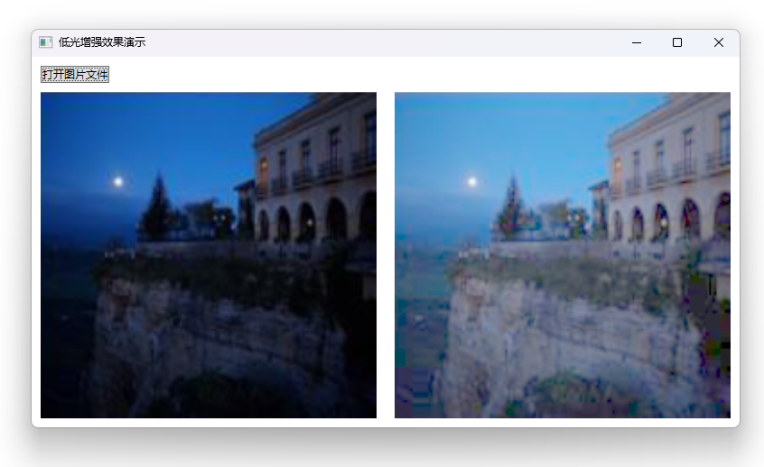
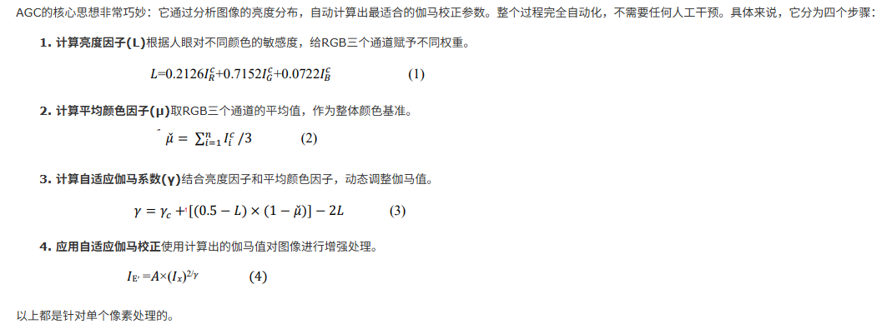

# WPF 通过 WriteableBitmap 实现 TAGC 低光增强效果算法

我在寻找将一些拍摄出来的比较暗的图片进行光亮增强的算法，用于处理我出门拍的一些照片。我从博客园找到了 Imageshop 大佬记录的伊拉克团队的TAGC（低光增强效果）算法实现，通过阅读大佬的博客和对应的论文，基于 WPF 的 WriteableBitmap 实现 TAGC 低光增强效果算法

<!--more-->
<!-- 发布 -->
<!-- 博客 -->

开始之前，必须感谢 [只(挚)爱图像处理 - Imageshop](https://www.cnblogs.com/Imageshop ) 大佬的分享。本文将参阅 [伊拉克团队的TAGC（低光增强效果）算法实现。 - Imageshop - 博客园](https://www.cnblogs.com/Imageshop/p/19025343 ) 进行实现

原论文信息如下：

论文标题: Tuning adaptive gamma correction (TAGC) for enhancing images in low light

发表日期: 2025年07月

作者: Ghufran Alhamzawi, Alfoudi Ali Saeed, Suha Mohammed Hadi等

发表单位: University of Al-Qadisiyah, University of Information Technology and Communications等

原文链接: <http://arxiv.org/pdf/2507.19574v1>

实现效果如下图所示

<!--  -->


<!--  -->


这个过程无需玄学算法参与，无需对接任何 AI 相关的算法，仅仅只是非常简单的逐个像素进行数学计算。核心实现代码如下

```csharp
/// <summary>
/// Tuning adaptive gamma correction (TAGC) 低光增强效果算法
/// </summary>
public class TuningAdaptiveGammaCorrectionAlgorithm
{
    public static unsafe void Enhancement(WriteableBitmap sourceBitmap, WriteableBitmap targetBitmap)
    {
        if (sourceBitmap.Format != targetBitmap.Format)
        {
            return;
        }

        if (sourceBitmap.Format != PixelFormats.Bgra32)
        {
            return;
        }

        float inv255 = 1.0f / 255;

        sourceBitmap.Lock();
        targetBitmap.Lock();

        byte* src = (byte*)sourceBitmap.BackBuffer;
        byte* dest = (byte*)targetBitmap.BackBuffer;

        var height = sourceBitmap.PixelHeight;
        var width = sourceBitmap.PixelWidth;
        var stride = sourceBitmap.BackBufferStride;
        int channel = stride / width;

        for (int yIndex = 0; yIndex < height; yIndex++)
        {
            byte* linePixelSource = src + yIndex * stride;
            byte* linePixelDest = dest + yIndex * stride;
            for (int xIndex = 0; xIndex < width; xIndex++)
            {
                float blue = linePixelSource[0] * inv255;
                float green = linePixelSource[1] * inv255;
                float red = linePixelSource[2] * inv255;
                double l = 0.2126f * red + 0.7152 * green + 0.0722 * blue;
                float a = (blue + green + red) / 3;
                double gamma = 5.0f + (0.5f - l) * (1 - a) - 2 * l;
                double y = 2 / gamma;

                byte tb = ClampToByte((int)(Math.Pow(blue, y) * 255 + 0.4999999f));
                double y1 = 2 / gamma;
                byte tg = ClampToByte((int)(Math.Pow(green, y1) * 255 + 0.4999999f));
                double y2 = 2 / gamma;
                byte tr = ClampToByte((int)(Math.Pow(red, y2) * 255 + 0.4999999f));

                byte ta = 0xFF;

                linePixelDest[0] = tb;
                linePixelDest[1] = tg;
                linePixelDest[2] = tr;
                linePixelDest[3] = ta;

                linePixelSource += channel;
                linePixelDest += channel;
            }
        }

        targetBitmap.AddDirtyRect(new Int32Rect(0, 0, targetBitmap.PixelWidth, targetBitmap.PixelHeight));
        sourceBitmap.Unlock();
        targetBitmap.Unlock();
    }

    private static byte ClampToByte(int value)
    {
        return (byte)Math.Clamp(value, 0, byte.MaxValue);
    }
}
```

具体计算的原理，如 <https://www.cnblogs.com/Imageshop/p/19025343> 博客内容所述：

<!--  -->


使用 Tuning adaptive gamma correction (TAGC) 确实能够帮我将很多拍摄暗光照片进行低光增强。但对于一些屏幕截图的效果或其他非拍摄的图片的处理效果不佳

整个算法代码看起来也比较清新，代码量也少，能够实现如此好的效果，也是需要给大佬们点赞。如果大家对此算法效果感兴趣，欢迎按照本文末尾的方法拉取我的代码跑跑看效果，或直接从 Imageshop 大佬那下载他已经构建好的程序

细心的伙伴也许看到了，在本文的 Enhancement 方法里面需要判断图片的格式，但并非所有的图片都能遵循此格式。好在 WPF 里面可以非常方便地通过 FormatConvertedBitmap 进行转换，此转换过程都是利用 WIC 多媒体进行转换，性能非常高，损耗非常低。核心代码如下

```csharp
        var formatConvertedBitmap = new FormatConvertedBitmap();
        formatConvertedBitmap.BeginInit();
        formatConvertedBitmap.Source = source;
        formatConvertedBitmap.DestinationFormat = PixelFormats.Bgra32;
        formatConvertedBitmap.EndInit();
```

使用的时候直接将 FormatConvertedBitmap 当成 BitmapSource 传递就可以了。完全的从传入的图片文件路径，经过 TAGC 算法，将输出的 WriteableBitmap 给到 `DestImage` 控件的 Source 的代码如下

```csharp
    private void Enhancement(string filePath)
    {
        if (string.IsNullOrEmpty(filePath) || !File.Exists(filePath))
        {
            return;
        }

        filePath = Path.GetFullPath(filePath);

        var source = new BitmapImage(new Uri(filePath));
        SourceImage.Source = source;

        var formatConvertedBitmap = new FormatConvertedBitmap();
        formatConvertedBitmap.BeginInit();
        formatConvertedBitmap.Source = source;
        formatConvertedBitmap.DestinationFormat = PixelFormats.Bgra32;
        formatConvertedBitmap.EndInit();

        var sourceBitmap = new WriteableBitmap(formatConvertedBitmap);
        var targetBitmap = new WriteableBitmap(sourceBitmap.PixelWidth, sourceBitmap.PixelHeight, sourceBitmap.DpiX,
            sourceBitmap.DpiY, sourceBitmap.Format, sourceBitmap.Palette);

        TuningAdaptiveGammaCorrectionAlgorithm.Enhancement(sourceBitmap, targetBitmap);

        var pngBitmapEncoder = new PngBitmapEncoder();
        pngBitmapEncoder.Frames.Add(BitmapFrame.Create(targetBitmap));
        using var stream = File.Create("1.png");
        pngBitmapEncoder.Save(stream);

        DestImage.Source = targetBitmap;
    }
```

以上的 DestImage 就是 Image 控件，界面代码定义如下

```xml
    <Grid RowDefinitions="Auto,*">
        <Grid>
            <StackPanel Orientation="Horizontal">
                <Button x:Name="OpenImageFileButton" Margin="10,10,10,0" Content="打开图片文件" Click="OpenImageFileButton_OnClick"/>
            </StackPanel>
        </Grid>
        <Grid Grid.Row="1" ColumnDefinitions="*,*">
            <Image x:Name="SourceImage" Stretch="Fill" Margin="10,10,10,10"/>
            <Image x:Name="DestImage" Grid.Column="1" Stretch="Fill" Margin="10,10,10,10"/>
        </Grid>
    </Grid>
```

按钮点击打开文件，其方法实现如下

```csharp
    private void OpenImageFileButton_OnClick(object sender, RoutedEventArgs e)
    {
        var openFileDialog = new OpenFileDialog()
        {
            Filter = "Image Files|*.jpg;*.jpeg;*.png;*.bmp;",
            Multiselect = false,
        };
        openFileDialog.ShowDialog(this);
        var file = openFileDialog.FileName;
        Enhancement(file);
    }
```

本文代码放在 [github](https://github.com/lindexi/lindexi_gd/tree/13152fb73b02bc3ec1acaca8c34ee44761fdff2c/WPFDemo/JoyojabujeaCocherallli) 和 [gitee](https://gitee.com/lindexi/lindexi_gd/tree/13152fb73b02bc3ec1acaca8c34ee44761fdff2c/WPFDemo/JoyojabujeaCocherallli) 上，可以使用如下命令行拉取代码。我整个代码仓库比较庞大，使用以下命令行可以进行部分拉取，拉取速度比较快

先创建一个空文件夹，接着使用命令行 cd 命令进入此空文件夹，在命令行里面输入以下代码，即可获取到本文的代码

```
git init
git remote add origin https://gitee.com/lindexi/lindexi_gd.git
git pull origin 13152fb73b02bc3ec1acaca8c34ee44761fdff2c
```

以上使用的是国内的 gitee 的源，如果 gitee 不能访问，请替换为 github 的源。请在命令行继续输入以下代码，将 gitee 源换成 github 源进行拉取代码。如果依然拉取不到代码，可以发邮件向我要代码

```
git remote remove origin
git remote add origin https://github.com/lindexi/lindexi_gd.git
git pull origin 13152fb73b02bc3ec1acaca8c34ee44761fdff2c
```

获取代码之后，进入 WPFDemo/JoyojabujeaCocherallli 文件夹，即可获取到源代码

更多技术博客，请参阅 [博客导航](https://blog.lindexi.com/post/%E5%8D%9A%E5%AE%A2%E5%AF%BC%E8%88%AA.html )