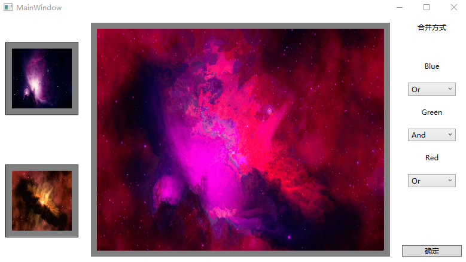
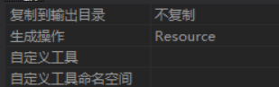
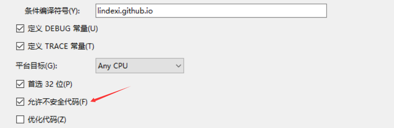
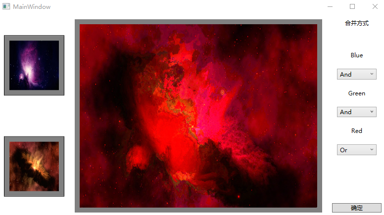

# WPF 通过位处理合并图片

本文告诉大家，在使用 WPF 合并两张图片的处理，可以使用像素之间的与或和异或的方式，对三个颜色的通道进行处理。

<!--more-->
<!-- CreateTime:2018/10/20 16:53:49 -->

<!-- csdn -->
<!-- 标签：WPF，图片处理 -->

先给大家看一下软件的界面

<!--  -->


这就是通过将左边的两张图片叠加合并为一张图片，这里的蓝色的通道就是通过位或的方式，绿色通道使用与的方式，红色也使用或的方式。

在 [WPF 修改图片颜色](https://lindexi.gitee.io/post/WPF-%E4%BF%AE%E6%94%B9%E5%9B%BE%E7%89%87%E9%A2%9C%E8%89%B2.html ) 已经告诉大家如何修改 WPF 的图片的颜色，但是为了叠加两张图片，还需要先读取图片的颜色

## 读取图片

在读取图片之前需要从文件加载图片，先在解决方案放两张图片，然后进行解析

在 WPF 如何需要读取解决方案的图片，可以使用 `GetResourceStream` 的方法，注意图片放在解决方案需要修改生成方式为资源

<!--  -->


在 WPF 的读取资源是使用 URL 的方式，我这里在解决方案放的图片是在项目的文件夹，可以通过下面的链接获取

```csharp
pack://application:,,,/图片文件夹/图片名.jpg
```

获取资源的代码很简单，但是需要将资源转换为图片，这里转换为图片的时候因为下面需要读取图片的颜色，需要修改图片的格式为 Bgra32 的格式，这个格式就是使用 32 位的 int 存放一个像素，一个像素里的按照8位也是1个byte分为蓝色、绿色红色和透明度

```csharp
      private WriteableBitmap GetImage(string url)
        {
            var stream = Application.GetResourceStream(new Uri(url))?.Stream ?? throw new ArgumentException();

            var bitmapImage = new BitmapImage();
            bitmapImage.BeginInit();
            bitmapImage.StreamSource = stream;
            bitmapImage.EndInit();

            var formatConvertedBitmap = new FormatConvertedBitmap();

            formatConvertedBitmap.BeginInit();

            formatConvertedBitmap.Source = bitmapImage;

            formatConvertedBitmap.DestinationFormat = PixelFormats.Bgra32;

            formatConvertedBitmap.EndInit();

            return new WriteableBitmap(formatConvertedBitmap);
        }
```

通过这个方法就可以从解决方案拿到 URL 转换为图片

## 读取图片像素

获取到图片之后，可以通过下面的方式获取图片的每一个像素

```csharp
           var length = writeableBitmap.PixelWidth * writeableBitmap.PixelHeight *
                         writeableBitmap.Format.BitsPerPixel / 8;
           var backBuffer = (byte*) writeableBitmap.BackBuffer;
 
            for (int i = 0; i + 4 < length; i = i + 4)
            {
                var blue = backBuffer[i];
                var green = backBuffer[i + 1];
                var red = backBuffer[i + 2];
                var alpha = backBuffer[i + 3];
            }
```

这里的 length 就是拿到图片的像素长度，从上面代码可以看到使用了不安全代码，需要右击项目属性，选择可以使用不安全代码

<!--  -->


通过上面的方法拿到两个图片的所有像素，然后将像素一一对应，这里我使用的两张图片的像素长度和像素宽度都是相同的，所以直接通过对应的数组下标就可以对应每个像素，如果是像素不相等的图片，具体业务是怎么处理就进行对应的方法

## 合并两张图片

从上面的代码可以拿到两张图片的每个像素，然后将两张图片的像素合并为第三个像素放在一个新的数组，最后将这个数组创建为一张图片，也就是显示为中间的图片

先来写一个函数，这个函数传入了枚举 YimiXoujelneTi 和两个 byte 关于枚举请看下面

```csharp
        enum YimiXoujelneTi
        {
            Or,
            And,
            Xor,
        }
```

枚举包含三个值，一个是或一个是与一个是异或，通过上面三个值可以处理传入的两个像素的通道

```csharp
                                switch (soKooworstarWhisvemsal)
                                {
                                    case YimiXoujelneTi.Or:
                                        return (byte) (byte1 | byte2);
                                    case YimiXoujelneTi.And:
                                        return (byte) (byte1 & byte2);
                                    case YimiXoujelneTi.Xor:
                                        return (byte) (byte1 ^ byte2);
                                }
```

很简单就处理像素，需要对不同的颜色进行处理

在处理颜色之后，可以通过创建一个和处理的图片的像素宽度和像素高度相同的 WriteableBitmap 然后写入处理的数组

## 界面

已经告诉了大家原理的部分，现在是细节的界面，在界面添加三个图片控件和一个按钮

```
    <Grid>
        <Grid.Resources>
            <system:Double x:Key="MicuTisperesemtooImageWidth">100</system:Double>
            <system:Double x:Key="MalkersemjemQalreeImageHeight">100</system:Double>

            <Style x:Key="RootealalheJiqardreImage" TargetType="Image">
                <Setter Property="Width" Value="{StaticResource MicuTisperesemtooImageWidth}" />
                <Setter Property="Height" Value="{StaticResource MalkersemjemQalreeImageHeight}" />
                <Setter Property="Stretch" Value="Fill" />
            </Style>
        </Grid.Resources>
        <Grid.ColumnDefinitions>
            <ColumnDefinition Width="Auto" />
            <ColumnDefinition Width="135*" />
            <ColumnDefinition Width="Auto" />
        </Grid.ColumnDefinitions>
        <Border BorderThickness="1">
            <Border.Resources>
                <Style x:Key="CawhemWurYairbeaBiqawjelBorder" TargetType="Border">
                    <Setter Property="Background" Value="Gray" />
                    <Setter Property="Margin" Value="10,10,10,10" />
                    <Setter Property="HorizontalAlignment" Value="Center" />
                    <Setter Property="VerticalAlignment" Value="Center" />
                    <Setter Property="Padding" Value="10,10,10,10"></Setter>
                    <Setter Property="BorderThickness" Value="1"></Setter>
                    <Setter Property="BorderBrush" Value="Black"></Setter>
                </Style>
            </Border.Resources>
            <Grid>
                <Grid.Resources>
               
                </Grid.Resources>
                <Grid.RowDefinitions>
                    <RowDefinition />
                    <RowDefinition />
                </Grid.RowDefinitions>
                <Grid>
                    <Border Style="{StaticResource CawhemWurYairbeaBiqawjelBorder}">
                        <Image x:Name="JaitetiDrokowPiskikaroImage" Style="{StaticResource RootealalheJiqardreImage}"
                               Source="orion-nebula-11107_640.jpg" />
                    </Border>
                </Grid>
                <Grid Grid.Row="1">
                    <Border Style="{StaticResource CawhemWurYairbeaBiqawjelBorder}">
                        <Image x:Name="NojerecalkeLeahuBemnercerfi" Style="{StaticResource RootealalheJiqardreImage}"
                               Source="solar-system-11188_640.jpg" />
                    </Border>
                </Grid>
            </Grid></Border>
        <Grid Grid.Column="1" Background="Gray" Margin="10,10,10,10">
            <Image x:Name="MeamouceaxaPooricoumo" Margin="10,10,10,10" Stretch="Fill" />
        </Grid>
        <Grid Grid.Column="2">
            <StackPanel Margin="10,10,10,10" Width="100">
                <StackPanel.Resources>
                    <Style x:Key="JairrairzeceDairpeCistirtelTextBlock" TargetType="TextBlock">
                        <Setter Property="HorizontalAlignment" Value="Center" />
                    </Style>
                    <Style x:Key="KirjasdraRadocemsouMainouhaltuTasmejirComboBox" TargetType="ComboBox">
                        <Setter Property="Margin" Value="10,10,10,10" />
                    </Style>
                </StackPanel.Resources>
                <TextBlock Style="{StaticResource JairrairzeceDairpeCistirtelTextBlock}" Text="合并方式" />
                <TextBlock Margin="10,50,10,10" Style="{StaticResource JairrairzeceDairpeCistirtelTextBlock}"
                           Text="Blue" />
                <ComboBox x:Name="BlueDallstartaxaJembere"
                          Style="{StaticResource KirjasdraRadocemsouMainouhaltuTasmejirComboBox}" />

                <TextBlock Margin="10,10,10,10" Style="{StaticResource JairrairzeceDairpeCistirtelTextBlock}"
                           Text="Green" />
                <ComboBox x:Name="GreenTrelqarnelNayke"
                          Style="{StaticResource KirjasdraRadocemsouMainouhaltuTasmejirComboBox}" />

                <TextBlock Margin="10,10,10,10" Style="{StaticResource JairrairzeceDairpeCistirtelTextBlock}"
                           Text="Red" />
                <ComboBox x:Name="RedNemriTailowhayi"
                          Style="{StaticResource KirjasdraRadocemsouMainouhaltuTasmejirComboBox}" />
            </StackPanel>
            <Button Margin="10,10,10,10" VerticalAlignment="Bottom" Content="确定" Click="JowhuRudi_OnClick" />
        </Grid>
    </Grid>

```

在后台代码的构造函数加载图片

```csharp
       public MainWindow()
        {
            InitializeComponent();

            var caitelooPeeSidreharTadri = Enum.GetNames(typeof(YimiXoujelneTi)).ToList();
            BlueDallstartaxaJembere.ItemsSource = caitelooPeeSidreharTadri;
            GreenTrelqarnelNayke.ItemsSource = caitelooPeeSidreharTadri;
            RedNemriTailowhayi.ItemsSource = caitelooPeeSidreharTadri;

            BlueDallstartaxaJembere.SelectedIndex = 0;
            GreenTrelqarnelNayke.SelectedIndex = 0;
            RedNemriTailowhayi.SelectedIndex = 0;

            _kearsisawjurNerasJaspahir = GetImage("pack://application:,,,/orion-nebula-11107_640.jpg");
            _pasfuTeabou = GetImage("pack://application:,,,/solar-system-11188_640.jpg");

            JaitetiDrokowPiskikaroImage.Source = _kearsisawjurNerasJaspahir;
            NojerecalkeLeahuBemnercerfi.Source = _pasfuTeabou;
        }

        private WriteableBitmap GetImage(string url)
        {
            var stream = Application.GetResourceStream(new Uri(url))?.Stream ?? throw new ArgumentException();

            var bitmapImage = new BitmapImage();
            bitmapImage.BeginInit();
            bitmapImage.StreamSource = stream;
            bitmapImage.EndInit();

            var formatConvertedBitmap = new FormatConvertedBitmap();

            formatConvertedBitmap.BeginInit();

            formatConvertedBitmap.Source = bitmapImage;

            formatConvertedBitmap.DestinationFormat = PixelFormats.Bgra32;

            formatConvertedBitmap.EndInit();

            return new WriteableBitmap(formatConvertedBitmap);
        }

        private WriteableBitmap _kearsisawjurNerasJaspahir;
        private WriteableBitmap _pasfuTeabou;
```

在按钮点击的时候按照选项创建中间图片

```csharp
        private void JowhuRudi_OnClick(object sender, RoutedEventArgs e)
        {
            unsafe
            {
                var lardiqaMesearToseNurrai = (byte*) _kearsisawjurNerasJaspahir.BackBuffer;
                var tayjaytumalFoubor = _kearsisawjurNerasJaspahir.PixelWidth * _kearsisawjurNerasJaspahir.PixelHeight *
                                        _kearsisawjurNerasJaspahir.Format.BitsPerPixel / 8;

                var yearcayralBawa = (byte*) _pasfuTeabou.BackBuffer;
                var douxouJebirjapowMerema = _pasfuTeabou.PixelWidth * _pasfuTeabou.PixelHeight *
                                             _pasfuTeabou.Format.BitsPerPixel / 8;

                var risnistaDurjair = new WriteableBitmap(_kearsisawjurNerasJaspahir.PixelWidth,
                    _kearsisawjurNerasJaspahir.PixelHeight, 96, 96, PixelFormats.Bgra32, null);

                byte[] saworCearsouCallfekenai = new byte[tayjaytumalFoubor];

                for (int i = 0; i + 4 < tayjaytumalFoubor; i += 4)
                {
                    var blue = lardiqaMesearToseNurrai[i];
                    var green = lardiqaMesearToseNurrai[i + 1];
                    var red = lardiqaMesearToseNurrai[i + 2];
                    var alpha = lardiqaMesearToseNurrai[i + 3];

                    if (i + 4 < douxouJebirjapowMerema)
                    {
                        blue = MupalSiluburwor(blue, yearcayralBawa[i],
                            BlueDallstartaxaJembere.SelectedItem?.ToString());
                        green = MupalSiluburwor(green, yearcayralBawa[i + 1],
                            GreenTrelqarnelNayke.SelectedItem?.ToString());
                        red = MupalSiluburwor(red, yearcayralBawa[i + 2], RedNemriTailowhayi.SelectedItem?.ToString());

                        byte MupalSiluburwor(byte celtroosiBalhaibelsowPisdelairjem, byte jenalearTurdoumou,
                            string pisemBalvetay)
                        {
                            if (string.IsNullOrEmpty(pisemBalvetay))
                            {
                                return celtroosiBalhaibelsowPisdelairjem;
                            }

                            if (Enum.TryParse(pisemBalvetay, out YimiXoujelneTi soKooworstarWhisvemsal))
                            {
                                switch (soKooworstarWhisvemsal)
                                {
                                    case YimiXoujelneTi.Or:
                                        return (byte) (celtroosiBalhaibelsowPisdelairjem | jenalearTurdoumou);
                                    case YimiXoujelneTi.And:
                                        return (byte) (celtroosiBalhaibelsowPisdelairjem & jenalearTurdoumou);
                                    case YimiXoujelneTi.Xor:
                                        return (byte) (celtroosiBalhaibelsowPisdelairjem ^ jenalearTurdoumou);
                                }
                            }

                            return celtroosiBalhaibelsowPisdelairjem;
                        }
                    }

                    saworCearsouCallfekenai[i] = blue;
                    saworCearsouCallfekenai[i + 1] = green;
                    saworCearsouCallfekenai[i + 2] = red;
                    saworCearsouCallfekenai[i + 3] = alpha;
                }

                risnistaDurjair.WritePixels(
                    new Int32Rect(0, 0, _kearsisawjurNerasJaspahir.PixelWidth, _kearsisawjurNerasJaspahir.PixelHeight),
                    saworCearsouCallfekenai, 4 * risnistaDurjair.PixelWidth, 0);

                MeamouceaxaPooricoumo.Source = risnistaDurjair;
            }
        }
```

<!--  -->


<a rel="license" href="http://creativecommons.org/licenses/by-nc-sa/4.0/"></a><br />本作品采用<a rel="license" href="http://creativecommons.org/licenses/by-nc-sa/4.0/">知识共享署名-非商业性使用-相同方式共享 4.0 国际许可协议</a>进行许可。欢迎转载、使用、重新发布，但务必保留文章署名[林德熙](http://blog.csdn.net/lindexi_gd)(包含链接:http://blog.csdn.net/lindexi_gd )，不得用于商业目的，基于本文修改后的作品务必以相同的许可发布。如有任何疑问，请与我[联系](mailto:lindexi_gd@163.com)。
