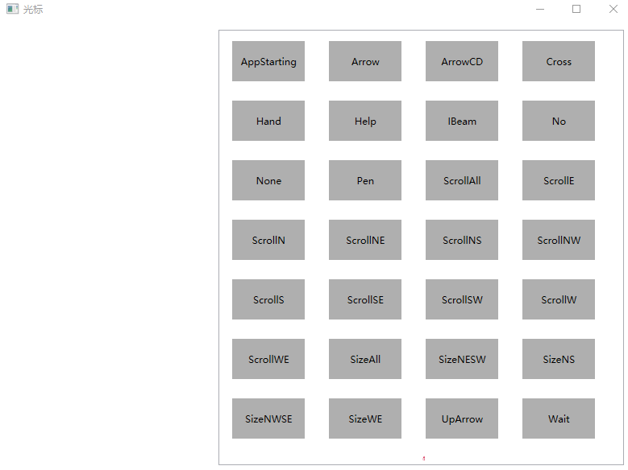
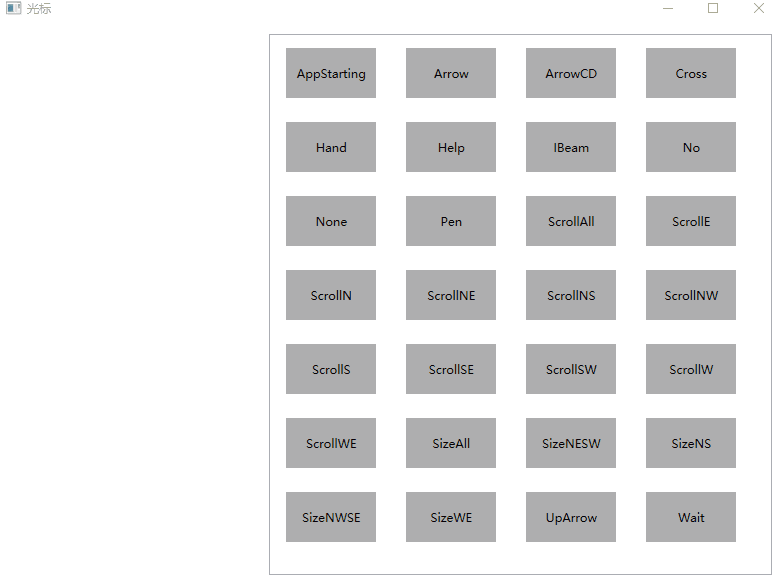

# WPF 鼠标光标大全

在 WPF 中，可以通过 Cursors 静态类里面的各个预定义属性来设置移入到某个元素时，鼠标光标的外观样式。今天小伙伴问我哪个是鼠标移动控件的鼠标外观属性，在看到 Cursors 静态类里面那么多属性时，我也不知道用哪个好。于是我就写了一个叫鼠标光标大全的应用，可以让大家快速知道有哪些可以用的光标

<!--more-->
<!-- CreateTime:2021/8/5 19:23:23 -->

<!-- 发布 -->

以下是我的应用界面

<!--  -->


鼠标移动到不同的属性上，即可修改当前的鼠标外观

<!--  -->


这个应用我在 [github](https://github.com/lindexi/lindexi_gd/tree/0db985a1c785e0a3d090c2eb2bcb2da9e032f156/KeregabaneyairWeqainowafobar) 和 [gitee](https://gitee.com/lindexi/lindexi_gd/tree/0db985a1c785e0a3d090c2eb2bcb2da9e032f156/KeregabaneyairWeqainowafobar) 上完全开源

不嫌弃麻烦的话，还请自行下载代码，自己构建。可以通过如下方式获取本文的源代码，先创建一个空文件夹，接着使用命令行 cd 命令进入此空文件夹，在命令行里面输入以下代码，即可获取到本文的代码

```
git init
git remote add origin https://gitee.com/lindexi/lindexi_gd.git
git pull origin 0db985a1c785e0a3d090c2eb2bcb2da9e032f156
```

以上使用的是 gitee 的源，如果 gitee 不能访问，请替换为 github 的源

```
git remote remove origin
git remote add origin https://github.com/lindexi/lindexi_gd.git
```

获取代码之后，进入 KeregabaneyairWeqainowafobar 文件夹

如果嫌弃麻烦的话，而且 CSDN 积分不要钱的话，还请到 [CSDN 下载](https://download.csdn.net/download/lindexi_gd/20722507) 我构建好的应用

以下是核心的逻辑，可以通过编写一个 ListView 控件，让这个控件里面的每一项绑定光标。在 WPF 中，可以在不同的元素上，给各个元素设置自己光标，如果没有设置，那将会使用元素的上一层容器的鼠标光标属性

```xml
          <Border Margin="10,10,10,10" Height="50" Width="90" Background="#AFAFAF" 
                  IsHitTestVisible="True"
                  Cursor="{Binding Cursor}">
            <TextBlock Text="{Binding Name}" 
                       HorizontalAlignment="Center" 
                       VerticalAlignment="Center" />
          </Border>
```

以上的代码是放在 ItemTemplate 作为列表里面的某个元素

绑定的 Model 定义如下

```csharp
    public class CursorInfo
    {
        public CursorInfo(Cursor cursor)
        {
            Name = cursor.ToString();
            Cursor = cursor;
        }

        public string Name { get; }

        public Cursor Cursor { get; }
    }
```

在 MainWindow 设置了所有默认的光标

```csharp
    public partial class MainWindow : Window
    {

        public MainWindow()
        {
            CursorInfoList = new List<CursorInfo>()
            {
                new CursorInfo(Cursors.AppStarting),
                new CursorInfo(Cursors.Arrow),
                new CursorInfo(Cursors.ArrowCD),
                new CursorInfo(Cursors.Cross),
                new CursorInfo(Cursors.Hand),
                new CursorInfo(Cursors.Help),
                new CursorInfo(Cursors.IBeam),
                new CursorInfo(Cursors.No),
                new CursorInfo(Cursors.None),
                new CursorInfo(Cursors.Pen),
                new CursorInfo(Cursors.ScrollAll),
                new CursorInfo(Cursors.ScrollE),
                new CursorInfo(Cursors.ScrollN),
                new CursorInfo(Cursors.ScrollNE),
                new CursorInfo(Cursors.ScrollNS),
                new CursorInfo(Cursors.ScrollNW),
                new CursorInfo(Cursors.ScrollS),
                new CursorInfo(Cursors.ScrollSE),
                new CursorInfo(Cursors.ScrollSW),
                new CursorInfo(Cursors.ScrollW),
                new CursorInfo(Cursors.ScrollWE),
                new CursorInfo(Cursors.SizeAll),
                new CursorInfo(Cursors.SizeNESW),
                new CursorInfo(Cursors.SizeNS),
                new CursorInfo(Cursors.SizeNWSE),
                new CursorInfo(Cursors.SizeWE),
                new CursorInfo(Cursors.UpArrow),
                new CursorInfo(Cursors.Wait),
            };

            DataContext = this;

            InitializeComponent();
        }

        public List<CursorInfo> CursorInfoList { get; }

        public CursorInfo CurrentCursor
        {
            set
            {
                _currentCursor = value;
                Cursor = value.Cursor;
            }
            get => _currentCursor;
        }

        private CursorInfo _currentCursor;
    }
```

全部的 XAML 代码如下

```xml
<Window x:Class="KeregabaneyairWeqainowafobar.MainWindow"
        xmlns="http://schemas.microsoft.com/winfx/2006/xaml/presentation"
        xmlns:x="http://schemas.microsoft.com/winfx/2006/xaml"
        xmlns:d="http://schemas.microsoft.com/expression/blend/2008"
        xmlns:mc="http://schemas.openxmlformats.org/markup-compatibility/2006"
        xmlns:local="clr-namespace:KeregabaneyairWeqainowafobar"
        mc:Ignorable="d"
        Title="光标" Height="600" Width="800">
  <Grid>
    <Grid.ColumnDefinitions>
      <ColumnDefinition />
      <ColumnDefinition Width="2*" />
    </Grid.ColumnDefinitions>
    <ListView Grid.Column="1" Margin="10,10,10,10" ItemsSource="{Binding CursorInfoList}"
              SelectedItem="{Binding CurrentCursor,Mode=TwoWay}" ScrollViewer.HorizontalScrollBarVisibility="Disabled">
      <ListView.ItemsPanel>
        <ItemsPanelTemplate>
          <WrapPanel />
        </ItemsPanelTemplate>
      </ListView.ItemsPanel>
      <ListBox.ItemContainerStyle>
        <Style TargetType="ListBoxItem">
          <Setter Property="HorizontalContentAlignment" Value="Stretch" />
        </Style>
      </ListBox.ItemContainerStyle>
      <ListView.ItemTemplate>
        <DataTemplate DataType="local:CursorInfo">
          <Border Margin="10,10,10,10" Height="50" Width="90" Background="#AFAFAF" 
                  IsHitTestVisible="True"
                  Cursor="{Binding Cursor}">
            <TextBlock Text="{Binding Name}" 
                       HorizontalAlignment="Center" 
                       VerticalAlignment="Center" />
          </Border>
        </DataTemplate>
      </ListView.ItemTemplate>
    </ListView>
  </Grid>
</Window>
```

<a rel="license" href="http://creativecommons.org/licenses/by-nc-sa/4.0/"></a><br />本作品采用<a rel="license" href="http://creativecommons.org/licenses/by-nc-sa/4.0/">知识共享署名-非商业性使用-相同方式共享 4.0 国际许可协议</a>进行许可。欢迎转载、使用、重新发布，但务必保留文章署名[林德熙](http://blog.csdn.net/lindexi_gd)(包含链接:http://blog.csdn.net/lindexi_gd )，不得用于商业目的，基于本文修改后的作品务必以相同的许可发布。如有任何疑问，请与我[联系](mailto:lindexi_gd@163.com)。
