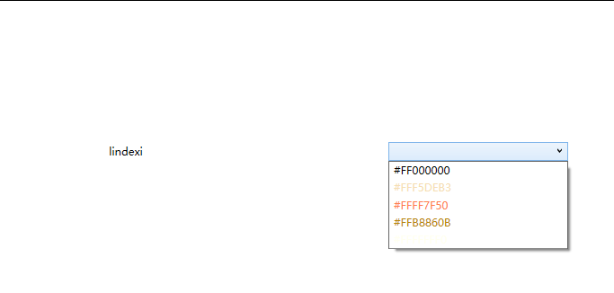

# WPF 下拉框选项做鼠标 Hover 预览效果

本文来告诉大家如何在 WPF 中，在 下拉框 ComboBox 里面，鼠标移动到 ComboBoxItem 上时，自动触发对应的事件，用来预览此选项值。例如我在实现一个颜色下拉框，此时我可以通过点击下拉框显示多个不同的颜色，鼠标移动到某个颜色选项上，可以修改界面，预览此颜色的内容

<!--more-->


<!-- 发布 -->

大概的界面如下图，点击右边的颜色下拉框，可以显示多个不同的颜色，而鼠标移动到下拉框的选项上，可以自动让文标的颜色进行变更

<!--  -->


实现的运行效果如下图

<!--  -->


实现的方法很简单，如下图创建一个简单的界面

```xml
  <Window.Resources>
    <x:Array x:Key="BrushList" Type="SolidColorBrush">
      <SolidColorBrush Color="Black"></SolidColorBrush>
      <SolidColorBrush Color="Wheat"></SolidColorBrush>
      <SolidColorBrush Color="Coral"></SolidColorBrush>
      <SolidColorBrush Color="DarkGoldenrod"></SolidColorBrush>
      <SolidColorBrush Color="Ivory"></SolidColorBrush>
    </x:Array>
  </Window.Resources>
  <Grid>
    <Grid.ColumnDefinitions>
      <ColumnDefinition></ColumnDefinition>
      <ColumnDefinition></ColumnDefinition>
    </Grid.ColumnDefinitions>
    <TextBlock x:Name="TextBlock" Text="lindexi" HorizontalAlignment="Center" VerticalAlignment="Center"></TextBlock>
    <ComboBox Grid.Column="1" Margin="10,10,10,10"
              Width="200"
              VerticalAlignment="Center" 
              ItemsSource="{StaticResource BrushList}"
              MouseMove="ComboBox_OnMouseMove">
      <ComboBox.ItemTemplate>
        <DataTemplate>
          <TextBlock Foreground="{Binding}" Text="{Binding Color}"></TextBlock>
        </DataTemplate>
      </ComboBox.ItemTemplate>
    </ComboBox>
  </Grid>
```

接着在后台代码添加 `ComboBox_OnMouseMove` 方法，在 `ComboBox_OnMouseMove` 方法里面判断当前的鼠标移动，根据当前鼠标移动所在的项对应的 DataContext 即可拿到绑定的数据，从而拿到当前预览颜色

```csharp
        private void ComboBox_OnMouseMove(object sender, MouseEventArgs e)
        {
            if (e.OriginalSource is FrameworkElement frameworkElement)
            {
                if (frameworkElement.DataContext is Brush brush)
                {
                    TextBlock.Foreground = brush;
                }
            }
        }
```

以上代码采用 C# 9.0 的写法

本文所有代码放在 [github](https://github.com/lindexi/lindexi_gd/tree/54b57574b4e99362c651a77251c7bc1d7ad6106f/QicafejukarJaifairnemleree) 和 [gitee](https://gitee.com/lindexi/lindexi_gd/tree/54b57574b4e99362c651a77251c7bc1d7ad6106f/QicafejukarJaifairnemleree) 欢迎访问

可以通过如下方式获取本文的源代码，先创建一个空文件夹，接着使用命令行 cd 命令进入此空文件夹，在命令行里面输入以下代码，即可获取到本文的代码

```
git init
git remote add origin https://gitee.com/lindexi/lindexi_gd.git
git pull origin 54b57574b4e99362c651a77251c7bc1d7ad6106f
```

以上使用的是 gitee 的源，如果 gitee 不能访问，请替换为 github 的源

```
git remote remove origin
git remote add origin https://github.com/lindexi/lindexi_gd.git
```

获取代码之后，进入 QicafejukarJaifairnemleree 文件夹


<a rel="license" href="http://creativecommons.org/licenses/by-nc-sa/4.0/"></a><br />本作品采用<a rel="license" href="http://creativecommons.org/licenses/by-nc-sa/4.0/">知识共享署名-非商业性使用-相同方式共享 4.0 国际许可协议</a>进行许可。欢迎转载、使用、重新发布，但务必保留文章署名[林德熙](http://blog.csdn.net/lindexi_gd)(包含链接:http://blog.csdn.net/lindexi_gd )，不得用于商业目的，基于本文修改后的作品务必以相同的许可发布。如有任何疑问，请与我[联系](mailto:lindexi_gd@163.com)。