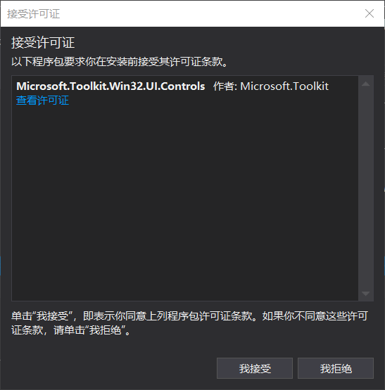
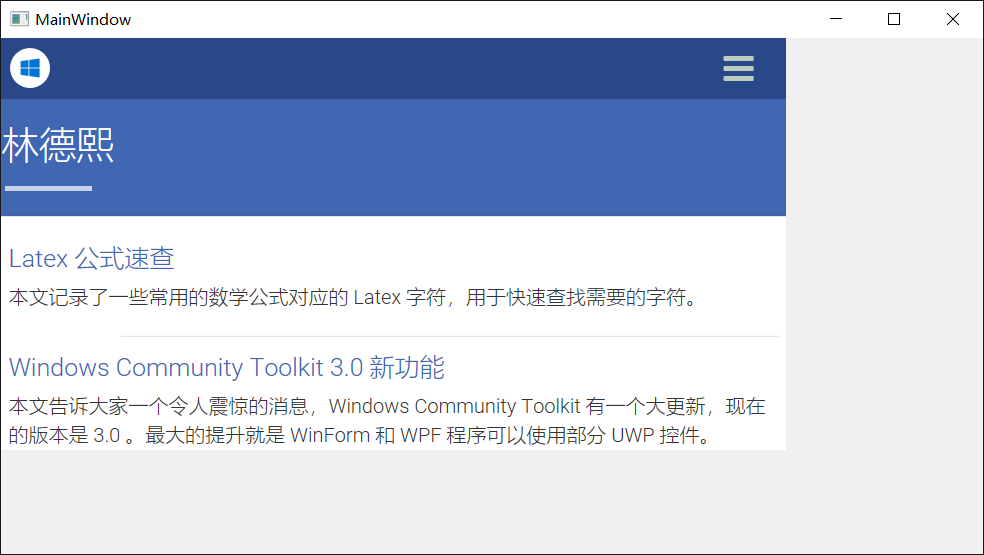

# WPF 使用 Edge 浏览器

本文告诉大家如何使用 Windows Community Toolkit 的新控件，在 WPF 使用 Edge 浏览器。

<!--more-->


<!-- csdn -->

首先需要通过 VisualStudio 创建 WPF 项目。因为  Microsoft.Toolkit.Win32.UI.Controls 库只支持 4.6.2 以上，所以需要选择框架大于 4.6.2 

打开 Nuget 安装 Microsoft.Toolkit.Win32.UI.Controls ，需要同意许可


<!--  -->


打开主页面，在 xaml 添加下面代码

```csharp
 xmlns:wpf="clr-namespace:Microsoft.Toolkit.Win32.UI.Controls.WPF;assembly=Microsoft.Toolkit.Win32.UI.Controls" 
```

```csharp
        <wpf:WebView x:Name="WebView"></wpf:WebView>
```

在代码跳转到我的博客

```csharp
        public MainWindow()
        {
            InitializeComponent();

            WebView.Navigate("https://lindexi.gitee.io");
        }
```

运行一下软件

<!--  -->


如果不想在 xaml 写任何的代码，也可以通过下面代码添加

```csharp
        public MainWindow()
        {
            InitializeComponent();

            var webView = new WebView();
            webView.Navigate("https://lindexi.gitee.io");
            Content = webView;
        }
```

## 优点

 - 触摸非常流畅

 - 加载页面非常快

 - 缩放页面几乎不使用CPU

 - 对于很多图片的时候使用内存很小

## 存在的问题

 - 吃掉了 Touch 事件、MouseDown事件，也就是吃掉了所有用户输入

 - 第一次加载无法覆盖控件大小，在修改窗口大小之后才可以

参见：[Windows Community Toolkit 3.0 新功能 在WinForms 和 WPF 使用 UWP 控件 - CSDN博客](https://blog.csdn.net/lindexi_gd/article/details/80533053 )

[Bringing a modern WebView to your .NET WinForms and WPF Apps - Microsoft Edge Dev BlogMicrosoft Edge Dev Blog](https://blogs.windows.com/msedgedev/2018/05/09/modern-webview-winforms-wpf-apps/#gUx8ACTB19D37Sdj.97 )


<a rel="license" href="http://creativecommons.org/licenses/by-nc-sa/4.0/"></a><br />本作品采用<a rel="license" href="http://creativecommons.org/licenses/by-nc-sa/4.0/">知识共享署名-非商业性使用-相同方式共享 4.0 国际许可协议</a>进行许可。欢迎转载、使用、重新发布，但务必保留文章署名[林德熙](http://blog.csdn.net/lindexi_gd)(包含链接:http://blog.csdn.net/lindexi_gd )，不得用于商业目的，基于本文修改后的作品务必以相同的许可发布。如有任何疑问，请与我[联系](mailto:lindexi_gd@163.com)。