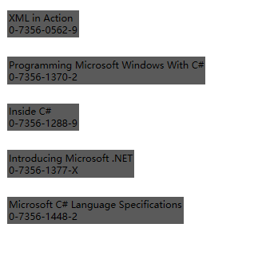

# WPF 使用 ItemsPanel 修改方向

在 WPF 很多时候都需要使用 ListView 但是默认的列表是垂直的，如果需要使用水平的，就需要使用 ItemsPanel 设置使用的类

<!--more-->


<!-- csdn -->

先添加一些代码到资源，下面就可以使用这里的资源

```
      <Grid.Resources>
            <XmlDataProvider x:Key="InventoryData" XPath="Books">
                <x:XData>
                    <Books xmlns="">
                        <Book ISBN="0-7356-0562-9" Stock="in" Number="9">
                            <Title>XML in Action</Title>
                            <Summary>XML Web Technology</Summary>
                        </Book>
                        <Book ISBN="0-7356-1370-2" Stock="in" Number="8">
                            <Title>Programming Microsoft Windows With C#</Title>
                            <Summary>C# Programming using the .NET Framework</Summary>
                        </Book>
                        <Book ISBN="0-7356-1288-9" Stock="out" Number="7">
                            <Title>Inside C#</Title>
                            <Summary>C# Language Programming</Summary>
                        </Book>
                        <Book ISBN="0-7356-1377-X" Stock="in" Number="5">
                            <Title>Introducing Microsoft .NET</Title>
                            <Summary>Overview of .NET Technology</Summary>
                        </Book>
                        <Book ISBN="0-7356-1448-2" Stock="out" Number="4">
                            <Title>Microsoft C# Language Specifications</Title>
                            <Summary>The C# language definition</Summary>
                        </Book>
                    </Books>
                </x:XData>
            </XmlDataProvider>
        </Grid.Resources>
```

添加一个 ListView 然后通过 ItemTemplate 设置界面

```
       <ListView ItemsSource="{Binding Source={StaticResource InventoryData}, XPath=Book}">
            <ListView.ItemTemplate>
                <DataTemplate>
                    <Grid Background="#5a5a5a" Margin="10,10,10,10">
                        <StackPanel Margin="2,2,2,2">
                            <TextBlock Text="{Binding XPath=Title}" />
                            <TextBlock Text="{Binding XPath=@ISBN}" />
                        </StackPanel>
                    </Grid>
                </DataTemplate>
            </ListView.ItemTemplate>
        </ListView>
```

这里的 DataTemplate 传入的 DataContext 就是 ItemsSource 绑定的列表的每一项

如绑定了 List<Foo> 那么这里的 DataContext 就是 Foo 类

于是在这里就可以通过绑定 DataContext 的属性绑定界面

上面代码运行可以看到列表是垂直的

<!--  -->


如果需要修改为水平的，可以通过 ItemsPanel 修改

```
            <ListView.ItemsPanel>
                <ItemsPanelTemplate>
                    <StackPanel Orientation="Horizontal" />
                </ItemsPanelTemplate>
            </ListView.ItemsPanel>
```

<!--  -->


代码全部都在 xaml 写，因为神树说在后台写不好

```
    <Grid>
        <Grid.Resources>
            <XmlDataProvider x:Key="InventoryData" XPath="Books">
                <x:XData>
                    <Books xmlns="">
                        <Book ISBN="0-7356-0562-9" Stock="in" Number="9">
                            <Title>XML in Action</Title>
                            <Summary>XML Web Technology</Summary>
                        </Book>
                        <Book ISBN="0-7356-1370-2" Stock="in" Number="8">
                            <Title>Programming Microsoft Windows With C#</Title>
                            <Summary>C# Programming using the .NET Framework</Summary>
                        </Book>
                        <Book ISBN="0-7356-1288-9" Stock="out" Number="7">
                            <Title>Inside C#</Title>
                            <Summary>C# Language Programming</Summary>
                        </Book>
                        <Book ISBN="0-7356-1377-X" Stock="in" Number="5">
                            <Title>Introducing Microsoft .NET</Title>
                            <Summary>Overview of .NET Technology</Summary>
                        </Book>
                        <Book ISBN="0-7356-1448-2" Stock="out" Number="4">
                            <Title>Microsoft C# Language Specifications</Title>
                            <Summary>The C# language definition</Summary>
                        </Book>
                    </Books>
                </x:XData>
            </XmlDataProvider>
        </Grid.Resources>

        <ListView ItemsSource="{Binding Source={StaticResource InventoryData}, XPath=Book}">
            <ListView.ItemsPanel>
                <ItemsPanelTemplate>
                    <StackPanel Orientation="Horizontal" />
                </ItemsPanelTemplate>
            </ListView.ItemsPanel>

            <ListView.ItemTemplate>
                <DataTemplate>
                    <Grid Background="#5a5a5a" Margin="10,10,10,10">
                        <StackPanel Margin="2,2,2,2">
                            <TextBlock Text="{Binding XPath=Title}" />
                            <TextBlock Text="{Binding XPath=@ISBN}" />
                        </StackPanel>
                    </Grid>
                </DataTemplate>
            </ListView.ItemTemplate>
        </ListView>
    </Grid>
```

代码 https://gitee.com/lindexi/lindexi_gd/blob/68cefabd097bf2f4fc35e3384f34e1dc622a67ad/PotrallTiscawMouger/PotrallTiscawMouger/MainWindow.xaml


<a rel="license" href="http://creativecommons.org/licenses/by-nc-sa/4.0/"></a><br />本作品采用<a rel="license" href="http://creativecommons.org/licenses/by-nc-sa/4.0/">知识共享署名-非商业性使用-相同方式共享 4.0 国际许可协议</a>进行许可。欢迎转载、使用、重新发布，但务必保留文章署名[林德熙](http://blog.csdn.net/lindexi_gd)(包含链接:http://blog.csdn.net/lindexi_gd )，不得用于商业目的，基于本文修改后的作品务必以相同的许可发布。如有任何疑问，请与我[联系](mailto:lindexi_gd@163.com)。