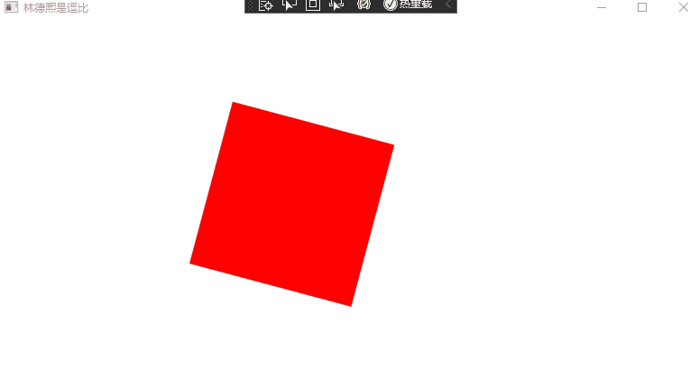

# WPF 使用 ManipulationProcessor2D 纯数学计算方式提供多点漫游元素功能

在 WPF 中，除了使用 Manipulation 系列在进行触摸的多点进行漫游外，还可以使用比较少有人了解的 WPF 提供的 ManipulationProcessor2D 纯数学库来进行多点漫游元素功能。这是放在 System.Windows.Input.Manipulations 空间内，一个单独的 WPF 程序集，使用这个程序集可以使用和 WPF 交互无关的纯数学计算方式提供多点漫游元素功能。只需要给 ManipulationProcessor2D 提供多点的 Id 和时间和坐标信息，就可以用上 Manipulation 数学计算，拿到平移和缩放和旋转等信息，以及累计量和差量和速度，可以使用这些信息做到元素的漫游

<!--more-->


<!-- CreateTime:2021/3/19 20:42:56 -->

<!-- 发布 -->

对比 WPF 交互中的 Manipulation 系列，使用 System.Windows.Input.Manipulations 的 ManipulationProcessor2D 的优势在于可以传入很多虚拟的点，可以无视具体的交互，实现从传入的多个点拿到平移和缩放和旋转等信息，以及通过多次传入的时间值计算出累计量和差量和速度

本文使用的 System.Windows.Input.Manipulations 的 ManipulationProcessor2D 也是在 WPF 开源仓库中完全开源，在 [https://github.com/dotnet/wpf](https://github.com/dotnet/wpf) 可以找到所有的计算源代码，以上开源基于友好的 MIT 协议，意味着大家可以随意魔改，开源或不开源都佛系。本来我是打算写这一篇的原理的，但是阅读完了代码，自己没有这个能力写如此数学系的博客。本文仅仅只是告诉大家可以如何用而已

在阅读本博客之前，如果你是带着需求阅读的，那么请优先考虑使用默认的 Manipulation 系列是否满足需求。原因在于 WPF 交互中的 Manipulation 系列已经处理了足够多的细节，以及通过底层的优化有非常好的性能。但使用 ManipulationProcessor2D 如果是用在多点触摸上，意味着你需要处理大量触摸交互细节。本文以下的逻辑仅仅只是做很少的细节处理，不建议你抄下面代码放在你的产品应用上。如果你是期望用在多点触摸上，在阅读本文之前，请确定你对触摸有足够的了解

在开始之前，给大家看一下效果


<!--  -->

咱先在界面放一个 Rectangle 作为元素，接下来将会对这个元素进行漫游

```xml
    <Rectangle x:Name="Rectangle" Width="100" Height="100" HorizontalAlignment="Left" VerticalAlignment="Top"
               Fill="Red">
      <Rectangle.RenderTransform>
        <TransformGroup>
          <RotateTransform x:Name="RotateTransform"></RotateTransform>
          <ScaleTransform x:Name="ScaleTransform"></ScaleTransform>
          <TranslateTransform x:Name="TranslateTransform"></TranslateTransform>
        </TransformGroup>
      </Rectangle.RenderTransform>
    </Rectangle>
```

使用 System.Windows.Input.Manipulations 库的入口是 ManipulationProcessor2D 类，需要先创建对象，在创建对象的时候可以设置当前的数学计算对什么生效，如仅允许平移，或仅旋转等。例如需要在给定多个点的时候，判断这些点当前是否在做旋转等逻辑，就可以用上这部分逻辑，不一定是做多点触摸

```csharp
        public MainWindow()
        {
            InitializeComponent();

            ManipulationProcessor2D = new ManipulationProcessor2D(Manipulations2D.All);
        }

        private ManipulationProcessor2D ManipulationProcessor2D { get; }
```

以上代码传入的是 Manipulations2D.All 表示啥交互都要，在运行过程中，也可以更改当前支持的交互。更改方法是通过 ManipulationProcessor2D.SupportedManipulations 属性进行更改，如下面代码

```csharp
            ManipulationProcessor2D.SupportedManipulations = Manipulations2D.Scale;
```

使用 ManipulationProcessor2D 的重点是监听事件，在事件里面获取交互，如下面代码

```csharp
            ManipulationProcessor2D.Started += ManipulationProcessor2D_Started;
            ManipulationProcessor2D.Delta += ManipulationProcessor2D_Delta;
            ManipulationProcessor2D.Completed += ManipulationProcessor2D_Completed;
```

而 ManipulationProcessor2D 的事件的触发就依赖于给定 ManipulationProcessor2D 数据。给 ManipulationProcessor2D 数据的方法重点就是 ProcessManipulators 函数的调用，以及在交互结束之后调用的 CompleteManipulation 方法

给定 ManipulationProcessor2D 数据，需要调用 ProcessManipulators 函数，这个函数的参数有两个，分别是时间戳，时间戳使用的是 100 纳秒作为一单位，和触摸点列表。触摸点列表要求传入的触摸点包含了点的 Id 和坐标，在进行多点交互时，要求在相同的一个时间戳里面传入多个不同的点的坐标。而因为此要求，将会让逻辑设计的时候比较复杂，原因是如果是用在多点触摸上，通过 Touch 或 Stylus 事件，每次获取的只是指定单个触摸设备的触摸点，而不是能拿到当前所有的触摸设备的触摸点，因此最简方法是加上一个字典做缓存

本文以下代码采用 Stylus 事件来作为触摸输入来源，根据触摸的输出对矩形进行漫游

```csharp
        private readonly Dictionary<int, (double x, double y)> _points = new();
        private int _lastTimeStamp;

        private ManipulationProcessor2D ManipulationProcessor2D { get; }

        private void MainWindow_StylusDown(object sender, StylusDownEventArgs e)
        {
            var timestamp = e.Timestamp;
            if (timestamp <= _lastTimeStamp)
                //非递增时间戳+1，确保不丢Down
                timestamp = _lastTimeStamp + 1;
            _lastTimeStamp = timestamp;

            var point = e.GetStylusPoints(this);
            var firstStylusPoint = point.FirstOrDefault();
            _points.Add(e.StylusDevice.Id, new (firstStylusPoint.X, firstStylusPoint.Y));

            ManipulationProcessor2D.ProcessManipulators(timestamp,
                _points.Select(temp => new Manipulator2D(temp.Key, (float) temp.Value.x, (float) temp.Value.y)));
        }

        private void MainWindow_StylusMove(object sender, StylusEventArgs e)
        {
            if (!_points.ContainsKey(e.StylusDevice.Id))
                // 丢失按下的，忽略
                return;

            var timestamp = e.Timestamp;
            if (timestamp <= _lastTimeStamp)
                //非递增时间戳直接忽略
                return;
            _lastTimeStamp = timestamp;

            // 下面代码和 e.GetPosition() 其实没差别
            var firstStylusPoint = e.GetStylusPoints(this).FirstOrDefault();
            _points[e.StylusDevice.Id] = new (firstStylusPoint.X, firstStylusPoint.Y);

            ManipulationProcessor2D.ProcessManipulators(timestamp,
                _points.Select(temp => new Manipulator2D(temp.Key, (float) temp.Value.x, (float) temp.Value.y)));
        }

        private void MainWindow_StylusUp(object sender, StylusEventArgs e)
        {
            if (!_points.ContainsKey(e.StylusDevice.Id)) return;
            var timestamp = e.Timestamp;
            if (timestamp <= _lastTimeStamp)
                //非递增时间戳+1，确保不丢Up
                timestamp = _lastTimeStamp + 1;

            // 下面代码和 e.GetPosition() 其实没差别
            var firstStylusPoint = e.GetStylusPoints(this).FirstOrDefault();
            _points[e.StylusDevice.Id] = new (firstStylusPoint.X, firstStylusPoint.Y);

            ManipulationProcessor2D.ProcessManipulators(timestamp,
                _points.Select(temp => new Manipulator2D(temp.Key, (float) temp.Value.x, (float) temp.Value.y)));
            _points.Remove(e.StylusDevice.Id);

            if (_points.Count == 0)
            {
                ManipulationProcessor2D.CompleteManipulation(timestamp);
                _lastTimeStamp = 0;
            }
        }
```

以上代码使用了 .NET 5 的 WPF 和 C# 9.0 语法。上面代码包含了一些处理的细节，但是还远远不够作为产品级的代码。上面代码的 `_points` 只是一个缓存，用来解决在一次调用 ProcessManipulators 方法的时候，给定多个触摸设备的触摸点。上面代码的 `_points` 仅仅保存一个触摸设备的一个触摸点。以上的触摸设备用的是 StylusDevice 概念，相当于一个手指就是一个触摸设备，而不是说有多个触摸屏幕。如果只是为了获取单个触摸点，那么调用 `e.GetPosition()` 的性能会更好，但如果是需要获取多个触摸点做到更平滑，就需要用到 `e.GetStylusPoints` 方法。而是否能做到平滑，我的推荐是加上一层过滤层，因为触摸点的上报和具体的触摸框相关，上报的密度将会影响上面逻辑

为什么在我这里采用了 Stylus 而不是 Touch 事件？实际上也许在你的设备上，采用 Touch 的效果会更好，只是对于我当前的触摸框来说，因为上报的点的密度比较大，同时触摸框的平滑算法比较渣，使用 Touch 会出现比较多的抖动。在 WPF 中 Touch 是触摸，而 Stylus 是触笔。在单纯的手指触摸下去，会根据触摸框的不同，让 TouchMove 的触发频率大于等于 StylusMove 的频率，而 StylusMove 能收集一段时间的触摸点，可以根据收集到的点优化平滑拿到多个点。如果你的触摸框上报的频率不够大，那么采用 Touch 也不错

在调用 CompleteManipulation 方法的时候，需要在所有的触摸点都抬起的才能调用，原因是在 `MainWindow_StylusMove` 方法依然需要用到这些触摸点，否则下一次调用 ProcessManipulators 将会识别为下次的触摸开始

在 ManipulationProcessor2D 的 Started 和 Delta 和 Completed 事件里面，可以收到进行数学计算之后反馈的结果 

```csharp
            ManipulationProcessor2D.Started += ManipulationProcessor2D_Started;
            ManipulationProcessor2D.Delta += ManipulationProcessor2D_Delta;
            ManipulationProcessor2D.Completed += ManipulationProcessor2D_Completed;

        private void ManipulationProcessor2D_Started(object? sender, Manipulation2DStartedEventArgs e)
        {
        }

        private void ManipulationProcessor2D_Delta(object? sender, Manipulation2DDeltaEventArgs e)
        {
        }

        private void ManipulationProcessor2D_Completed(object? sender, Manipulation2DCompletedEventArgs e)
        {
        }
```

在 Manipulation2DStartedEventArgs 方法里面，表示的只是开始而已，基本没啥有用的参数。对于业务来说，可以执行一些初始化

在 ManipulationProcessor2D_Delta 的 Manipulation2DDeltaEventArgs 参数就是重点，也就是上面的触摸输入代码只是为了拿到 Manipulation2DDeltaEventArgs 参数。在 Manipulation2DDeltaEventArgs 参数里面包含了以下逻辑

- Delta 差量值，可以用来做叠加差量。但是缺点是存在精度问题，叠加的差量之和不一定是累计量
- Cumulative 累计值，距离 Start 的累计值，可以用来解决差量的计算误差。但缺点是需要自己计算第一次的状态
- Velocities 速度，速度也称为惯性

以下代码将使用 Delta 让矩形漫游

```csharp
        private void ManipulationProcessor2D_Delta(object? sender, Manipulation2DDeltaEventArgs e)
        {
            // 获取的 Rotation 是弧度
            RotateTransform.Angle += e.Delta.Rotation * 180 / Math.PI;

            TranslateTransform.X += e.Delta.TranslationX;
            TranslateTransform.Y += e.Delta.TranslationY;

            ScaleTransform.ScaleX += e.Delta.ExpansionX / 100;
            ScaleTransform.ScaleY += e.Delta.ExpansionY / 100;
        }
```

而为了让矩形做到跟手，可以再优化一下逻辑

```csharp
        private void ManipulationProcessor2D_Delta(object? sender, Manipulation2DDeltaEventArgs e)
        {
            // 获取的 Rotation 是弧度
            var centerX = Rectangle.Width / 2;
            var centerY = Rectangle.Height / 2;
            RotateTransform.CenterX = centerX;
            RotateTransform.CenterY = centerY;
            RotateTransform.Angle += e.Delta.Rotation * 180 / Math.PI;

            TranslateTransform.X += e.Delta.TranslationX;
            TranslateTransform.Y += e.Delta.TranslationY;

            //// Expansion 是大小变化量
            //ScaleTransform.ScaleX += e.Delta.ExpansionX / 100;
            //ScaleTransform.ScaleY += e.Delta.ExpansionY / 100;

            // ScaleX 这个是缩放比
            ScaleTransform.CenterX = centerX;
            ScaleTransform.CenterY = centerY;
            ScaleTransform.ScaleX *= e.Delta.ScaleX;
            ScaleTransform.ScaleY *= e.Delta.ScaleY;
        }
```

加上了旋转和缩放的中心点，采用缩放因子代替大小变化量。本质上 ScaleX 和 ScaleY 是由 ExpansionX 和 ExpansionY 推出的，但在 WPF 缩放里面，采用的是缩放比

以下是全部的代码

```csharp
    public partial class MainWindow : Window
    {
        public MainWindow()
        {
            InitializeComponent();

            ManipulationProcessor2D = new ManipulationProcessor2D(Manipulations2D.All);

            ManipulationProcessor2D.Started += ManipulationProcessor2D_Started;
            ManipulationProcessor2D.Delta += ManipulationProcessor2D_Delta;
            ManipulationProcessor2D.Completed += ManipulationProcessor2D_Completed;

            StylusDown += MainWindow_StylusDown;
            StylusMove += MainWindow_StylusMove;
            StylusUp += MainWindow_StylusUp;
        }

        private readonly Dictionary<int, (double x, double y)> _points = new();
        private int _lastTimeStamp;

        private ManipulationProcessor2D ManipulationProcessor2D { get; }

        private void MainWindow_StylusDown(object sender, StylusDownEventArgs e)
        {
            var timestamp = e.Timestamp;
            if (timestamp <= _lastTimeStamp)
                //非递增时间戳+1，确保不丢Down
                timestamp = _lastTimeStamp + 1;
            _lastTimeStamp = timestamp;

            var point = e.GetStylusPoints(this);
            var firstStylusPoint = point.FirstOrDefault();
            _points.Add(e.StylusDevice.Id, new(firstStylusPoint.X, firstStylusPoint.Y));

            ManipulationProcessor2D.ProcessManipulators(timestamp,
                _points.Select(temp => new Manipulator2D(temp.Key, (float)temp.Value.x, (float)temp.Value.y)));
        }

        private void MainWindow_StylusMove(object sender, StylusEventArgs e)
        {
            if (!_points.ContainsKey(e.StylusDevice.Id))
                // 丢失按下的，忽略
                return;

            var timestamp = e.Timestamp;
            if (timestamp <= _lastTimeStamp)
                //非递增时间戳直接忽略
                return;
            _lastTimeStamp = timestamp;

            // 下面代码和 e.GetPosition() 其实没差别
            var firstStylusPoint = e.GetStylusPoints(this).FirstOrDefault();
            _points[e.StylusDevice.Id] = new(firstStylusPoint.X, firstStylusPoint.Y);

            ManipulationProcessor2D.ProcessManipulators(timestamp,
                _points.Select(temp => new Manipulator2D(temp.Key, (float)temp.Value.x, (float)temp.Value.y)));
        }

        private void MainWindow_StylusUp(object sender, StylusEventArgs e)
        {
            if (!_points.ContainsKey(e.StylusDevice.Id)) return;
            var timestamp = e.Timestamp;
            if (timestamp <= _lastTimeStamp)
                //非递增时间戳+1，确保不丢Up
                timestamp = _lastTimeStamp + 1;

            // 下面代码和 e.GetPosition() 其实没差别
            var firstStylusPoint = e.GetStylusPoints(this).FirstOrDefault();
            _points[e.StylusDevice.Id] = new(firstStylusPoint.X, firstStylusPoint.Y);

            ManipulationProcessor2D.ProcessManipulators(timestamp,
                _points.Select(temp => new Manipulator2D(temp.Key, (float)temp.Value.x, (float)temp.Value.y)));
            _points.Remove(e.StylusDevice.Id);

            if (_points.Count == 0)
            {
                ManipulationProcessor2D.CompleteManipulation(timestamp);
                _lastTimeStamp = 0;
            }
        }

        private void ManipulationProcessor2D_Started(object? sender, Manipulation2DStartedEventArgs e)
        {
        }

        private void ManipulationProcessor2D_Delta(object? sender, Manipulation2DDeltaEventArgs e)
        {
            // 获取的 Rotation 是弧度
            var centerX = Rectangle.Width / 2;
            var centerY = Rectangle.Height / 2;
            RotateTransform.CenterX = centerX;
            RotateTransform.CenterY = centerY;
            RotateTransform.Angle += e.Delta.Rotation * 180 / Math.PI;

            TranslateTransform.X += e.Delta.TranslationX;
            TranslateTransform.Y += e.Delta.TranslationY;

            //// Expansion 是大小变化量
            //ScaleTransform.ScaleX += e.Delta.ExpansionX / 100;
            //ScaleTransform.ScaleY += e.Delta.ExpansionY / 100;

            // ScaleX 这个是缩放比
            ScaleTransform.CenterX = centerX;
            ScaleTransform.CenterY = centerY;
            ScaleTransform.ScaleX *= e.Delta.ScaleX;
            ScaleTransform.ScaleY *= e.Delta.ScaleY;
        }

        private void ManipulationProcessor2D_Completed(object? sender, Manipulation2DCompletedEventArgs e)
        {
        }
    }
```

当前的 WPF 在 [https://github.com/dotnet/wpf](https://github.com/dotnet/wpf) 完全开源，使用友好的 MIT 协议，意味着允许任何人任何组织和企业任意处置，包括使用，复制，修改，合并，发表，分发，再授权，或者销售。在仓库里面包含了完全的构建逻辑，只需要本地的网络足够好（因为需要下载一堆构建工具），即可进行本地构建

更多触摸请看 [WPF 触摸相关](https://blog.lindexi.com/post/WPF-%E8%A7%A6%E6%91%B8%E7%9B%B8%E5%85%B3.html ) 

有部分细节需要小心是积累量没有变换中心，如果是想要做跟手的自由缩放是没戏的，只能用差量来做手势。如果额外想要做积累量的变换中心，就只有自己的每次自行叠加，每次建立恒等矩阵对变换中心叠加旋转缩放平移。拿到的每次的矩阵叠加就是变换中心积累量


<a rel="license" href="http://creativecommons.org/licenses/by-nc-sa/4.0/"></a><br />本作品采用<a rel="license" href="http://creativecommons.org/licenses/by-nc-sa/4.0/">知识共享署名-非商业性使用-相同方式共享 4.0 国际许可协议</a>进行许可。欢迎转载、使用、重新发布，但务必保留文章署名[林德熙](http://blog.csdn.net/lindexi_gd)(包含链接:http://blog.csdn.net/lindexi_gd )，不得用于商业目的，基于本文修改后的作品务必以相同的许可发布。如有任何疑问，请与我[联系](mailto:lindexi_gd@163.com)。