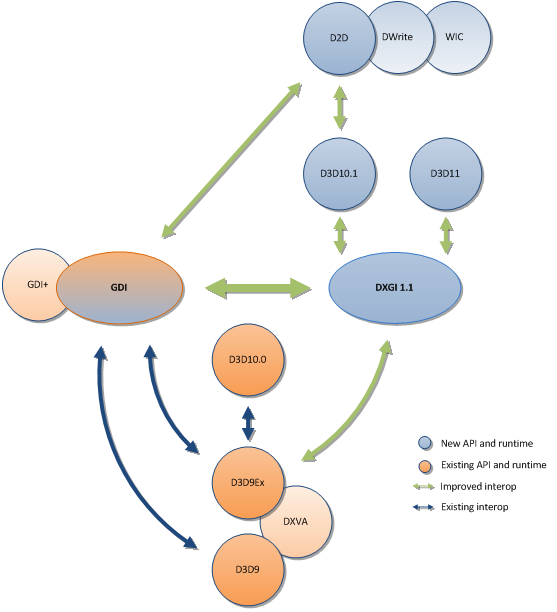

# WPF 使用 Silk.NET 进行 DirectX 渲染入门

本文告诉大家如何使用 dotnet 基金会新开源的 Silk.NET 库调用 DirectX 进行渲染的方法。此库是对 DirectX 的底层基础封装，用上了 dotnet 和 C# 的各个新特性，相对来说基础性能较好，也许后续可以考虑作为 SharpDx 的代替

<!--more-->


<!-- CreateTime:2021/12/23 20:01:12 -->

<!-- 标签：WPF,DirectX,渲染 -->
<!-- 发布 -->

本文将告诉大家如何使用 Silk.NET 创建 DirectX 的各个对象，进行初始化逻辑，再对接 Direct2D 进行界面绘制。当前是 2021.12.23 此时 Silk.NET 还没有完成 Direct2D 的封装，为了方便演示，本文使用了 SharpDx 的 D2D 代替

本文非新手友好，如果是刚接触 DirectX 那我推荐先阅读 [WPF 使用 SharpDx 渲染博客导航](https://blog.lindexi.com/post/WPF-%E4%BD%BF%E7%94%A8-SharpDx-%E6%B8%B2%E6%9F%93%E5%8D%9A%E5%AE%A2%E5%AF%BC%E8%88%AA.html )

当前 SharpDx 已不维护，我正在找代替的项目，详细请看 [SharpDx 的代替项目](https://blog.lindexi.com/post/SharpDx-%E7%9A%84%E4%BB%A3%E6%9B%BF%E9%A1%B9%E7%9B%AE.html )

刚好找到了 dotnet 基金会下的 Silk.NET 库，此库是新写的，用上了很多 dotnet 和 C# 的新特性，例如通过 COM 调用 DirectX 的实现逻辑是通过了 `delegate* unmanaged` 新特性，这是 C# 9 的新特性，请看 [Function pointers - C# 9.0 draft specifications Microsoft Docs](https://docs.microsoft.com/en-us/dotnet/csharp/language-reference/proposals/csharp-9.0/function-pointers?WT.mc_id=WD-MVP-5003260 )

代码的写法如下

```csharp
        public ID3D11Device
        (
            void** lpVtbl = null
        ) : this()
        {
            if (lpVtbl is not null)
            {
                LpVtbl = lpVtbl;
            }
        }

        public void** LpVtbl;

        public readonly unsafe int QueryInterface(Guid* riid, void** ppvObject)
        {
            var @this = (ID3D11Device*) Unsafe.AsPointer(ref Unsafe.AsRef(in this));
            int ret = default;
            ret = ((delegate* unmanaged[Cdecl]<ID3D11Device*, Guid*, void**, int>)LpVtbl[0])(@this, riid, ppvObject);
            return ret;
        }
```

通过以上的代码，特别是 `((delegate* unmanaged[Cdecl]<ID3D12Device*, Guid*, void**, int>)LpVtbl[0])(@this, riid, ppvObject);` 这句如此复杂的代码，即可减少 COM 默认 dotnet 封装的 RCW 封装层的封送损耗。当然了，这部分不是本文的重点，细节请看 [Runtime Callable Wrapper Microsoft Docs](https://docs.microsoft.com/en-us/dotnet/standard/native-interop/runtime-callable-wrapper?WT.mc_id=WD-MVP-5003260 )

大家只需要知道，此库的实现里面，可以很大减少调用 COM 时的额外损耗。但这也带来了一点坑，例如调用方也只能采用不安全代码调用，写法也有点诡异

根据 [Surface sharing between Windows graphics APIs - Win32 apps](https://docs.microsoft.com/en-us/windows/win32/direct3darticles/surface-sharing-between-windows-graphics-apis?WT.mc_id=WD-MVP-5003260 ) 文档，为了在 WPF 的 D3DImage 上进行 D2D 绘制，就需要通过 D3D11 进行转接，好在此转接也只是指针的传输而已，基本没有啥性能损耗。为了在 WPF 上使用到 D2D 就需要执行如下步骤：

- 创建 D3D11 设备
- 通过 DXGI 关联 D2D 设备
- 创建 D3D9 设备

如官方文档的转换图

<!--  -->


使用 DirectX 时，初始化参数的代码将会特别多。由于 Silk.NET 只是对 DirectX 的底层封装，没有细节隐藏，也就是说使用过程的复杂度也会特别多

在开始之前，先准备一个空 WPF 项目，基于 dotnet 6 框架。安装好如下库，可编辑 csproj 文件，修改为如下代码

```xml
<Project Sdk="Microsoft.NET.Sdk">

  <PropertyGroup>
    <OutputType>WinExe</OutputType>
    <TargetFramework>net6.0-windows</TargetFramework>
    <Nullable>enable</Nullable>
    <UseWPF>true</UseWPF>
    <AllowUnsafeBlocks>True</AllowUnsafeBlocks>
  </PropertyGroup>

  <ItemGroup>
    <PackageReference Include="SharpDX.Direct2D1" Version="4.2.0" />
    <PackageReference Include="Silk.NET.Direct3D11" Version="2.11.0" />
    <PackageReference Include="Silk.NET.Direct3D9" Version="2.11.0" />
    <PackageReference Include="Silk.NET.DXGI" Version="2.11.0" />
  </ItemGroup>

</Project>
```

以上代码关键在于 AllowUnsafeBlocks 需要开启，用于开启不安全代码给 Silk.NET 调用代码所使用。当前 Silk.NET 还没有完成 D2D 封装，本文将使用 SharpDX.Direct2D1 库辅助编写 D2D 的代码

在 XAML 界面添加 D3DImage 如下面代码

```xml
<Window x:Class="RawluharkewalQeaninanel.MainWindow"
        xmlns="http://schemas.microsoft.com/winfx/2006/xaml/presentation"
        xmlns:x="http://schemas.microsoft.com/winfx/2006/xaml"
        xmlns:d="http://schemas.microsoft.com/expression/blend/2008"
        xmlns:mc="http://schemas.openxmlformats.org/markup-compatibility/2006"
        xmlns:local="clr-namespace:RawluharkewalQeaninanel"
        xmlns:interop="clr-namespace:System.Windows.Interop;assembly=PresentationCore"
        mc:Ignorable="d"
        Title="MainWindow" Height="450" Width="800">
    <Grid>
        <Image>
            <Image.Source>
                <interop:D3DImage x:Name="D3DImage"></interop:D3DImage>
            </Image.Source>
        </Image>
    </Grid>
</Window>
```

为了等待窗口等初始化完成，将在 Loaded 时进行实际的初始化代码

```csharp
        public MainWindow()
        {
            InitializeComponent();

            Loaded += MainWindow_Loaded;
        }
```

在 MainWindow_Loaded 上添加本文的关键逻辑

按照顺序，先创建 D3D11 设备和初始化。开始前，考虑到命名空间十分复杂，为了方便理解，先定义引用，如以下代码

```csharp
using Silk.NET.Core.Native;

using D3D11 = Silk.NET.Direct3D11;
using D3D9 = Silk.NET.Direct3D9;
using DXGI = Silk.NET.DXGI;
using D2D = SharpDX.Direct2D1;
using SharpDXDXGI = SharpDX.DXGI;
using SharpDXMathematics = SharpDX.Mathematics.Interop;
```

虽然加上此命名空间引用会让代码写的时候，稍微复杂一点，但好在清晰

定义完成之后，开始创建 D3D11 设备。 创建过程中，需要先设置参数，代码如下

```csharp
        private void MainWindow_Loaded(object sender, RoutedEventArgs e)
        {
            // 根据 [Surface sharing between Windows graphics APIs - Win32 apps](https://docs.microsoft.com/en-us/windows/win32/direct3darticles/surface-sharing-between-windows-graphics-apis?WT.mc_id=WD-MVP-5003260 ) 文档

            var width = ImageWidth;
            var height = ImageHeight;

            // 2021.12.23 不能在 x86 下运行，会炸掉。参阅 https://github.com/dotnet/Silk.NET/issues/731

            var texture2DDesc = new D3D11.Texture2DDesc()
            {
                BindFlags = (uint) (D3D11.BindFlag.BindRenderTarget | D3D11.BindFlag.BindShaderResource),
                Format = DXGI.Format.FormatB8G8R8A8Unorm, // 最好使用此格式，否则还需要后续转换
                Width = (uint) width,
                Height = (uint) height,
                MipLevels = 1,
                SampleDesc = new DXGI.SampleDesc(1, 0),
                Usage = D3D11.Usage.UsageDefault,
                MiscFlags = (uint) D3D11.ResourceMiscFlag.ResourceMiscShared,
                // The D3D11_RESOURCE_MISC_FLAG cannot be used when creating resources with D3D11_CPU_ACCESS flags.
                CPUAccessFlags = 0, //(uint) D3D11.CpuAccessFlag.None,
                ArraySize = 1
            };

            // 忽略代码
        }
        private int ImageWidth => (int) ActualWidth;
        private int ImageHeight => (int) ActualHeight;
```

需要特别说明以上代码的一个注释，当前 Silk.NET 对 X86 的支持较弱，调试模式下运行将会炸掉应用，非调试模式下没啥问题。其原因是 Silk.NET 对于 COM 封装在定义上是不对的，我给官方报告了此问题，请看 [https://github.com/dotnet/Silk.NET/issues/731](https://github.com/dotnet/Silk.NET/issues/731)

问题的原因是在 Silk.NET 里面，定义对 DirectX 的调用，使用的是 Cdecl 方式调用，然而在 DirectX 的定义里，需要采用 Stdcall 来调用才是正确的。此行为将在 X86 下导致调用栈的内容不对，本应该清理的内容没有正确清理。这部分细节请参阅 [stdcall Microsoft Docs](https://docs.microsoft.com/en-us/cpp/cpp/stdcall?view=msvc-170&WT.mc_id=WD-MVP-5003260 ) 和 [cdecl Microsoft Docs](https://docs.microsoft.com/en-us/cpp/cpp/cdecl?view=msvc-170&WT.mc_id=WD-MVP-5003260 ) 官方文档

创建参数里，为了方便在 WPF 里使用，要求最好使用 `FormatB8G8R8A8Unorm` 格式。以上参数差不多是固定写法，各个参数的细节请看 DirectX 官方文档

接下来通过 D3D11 类型的 GetApi 方法获取 D3D11 对象，此对象的获取是 Silk.NET 的封装，不属于 DirectX 的内容

```csharp
            D3D11.D3D11 d3D11 = D3D11.D3D11.GetApi();
```

因为 Silk.NET 的封装特别底层，需要开启不安全代码才能创建对象，为了方便编写代码，将在 class 上加上 unsafe 让此类的所有代码在使用不安全代码，不需要再加上 unsafe 即可使用

```csharp
    public unsafe partial class MainWindow : Window
    {
    }
```

创建 D3D11 设备的代码如下

```csharp
            D3D11.ID3D11Device* pD3D11Device;
            D3D11.ID3D11DeviceContext* pD3D11DeviceContext;
            D3DFeatureLevel pD3DFeatureLevel = default;

            var hr = d3D11.CreateDevice((DXGI.IDXGIAdapter*) IntPtr.Zero, D3DDriverType.D3DDriverTypeHardware,
                Software: 0,
                Flags: (uint) D3D11.CreateDeviceFlag.CreateDeviceBgraSupport,
                (D3DFeatureLevel*) IntPtr.Zero,
                FeatureLevels: 0, // D3DFeatureLevel 的长度
                SDKVersion: 7,
                (D3D11.ID3D11Device**) &pD3D11Device, // 参阅 [C# 从零开始写 SharpDx 应用 聊聊功能等级](https://blog.lindexi.com/post/C-%E4%BB%8E%E9%9B%B6%E5%BC%80%E5%A7%8B%E5%86%99-SharpDx-%E5%BA%94%E7%94%A8-%E8%81%8A%E8%81%8A%E5%8A%9F%E8%83%BD%E7%AD%89%E7%BA%A7.html )
                ref pD3DFeatureLevel,
                (D3D11.ID3D11DeviceContext**) &pD3D11DeviceContext
            );
            SilkMarshal.ThrowHResult(hr);
```

可以看到代码里面大量用到不安全代码

在创建完成了 D3D11 设备之后，即可开始创建 Texture 对象。咱的步骤是创建出 Texture 用来共享和给 D2D 绘制用，但 D2D 绘制在的是 Texture 的 IDXGISurface 平面上

创建 Texture2D 代码如下

```csharp
            D3D11.ID3D11Texture2D* pD3D11Texture2D;
            hr = pD3D11Device->CreateTexture2D(ref texture2DDesc, (D3D11.SubresourceData*) IntPtr.Zero, &pD3D11Texture2D);
            SilkMarshal.ThrowHResult(hr);
```

此 ID3D11Texture2D 就是作为后续 D2D 绘制的 IDXGISurface 对象

```csharp
            var renderTarget = pD3D11Texture2D;
            DXGI.IDXGISurface* pDXGISurface;
            var dxgiSurfaceGuid = DXGI.IDXGISurface.Guid;
            renderTarget->QueryInterface(ref dxgiSurfaceGuid, (void**) &pDXGISurface);
```

接下来部分就是 SharpDx 的啦，当前 Silk.NET 还没有封装好 D2D 部分，于是这里就和 [WPF 使用 SharpDX](https://blog.lindexi.com/post/WPF-%E4%BD%BF%E7%94%A8-SharpDX.html ) 博客的方法差不多，只是创建 SharpDX 的 Surface 代码稍微修改而已

```csharp
            var surface = new SharpDXDXGI.Surface(new IntPtr((void*) pDXGISurface));
```

其他逻辑如下

```csharp
            var d2DFactory = new D2D.Factory();

            var renderTargetProperties =
                new D2D.RenderTargetProperties(new D2D.PixelFormat(SharpDXDXGI.Format.Unknown, D2D.AlphaMode.Premultiplied));
            _d2DRenderTarget = new D2D.RenderTarget(d2DFactory, surface, renderTargetProperties);

        private D2D.RenderTarget _d2DRenderTarget;
```

拿到了 D2D.RenderTarget 就可以进行 D2D 绘制。但是在开始前，还需要关联到 WPF 的 D3DImage 才能渲染。为了关联 D3DImage 就需要继续创建 D3D9 设备，如下面代码，调用 SetRenderTarget 将 D3D11 创建的 ID3D11Texture2D 作为 D3D9 的共享纹理，从而让 D2D 的内容可以在 D3DImage 上使用

```csharp
            SetRenderTarget(renderTarget);
```

在 SetRenderTarget 的代码是从 ID3D11Texture2D 转到 IDirect3DSurface9 上，将 IDirect3DSurface9 作为 D3DImage 的 BackBuffer 给 WPF 使用

```csharp
        private void SetRenderTarget(D3D11.ID3D11Texture2D* target)
        {
        }
```

从 ID3D11Texture2D 转到 IDirect3DSurface9 上有如下步骤：

- 获取共享指针
- 创建 D3D9 设备
- 通过 D3D9 设备，使用共享指针创建纹理，通过纹理获取平面

获取共享指针是为了让 D3D9 的纹理共享 D3D11 的资源，获取代码如下

```csharp
            DXGI.IDXGIResource* pDXGIResource;
            var dxgiResourceGuid = DXGI.IDXGIResource.Guid;
            target->QueryInterface(ref dxgiResourceGuid, (void**) &pDXGIResource);

            void* sharedHandle;
            var hr = pDXGIResource->GetSharedHandle(&sharedHandle);
            SilkMarshal.ThrowHResult(hr);
```

创建 D3D9 之前，需要使用 Silk.NET 的 D3D9 类的 GetApi 对象获取 D3D9 对象。这是 Silk.NET 的设计，可以看到此库很多类型都有 GetApi 方法

```csharp
            var d3d9 = D3D9.D3D9.GetApi();
```

创建 D3D9 设备之前，需要先创建 IDirect3D9Ex 对象

```csharp
            D3D9.IDirect3D9Ex* pDirect3D9Ex;
            hr = d3d9.Direct3DCreate9Ex(SDKVersion: 32, &pDirect3D9Ex);
            SilkMarshal.ThrowHResult(hr);
            var d3DContext = pDirect3D9Ex;
```

创建 D3D9 设备之前，也需要初始化参数，有一些参数需要和 D3D11 创建的参数相同，需要先获取 D3D11 的参数

```csharp
            D3D11.Texture2DDesc texture2DDescription = default;
            target->GetDesc(ref texture2DDescription);
```

初始化创建 D3D9 的创建参数

```csharp
            var presentParameters = new D3D9.PresentParameters()
            {
                Windowed = 1,// true
                SwapEffect = D3D9.Swapeffect.SwapeffectDiscard,
                HDeviceWindow = GetDesktopWindow(),
                PresentationInterval = D3D9.D3D9.PresentIntervalDefault,
            };

            // 设置使用多线程方式，这样的性能才足够
            uint createFlags = D3D9.D3D9.CreateHardwareVertexprocessing | D3D9.D3D9.CreateMultithreaded | D3D9.D3D9.CreateFpuPreserve;

        [DllImport("user32.dll", SetLastError = false)]
        public static extern IntPtr GetDesktopWindow();
```

拿到创建参数，创建 D3D9 设备

```csharp
            D3D9.IDirect3DDevice9Ex* pDirect3DDevice9Ex;
            hr = d3DContext->CreateDeviceEx(Adapter: 0, 
                DeviceType: D3D9.Devtype.DevtypeHal,// 使用硬件渲染
                hFocusWindow: IntPtr.Zero, 
                createFlags,
                ref presentParameters, 
                pFullscreenDisplayMode: (D3D9.Displaymodeex*) IntPtr.Zero, 
                &pDirect3DDevice9Ex);
            SilkMarshal.ThrowHResult(hr);

            var d3DDevice = pDirect3DDevice9Ex;
```

拿到 D3D9 设备，开始创建纹理

```csharp
            D3D9.IDirect3DTexture9* pDirect3DTexture9;
            hr = d3DDevice->CreateTexture(texture2DDescription.Width, texture2DDescription.Height, Levels: 1,
                D3D9.D3D9.UsageRendertarget, 
                D3D9.Format.FmtA8R8G8B8, // 这是必须要求的颜色，不能使用其他颜色
                D3D9.Pool.PoolDefault, 
                &pDirect3DTexture9,
                &sharedHandle);
            SilkMarshal.ThrowHResult(hr);
            _renderTarget = pDirect3DTexture9;

        private D3D9.IDirect3DTexture9* _renderTarget;
```

纹理有要求颜色格式，也要求尺寸和 D3D11 的相同

通过纹理可以拿到 IDirect3DSurface9 对象

```csharp
            D3D9.IDirect3DSurface9* pDirect3DSurface9;
            _renderTarget->GetSurfaceLevel(0, &pDirect3DSurface9);
            _pDirect3DSurface9 = pDirect3DSurface9;
```

将 IDirect3DSurface9 作为 D3DImage 的 BackBuffer 即可完成初始化

```csharp
            D3DImage.Lock();
            D3DImage.SetBackBuffer(D3DResourceType.IDirect3DSurface9, new IntPtr(pDirect3DSurface9));
            D3DImage.Unlock();
```

在 MainWindow_Loaded 设置将一个视图数组绑定到管道的光栅化阶段

```csharp
            var viewport = new D3D11.Viewport(0, 0, width, height, 0, 1);
            pD3D11DeviceContext->RSSetViewports(NumViewports: 1, ref viewport);
```

开始测试 D2D 的渲染，通过测试 D2D 即可了解是否创建初始化成功。在 WPF 的 CompositionTarget 的 Rendering 进行 D2D 绘制

```csharp
            CompositionTarget.Rendering += CompositionTarget_Rendering;

        private void CompositionTarget_Rendering(object? sender, EventArgs e)
        {
            _d2DRenderTarget.BeginDraw();

            OnRender(_d2DRenderTarget);

            _d2DRenderTarget.EndDraw();

            D3DImage.Lock();

            D3DImage.AddDirtyRect(new Int32Rect(0, 0, D3DImage.PixelWidth, D3DImage.PixelHeight));

            D3DImage.Unlock();
        }
```

在 OnRender 方法加上 D2D 的绘制内容，这就是测试逻辑，请根据自己的需求编写

```csharp
        private void OnRender(D2D.RenderTarget renderTarget)
        {
            var brush = new D2D.SolidColorBrush(_d2DRenderTarget, new SharpDXMathematics.RawColor4(1, 0, 0, 1));

            renderTarget.Clear(null);

            renderTarget.DrawRectangle(new SharpDXMathematics.RawRectangleF(_x, _y, _x + 10, _y + 10), brush);

            _x = _x + _dx;
            _y = _y + _dy;
            if (_x >= ActualWidth - 10 || _x <= 0)
            {
                _dx = -_dx;
            }

            if (_y >= ActualHeight - 10 || _y <= 0)
            {
                _dy = -_dy;
            }
        }

        private float _x;
        private float _y;
        private float _dx = 1;
        private float _dy = 1;
```

按照微软官方的推荐，在 CompositionTarget_Rendering 里，如果进行 DirectX 的逻辑，需要判断是否进入了多次，但本文这里只是测试逻辑，忽略官方给出的逻辑

运行代码即可看到界面上有一个矩形显示

也许后续我会封装一个 Silk.NET 的 DirectX 给 WPF 使用的控件

```csharp
#nullable disable

using System;
using System.Diagnostics;
using System.Runtime.InteropServices;
using System.Windows;
using System.Windows.Interop;
using System.Windows.Media;

using Silk.NET.Core.Native;

using D3D11 = Silk.NET.Direct3D11;
using D3D9 = Silk.NET.Direct3D9;
using DXGI = Silk.NET.DXGI;
using D2D = SharpDX.Direct2D1;
using SharpDXDXGI = SharpDX.DXGI;
using SharpDXMathematics = SharpDX.Mathematics.Interop;

namespace RawluharkewalQeaninanel
{
    /// <summary>
    /// Interaction logic for MainWindow.xaml
    /// </summary>
    public unsafe partial class MainWindow : Window
    {
        public MainWindow()
        {
            InitializeComponent();

            Loaded += MainWindow_Loaded;
        }

        private void MainWindow_Loaded(object sender, RoutedEventArgs e)
        {
            // 根据 [Surface sharing between Windows graphics APIs - Win32 apps](https://docs.microsoft.com/en-us/windows/win32/direct3darticles/surface-sharing-between-windows-graphics-apis?WT.mc_id=WD-MVP-5003260 ) 文档

            var width = ImageWidth;
            var height = ImageHeight;

            // 2021.12.23 不能在 x86 下运行，会炸掉。参阅 https://github.com/dotnet/Silk.NET/issues/731

            var texture2DDesc = new D3D11.Texture2DDesc()
            {
                BindFlags = (uint) (D3D11.BindFlag.BindRenderTarget | D3D11.BindFlag.BindShaderResource),
                Format = DXGI.Format.FormatB8G8R8A8Unorm, // 最好使用此格式，否则还需要后续转换
                Width = (uint) width,
                Height = (uint) height,
                MipLevels = 1,
                SampleDesc = new DXGI.SampleDesc(1, 0),
                Usage = D3D11.Usage.UsageDefault,
                MiscFlags = (uint) D3D11.ResourceMiscFlag.ResourceMiscShared,
                // The D3D11_RESOURCE_MISC_FLAG cannot be used when creating resources with D3D11_CPU_ACCESS flags.
                CPUAccessFlags = 0, //(uint) D3D11.CpuAccessFlag.None,
                ArraySize = 1
            };

            D3D11.ID3D11Device* pD3D11Device;
            D3D11.ID3D11DeviceContext* pD3D11DeviceContext;
            D3DFeatureLevel pD3DFeatureLevel = default;
            D3D11.D3D11 d3D11 = D3D11.D3D11.GetApi();

            var hr = d3D11.CreateDevice((DXGI.IDXGIAdapter*) IntPtr.Zero, D3DDriverType.D3DDriverTypeHardware,
                Software: 0,
                Flags: (uint) D3D11.CreateDeviceFlag.CreateDeviceBgraSupport,
                (D3DFeatureLevel*) IntPtr.Zero,
                FeatureLevels: 0, // D3DFeatureLevel 的长度
                SDKVersion: 7,
                (D3D11.ID3D11Device**) &pD3D11Device, // 参阅 [C# 从零开始写 SharpDx 应用 聊聊功能等级](https://blog.lindexi.com/post/C-%E4%BB%8E%E9%9B%B6%E5%BC%80%E5%A7%8B%E5%86%99-SharpDx-%E5%BA%94%E7%94%A8-%E8%81%8A%E8%81%8A%E5%8A%9F%E8%83%BD%E7%AD%89%E7%BA%A7.html )
                ref pD3DFeatureLevel,
                (D3D11.ID3D11DeviceContext**) &pD3D11DeviceContext
            );
            SilkMarshal.ThrowHResult(hr);

            Debugger.Launch();
            Debugger.Break();

            _pD3D11Device = pD3D11Device;
            _pD3D11DeviceContext = pD3D11DeviceContext;

            D3D11.ID3D11Texture2D* pD3D11Texture2D;
            hr = pD3D11Device->CreateTexture2D(ref texture2DDesc, (D3D11.SubresourceData*) IntPtr.Zero, &pD3D11Texture2D);
            SilkMarshal.ThrowHResult(hr);

            var renderTarget = pD3D11Texture2D;
            _pD3D11Texture2D = pD3D11Texture2D;

            DXGI.IDXGISurface* pDXGISurface;
            var dxgiSurfaceGuid = DXGI.IDXGISurface.Guid;
            renderTarget->QueryInterface(ref dxgiSurfaceGuid, (void**) &pDXGISurface);
            _pDXGISurface = pDXGISurface;

            var d2DFactory = new D2D.Factory();

            var renderTargetProperties =
                new D2D.RenderTargetProperties(new D2D.PixelFormat(SharpDXDXGI.Format.Unknown, D2D.AlphaMode.Premultiplied));
            var surface = new SharpDXDXGI.Surface(new IntPtr((void*) pDXGISurface));
            _d2DRenderTarget = new D2D.RenderTarget(d2DFactory, surface, renderTargetProperties);

            SetRenderTarget(renderTarget);

            var viewport = new D3D11.Viewport(0, 0, width, height, 0, 1);
            pD3D11DeviceContext->RSSetViewports(NumViewports: 1, ref viewport);

            CompositionTarget.Rendering += CompositionTarget_Rendering;
        }

        private void CompositionTarget_Rendering(object? sender, EventArgs e)
        {
            _d2DRenderTarget.BeginDraw();

            OnRender(_d2DRenderTarget);

            _d2DRenderTarget.EndDraw();

            D3DImage.Lock();

            D3DImage.AddDirtyRect(new Int32Rect(0, 0, D3DImage.PixelWidth, D3DImage.PixelHeight));

            D3DImage.Unlock();
        }

        private void OnRender(D2D.RenderTarget renderTarget)
        {
            var brush = new D2D.SolidColorBrush(_d2DRenderTarget, new SharpDXMathematics.RawColor4(1, 0, 0, 1));

            renderTarget.Clear(null);

            renderTarget.DrawRectangle(new SharpDXMathematics.RawRectangleF(_x, _y, _x + 10, _y + 10), brush);

            _x = _x + _dx;
            _y = _y + _dy;
            if (_x >= ActualWidth - 10 || _x <= 0)
            {
                _dx = -_dx;
            }

            if (_y >= ActualHeight - 10 || _y <= 0)
            {
                _dy = -_dy;
            }
        }

        private float _x;
        private float _y;
        private float _dx = 1;
        private float _dy = 1;

        private void SetRenderTarget(D3D11.ID3D11Texture2D* target)
        {
            DXGI.IDXGIResource* pDXGIResource;
            var dxgiResourceGuid = DXGI.IDXGIResource.Guid;
            target->QueryInterface(ref dxgiResourceGuid, (void**) &pDXGIResource);

            D3D11.Texture2DDesc texture2DDescription = default;
            target->GetDesc(ref texture2DDescription);

            void* sharedHandle;
            var hr = pDXGIResource->GetSharedHandle(&sharedHandle);
            SilkMarshal.ThrowHResult(hr);

            var d3d9 = D3D9.D3D9.GetApi();
            D3D9.IDirect3D9Ex* pDirect3D9Ex;
            hr = d3d9.Direct3DCreate9Ex(SDKVersion: 32, &pDirect3D9Ex);
            SilkMarshal.ThrowHResult(hr);
            var d3DContext = pDirect3D9Ex;
            _pDirect3D9Ex = pDirect3D9Ex;

            var presentParameters = new D3D9.PresentParameters()
            {
                Windowed = 1,// true
                SwapEffect = D3D9.Swapeffect.SwapeffectDiscard,
                HDeviceWindow = GetDesktopWindow(),
                PresentationInterval = D3D9.D3D9.PresentIntervalDefault,
            };

            // 设置使用多线程方式，这样的性能才足够
            uint createFlags = D3D9.D3D9.CreateHardwareVertexprocessing | D3D9.D3D9.CreateMultithreaded | D3D9.D3D9.CreateFpuPreserve;

            D3D9.IDirect3DDevice9Ex* pDirect3DDevice9Ex;
            hr = d3DContext->CreateDeviceEx(Adapter: 0, 
                DeviceType: D3D9.Devtype.DevtypeHal,// 使用硬件渲染
                hFocusWindow: IntPtr.Zero, 
                createFlags,
                ref presentParameters, 
                pFullscreenDisplayMode: (D3D9.Displaymodeex*) IntPtr.Zero, 
                &pDirect3DDevice9Ex);
            SilkMarshal.ThrowHResult(hr);

            var d3DDevice = pDirect3DDevice9Ex;

            D3D9.IDirect3DTexture9* pDirect3DTexture9;
            hr = d3DDevice->CreateTexture(texture2DDescription.Width, texture2DDescription.Height, Levels: 1,
                D3D9.D3D9.UsageRendertarget, 
                D3D9.Format.FmtA8R8G8B8, // 这是必须要求的颜色，不能使用其他颜色
                D3D9.Pool.PoolDefault, 
                &pDirect3DTexture9,
                &sharedHandle);
            SilkMarshal.ThrowHResult(hr);
            _renderTarget = pDirect3DTexture9;

            D3D9.IDirect3DSurface9* pDirect3DSurface9;
            _renderTarget->GetSurfaceLevel(0, &pDirect3DSurface9);
            _pDirect3DSurface9 = pDirect3DSurface9;

            D3DImage.Lock();
            D3DImage.SetBackBuffer(D3DResourceType.IDirect3DSurface9, new IntPtr(pDirect3DSurface9));
            D3DImage.Unlock();
        }

        // 这些字段的另一个作用是防止回收
        private D2D.RenderTarget _d2DRenderTarget;

        private D3D11.ID3D11Device* _pD3D11Device;
        private D3D11.ID3D11DeviceContext* _pD3D11DeviceContext;
        private D3D11.ID3D11Texture2D* _pD3D11Texture2D;
        private DXGI.IDXGISurface* _pDXGISurface;

        private D3D9.IDirect3D9Ex* _pDirect3D9Ex;
        private D3D9.IDirect3DTexture9* PDirect3DTexture9 => _renderTarget;
        private D3D9.IDirect3DTexture9* _renderTarget;
        private D3D9.IDirect3DSurface9* _pDirect3DSurface9;

        private int ImageWidth => (int) ActualWidth;
        private int ImageHeight => (int) ActualHeight;

        [DllImport("user32.dll", SetLastError = false)]
        public static extern IntPtr GetDesktopWindow();
    }
}
```

本文所有代码放在[github](https://github.com/lindexi/lindexi_gd/tree/f4c2f884b3fb006676aeef7e249055c5e2d8766d/RawluharkewalQeaninanel) 和 [gitee](https://gitee.com/lindexi/lindexi_gd/tree/f4c2f884b3fb006676aeef7e249055c5e2d8766d/RawluharkewalQeaninanel) 欢迎访问

可以通过如下方式获取本文的源代码，先创建一个空文件夹，接着使用命令行 cd 命令进入此空文件夹，在命令行里面输入以下代码，即可获取到本文的代码

```
git init
git remote add origin https://gitee.com/lindexi/lindexi_gd.git
git pull origin f4c2f884b3fb006676aeef7e249055c5e2d8766d
```

以上使用的是 gitee 的源，如果 gitee 不能访问，请替换为 github 的源

```
git remote remove origin
git remote add origin https://github.com/lindexi/lindexi_gd.git
```

获取代码之后，进入 RawluharkewalQeaninanel 文件夹


<a rel="license" href="http://creativecommons.org/licenses/by-nc-sa/4.0/"></a><br />本作品采用<a rel="license" href="http://creativecommons.org/licenses/by-nc-sa/4.0/">知识共享署名-非商业性使用-相同方式共享 4.0 国际许可协议</a>进行许可。欢迎转载、使用、重新发布，但务必保留文章署名[林德熙](http://blog.csdn.net/lindexi_gd)(包含链接:http://blog.csdn.net/lindexi_gd )，不得用于商业目的，基于本文修改后的作品务必以相同的许可发布。如有任何疑问，请与我[联系](mailto:lindexi_gd@163.com)。