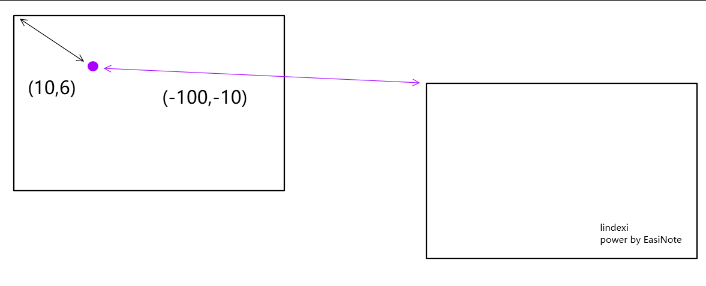

# WPF 使用 TranslatePoint 换算元素之间相对坐标

在 WPF 中的布局模型里面，可以将每个元素都认为是矩形。而每个矩形都可以将自己的左上角作为原点建立坐标，不同的矩形之间的坐标原点不相同，当这些用矩形表达的元素进行系列的旋转和平移等之后，如何将以某个元素的矩形左上角为原点的坐标换算为另一个元素的矩形左上角为原点的坐标

<!--more-->


<!-- CreateTime:2020/3/18 8:30:31 -->


只要在相同的视觉树上面，所有的元素的矩形范围都能通过矩阵计算换算出来，在 WPF 和 UWP 里面都在每个元素提供了 TranslatePoint 方法，这个方法的作用就是用当前元素的左上角为原点的坐标换算为这个点在传入的元素的坐标，或者说将传入的点相对于视觉树最顶层的坐标不变的前提下，计算出如果放在传入元素里面应该的坐标是多少

如我有一个 Canvas 和 Canvas 里面有一个矩形，我对矩形做了一些复杂的变换，包括设置他的 Margin 和 Canvas.Left 的值，我想要了解这个矩形相对于Canvas的坐标在哪？其实这个问题可以转换为求在矩形坐标中，点(0,0)在 Canvas 上的值是多少

因为求一个元素相对于另一个的元素的坐标，也就是求元素左上角所在另一个元素的坐标，而一个元素的左上角就是通过以元素的左上角为原点的坐标也就是点 (0,0) 在屏幕坐标不变前提下，以另一个元素的左上角为原点的坐标点在哪

```xml
        <Canvas x:Name="Canvas">
            <Rectangle x:Name="Rectangle" Margin="10,10,10,10" Width="100" Height="100"
                       Canvas.Left="-5" Fill="Black"></Rectangle>
        </Canvas>
```

可以通过在 Rectangle 的 TranslatePoint 方法里面传入点 (0,0) 和需要换算的对应的另一个元素 Canvas 对象，就能返回传入的点在画布中的坐标

```csharp
        private void MainWindow_Loaded(object sender, RoutedEventArgs e)
        {
            var point = Rectangle.TranslatePoint(new Point(), Canvas);
            Debug.WriteLine(point);
        }
```

在元素的TranslatePoint方法里面，第一个参数传入的点是相对于当前元素的左上角为原点的坐标，而第二个值就是将要转换坐标的元素。计算方法就是将传入的点换算为传入的转换坐标的元素的左上角原点的坐标

计算原理是什么？其实小伙伴可以尝试画两个矩形，在其中一个矩形里面点一个点，然后求这个点在使用另一个矩形的左上角作为原点时的坐标，这是一道特别简单的初中数学

<!--  -->


本文代码放在[github](https://github.com/lindexi/lindexi_gd/tree/502e65befeee340520968976b023cf9b8b4b70a9/JeelifuwheChaykicinelniyearje)欢迎小伙伴访问

更多请看 [WPF使用TransformToAncestor获取元素的相对坐标_网络_sinat_31608641的博客-CSDN博客](https://blog.csdn.net/sinat_31608641/article/details/89631824 )


<a rel="license" href="http://creativecommons.org/licenses/by-nc-sa/4.0/"></a><br />本作品采用<a rel="license" href="http://creativecommons.org/licenses/by-nc-sa/4.0/">知识共享署名-非商业性使用-相同方式共享 4.0 国际许可协议</a>进行许可。欢迎转载、使用、重新发布，但务必保留文章署名[林德熙](http://blog.csdn.net/lindexi_gd)(包含链接:http://blog.csdn.net/lindexi_gd )，不得用于商业目的，基于本文修改后的作品务必以相同的许可发布。如有任何疑问，请与我[联系](mailto:lindexi_gd@163.com)。