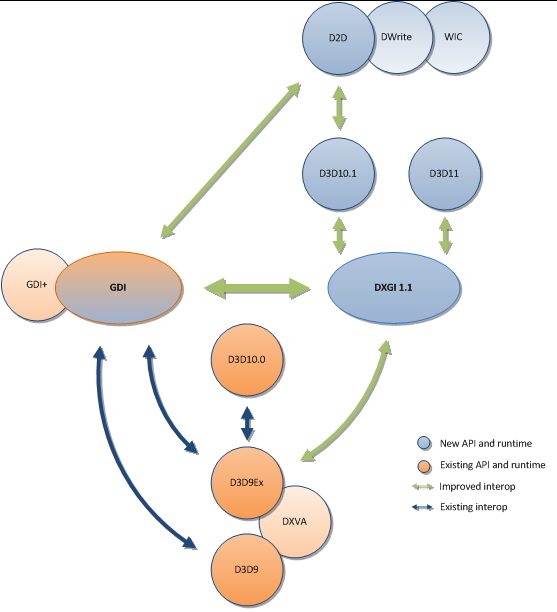

# WPF 使用 Vortice 在 D3DImage 显示 D2D 内容

本文属于 DirectX 的基础入门使用博客。本文将告诉大家，如何在 WPF 里面，使用 Vortice 库在 D3DImage 上显示通过 D2D 绘制的内容

<!--more-->


<!-- CreateTime:2026/01/28 07:23:56 -->

<!-- 发布 -->
<!-- 博客 -->
<!-- 标签：C#,D2D,DirectX,Vortice,Direct2D,渲染 -->

本文绝大部分代码来源于 [Raspberry Monster](https://github.com/Raspberry-Monster) 伙伴提供。我只是代为记录的工具人

本文是[渲染相关系列博客](https://blog.lindexi.com/post/WPF-%E4%BD%BF%E7%94%A8-SharpDx-%E6%B8%B2%E6%9F%93%E5%8D%9A%E5%AE%A2%E5%AF%BC%E8%88%AA.html )中的一篇，该系列博客已按照逻辑顺序编排，方便大家依次阅读。本文属于系列博客中，比较靠前的博客，可以独立阅读，无上下篇依赖。如您对渲染相关感兴趣，可以通过以下链接访问整个系列：[渲染相关系列博客导航](https://blog.lindexi.com/post/WPF-%E4%BD%BF%E7%94%A8-SharpDx-%E6%B8%B2%E6%9F%93%E5%8D%9A%E5%AE%A2%E5%AF%BC%E8%88%AA.html )

在开始聊 Vortice 之前，必须要先聊聊 SharpDx 库。 众所周知，现在 SharpDx 已不维护，尽管 SharpDx 的不维护对咱开发影响很小，除非需要用到这几年新加的功能，否则使用不维护的 SharpDx 的问题也不大。而 Vortice 是作为 SharpDx 的一个代替的存在，是从 SharpDx 的基础上，继续开发的一个项目。使用 Vortice 底层库，能让 C# 代码比较方便的和 DirectX 对接

在本文这里，将尝试利用 Vortice 库使得 D2D 绘制的内容能够在 D3DImage 上显示。本文将需要用到 WPF 的内建机制。如果大家希望看到最裸的无 UI 框架依赖的实现，还请参阅 [DirectX 使用 Vortice 从零开始控制台创建 Direct2D1 窗口](https://blog.lindexi.com/post/DirectX-%E4%BD%BF%E7%94%A8-Vortice-%E4%BB%8E%E9%9B%B6%E5%BC%80%E5%A7%8B%E6%8E%A7%E5%88%B6%E5%8F%B0%E5%88%9B%E5%BB%BA-Direct2D1-%E7%AA%97%E5%8F%A3%E4%BF%AE%E6%94%B9%E9%A2%9C%E8%89%B2.html )

## 准备步骤

新建一个空 WPF 项目，按照 .NET 的惯例，通过 NuGet 安装好 Vortice 的库，安装完成之后的 csproj 项目文件代码大概如下

```xml
<Project Sdk="Microsoft.NET.Sdk">

  <PropertyGroup>
    <OutputType>WinExe</OutputType>
    <TargetFramework>net9.0-windows</TargetFramework>
    <Nullable>enable</Nullable>
    <ImplicitUsings>enable</ImplicitUsings>
    <UseWPF>true</UseWPF>
	<AllowUnsafeBlocks>True</AllowUnsafeBlocks>
  </PropertyGroup>

  <ItemGroup>
    <PackageReference Include="Vortice.Direct2D1" Version="3.6.2" />
    <PackageReference Include="Vortice.Direct3D11" Version="3.6.2" />
    <PackageReference Include="Vortice.Direct3D9" Version="3.6.2" />
    <PackageReference Include="Vortice.Wpf" Version="3.6.2" />
  </ItemGroup>

</Project>
```

## 添加界面代码

修改 MainWindow.xaml 添加一点界面代码

```xml
    <Grid>
        <Border Margin="10,10,10,10" BorderBrush="Black" BorderThickness="1">
            <Image x:Name="Image" Width="600" Height="500" Stretch="Fill">
                <Image.Source>
                    <interop:D3DImage x:Name="D3DImage" />
                </Image.Source>
            </Image>
        </Border>
    </Grid>
```

进入到 MainWindow.xaml.cs 文件，开始编写本文的核心代码

代码需要放在 WPF 窗口获取句柄之后，简单方便来说在 Loaded 之后就可以了

```csharp
        public MainWindow()
        {
            InitializeComponent();
            Loaded += MainWindow_Loaded;
        }

        private void MainWindow_Loaded(object sender, RoutedEventArgs e)
        {
            ...
        }
```

## 创建 D3D 设备

直接使用 `D3D11.D3D11CreateDevice` 方法即可创建 ID3D11Device 设备

```csharp
            ID3D11Device device =
                D3D11.D3D11CreateDevice(Vortice.Direct3D.DriverType.Hardware, DeviceCreationFlags.BgraSupport);
```

对比 SharDx 的是直接 new 创建出来的，在 Vortice 里是采用静态工厂创建的，其思想没有本质差别

创建出来的设备可用来创建纹理，创建出来的纹理最终将会转换，作为 D3DImage 的 SetBackBuffer 所需的参数设置进去

创建纹理需要一些参数，如宽度高度信息。本文这里直接采用界面的 Image 控件的宽度高度作为纹理的宽度高度。无需缩放的纹理可以获得更高的渲染性能

```csharp
            var desc = new Texture2DDescription()
            {
                BindFlags = BindFlags.RenderTarget | BindFlags.ShaderResource,
                Format = DXGIFormat.B8G8R8A8_UNorm,
                Width = width,
                Height = height,
                MipLevels = 1,
                SampleDescription = new SampleDescription(1, 0),
                Usage = ResourceUsage.Default,
                MiscFlags = ResourceOptionFlags.Shared,
                CPUAccessFlags = CpuAccessFlags.None,
                ArraySize = 1
            };
            ID3D11Texture2D renderTarget = device.CreateTexture2D(desc);
```

以上参数关键点除了尺寸信息之外，还在于颜色格式选用 B8G8R8A8_UNorm 格式。这是最通用的格式，可以很方便很设置给到 D3DImage 里

## 对接 D2D 渲染

创建出来的纹理可先和 D2D 进行对接，也可先和 D3DImage 对接，这个顺序可随意排列。本文这里先和 D2D 进行对接

和 D2D 对接时，需要先将 ID3D11Texture2D 当成 IDXGISurface 才能让 D2D 将画面绘制在纹理上，代码如下

```csharp
            var surface = renderTarget.QueryInterface<IDXGISurface>();
```

在使用 D2D 之前，按照 DirectX 惯例，先创建工厂，代码如下

```csharp
            var d2dFactory = D2D1.D2D1CreateFactory<ID2D1Factory>();
```

自然，在 SharpDx 里面，是直接用 new 创建出来，代码如下

```csharp
// 以下是 SharpDx 的代码：
            var d2DFactory = new D2D.Factory();
```

配置创建渲染的信息，代码如下

```csharp
            var renderTargetProperties =
                new RenderTargetProperties(new Vortice.DCommon.PixelFormat(DXGIFormat.B8G8R8A8_UNorm,
                    Vortice.DCommon.AlphaMode.Premultiplied));
```

以上代码关键在于 B8G8R8A8_UNorm 像素格式。此外的 `AlphaMode.Premultiplied` 为像素预乘，简单来说就是最终输出的值里的 RGB 分量都乘以透明度。更多细节请参阅 [支持的像素格式和 Alpha 模式 - Win32 apps - Microsoft Learn](https://learn.microsoft.com/zh-cn/windows/win32/direct2d/supported-pixel-formats-and-alpha-modes#about-premultiplied-and-straight-alpha-modes )

完成配置之后，即可创建 ID2D1RenderTarget 对象，代码如下

```csharp
        private ID2D1RenderTarget? _d2DRenderTarget;

_d2DRenderTarget = d2dFactory.CreateDxgiSurfaceRenderTarget(surface, renderTargetProperties);
```

## 对接 D3DImage 设置指针

创建 SetRenderTarget 方法，将传入的 ID3D11Texture2D 参数和 D3DImage 绑定，方法签名如下

```csharp
        private void SetRenderTarget(ID3D11Texture2D target)
        {
            ...
        }
```

先将像素格式进行映射，这个过程中只是枚举类型定义不相同而已，过程中不会发生任何的像素变换，也就没有实际的性能损耗

```csharp
        private static Vortice.Direct3D9.Format TranslateFormat(ID3D11Texture2D texture)
        {
            switch (texture.Description.Format)
            {
                case DXGIFormat.R10G10B10A2_UNorm:
                    return Vortice.Direct3D9.Format.A2B10G10R10;
                case DXGIFormat.R16G16B16A16_Float:
                    return Vortice.Direct3D9.Format.A16B16G16R16F;
                case DXGIFormat.B8G8R8A8_UNorm:
                    return Vortice.Direct3D9.Format.A8R8G8B8;
                default:
                    return Vortice.Direct3D9.Format.Unknown;
            }
        }
```

也许有伙伴感到困惑，为什么在 DXGI 里面是按照 B8G8R8A8 排列的，而在 D3D9 是按照 A8R8G8B8 排列的，这两个是否是逆序关系？其实不是的，这两个颜色格式从内存的角度来说是完全相同的。仅仅只是因为•  DXGI 名称按 **内存字节顺序（小端）** 描述 B, G, R, A 每个 8 位。而 D3D9 名称按 **通道意义（从高位到低位）** 描述 A, R, G, B 通道

在 C# 里面默认也采用小端顺序，这时候就和 DXGI 描述的更贴合，从内存的角度上讲，一个 32bit 的像素颜色分量如下

```csharp
byte0 = B
byte1 = G
byte2 = R
byte3 = A
```

按照 DirectX 的建议，推荐使用 BGRA 格式而不是 RGBA 格式，在底层实现里面，会让 BGRA 格式目标的性能优于 RGBA 格式。详细请看 [支持的像素格式和 Alpha 模式 - Win32 apps - Microsoft Learn](https://learn.microsoft.com/zh-cn/windows/win32/direct2d/supported-pixel-formats-and-alpha-modes#supported-formats-for-id2d1hwndrendertarget )

转换颜色格式枚举后，再获取纹理的共享句柄，代码如下

```csharp
        private IntPtr GetSharedHandle(ID3D11Texture2D texture)
        {
            using (var resource = texture.QueryInterface<IDXGIResource>())
            {
                return resource.SharedHandle;
            }
        }
```

为了创建 D3D9 设备，还需要更多准备工作，如准备好参数，代码如下

```csharp
        private static Vortice.Direct3D9.PresentParameters GetPresentParameters()
        {
            var presentParams = new Vortice.Direct3D9.PresentParameters();

            presentParams.Windowed = true;
            presentParams.SwapEffect = Vortice.Direct3D9.SwapEffect.Discard;
            presentParams.DeviceWindowHandle = NativeMethods.GetDesktopWindow();
            presentParams.PresentationInterval = PresentInterval.Default;
            return presentParams;
        }

public static class NativeMethods
{
    [DllImport("user32.dll", SetLastError = false)]
    public static extern IntPtr GetDesktopWindow();
}
```

完成准备工作，开始创建 D3D9 设备，代码如下

```csharp
            var format = TranslateFormat(target);
            var handle = GetSharedHandle(target);

            var presentParams = GetPresentParameters();
            var createFlags = CreateFlags.HardwareVertexProcessing | CreateFlags.Multithreaded |
                              CreateFlags.FpuPreserve;
            var d3DContext = D3D9.Direct3DCreate9Ex();
            // 以下代码强行获取第 0 个适配器，可能会在多显卡等情况下导致问题。如设置 CPU 的 CpuAccessFlags 为 Read 等无权限问题
            using IDirect3DDevice9Ex d3DDevice =
                d3DContext.CreateDeviceEx(adapter: 0, DeviceType.Hardware, focusWindow: IntPtr.Zero, createFlags, presentParams);
            _d3D9Device = d3DDevice;
```

让 D3D9 设备，从 GetSharedHandle 方法获取到的共享纹理创建 D3D9 的纹理，从而可以让创建出来的 D3D9 的纹理设置到 D3DImage 上

```csharp
        private IDirect3DTexture9? _renderTarget;

        private void SetRenderTarget(ID3D11Texture2D target)
        {
            ...
            _renderTarget = d3DDevice.CreateTexture(target.Description.Width, target.Description.Height, 1,
                Vortice.Direct3D9.Usage.RenderTarget, format, Pool.Default, ref handle);
            ...
        }
```

从 IDirect3DTexture9 取出表面，设置给到 D3DImage 上

```csharp
            using var surface = _renderTarget.GetSurfaceLevel(0);
            D3DImage.Lock();
            D3DImage.SetBackBuffer(D3DResourceType.IDirect3DSurface9, surface.NativePointer,
                enableSoftwareFallback: true);
            D3DImage.Unlock();
```

如此即可完成关联对接工作。简单来说就是让 D3D11 和 D2D 对接，让 D3D11 和 DXGI 对接，再让 DXGI 和 D3D9 对接。渲染部分就拿 ID3D11Texture2D 共享纹理给到 D3D9 的 `d3DDevice.CreateTexture` 转换为 IDirect3DTexture9 纹理。整个过程就是让 D2D 绘制在 ID3D11Texture2D 纹理上，再将 ID3D11Texture2D 纹理当成 IDirect3DTexture9 给 D3DImage 使用，如下图所示

<!--  -->


## 渲染画面

监听 WPF 的 CompositionTarget.Rendering 事件，在此事件里面完成 D2D 的画面渲染

```csharp
            CompositionTarget.Rendering += CompositionTarget_Rendering;

        private void CompositionTarget_Rendering(object? sender, EventArgs e)
        {
            if (_d2DRenderTarget is null)
            {
                return;
            }

            _d2DRenderTarget.BeginDraw();

            OnRender(_d2DRenderTarget);

            _d2DRenderTarget.EndDraw();
            _d3D11Device?.ImmediateContext.Flush();

            D3DImage.Lock();

            D3DImage.AddDirtyRect(new Int32Rect(0, 0, D3DImage.PixelWidth, D3DImage.PixelHeight));
            D3DImage.Unlock();

            Image.InvalidateVisual();
        }
```

在 OnRender 方法里面，仅仅只面向 D2D 进行渲染，逻辑十分简单。可以尝试自己编写好看的渲染画面，本文这里只是做简单的矩形动画，代码如下

```csharp
        private void OnRender(ID2D1RenderTarget renderTarget)
        {
            using var brush = renderTarget.CreateSolidColorBrush(new Color4(Random.Shared.Next() | 0xFF << 24 /*确保 A 是不透明的*/));

            renderTarget.Clear(null);

            const int size = 10;
            renderTarget.DrawRectangle(new Vortice.RawRectF(left: _x, top: _y, right: _x + size, bottom: _y + size), brush);

            _x = _x + _xDirection * Random.Shared.Next(size);
            _y = _y + _yDirection * Random.Shared.Next(size);

            var minX = 0;
            var maxX = D3DImage.Width - size;
            var minY = 0;
            var maxY = D3DImage.Height - size;
            if (_x >= maxX || _x <= minX)
            {
                _xDirection = -_xDirection;
                _x = (float) Math.Clamp(_x, minX, maxX);
            }

            if (_y >= maxY || _y <= minY)
            {
                _yDirection = -_yDirection;

                _y = (float) Math.Clamp(_y, minY, maxY);
            }
        }

        private float _x;

        private float _y;

        private float _xDirection = 1;

        private float _yDirection = 1;
```

如此就完成了在 WPF 里面，通过 Vortice 在 D3DImage 显示 D2D 绘制的内容

本文代码放在 [github](https://github.com/lindexi/lindexi_gd/tree/b3b32cf4560c2dfa2d59ef49c9ed41ba5d288c5d/DirectX/WPF/GoqudeqeljaigealelNilacifelyall) 和 [gitee](https://gitee.com/lindexi/lindexi_gd/tree/b3b32cf4560c2dfa2d59ef49c9ed41ba5d288c5d/DirectX/WPF/GoqudeqeljaigealelNilacifelyall) 上，可以使用如下命令行拉取代码。我整个代码仓库比较庞大，使用以下命令行可以进行部分拉取，拉取速度比较快

先创建一个空文件夹，接着使用命令行 cd 命令进入此空文件夹，在命令行里面输入以下代码，即可获取到本文的代码

```
git init
git remote add origin https://gitee.com/lindexi/lindexi_gd.git
git pull origin b3b32cf4560c2dfa2d59ef49c9ed41ba5d288c5d
```

以上使用的是国内的 gitee 的源，如果 gitee 不能访问，请替换为 github 的源。请在命令行继续输入以下代码，将 gitee 源换成 github 源进行拉取代码。如果依然拉取不到代码，可以发邮件向我要代码

```
git remote remove origin
git remote add origin https://github.com/lindexi/lindexi_gd.git
git pull origin b3b32cf4560c2dfa2d59ef49c9ed41ba5d288c5d
```

获取代码之后，进入 DirectX/WPF/GoqudeqeljaigealelNilacifelyall 文件夹，即可获取到源代码

更多技术博客，请参阅 [博客导航](https://blog.lindexi.com/post/%E5%8D%9A%E5%AE%A2%E5%AF%BC%E8%88%AA.html )


<a rel="license" href="http://creativecommons.org/licenses/by-nc-sa/4.0/"></a><br />本作品采用<a rel="license" href="http://creativecommons.org/licenses/by-nc-sa/4.0/">知识共享署名-非商业性使用-相同方式共享 4.0 国际许可协议</a>进行许可。欢迎转载、使用、重新发布，但务必保留文章署名[林德熙](http://blog.csdn.net/lindexi_gd)(包含链接:http://blog.csdn.net/lindexi_gd )，不得用于商业目的，基于本文修改后的作品务必以相同的许可发布。如有任何疑问，请与我[联系](mailto:lindexi_gd@163.com)。