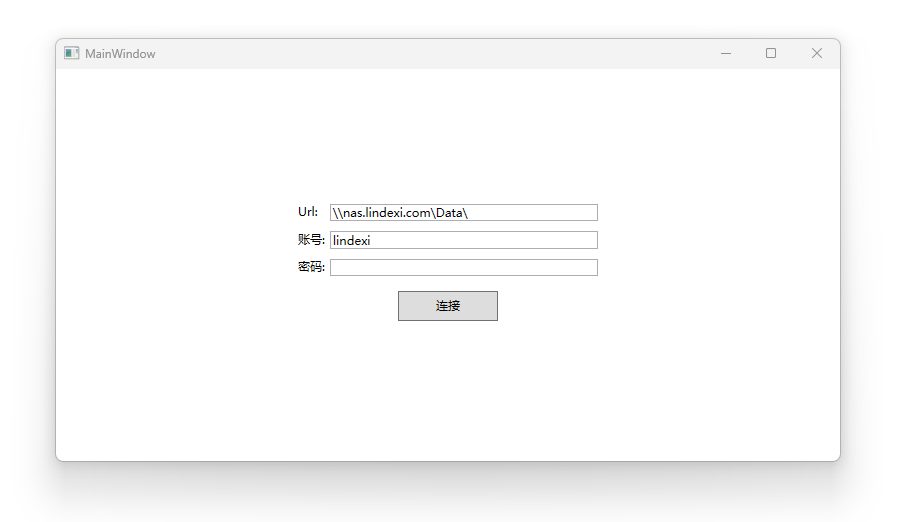

# WPF 使用 WNetUseConnection 连接 SMB 网络资源

本文将和大家演示如何在 WPF 里面，使用 WNetUseConnection 连接 SMB 网络资源

<!--more-->


<!-- CreateTime:2025/08/09 07:12:14 -->

<!-- 发布 -->
<!-- 博客 -->
<!-- 置顶1 -->

为了方便起见，我编写了一个简单的界面，代码如下

```xml
    <Grid>
        <StackPanel VerticalAlignment="Center">
            <Grid MinWidth="300" HorizontalAlignment="Center">
                <Grid.Resources>
                    <Style TargetType="TextBlock">
                        <Setter Property="Margin" Value="0 5 5 5"></Setter>
                    </Style>
                    <Style TargetType="TextBox">
                        <Setter Property="Margin" Value="0 5 0 5"></Setter>
                    </Style>
                </Grid.Resources>
                <Grid.RowDefinitions>
                    <RowDefinition></RowDefinition>
                    <RowDefinition></RowDefinition>
                    <RowDefinition></RowDefinition>
                </Grid.RowDefinitions>
                <Grid.ColumnDefinitions>
                    <ColumnDefinition Width="Auto"></ColumnDefinition>
                    <ColumnDefinition></ColumnDefinition>
                </Grid.ColumnDefinitions>

                <TextBlock Text="Url:"></TextBlock>
                <TextBox x:Name="UrlTextBox" Grid.Row="0" Grid.Column="1" Text="\\nas.lindexi.com\Data\"></TextBox>

                <TextBlock Grid.Row="1" Grid.Column="0"  Text="账号:"></TextBlock>
                <TextBox x:Name="UserNameTextBox" Grid.Row="1" Grid.Column="1"></TextBox>

                <TextBlock Grid.Row="2" Grid.Column="0"  Text="密码:"></TextBlock>
                <TextBox x:Name="PasswordTextBox" Grid.Row="2" Grid.Column="1"></TextBox>
            </Grid>

            <Button x:Name="ConnectButton" Width="100" Height="30" Margin="10" Click="ConnectButton_OnClick">连接</Button>
        </StackPanel>
      
    </Grid>
```

运行起来的界面大概如下

<!--  -->


点击连接按钮时，将尝试连接以上配置的各项内容

如上图所示，我将尝试连接到我的 SMB 上。对于 Windows 来说，以上的 `\\nas.lindexi.com\Data\` 就是一个非常合法的路径，连接完成之后，即可直接访问

本文的重点是调用 WNetUseConnection 方法进行连接，此方法的官方说明文档是 [WNetUseConnectionW 函数 (winnetwk.h) - Win32 apps - Microsoft Learn](https://learn.microsoft.com/zh-cn/windows/win32/api/winnetwk/nf-winnetwk-wnetuseconnectionw )

其 PInvoke 定义代码如下

```csharp
    [DllImport("Mpr.dll")]
    private static extern int WNetUseConnection
    (
        IntPtr hwndOwner,
        NETRESOURCE lpNetResource,
        string lpPassword,
        string lpUserID,
        int dwFlags,
        string? lpAccessName,
        string? lpBufferSize,
        string? lpResult
    );
```

结构体 `NETRESOURCE` 的定义如下

```csharp
    [StructLayout(LayoutKind.Sequential)]
    private struct NETRESOURCE()
    {
        public int dwScope = 0;
        public int dwType = 0;
        public int dwDisplayType = 0;
        public int dwUsage = 0;
        public string lpLocalName = "";
        public string lpRemoteName = "";
        public string lpComment = "";
        public string lpProvider = "";
    }
```

为了方便调用，我编写了 NetworkShare 辅助类，代码如下

```csharp
public static class NetworkShare
{
    public static int ConnectToShare(string uri, string username, string password)
    {
        //Create netresource and point it at the share
        NETRESOURCE netResource = new NETRESOURCE();
        netResource.dwType = RESOURCETYPE_DISK;
        netResource.lpRemoteName = uri;

        int result = WNetUseConnection(IntPtr.Zero, netResource, password, username, 0, null, null, null);
        return result;
    }

    const int RESOURCETYPE_DISK = 0x00000001;
    const int CONNECT_UPDATE_PROFILE = 0x00000001;

    ...
}
```

对于 Win32 调用来说，一般都有成对的释放代码，这里使用的是 WNetCancelConnection 进行断开

同样做简单的封装

```csharp
public static class NetworkShare
{
    public static int DisconnectFromShare(string uri, bool force)
    {
        int result = WNetCancelConnection(uri, force);
        return result;
    }

    [DllImport("Mpr.dll")]
    private static extern int WNetCancelConnection
    (
        string lpName,
        bool fForce
    );

    ...
}
```

整个 NetworkShare 的代码如下

```csharp
public static class NetworkShare
{
    public static int ConnectToShare(string uri, string username, string password)
    {
        //Create netresource and point it at the share
        NETRESOURCE netResource = new NETRESOURCE();
        netResource.dwType = RESOURCETYPE_DISK;
        netResource.lpRemoteName = uri;

        int result = WNetUseConnection(IntPtr.Zero, netResource, password, username, 0, null, null, null);
        return result;
    }

    public static int DisconnectFromShare(string uri, bool force)
    {
        int result = WNetCancelConnection(uri, force);
        return result;
    }

    const int RESOURCETYPE_DISK = 0x00000001;
    const int CONNECT_UPDATE_PROFILE = 0x00000001;

    [StructLayout(LayoutKind.Sequential)]
    private struct NETRESOURCE()
    {
        public int dwScope = 0;
        public int dwType = 0;
        public int dwDisplayType = 0;
        public int dwUsage = 0;
        public string lpLocalName = "";
        public string lpRemoteName = "";
        public string lpComment = "";
        public string lpProvider = "";
    }

    [DllImport("Mpr.dll")]
    private static extern int WNetUseConnection
    (
        IntPtr hwndOwner,
        NETRESOURCE lpNetResource,
        string lpPassword,
        string lpUserID,
        int dwFlags,
        string? lpAccessName,
        string? lpBufferSize,
        string? lpResult
    );

    [DllImport("Mpr.dll")]
    private static extern int WNetCancelConnection
    (
        string lpName,
        bool fForce
    );
}
```

完成之后的调用代码如下

```csharp
    private void ConnectButton_OnClick(object sender, RoutedEventArgs e)
    {
        var success = NetworkShare.ConnectToShare(UrlTextBox.Text, UserNameTextBox.Text, PasswordTextBox.Text);
        if (success == 0)
        {
            foreach (var fileSystemEntry in Directory.EnumerateFileSystemEntries(UrlTextBox.Text))
            {
                Debug.WriteLine(fileSystemEntry);
            }

            NetworkShare.DisconnectFromShare(UrlTextBox.Text, force: true);
        }
    }
```

当输入的地址和账号密码正确时，预期可以在 `ConnectButton_OnClick` 里面枚举出当前 SMB 网络资源的各项文件夹和文件

我为了方便自己调试，我还引入了 <https://github.com/dotnet-campus/dotnetCampus.Configurations> 硬币配置文件库，将连接地址和账号密码存放在 COIN 硬币配置文件里，其代码如下

```csharp
    public MainWindow()
    {
        InitializeComponent();

        var coinFile = @"C:\lindexi\Nas.coin";
        if (File.Exists(coinFile))
        {
            var fileConfigurationRepo = ConfigurationFactory.FromFile(coinFile,RepoSyncingBehavior.Static);
            var appConfigurator = fileConfigurationRepo.CreateAppConfigurator();
            var nasConfiguration = appConfigurator.Of<NasConfiguration>();
            UrlTextBox.Text = nasConfiguration.Url;
            UserNameTextBox.Text = nasConfiguration.UserName;
            PasswordTextBox.Text = nasConfiguration.Password;
        }
    }

    class NasConfiguration : Configuration
    {
        public NasConfiguration() : base("")
        {
        }

        public string Url => GetString();
        public string UserName => GetString();
        public string Password => GetString();
    }
```

本文代码放在 [github](https://github.com/lindexi/lindexi_gd/tree/75409caab083c6ccd3337de4e8159205314e6974/WPFDemo/NaihunojojeaKeheakabearweabe) 和 [gitee](https://gitee.com/lindexi/lindexi_gd/blob/75409caab083c6ccd3337de4e8159205314e6974/WPFDemo/NaihunojojeaKeheakabearweabe) 上，可以使用如下命令行拉取代码。我整个代码仓库比较庞大，使用以下命令行可以进行部分拉取，拉取速度比较快

先创建一个空文件夹，接着使用命令行 cd 命令进入此空文件夹，在命令行里面输入以下代码，即可获取到本文的代码

```
git init
git remote add origin https://gitee.com/lindexi/lindexi_gd.git
git pull origin 75409caab083c6ccd3337de4e8159205314e6974
```

以上使用的是国内的 gitee 的源，如果 gitee 不能访问，请替换为 github 的源。请在命令行继续输入以下代码，将 gitee 源换成 github 源进行拉取代码。如果依然拉取不到代码，可以发邮件向我要代码

```
git remote remove origin
git remote add origin https://github.com/lindexi/lindexi_gd.git
git pull origin 75409caab083c6ccd3337de4e8159205314e6974
```

获取代码之后，进入 WPFDemo/NaihunojojeaKeheakabearweabe 文件夹，即可获取到源代码

更多技术博客，请参阅 [博客导航](https://blog.lindexi.com/post/%E5%8D%9A%E5%AE%A2%E5%AF%BC%E8%88%AA.html )


<a rel="license" href="http://creativecommons.org/licenses/by-nc-sa/4.0/"></a><br />本作品采用<a rel="license" href="http://creativecommons.org/licenses/by-nc-sa/4.0/">知识共享署名-非商业性使用-相同方式共享 4.0 国际许可协议</a>进行许可。欢迎转载、使用、重新发布，但务必保留文章署名[林德熙](http://blog.csdn.net/lindexi_gd)(包含链接:http://blog.csdn.net/lindexi_gd )，不得用于商业目的，基于本文修改后的作品务必以相同的许可发布。如有任何疑问，请与我[联系](mailto:lindexi_gd@163.com)。