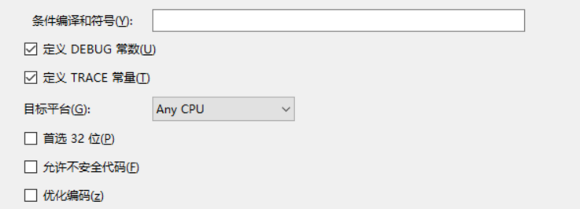

# WPF 使用 Win2d 渲染

在当前所有渲染框架里面，做 2D 渲染的，最好的框架是 Win2d 这个提供了大量底层接口封装，不仅性能高同时接口设计非常好
在很久之前，只有在 UWP 等现代应用才能使用 Win2d 而 WPF 是不能使用的。好在微软开放了一些黑科技，可以在 WPF 上使用 Win2d 渲染，下面就让我告诉大家如何在 WPF 上使用

<!--more-->


<!-- csdn -->

在 2019年7月03日 这个技术还是属于黑科技，还没有正式发布，在开始使用之前，有一定的环境要求

- 需要 VisualStudio 2017 和以上，点击[Visual Studio下载链接](https://visualstudio.microsoft.com/zh-hans/ )下载最新的工具
- 需要在 VisualStudio 的开发添加 UWP 和桌面开发
- 需要在设备安装 .NET Framework 4.7.2 及以上，同时新建项目需要选择 .NET Framework 4.7.2 和以上。有小伙伴说 45 也是可以的，但是步骤会更多，建议小伙伴在看完本文测试过了才尝试降级
- 开发和运行设备是 Windows 10 版本 1903 和以上
- 开发设备上安装 UWP 的 SDK 版本是 18362 及以上 [Windows 10 SDK - Windows 应用开发](https://developer.microsoft.com/zh-cn/windows/downloads/windows-10-sdk )

新建一个 WPF 的 .NET Framework 4.8 项目，在这个项目上面安装下面 NuGet 包

- Microsoft.Windows.SDK.Contracts
- Microsoft.VCRTForwarders.140
- System.Numerics.Vectors
- Win2D.uwp

如果有安装不上的，例如有下面提示

```csharp
无法安装程序包“Win2D.uwp 1.23.0”。你正在尝试将此程序包安装到目标为“.NETFramework,Version=v4.8”的项目中，但该程序包不包含任何与该框架兼容的程序集引用或内容文件。有关详细信息，请联系程序包作者。
```

右击编辑 csproj 文件，在 csproj 文件里面添加下面代码。注意此时你新建的项目使用的 nuget 格式需要新的 Nuget 格式，也就是不带 package.config 文件的格式

```csharp
    <PackageReference Include="Microsoft.VCRTForwarders.140">
      <Version>1.0.0-rc</Version>
    </PackageReference>
    <PackageReference Include="Microsoft.Windows.SDK.Contracts">
      <Version>10.0.18362.2002-preview</Version>
    </PackageReference>
    <PackageReference Include="System.Numerics.Vectors">
      <Version>4.5.0</Version>
    </PackageReference>
    <PackageReference Include="Win2D.uwp">
      <Version>1.22.0</Version>
    </PackageReference>
```

这样就可以强制安装

准备好了环境和 NuGet 之后就可以开始开发了

和之前博客 [WPF 使用 Composition API 做高性能渲染](https://blog.lindexi.com/post/wpf-%E4%BD%BF%E7%94%A8-composition-api-%E5%81%9A%E9%AB%98%E6%80%A7%E8%83%BD%E6%B8%B2%E6%9F%93 ) 所说方法搭建代码

搭建出 CompositionHost 和 CompositionHostControl 两个类，然后在 CompositionHostControl 里面添加 Win2d 相关方法

在 CompositionHostControl 的构造函数给 Win2d 初始化

```csharp
        private readonly CanvasDevice _canvasDevice;

        public CompositionHostControl()
        {
            InitializeComponent();            

            // 手动高亮，下面代码用于创建 Win2d 的渲染设备
            _canvasDevice = CanvasDevice.GetSharedDevice();

            // 忽略其他代码
        }
```

以上忽略代码可以在 [Windows.UI.Composition-Win32-Samples](https://github.com/microsoft/Windows.UI.Composition-Win32-Samples/blob/1eeb30a5e724ff2681f43f4f7aa829476aa894a4/dotnet/WPF/AcrylicEffect/AcrylicEffect/CompositionHostControl.xaml.cs ) 找到

在 `CompositionHostControl_Loaded` 事件里面才是核心代码

想要让 Win2d 绘制在界面上，需要在界面存放一张平面，让 Win2d 在这个平面上绘制，然后将平面加入到渲染的平面列表里面，这样就可以进行渲染了

```csharp

// 创建链接 _compositor 和 _canvasDevice 的链接
            _compositionGraphicsDevice = CanvasComposition.CreateCompositionGraphicsDevice(_compositor, _canvasDevice);

// 创建一个平面，将会让 Win2d 在这个平面渲染
            var noiseDrawingSurface = _compositionGraphicsDevice.CreateDrawingSurface(
                new Windows.Foundation.Size(_rectWidth, _rectHeight),
                DirectXPixelFormat.B8G8R8A8UIntNormalized,
                DirectXAlphaMode.Premultiplied);
            // 忽略一些代码

// 在这个函数里面就是让 Win2d 绘制的方法，其实在我自己的项目里面没有用到 noiseFilePath 变量
            LoadSurface(noiseDrawingSurface, noiseFilePath);

// 在 Win2d 渲染到平面完成之后，将这个平面作为一个画刷用于在之后的效果
            _noiseSurfaceBrush = _compositor.CreateSurfaceBrush(noiseDrawingSurface);
```

在 LoadSurface 方法里面进行绘制，请看创建代码

```csharp
        void LoadSurface(CompositionDrawingSurface surface, string path)
        {
            // Draw to surface.
            using (var ds = CanvasComposition.CreateDrawingSession(surface))
            {
                ds.Clear(Colors.Transparent);

                var rect = new Windows.Foundation.Rect(0, 0, _rectWidth, _rectHeight);
                ds.FillRectangle(rect, Colors.Coral);
            }
        }
```

这样就可以将 Win2d 的内容渲染到一个平面上，然后将这个平面作为画刷，在微软的代码里面是将这个画刷作为亚克力的画刷，然后将亚克力放在内容里面

下面是简化的代码

```csharp

LoadSurface(noiseDrawingSurface, noiseFilePath);
var visual = _compositor.CreateSpriteVisual();
// 忽略 visual 的参数设置
_acrylicVisual = visual;
// 创建亚克力画刷
_acrylicVisual.Brush = CreateAcrylicEffectBrush();

// 加入到图层
_containerVisual.Children.InsertAtTop(_acrylicVisual);

```

现在就完成了在 WPF 里面使用 Win2d 顺便还提供了亚克力的功能

其实本文主要不是告诉大家如何写代码，而是如何让官方的代码可以运行

在运行过程可能会遇到以下的坑

如在开始编译的时候提示下面代码

```csharp
C:\Users\lindexi.github.io\.nuget\packages\win2d.uwp\1.23.0\build\Win2D.common.targets(37,5): Error: This version of Win2D requires Windows SDK >= 10.0.17134.0, but TargetPlatformVersion is 7.0.
```

主要原因是现在 Microsoft.Windows.SDK.Contracts 只能让 Win2d 的 1.22 版本运行，解决方案是将原本的 1.23 版本降级到 1.22 版本

在运行过程，运行到 `_canvasDevice = CanvasDevice.GetSharedDevice()` 的时候提示下面的代码

```csharp
System.TypeLoadException:“所请求的 Windows 运行时类型“Microsoft.Graphics.Canvas.CanvasDevice”未注册。”

```

这个问题是因为没有在 app.manifest 文件里面添加下面代码

```csharp
<file name="Microsoft.Graphics.Canvas.dll">
    <activatableClass
      name="Microsoft.Graphics.Canvas.CanvasDevice"
      threadingModel="both"
      xmlns="urn:schemas-microsoft-com:winrt.v1"/>

   <activatableClass      name="Microsoft.Graphics.Canvas.UI.Composition.CanvasComposition"
      threadingModel="both"
      xmlns="urn:schemas-microsoft-com:winrt.v1"/>

    <activatableClass
      name="Microsoft.Graphics.Canvas.Effects.SaturationEffect"
      threadingModel="both"
      xmlns="urn:schemas-microsoft-com:winrt.v1"/>

    <activatableClass
       name="Microsoft.Graphics.Canvas.Effects.BlendEffect"
        threadingModel="both"
        xmlns="urn:schemas-microsoft-com:winrt.v1"/>

    <activatableClass
      name="Microsoft.Graphics.Canvas.Effects.GaussianBlurEffect"
      threadingModel="both"
      xmlns="urn:schemas-microsoft-com:winrt.v1"/>

    <activatableClass
      name="Microsoft.Graphics.Canvas.Effects.ColorSourceEffect"
      threadingModel="both"
      xmlns="urn:schemas-microsoft-com:winrt.v1"/>

    <activatableClass
      name="Microsoft.Graphics.Canvas.Effects.CompositeEffect"
      threadingModel="both"
      xmlns="urn:schemas-microsoft-com:winrt.v1"/>

    <activatableClass
      name="Microsoft.Graphics.Canvas.Effects.OpacityEffect"
      threadingModel="both"
      xmlns="urn:schemas-microsoft-com:winrt.v1"/>

    <activatableClass
      name="Microsoft.Graphics.Canvas.CanvasBitmap"
      threadingModel="both"
      xmlns="urn:schemas-microsoft-com:winrt.v1"/>
    <activatableClass 
      name="Microsoft.Graphics.Canvas.Effects.BorderEffect" 
      threadingModel="both" 
      xmlns="urn:schemas-microsoft-com:winrt.v1"/>
  </file>
```

或者这个文件没有在 csproj 声明，也就是没有在项目文件找到下面代码

```csharp
  <PropertyGroup>
    <ApplicationManifest>app.manifest</ApplicationManifest>
  </PropertyGroup>
```

在运行的时候，还是在 `_canvasDevice = CanvasDevice.GetSharedDevice()`  提示下面的代码

```csharp
System.IO.FileNotFoundException:“找不到指定的模块。 (异常来自 HRESULT:0x8007007E)”
```

这个问题是在输出文件夹缺少文件，请确定当前使用的是 x64 的设备，同时进行 AnyCpu 编译，没有勾选首选 32 的程序

<!--  -->


然后确定在 `bin\debug` 文件夹里面是否存在以下文件

- vcruntime140_app.dll
- msvcp140_app.dll
- Microsoft.Graphics.Canvas.dll
- System.Numerics.Vectors.dll
- Microsoft.Graphics.Canvas.winmd

在安装 `Microsoft.VCRTForwarders.140` 默认就会创建前面两个文件，在进行x64编译的时候。如果使用的是 AnyCpu 编译，那么就需要手动拷贝文件

而 Microsoft.Graphics.Canvas.dll 文件是需要手动拷贝的

手动复制文件的方法是打开自己的本地 .nuget 源，在 `c:\Users\用户名\.nuget\packages\` 里面可以找到

如我的 Microsoft.VCRTForwarders.140 内容在 `c:\Users\lindexi.github.io\.nuget\packages\microsoft.vcrtforwarders.140\1.0.0-rc\runtimes\win10-x64\native\release\` 文件，将里面的文件复制到输出文件夹

打开 `c:\Users\lindexi.github.io\.nuget\packages\win2d.uwp\1.22.0\runtimes\win10-x64\native\` 将 Microsoft.Graphics.Canvas.dll 文件复制到输出文件夹

请将上面文件夹的用户名替换为你自己的用户名

当然这样的呆魔大家一定不想使用，于是我将需要添加的文件放在项目文件，设置自动输出，请小伙伴换我的项目试试

我将代码放在 [Github](https://github.com/lindexi/lindexi_gd/tree/05cda6ac394962a10dd4bdf8bdc2d6ab6d3732b1/WeabubiwerekallkairgemRaceenabo ) 只需要下载代码，然后打开 sln 文件，右击还原项目，然后在 AnyCpu 下按下运行就可以


<a rel="license" href="http://creativecommons.org/licenses/by-nc-sa/4.0/"></a><br />本作品采用<a rel="license" href="http://creativecommons.org/licenses/by-nc-sa/4.0/">知识共享署名-非商业性使用-相同方式共享 4.0 国际许可协议</a>进行许可。欢迎转载、使用、重新发布，但务必保留文章署名[林德熙](http://blog.csdn.net/lindexi_gd)(包含链接:http://blog.csdn.net/lindexi_gd )，不得用于商业目的，基于本文修改后的作品务必以相同的许可发布。如有任何疑问，请与我[联系](mailto:lindexi_gd@163.com)。