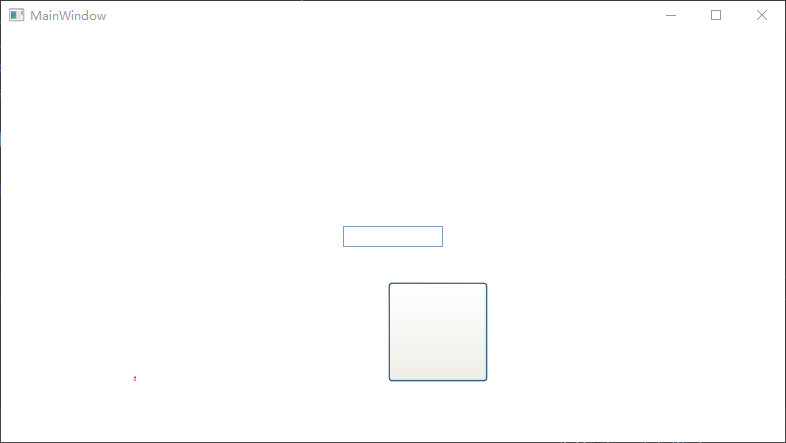
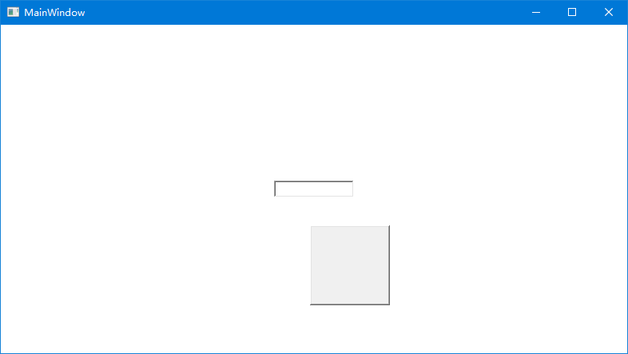

# WPF 切换主题使用 luna 复古版本

本文告诉大家如何在 WPF 里面使用 luna 等复古主题

<!--more-->


<!-- CreateTime:2022/5/19 20:00:13 -->

<!-- 发布 -->
<!-- 博客 -->

今天在 [lsj](https://blog.sdlsj.net) 说他准备优化 WPF 的程序集时，准备删除 luna 等程序集时，找到了一段有趣的注释，发现在 WPF 里面可以通过一些有趣的反射的方法修改主题，让应用使用 luna 的主题，实现复古的界面

使用方法非常简单，在 App.xaml.cs 的构造函数里面，添加如下代码即可

```csharp
        public App()
        {
            SetTheme("luna", "normalcolor");
        }

        /// <summary>
        /// Sets the WPF system theme.
        /// </summary>
        /// <param name="themeName">The name of the theme. (ie "aero")</param>
        /// <param name="themeColor">The name of the color. (ie "normalcolor")</param>
        /// Copy https://github.com/danielmoore/SystemThemeChange/blob/master/App.xaml.cs
        public static void SetTheme(string themeName, string themeColor)
        {
            const BindingFlags staticNonPublic = BindingFlags.Static | BindingFlags.NonPublic;

            var presentationFrameworkAsm = Assembly.GetAssembly(typeof(Window));

            var themeWrapper = presentationFrameworkAsm.GetType("MS.Win32.UxThemeWrapper");

            var isActiveField = themeWrapper.GetField("_isActive", staticNonPublic);
            var themeColorField = themeWrapper.GetField("_themeColor", staticNonPublic);
            var themeNameField = themeWrapper.GetField("_themeName", staticNonPublic);

            // Set this to true so WPF doesn't default to classic.
            isActiveField.SetValue(null, true);

            themeColorField.SetValue(null, themeColor);
            themeNameField.SetValue(null, themeName);
        }
```

为了展示界面效果，我添加了如下界面

```xml
    <Grid>
        <TextBox Width="100" HorizontalAlignment="Center" VerticalAlignment="Center"></TextBox>
        <Button Margin="100,200,10,10" Height="100" Width="100"></Button>
    </Grid>
```

软件运行效果如下

<!--  -->


再换成 Aero 效果，修改代码如下

```csharp
        public App()
        {
            SetTheme("areo", "normalcolor");
        }
```

可以看到界面更加好看

<!--  -->


以上方法实际上在很久之前就有大佬写了，详细请看 [danielmoore/SystemThemeChange: A demonstration of a theme change helper for WPF](https://github.com/danielmoore/SystemThemeChange )

在 WPF 里面，可以看到 UxThemeWrapper 有如下注释

```csharp
    internal static class UxThemeWrapper
    {
        // There are apps that override the system theme with one of their own
        // choosing, and intercept (and discard) WM_THEMECHANGED messages to
        // keep their theme in place even when the end-user selects a different
        // theme.   They do this using private reflection to assign values to
        // the three state variables.
        //
        // This state (i.e. where the three variables have values that differ from
        // the ones we choose) is unsupported.  So is the technique for getting
        // into that state (i.e. private reflection).  Nevertheless, .Net wants
        // to preserve some level of compatibility - at the very least, avoid
        // crashing.  [The apps use the result of GetField("_isActive") without
        // checking for null.]
        //
        // We do this in three steps:
        // 1) preserve the three fields;  this fixes the crashes.
        // 2) if the app overrides the values, use the overridden values
        //      in preference to ours.
        // 3) during WM_THEMECHANGED, restore the preference for our values.
        //      If the app overrides them again, step (2) will kick in.
        // Note that step (3) will never happen if the app is intercepting
        // WM_THEMECHANGED.

        private static bool    _isActive;
        private static string  _themeName;
        private static string  _themeColor;
    }
```

也就是以上的写法是符合预期的

本文以上的测试文件和代码放在[github](https://github.com/lindexi/lindexi_gd/tree/3a6a955fdd761b3f45d9195abc241c70574413d3/BearweakiqeNurwhallcarnearcowar) 和 [gitee](https://gitee.com/lindexi/lindexi_gd/tree/3a6a955fdd761b3f45d9195abc241c70574413d3/BearweakiqeNurwhallcarnearcowar) 欢迎访问

可以通过如下方式获取本文的源代码，先创建一个空文件夹，接着使用命令行 cd 命令进入此空文件夹，在命令行里面输入以下代码，即可获取到本文的代码

```
git init
git remote add origin https://gitee.com/lindexi/lindexi_gd.git
git pull origin 3a6a955fdd761b3f45d9195abc241c70574413d3
```

以上使用的是 gitee 的源，如果 gitee 不能访问，请替换为 github 的源

```
git remote remove origin
git remote add origin https://github.com/lindexi/lindexi_gd.git
```

获取代码之后，进入 BearweakiqeNurwhallcarnearcowar 文件夹


<a rel="license" href="http://creativecommons.org/licenses/by-nc-sa/4.0/"></a><br />本作品采用<a rel="license" href="http://creativecommons.org/licenses/by-nc-sa/4.0/">知识共享署名-非商业性使用-相同方式共享 4.0 国际许可协议</a>进行许可。欢迎转载、使用、重新发布，但务必保留文章署名[林德熙](http://blog.csdn.net/lindexi_gd)(包含链接:http://blog.csdn.net/lindexi_gd )，不得用于商业目的，基于本文修改后的作品务必以相同的许可发布。如有任何疑问，请与我[联系](mailto:lindexi_gd@163.com)。