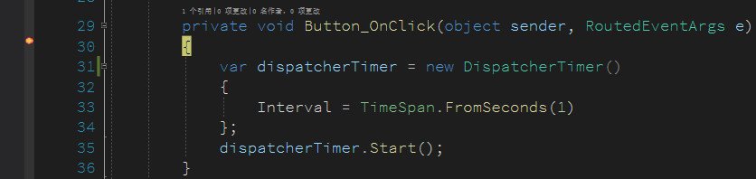
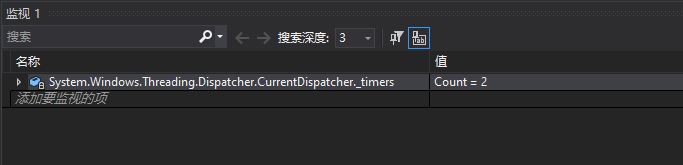
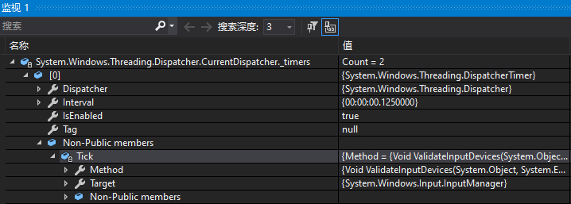
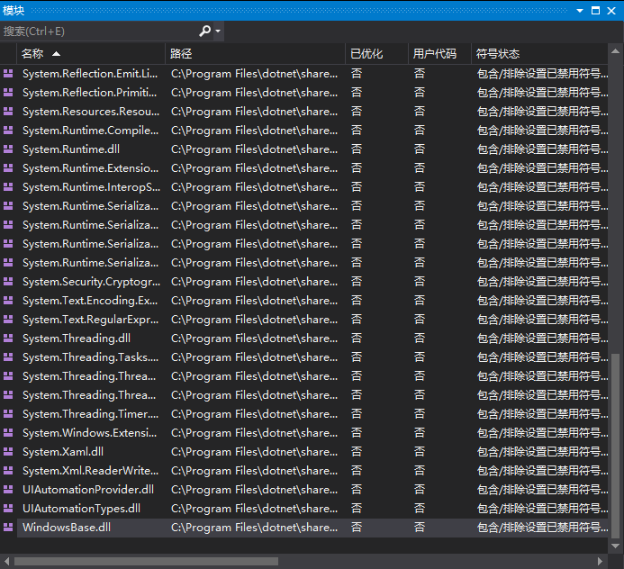
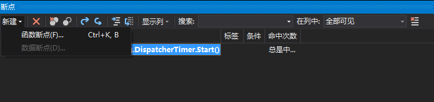
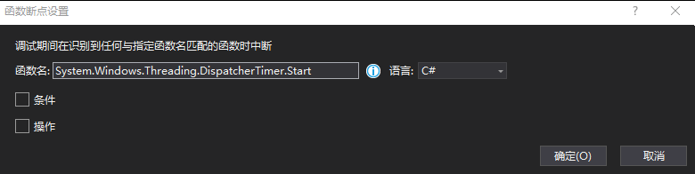
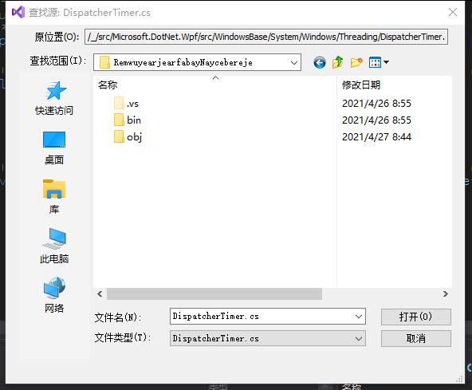
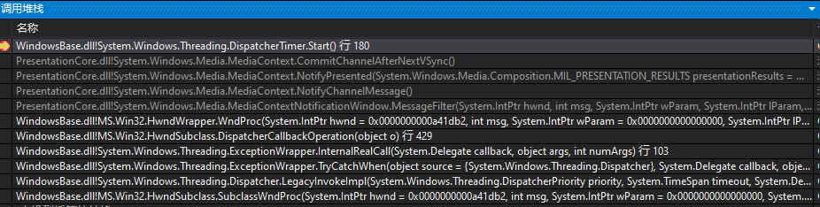

# WPF 如何知道当前有多少个 DispatcherTimer 在运行

在 WPF 调试中，对于 DispatcherTimer 定时器的执行，没有直观的调试方法。本文来告诉大家如何在 WPF 中调试当前主线程有多少个 DispatcherTimer 在运行

<!--more-->


<!-- CreateTime:2021/4/27 8:48:17 -->

<!-- 发布 -->

在 WPF 中，如果有 DispatcherTimer 定时器在执行，将会影响到主线程的执行，将会让主线程诡异忙碌。或者有 DispatcherTimer 定时器忘记订阅 Tick 同时也忘记设置时间，将会不断消耗主线程资源。在遇到没有任何的交互时，此时出现的主线程卡的问题，可以优先尝试了解是否 DispatcherTime 定时器的问题

如以下代码，在界面创建一个按钮，点击按钮时将会创建和运行 DispatcherTime 定时器

```xml
  <Grid>
    <Button Margin="10,10,10,10" HorizontalAlignment="Left" VerticalAlignment="Top" Content="按钮" Click="Button_OnClick" />
  </Grid>
```

在 `Button_OnClick` 加上创建和运行 DispatcherTimer 定时器的代码

```csharp
        private void Button_OnClick(object sender, RoutedEventArgs e)
        {
            var dispatcherTimer = new DispatcherTimer()
            {
                Interval = TimeSpan.FromSeconds(1)
            };
            dispatcherTimer.Start();
        }
```

假定需要调试在进入 `Button_OnClick` 方法，当前主线程有多少 DispatcherTimer 定时器在运行。可以在此方法上添加断点，如下图

<!--  -->


进入 VisualStudio 的监视界面，输入 `System.Windows.Threading.Dispatcher.CurrentDispatcher._timers` 即可了解当前主线程有多少个 DispatcherTime 定时器在运行。根据 Dispatcher.CurrentDispatcher 的定义，此 CurrentDispatcher 是 ThreadStatic 线程静态，因此以上调试断点必须落在主线程执行的代码

<!--  -->


如进一步了解当前的 DispatcherTimer 定时器是由哪个业务模块定义的，可以通过 `Tick` 委托找到对应的业务模块，如下图

<!--  -->


通过 `Tick` 委托可以了解到是哪个类的哪个方法，通过静态代码可以找到业务

如果只是期望调试 DispatcherTimer 定时器是由哪个业务模块启动创建的，此时可以添加函数断点，添加函数断点步骤相对复杂

在开始之前，需要加载 WindowsBase.dll 的符号，同时我也推荐使用 dotnet core 或 .NET 5 版本的 WPF 框架进行调试，因此此框架可以有源代码支持。加载 WindowsBase.dll 的符号之前，还请到开源的 WPF 项目，将代码拉到本地

加载 WindowsBase.dll 的符号方法是在 调试->窗口->模块 打开模块窗口，右击 WindowsBase.dll 加载符号

<!--  -->


加载符号时需要一点网络，基本上都能加载成功。为什么需要加载 WindowsBase.dll 的符号？原因是 System.Windows.Threading.DispatcherTimer 定义在 WindowsBase 程序集

接下来在断点窗口里面，点击新建函数断点

<!--  -->


输入调试的函数，进行断点，如断点放在 `System.Windows.Threading.DispatcherTimer.Start` 函数里面，当然，这只是一个例子

<!--  -->


这样在触发 DispatcherTimer.Start 函数将会进入断点

断点进入之后，默认都会提示是否选择源代码，这就是上文推荐使用开源版本的 WPF 框架的原因，因为咱可以找到此文件进行加载，这样就能实现源代码级的调试。如果发现源代码有一些不匹配，也莫慌，将自己的代码仓库切换到对应的分支或 tag 即可，或者去掉勾选源代码必须匹配选项

<!--  -->


通过调用堆栈即可了解到当前是哪个模块调用了 DispatcherTimer.Start 函数

<!--  -->


以上步骤比较多，还需要大家玩一下才能了解

其实 DispatcherTimer.Start 函数将会在框架内部消息里面不断调用，因此断点不建议落在 Start 函数，按照咱的调试需求，其实更多的是在构造函数，可以在函数断点里面输入 `System.Windows.Threading.DispatcherTimer.DispatcherTimer` 调试是哪个业务创建 DispatcherTimer 对象

本文所有代码放在 [github](https://github.com/lindexi/lindexi_gd/tree/ee3e25f3/RemwuyearjearfabayNaycebereje) 和 [gitee](https://gitee.com/lindexi/lindexi_gd/tree/ee3e25f3/RemwuyearjearfabayNaycebereje) 欢迎小伙伴访问

可以通过如下方式获取本文的源代码，先创建一个空文件夹，接着使用命令行 cd 命令进入此空文件夹，在命令行里面输入以下代码，即可获取到本文的代码

```
git init
git remote add origin https://gitee.com/lindexi/lindexi_gd.git
git pull origin ee3e25f3cb1cd6e3b1c90d3efb529dc37dd61172
```

以上使用的是 gitee 的源，如果 gitee 不能访问，请替换为 github 的源

```
git remote add origin https://github.com/lindexi/lindexi_gd.git
```

获取代码之后，进入 RemwuyearjearfabayNaycebereje 文件夹

更多代码调试请看 [dotnet 代码调试方法](https://blog.lindexi.com/post/dotnet-%E4%BB%A3%E7%A0%81%E8%B0%83%E8%AF%95%E6%96%B9%E6%B3%95.html )


<a rel="license" href="http://creativecommons.org/licenses/by-nc-sa/4.0/"></a><br />本作品采用<a rel="license" href="http://creativecommons.org/licenses/by-nc-sa/4.0/">知识共享署名-非商业性使用-相同方式共享 4.0 国际许可协议</a>进行许可。欢迎转载、使用、重新发布，但务必保留文章署名[林德熙](http://blog.csdn.net/lindexi_gd)(包含链接:http://blog.csdn.net/lindexi_gd )，不得用于商业目的，基于本文修改后的作品务必以相同的许可发布。如有任何疑问，请与我[联系](mailto:lindexi_gd@163.com)。