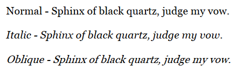

# WPF 字体 FontStyle 的 Italic 和 Oblique 的区别

本文介绍在 WPF 里面的字体属性 FontStyle 的 Italic 和 Oblique 的斜体差别

<!--more-->

<!-- CreateTime:2023/2/10 16:16:18 -->

<!-- 发布 -->
<!-- 博客 -->

本文的图片和知识来自： [#265 – Specifying Values for FontStyle 2,000 Things You Should Know About WPF](https://wpf.2000things.com/2011/04/03/265-specifying-values-for-fontstyle/ )

使用 Italic 是字体提供的斜体，可以和正常字体有不同的界面。也就是说字体可以有专门的斜体信息，斜体变体（italic variant）信息或字体，可以显示出和正常字体差别很大的界面内容

使用 Oblique 只是将正常的字体进行倾斜

如果一个字体没有斜体，那 Italic 和 Oblique 视觉效果相同

先看看下图，这是采用 Georgia 字体的效果。此 Georgia 字体存在斜体变体（italic variant）可以显示出更加专业的斜体效果

<!--  -->

这个设计是为了让一些英文字体可以有专业的显示效果，可以在使用斜体时，显示更符合国外语言文化的效果

 本作品采用<a rel="license" href="http://creativecommons.org/licenses/by-nc-sa/4.0/">知识共享署名-非商业性使用-相同方式共享 4.0 国际许可协议</a>进行许可。欢迎转载、使用、重新发布，但务必保留文章署名[林德熙](http://blog.csdn.net/lindexi_gd)(包含链接:http://blog.csdn.net/lindexi_gd )，不得用于商业目的，基于本文修改后的作品务必以相同的许可发布。如有任何疑问，请与我[联系](mailto:lindexi_gd@163.com)。