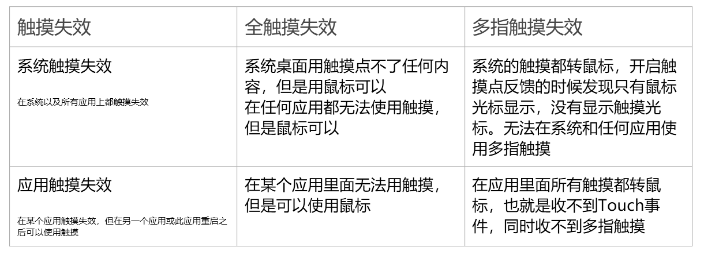
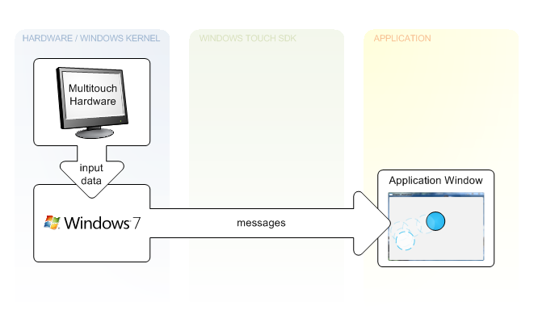
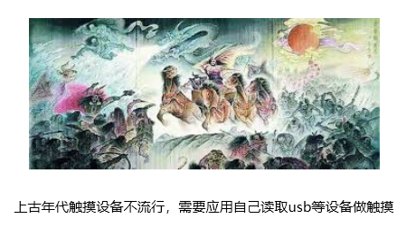
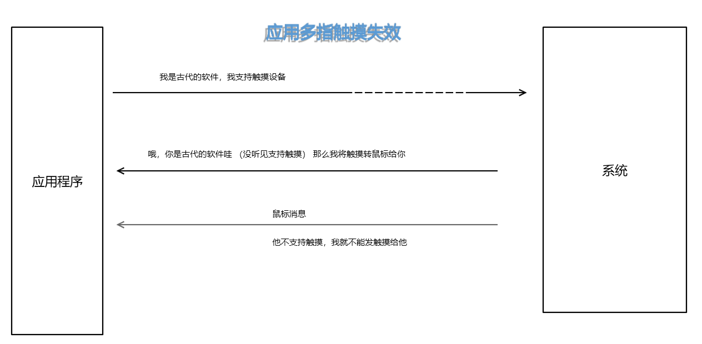

# WPF 客户端开发需要知道的触摸失效问题

在说 WPF 开发的时候，如果开发的应用是触摸应用，那么熟悉的小伙伴会说到触摸失效问题。从分类上触摸失效有系统的触摸失效，应用程序的触摸失效，同时触摸失效指的不是触摸没反应，本文详细告诉大家什么是触摸失效

<!--more-->

<!-- CreateTime:2019/11/29 8:50:02 -->

<!-- csdn -->

在说触摸失效时，需要先知道有多少分类。首先是系统触摸失效还是应用触摸失效，所有的触摸失效本身都分为两个不同失效的方式，一个是全触摸失效，另一个是多指触摸失效了，请看下图

<!--  -->

|触摸失效|全触摸失效|多指触摸失效|
|--|--|--|
|系统触摸失效|系统桌面用触摸点不了任何内容，但是用鼠标可以在任何应用都无法使用触摸，但是鼠标可以|系统的触摸都转鼠标，开启触摸点反馈的时候发现只有鼠标光标显示，没有显示触摸光标。无法在系统和任何应用使用多指触摸|
|应用触摸失效|在某个应用里面无法用触摸，但是可以使用鼠标|在应用里面所有触摸都转鼠标，也就是收不到Touch事件，同时收不到多指触摸|

系统触摸失效和应用触摸失效的不同在于，应用触摸失效只对某个应用，在其他应用或还是此应用重启之后可能就可以使用触摸了。如果是系统触摸失效了，大概就和没有触摸设备一样，所有的应用和系统都触摸失效

触摸失效的全触摸失效是就像没有触摸设备所有触摸没有响应，但是鼠标可以响应。而多指触摸失效是触摸不支持多指，但是可以转换为单指触摸或转为鼠标，相当于是鼠标点击

在应用程序里面还有瞬时触摸失效问题，这时的瞬时触摸失效就是某次触摸没有响应，但是此后应用程序能恢复触摸

对于不同的触摸失效问题对应不同的方法

在应用程序里面的触摸失效请看[WPF 程序无法触摸操作？我们一起来找原因和解决方法！ - walterlv](https://blog.walterlv.com/wpf/2017/09/12/touch-not-work-in-wpf.html )

在应用程序的触摸失效可以分为启动前和运行过程，如果应用程序在启动前就已经触摸失效了，那么和应用程序本身的代码执行无关。在 Win7 系统存在很多触摸问题，在应用启动过程还没有进入用户代码就触摸失效一般就是系统问题。如果在运行过程触摸失效了，也可能和系统相关但是大部分都是应用程序问题

为什么系统没有触摸失效而应用触摸失效了？从[官方文档](https://docs.microsoft.com/en-us/windows-hardware/design/component-guidelines/required-hid-top-level-collections)可以知道 windows 对触摸的处理方式，和从 [打开 HID 集合](https://docs.microsoft.com/zh-cn/windows-hardware/drivers/hid/opening-hid-collections )和 [Windows 触摸文档](https://docs.microsoft.com/en-us/windows/win32/wintouch/about-the-multi-touch-sdk ) 可以知道，从硬件收到的消息需要进入 windows 内核处理，然后让处理之后的消息经过 Windows touch sdk 然后转发到应用，如下图

<!--  -->

以上图片从[windows 触摸架构](https://docs.microsoft.com/en-us/windows/win32/wintouch/architectural-overview )文章复制

这是因为如果HID设备作为一个USB设备，如果被某个应用独占了，那么其他应用将无法访问这个USB设备。在 HID 设备中，默认都会被系统独占，那么被系统独占的 HID 设备是如何将数据发送到每个应用？此时就需要系统做转发了

但是在 win7 的时候，多指触摸还没有完善，很多古老的程序不知道有触摸消息，如果此时 Windows 直接发送触摸消息给到所有应用。那么可以看到有很多应用都是不工作的，于是小伙伴就会说垃圾微软，我的触摸屏无法使用。解决这样的问题很简单，只有在声明自己支持触摸的应用程序上，系统才会发送对应的触摸消息，如下文

> Unless an application registers for Windows Touch input messages with the RegisterTouchWindow function, notifications for gestures (WM_GESTURE messages) are created by Windows and sent to that application window. If an application Window registers to receive touch messages, notifications for Windows Touch input (WM_TOUCH messages) are sent to that application window. 

因为兼容的问题，有很古老的软件，例如 windows 的画图板，这部分软件以为自己是独占整个输入设备的，如 [DirectInput 概述](https://docs.microsoft.com/zh-cn/windows-hardware/drivers/hid/directinput ) 里面相关博客提到的，那么这部分设备应该如何处理？系统将会在上层虚拟化出对应的设备，这些都是软件设备，让对应的应用独占，这样每个应用对独占的设备做了不清真的处理也不会影响其他程序

也就是从硬件的触摸到达应用需要经过系统，而应用程序是否真的有触摸，还需要系统给应用程序一个触摸设备或触摸信息。如果是上古的软件，系统将会给应用一个软件设备。如果是古老的软件，在没有声明支持触摸支持的时候，系统将不会发送触摸消息。如果是现代的软件声明 Pointer 的，那么将默认给触摸消息

应用的触摸失效很多都在于系统给应用分配触摸的时候，在应用程序启动的过程，如果和系统声明了自己是支持触摸的，但是系统访问驱动程序没有返回正确的触摸设备，或者系统这部分处理被魔改了，那么这个应用将触摸失效。如果系统认为这个应用是需要独占设备的，实际这个应用支持触摸，那么系统将会给这个应用设备列表，应用需要使用[GetRawInputDeviceList](https://docs.microsoft.com/en-us/windows/win32/api/winuser/nf-winuser-getrawinputdevicelist )自己手动监听，如果应用没有做，那么系统连触摸转鼠标都不会发给应用，这时的应用就会全触摸失效。而如果应用声明了自己支持触摸，系统没有处理，系统认为这是不支持触摸的应用，那么系统为了兼容就将触摸转鼠标给应用，此时应用将会多指触摸失效

是不是觉得上面的话很复杂？看看下面的图片方便你理解

<!--  -->

<!--  -->

<!--  -->

<!--  -->

如果是应用触摸失效，同时在启动的过程就触摸失效，那么可以做的方法是重启软件，重启软件将会重新告诉系统。此时系统可能返回对的值。如果系统很多次都没有给应用触摸，那么可能是系统的驱动没有安装对，或者系统的补丁没打对，或者系统是魔改的系统，此时可以尝试安装驱动，如果安装驱动没有用，那么尝试安装系统补丁或重装清真的系统

基本上应用触摸失效，同时在启动过程就触摸失效的，都是win7的系统，现在win10的触摸架构修改了，很少有用户告诉我触摸失效

那么如果是系统触摸失效了，如果是全失效，大部分都是硬件问题，测试方法是使用这个主机接到另一个市场上在卖的触摸设备，如果此时触摸可以用，但是接到自己做的触摸设备上无法使用触摸。那么就是自己的触摸设备没有做好，请阅读[Windows 的 Pen 协议](https://blog.lindexi.com/post/Windows-%E7%9A%84-Pen-%E5%8D%8F%E8%AE%AE.html)同时使用 BusHound 抓硬件发过来的数据，看是不是有哪些数据发的不符合文档

如果系统只是多指触摸失效了，那么也需要看一下是不是硬件问题，然后检查系统是否打上了驱动以及是否开启多指触摸支持

[WPF 程序无法触摸操作？我们一起来找原因和解决方法！ - walterlv](https://blog.walterlv.com/wpf/2017/09/12/touch-not-work-in-wpf.html )

[Resolve HID compliant touch screen missing](https://www.auslogics.com/en/articles/fix-hid-compliant-touch-screen-missing-in-windows/ )

[打开 HID 集合](https://docs.microsoft.com/zh-cn/windows-hardware/drivers/hid/opening-hid-collections )

[Required HID Descriptors](https://docs.microsoft.com/en-us/windows-hardware/design/component-guidelines/required-hid-descriptors )

[winapi - How to determine display - touch device associations for windows 10? - Stack Overflow](https://stackoverflow.com/questions/42009818/how-to-determine-display-touch-device-associations-for-windows-10 )

[RAWINPUT (winuser.h)](https://docs.microsoft.com/zh-cn/windows/win32/api/winuser/ns-winuser-rawinput?redirectedfrom=MSDN )

[c++ - Associate HID Touch Device with Pnp Monitor - Stack Overflow](https://stackoverflow.com/questions/42215120/associate-hid-touch-device-with-pnp-monitor )

[GetRawInputDeviceList function (winuser.h)](https://docs.microsoft.com/en-us/windows/win32/api/winuser/nf-winuser-getrawinputdevicelist )

[c - Too many raw input device from GetRawInputDeviceList() - Stack Overflow](https://stackoverflow.com/questions/6881114/too-many-raw-input-device-from-getrawinputdevicelist/10331763 )

[winapi - GetRawInputDeviceList not working as expected on Windows7 - Stack Overflow](https://stackoverflow.com/questions/22554818/getrawinputdevicelist-not-working-as-expected-on-windows7 )

[Windows 中支持的 HID 客户端 - Windows drivers](https://docs.microsoft.com/zh-cn/windows-hardware/drivers/hid/hid-clients-supported-in-windows )

[获取按用户模式应用程序的 HID 报表 - Windows drivers](https://docs.microsoft.com/zh-cn/windows-hardware/drivers/hid/obtaining-hid-reports-by-user-mode-applications )

[HID 客户端驱动程序 - Windows drivers](https://docs.microsoft.com/zh-cn/windows-hardware/drivers/hid/hid-client-drivers )

[键盘和鼠标 HID 客户端驱动程序 - Windows drivers](https://docs.microsoft.com/zh-cn/windows-hardware/drivers/hid/keyboard-and-mouse-hid-client-drivers )

[About Windows Touch - Windows applications](https://docs.microsoft.com/en-us/windows/win32/wintouch/about-the-multi-touch-sdk )

更多触摸请看 [WPF 触摸相关](https://blog.lindexi.com/post/WPF-%E8%A7%A6%E6%91%B8%E7%9B%B8%E5%85%B3.html )

 本作品采用<a rel="license" href="http://creativecommons.org/licenses/by-nc-sa/4.0/">知识共享署名-非商业性使用-相同方式共享 4.0 国际许可协议</a>进行许可。欢迎转载、使用、重新发布，但务必保留文章署名[林德熙](http://blog.csdn.net/lindexi_gd)(包含链接:http://blog.csdn.net/lindexi_gd )，不得用于商业目的，基于本文修改后的作品务必以相同的许可发布。如有任何疑问，请与我[联系](mailto:lindexi_gd@163.com)。