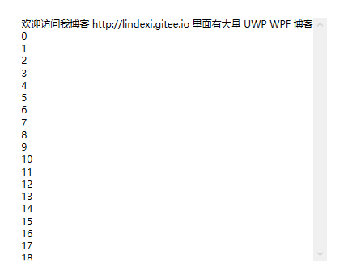

# WPF 开启 ScrollViewer 的触摸滚动

在 ScrollViewer 如果需要收到触摸消息，通过 Manipulation 触摸滚动，不能只是通过设置 IsManipulationEnabled 方法，还需要设置 PanningMode 才可以

<!--more-->


<!-- csdn -->

那么如何知道滚动条的触摸事件是否触发，可以写一个类继承滚动条

```csharp
    public class StisvearpaHudalserevow : ScrollViewer
    {
        /// <inheritdoc />
        protected override void OnManipulationDelta(ManipulationDeltaEventArgs e)
        {
            Debug.WriteLine("OnManipulationDelta");
            base.OnManipulationDelta(e);
        }

        /// <inheritdoc />
        protected override void OnManipulationCompleted(ManipulationCompletedEventArgs e)
        {
            Debug.WriteLine("OnManipulationCompleted");
            base.OnManipulationCompleted(e);
        }

        /// <inheritdoc />
        protected override void OnManipulationStarted(ManipulationStartedEventArgs e)
        {
            Debug.WriteLine("OnManipulationStarted");
            base.OnManipulationStarted(e);
        }
    }

```

在界面添加这个类，如果有触摸输入就可以通过输出看到了，简单一个界面，可以看到默认的滚动条是不能滚动的

<!--  -->


同时触摸的时候没有输出

尝试添加 IsManipulationEnabled 方法

```csharp
<local:StisvearpaHudalserevow IsManipulationEnabled="True">
```

可以看到有输出但是就是不能滚动

在我博客 [WPF 拖动滚动](https://blog.lindexi.com/post/WPF-%E6%8B%96%E5%8A%A8%E6%BB%9A%E5%8A%A8.html ) 告诉大家通过 PanningMode 的方法可以让滚动条滚动

只要在初始的过程设置了 PanningMode 因为在代码里面通过 InvalidateProperty 重新设置 IsManipulationEnabled 的值，所以只需要设置 PanningMode 就可以

```csharp
       /// <summary>
        ///     Method which sets IsManipulationEnabled
        ///     property based on the PanningMode
        /// </summary>
        private void OnPanningModeChanged()
        {
            PanningMode mode = PanningMode;
 
            // Call InvalidateProperty for IsManipulationEnabledProperty
            // to reset previous SetCurrentValueInternal if any. 
            // Then call SetCurrentValueInternal to
            // set the value of these properties if needed.
            InvalidateProperty(IsManipulationEnabledProperty);
 
            if (mode != PanningMode.None)
            {
                SetCurrentValueInternal(IsManipulationEnabledProperty, BooleanBoxes.TrueBox);
            }
        }
```

但是如果在触摸的过程，出现了设置 IsManipulationEnabled 为 false 就会触发 OnManipulationCompleted 事件

```csharp
        protected override void OnManipulationStarted(ManipulationStartedEventArgs e)
        {
            Debug.WriteLine("OnManipulationStarted");
            base.OnManipulationStarted(e);

            Task.Delay(TimeSpan.FromSeconds(3)).ContinueWith(_ => IsManipulationEnabled = false,
                TaskScheduler.FromCurrentSynchronizationContext());
        }
```

还可以通过设置 `IsHitTestVisible = false` 触发 OnManipulationCompleted 同时触发之后也没有触摸


<a rel="license" href="http://creativecommons.org/licenses/by-nc-sa/4.0/"></a><br />本作品采用<a rel="license" href="http://creativecommons.org/licenses/by-nc-sa/4.0/">知识共享署名-非商业性使用-相同方式共享 4.0 国际许可协议</a>进行许可。欢迎转载、使用、重新发布，但务必保留文章署名[林德熙](http://blog.csdn.net/lindexi_gd)(包含链接:http://blog.csdn.net/lindexi_gd )，不得用于商业目的，基于本文修改后的作品务必以相同的许可发布。如有任何疑问，请与我[联系](mailto:lindexi_gd@163.com)。