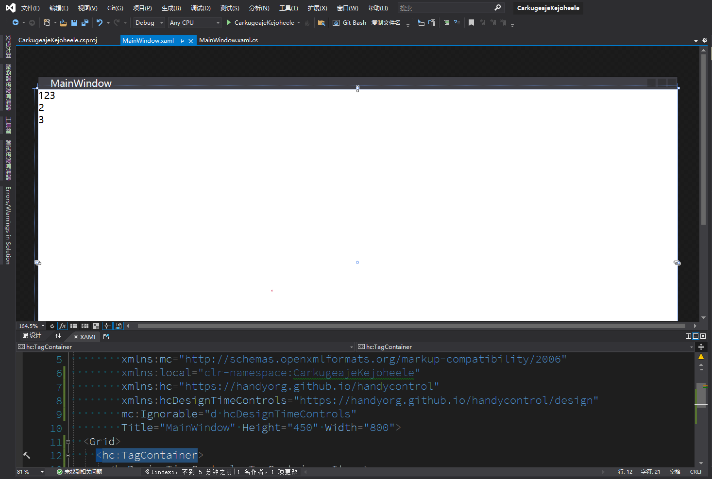
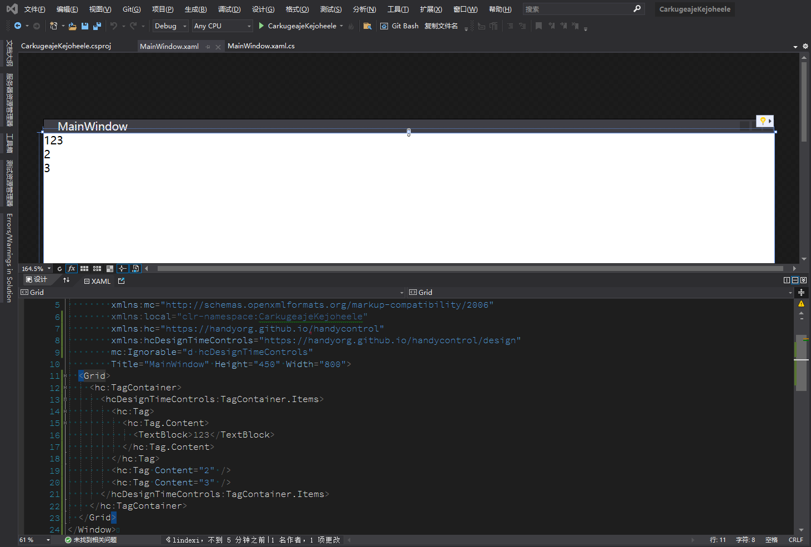

# WPF 引用第三方库的控件在设计器加上设计时数据和属性

本文告诉大家如何在 VisualStudio 2022 的 XAML 设计器中，在设计时给第三方控件加上设计用的属性和数据的方法

<!--more-->


<!-- 发布 -->

此功能要求使用不低于 VisualStudio 2019 的 16.8 版本以上，要求第三方控件设计上不要太过诡异（稍微偏离规范问题不大）即可在 XAML 设计上使用此功能

在 2020 重新组建(谜)的 XAML 设计器团队给 WPF 的设计时带来了更强的功能，可以让 `d:` 设置任意的设计时属性，例如给 `TextBlock` 加上设计用到的内容。这些设计用到的内容，在运行时是被完全忽略的，如下面代码

```xml
<TextBlock Text="{Binding Name}" d:Text="Name!" />
```

对于第三方的库引用，也是受支持的。本文使用 [HandyControl](https://github.com/HandyOrg/HandyControl) 作为例子，告诉大家如何使用设计时的属性设置

将使用 TagContainer 控件作为例子，在此控件中，可以设置 TagContainer.Items 的内容，期望在设计时有如下效果

<!--  -->


给 [HandyControl](https://github.com/HandyOrg/HandyControl) 加上设计时之前，需要加上此控件的设计时引用，如下面代码

```xml
  xmlns:hcDesignTimeControls="https://handyorg.github.io/handycontrol/design"
```

对于绝大部分控件库来说，都是简单在后缀上加上 `/design` 即可。对于控件库开发者来说，也不需要额外做什么，这是自然的支持

需要将上面定义的 `hcDesignTimeControls` 也加入到 `mc:Ignorable` 里面，用来告诉 XAML 构建，这是一个设计时的内容，还请忽略。否则对于一些控件库来说，将会提示找不到对应的属性

```csharp
        xmlns:hc="https://handyorg.github.io/handycontrol"
        xmlns:hcDesignTimeControls="https://handyorg.github.io/handycontrol/design"
        mc:Ignorable="d hcDesignTimeControls"
```

编写的 TagContainer 控件内容如下

```xml
    <hc:TagContainer>
      <hcDesignTimeControls:TagContainer.Items>
        <hc:Tag>
          <hc:Tag.Content>
            <TextBlock>123</TextBlock>
          </hc:Tag.Content>
        </hc:Tag>
        <hc:Tag Content="2" />
        <hc:Tag Content="3" />
      </hcDesignTimeControls:TagContainer.Items>
    </hc:TagContainer>
```

效果如下

<!--  -->


更多请看

[Use Design Time Data with the XAML Designer in Visual Studio - Visual Studio (Windows)](https://docs.microsoft.com/en-us/visualstudio/xaml-tools/xaml-designtime-data?view=vs-2022&WT.mc_id=WD-MVP-5003260 )

[What's the correct syntax for third-party control design-time property assign? · Issue #5766 · dotnet/wpf](https://github.com/dotnet/wpf/issues/5766 )


<a rel="license" href="http://creativecommons.org/licenses/by-nc-sa/4.0/"></a><br />本作品采用<a rel="license" href="http://creativecommons.org/licenses/by-nc-sa/4.0/">知识共享署名-非商业性使用-相同方式共享 4.0 国际许可协议</a>进行许可。欢迎转载、使用、重新发布，但务必保留文章署名[林德熙](http://blog.csdn.net/lindexi_gd)(包含链接:http://blog.csdn.net/lindexi_gd )，不得用于商业目的，基于本文修改后的作品务必以相同的许可发布。如有任何疑问，请与我[联系](mailto:lindexi_gd@163.com)。