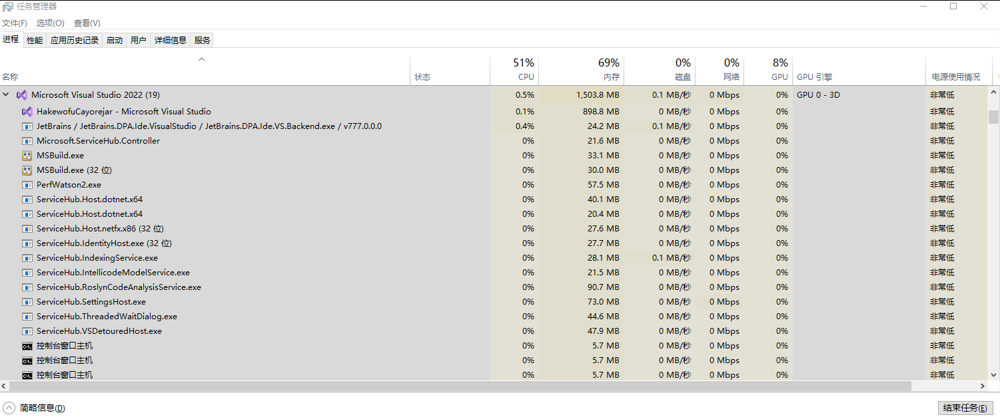

# WPF 探索任务管理器的进程分组逻辑

在看到 Win10 或 Win11 的 Task Manager 任务管理器时，不知大家是否有一个疑问，在 进程 标签里的应用进程是如何分组的。为什么有些组能包含很多个不同的进程，有些只能包含一个。本文将使用 WPF 写一个简单的应用来告诉大家任务管理器的进程分组策略

<!--more-->


<!-- 发布 -->
<!-- 博客 -->

如下图，这是任务管理器看到的 VisualStudio 的界面，可以看到这个进程组里面包含很多个进程

<!--  -->


那任务管理器将这些进程放在一个组里面的依据是什么？我能否可以将我自己的进程放在一个组里面，或者反过来我不想让我的进程放在一个组里面

在开始之前，需要说明的是，当前的任务管理器是不开源的，我也没有找到权威的文档来说这个事情，问了微软的大佬们，也没有收到回复。因此本文只能说是基于测试的结果了解任务管理器的行为。要是微软想不开，改了行为，那本文给出的分组策略也许就不对

任务管理器的分组依据是：

前台进程所直接启动的后台进程，将会放入到此前台进程所在的组里面

这里的前台进程指的是应用里面可以看到的进程，也是有带主窗口且显示的进程

前台进程所直接启动的后台进程的逻辑含义是此前台进程和对应的后台进程有父子进程关系

而后台进程指的是没有前台主窗口的进程，和是否控制台应用没有很大的关系，如果是控制台应用且有前台控制台窗口主机，依然不会被加入组内。或者说控制台应用存在前台主窗口，也不会被加入组内。也就是说只取决于是否存在前台主窗口，和是否控制台应用没有本质关系，即使是没有主窗口 GUI 应用，在这里也被当成后台进程

后台进程和前台进程之间是可以转换的，当前台进程没有前台主窗口时将转换为后台进程，当后台进程有前台主窗口时将转换为前台进程

另外继承链上的父子孙关系情况下，情况有些复杂，能否将孙进程显示在一个进程组里面，取决于子进程的存活时间，如果子进程在启动孙进程之后很快就退出，那么孙进程将不会被计入组里。如果子进程在启动孙进程之后，没有很快退出，那么孙进程将会被计入组里

以上的策略是我通过测试了解的，接下来将告诉大家这个测试应用的代码是如何编写的

先测试 前台进程所直接启动的后台进程，将会放入到此前台进程所在的组里面 的情况。测试方法就是通过一个带前台主窗口进程，启动另一个没有带前台主窗口的进程，看看在任务管理器里面是否放在一个组里面

新建一个叫 HakewofuCayorejar 的 WPF 应用，本文的代码基于 .NET 7 编写

为了方便代码编写，这里启动的多个进程都是相同的一个应用，只不过通过命令行参数决定不同的行为。为了更好的控制应用的逻辑，这里删除了 App.xaml 和 App.xaml.cs 文件，更改为自己编写 Main 函数

添加 Program 类，代码如下，用来在没有传入参数的时候，显示 MainWindow 作为前台主窗口。如果有命令行参数，那就啥都不做

```csharp
static class Program
{
    [STAThread]
    static void Main(string[] args)
    {
        var application = new Application()
        {
            ShutdownMode = ShutdownMode.OnExplicitShutdown
        };
        application.Startup += (sender, eventArgs) =>
        {
            if (args.Length == 0)
            {
                var mainWindow = new MainWindow();
                mainWindow.Show();
            }
            else
            {
            }
        };
        application.Run();
    }
}
```

在 MainWindow 放一个按钮，点击按钮的时候，启动进程，传入参数

```csharp
    private void Button_OnClick(object sender, RoutedEventArgs e)
    {
        var file = System.IO.Path.GetFullPath("HakewofuCayorejar.exe");
        Process.Start(file, "xxxxx");
    }
```

运行代码，然后点击按钮，接着看任务管理器，可以看到任务管理器里面的 HakewofuCayorejar 组将随着按钮的点击，可以看到越来越多的进程

再接着，关闭 HakewofuCayorejar 的 MainWindow 窗口，可以看到在任务管理器里面的应用刷新了，找不到 HakewofuCayorejar 组。只有在任务管理器的后台进程才能找到 HakewofuCayorejar 进程，这就证明了 HakewofuCayorejar 在关闭前台主窗口之后，从原本的前台进程转换为后台进程

再编辑一下代码测试任务管理器的更多行为，测试当一个后台进程转换为前台进程时的任务管理器行为情况，更改以上代码的 Program 代码，让带参数的进程等待几秒之后显示主窗口

```csharp

static class Program
{
    [STAThread]
    static void Main(string[] args)
    {
        var application = new Application()
        {
            ShutdownMode = ShutdownMode.OnExplicitShutdown
        };
        application.Startup += (sender, eventArgs) =>
        {
            if (args.Length == 0)
            {
                var mainWindow = new MainWindow();
                mainWindow.Show();
            }
            else
            {
                application.Dispatcher.InvokeAsync(async () =>
                {
                    await Task.Delay(5000);
                    var mainWindow = new MainWindow();
                    mainWindow.Show();
                });
            }
        };
        application.Run();
    }
}
```


运行代码，点击按钮，可以看到开始是将新的 HakewofuCayorejar 进程放入到第一个 HakewofuCayorejar 进程的组里面。但是等待一会，就可以看到任务管理器刷新了界面，拆开为两个 HakewofuCayorejar 组。这就证明了后台进程是可以通过显示前台主窗口转换为前台进程

接着测试父子孙进程的情况，测试孙进程是否被加入任务管理器的组里，取决于子进程在启动孙进程进程之后还能存在多久

更改 Program 的代码如下

```csharp
static class Program
{
    [STAThread]
    static void Main(string[] args)
    {
        var application = new Application()
        {
            ShutdownMode = ShutdownMode.OnExplicitShutdown
        };
        application.Startup += async (sender, eventArgs) =>
        {
            if (args.Length == 0)
            {
                var mainWindow = new MainWindow();
                mainWindow.Show();
            }
            else if (args.Length == 1)
            {
                var file = System.IO.Path.GetFullPath("HakewofuCayorejar.exe");
                Process.Start(file, "xxxxx xxxxx");
                await Task.Delay(10);
                application.Shutdown();
            }
        };
        application.Run();
    }
}
```


让子进程使用两个参数启动孙进程，然后延迟 10 毫秒再退出

运行应用，不断点击按钮，让子进程启动孙进程。通过任务管理器可以看到，任务管理器的组里面有多少个进程，完全看任务管理器的心情或者说子进程的退出延迟。偶尔孙进程加入到组里面，偶尔孙进程没有加入组里面

本文的代码放在 [github](https://github.com/lindexi/lindexi_gd/tree/af83d991a8bc603d64501d27e8cf511b3cefbf81/HakewofuCayorejar) 和 [gitee](https://gitee.com/lindexi/lindexi_gd/tree/af83d991a8bc603d64501d27e8cf511b3cefbf81/HakewofuCayorejar) 欢迎访问

可以通过如下方式获取本文的源代码，先创建一个空文件夹，接着使用命令行 cd 命令进入此空文件夹，在命令行里面输入以下代码，即可获取到本文的代码

```
git init
git remote add origin https://gitee.com/lindexi/lindexi_gd.git
git pull origin af83d991a8bc603d64501d27e8cf511b3cefbf81
```

以上使用的是 gitee 的源，如果 gitee 不能访问，请替换为 github 的源。请在命令行继续输入以下代码

```
git remote remove origin
git remote add origin https://github.com/lindexi/lindexi_gd.git
git pull origin af83d991a8bc603d64501d27e8cf511b3cefbf81
```

获取代码之后，进入 HakewofuCayorejar 文件夹


<a rel="license" href="http://creativecommons.org/licenses/by-nc-sa/4.0/"></a><br />本作品采用<a rel="license" href="http://creativecommons.org/licenses/by-nc-sa/4.0/">知识共享署名-非商业性使用-相同方式共享 4.0 国际许可协议</a>进行许可。欢迎转载、使用、重新发布，但务必保留文章署名[林德熙](http://blog.csdn.net/lindexi_gd)(包含链接:http://blog.csdn.net/lindexi_gd )，不得用于商业目的，基于本文修改后的作品务必以相同的许可发布。如有任何疑问，请与我[联系](mailto:lindexi_gd@163.com)。