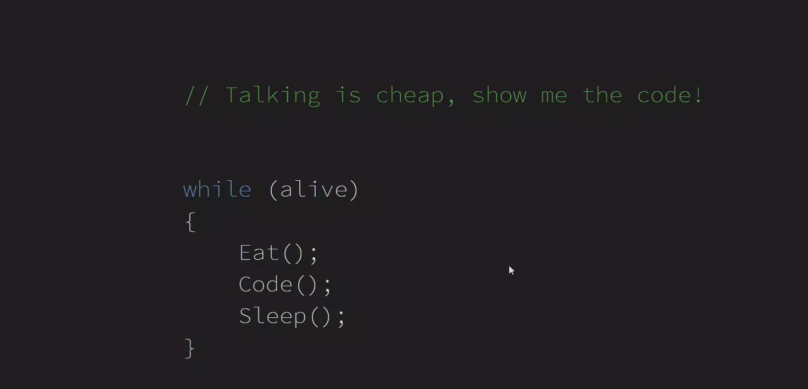

# WPF 滑动修改音量控件

本文来分享一个简单的控件，滑动的时候显示音量控制条

<!--more-->

<!-- CreateTime:2020/12/23 9:24:04 -->

<!-- 发布 -->

先来一张效果图

<!--  -->

这是一个特别简单的控件，代码放在[github](https://github.com/lindexi/lindexi_gd/tree/aa1ba2b2/KeenaihemchiQallhawearhina)欢迎小伙伴访问

 本作品采用<a rel="license" href="http://creativecommons.org/licenses/by-nc-sa/4.0/">知识共享署名-非商业性使用-相同方式共享 4.0 国际许可协议</a>进行许可。欢迎转载、使用、重新发布，但务必保留文章署名[林德熙](http://blog.csdn.net/lindexi_gd)(包含链接:http://blog.csdn.net/lindexi_gd )，不得用于商业目的，基于本文修改后的作品务必以相同的许可发布。如有任何疑问，请与我[联系](mailto:lindexi_gd@163.com)。