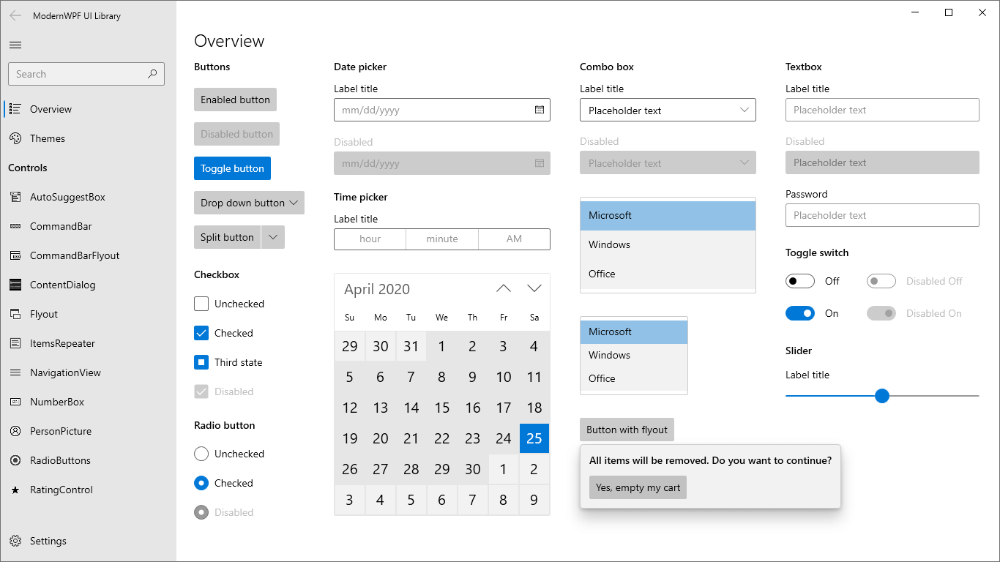

# WPF 漂亮的现代化控件 新 ModernWPF 界面库

这是一个在 GitHub 上完全开源的库，有十分漂亮的界面，整个都是 Win10 风，界面部分和默认 UWP 相近

<!--more-->


<!-- 发布 -->

这个库支持了 .NET Framework 4.5 和以上的版本，以及 .NET Core 3.0 和以上的版本，可以在 Windows Vista SP2 和以上的系统运行

界面如下

<!--  -->


使用方法简单，从 NuGet 上安装 ModernWpfUI 库，然后打开 App.xaml 添加下面代码

```xml
<Application
    ...
    xmlns:ui="http://schemas.modernwpf.com/2019">
    <Application.Resources>
        <ResourceDictionary>
            <ResourceDictionary.MergedDictionaries>
                <ui:ThemeResources />
                <ui:XamlControlsResources />
            </ResourceDictionary.MergedDictionaries>
        </ResourceDictionary>
    </Application.Resources>
</Application>
```

更多请到 GitHub 的仓库：[Kinnara/ModernWpf: Modern styles and controls for your WPF applications](https://github.com/Kinnara/ModernWpf )


<a rel="license" href="http://creativecommons.org/licenses/by-nc-sa/4.0/"></a><br />本作品采用<a rel="license" href="http://creativecommons.org/licenses/by-nc-sa/4.0/">知识共享署名-非商业性使用-相同方式共享 4.0 国际许可协议</a>进行许可。欢迎转载、使用、重新发布，但务必保留文章署名[林德熙](http://blog.csdn.net/lindexi_gd)(包含链接:http://blog.csdn.net/lindexi_gd )，不得用于商业目的，基于本文修改后的作品务必以相同的许可发布。如有任何疑问，请与我[联系](mailto:lindexi_gd@163.com)。