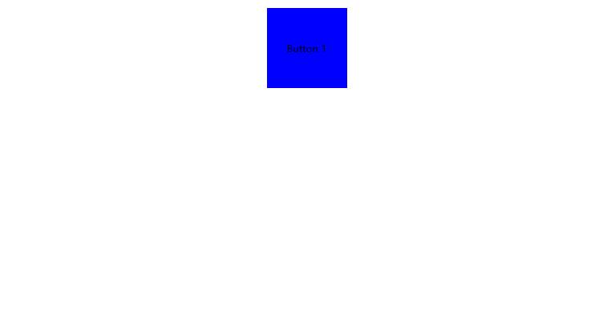

# WPF 点击按钮时更改按钮样式界面效果的 XAML 实现方法

在 WPF 中按钮 Button 将会吃掉路由事件，此时的 EventTrigger 如果通过 RoutedEvent 是 MouseLeftButtonDown 那么将会拿不到路由事件，也就触发不了，因此样式将不会变更。简单的解决方法就是通过 VisualStateManager 配合 VisualState 来实现

<!--more-->


<!-- CreateTime:2020/8/26 10:30:27 -->


实现效果如下，所有代码都是 XAML 代码

<!--  -->


实现方式为给 Button 定义一个样式，通过如下代码可以定义

```xml
<Style TargetType="Button">
</Style>
```

上面代码没有定义样式资源的 key 因此会对容器内所有的 Button 按钮样式生效，因此我将这个样式放在需要使用的容器里面，这样才不会干扰其他容器内的元素

```xml
<StackPanel>
    <StackPanel.Resources>
        <Style TargetType="Button"></Style>
    </StackPanel.Resources>
</StackPanel>
```

接着新建一个按钮，如下代码

```xml
<StackPanel>
    <StackPanel.Resources>
        <Style TargetType="Button"></Style>
    </StackPanel.Resources>
    <Button Margin="10,10,10,10" Width="100" Height="100" Content="Button 1" HorizontalAlignment="Center"
                    VerticalAlignment="Center" />
</StackPanel>
```

接下来就是核心逻辑了，通过重写 Button 的 Template 内容，给内容的 Border 添加一些必要样式

```xml
<Style TargetType="Button">
    <Setter Property="Template">
        <Setter.Value>
            <ControlTemplate TargetType="Button">
                <Border x:Name="Border">
                    <Border.RenderTransform>
                        <ScaleTransform />
                    </Border.RenderTransform>
                    <Grid>
                        <Rectangle Fill="Blue"/>
                        <ContentPresenter HorizontalAlignment="Center" VerticalAlignment="Center" />
                    </Grid>
                </Border>
            </ControlTemplate>
        </Setter.Value>
    </Setter>
</Style>
```

接着在 Border 添加 VisualStateManager 如下面代码

```xml
<Border x:Name="Border">
    <Border.RenderTransform>
        <ScaleTransform />
    </Border.RenderTransform>
    <VisualStateManager.VisualStateGroups>
        <VisualStateGroup x:Name="CommonStates">
            <VisualState x:Name="Normal" />
            <VisualState x:Name="Pressed"/>
        </VisualStateGroup>
    </VisualStateManager.VisualStateGroups>
    <Grid>
        <Rectangle Fill="Blue"/>
        <ContentPresenter HorizontalAlignment="Center" VerticalAlignment="Center" />
    </Grid>
</Border>
```

可以看到上面代码有两个 VisualState 分别是 Normal 和 Pressed 两个，其中 Pressed 表示的是鼠标按下，因此可以通过在 Pressed 添加动画实现更改样式

```xml
<VisualStateManager.VisualStateGroups>
    <VisualStateGroup x:Name="CommonStates">
        <VisualState x:Name="Normal" />
        <VisualState x:Name="Pressed">
            <Storyboard>
                <DoubleAnimation Storyboard.TargetProperty="(RenderTransform).(ScaleTransform.ScaleX)"
                                 To="0.5" />
                <DoubleAnimation Storyboard.TargetProperty="(RenderTransform).(ScaleTransform.ScaleY)"
                                 To="0.5" />
            </Storyboard>
        </VisualState>
    </VisualStateGroup>
</VisualStateManager.VisualStateGroups>
```

如上面代码是更改缩放

那么抬起呢？其实抬起就是非 Pressed 也就是 Normal 状态，啥都不写将会自动还原为属性的值。原理是在依赖属性里面，其实属性是一个属性列表，将会取优先级最高的一个，而优先级是这样排序的

```
属性系统强制

活动动画或具有 Hold 行为的动画

本地值

TemplatedParent 模板属性

隐式样式

样式触发器

模板触发器

样式资源库

默认（主题）样式

继承

来自依赖属性元数据的默认值
```

详细请看 [依赖项属性值优先级](https://docs.microsoft.com/zh-cn/dotnet/framework/wpf/advanced/dependency-property-value-precedence )

所有代码如下

```xml
        <StackPanel>
            <StackPanel.Resources>
                <Style TargetType="Button">
                    <Setter Property="Template">
                        <Setter.Value>
                            <ControlTemplate TargetType="Button">
                                <Border x:Name="Border">
                                    <Border.RenderTransform>
                                        <ScaleTransform />
                                    </Border.RenderTransform>
                                    <VisualStateManager.VisualStateGroups>
                                        <VisualStateGroup x:Name="CommonStates">
                                            <VisualState x:Name="Normal" />
                                            <VisualState x:Name="Pressed">
                                                <Storyboard>
                                                    <DoubleAnimation
                                                        Storyboard.TargetProperty="(RenderTransform).(ScaleTransform.ScaleX)"
                                                        To="0.5" />
                                                    <DoubleAnimation
                                                        Storyboard.TargetProperty="(RenderTransform).(ScaleTransform.ScaleY)"
                                                        To="0.5" />
                                                </Storyboard>
                                            </VisualState>
                                        </VisualStateGroup>
                                    </VisualStateManager.VisualStateGroups>

                                    <Grid>
                                        <Rectangle Fill="Blue"/>
                                        <ContentPresenter HorizontalAlignment="Center" VerticalAlignment="Center" />
                                    </Grid>
                                </Border>
                            </ControlTemplate>
                        </Setter.Value>
                    </Setter>
                </Style>
            </StackPanel.Resources>

            <Button Margin="10,10,10,10" Width="100" Height="100" Content="Button 1" HorizontalAlignment="Center"
                    VerticalAlignment="Center" />
        </StackPanel>

```

代码放在 [github](https://github.com/lindexi/lindexi_gd/tree/46dd1572/Babukeelleneeoai) 欢迎小伙伴访问

当然，本文有很多知识点没有聊到，包括 Style 是什么，以及属性的配置应该如何写，还有动画 DoubleAnimation 是什么等等。我特别推荐小伙伴入门的时候看 [微软技术教程 - 哔哩哔哩 ( ゜- ゜)つロ 乾杯~ Bilibili](https://space.bilibili.com/32497462 ) 的免费教程视频，包含了这些细节


<a rel="license" href="http://creativecommons.org/licenses/by-nc-sa/4.0/"></a><br />本作品采用<a rel="license" href="http://creativecommons.org/licenses/by-nc-sa/4.0/">知识共享署名-非商业性使用-相同方式共享 4.0 国际许可协议</a>进行许可。欢迎转载、使用、重新发布，但务必保留文章署名[林德熙](http://blog.csdn.net/lindexi_gd)(包含链接:http://blog.csdn.net/lindexi_gd )，不得用于商业目的，基于本文修改后的作品务必以相同的许可发布。如有任何疑问，请与我[联系](mailto:lindexi_gd@163.com)。