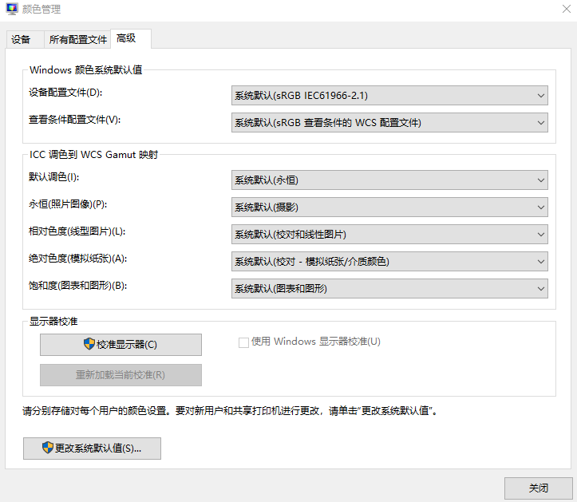

# WPF 界面打不开提示 System.ArithmeticException Overflow or underflow in the arithmetic operation 异常

本文告诉大家如何解决界面打不开，抛出 System.ArithmeticException: Overflow or underflow in the arithmetic operation 异常的修复方法

<!--more-->

<!-- 发布 -->
<!-- 博客 -->

这个问题是用户的电脑的颜色系统设备配置文件的问题，修复方法是进入 颜色管理 设置。进入的方法可以是搜 颜色管理 即可，或者是进入 设置->系统->高级显示设置->显示器1的显示适配器属性->进入颜色管理->点击颜色管理

实在不知道的话，自己百度搜如何进入颜色管理即可

点击进入高级页面，如下图

<!--  -->

英文版本的页面如下

要求你的应用的配置和我的相同，例如设备配置文件里，推荐是 sRGB IEC61996-2.1 的等

改完之后，点击关闭即可。另外值得一提的是这个界面是当前用户的配置，如果想要改本机的，可以进入更改系统默认值进行设置

修改完成之后，推荐重启电脑

 本作品采用<a rel="license" href="http://creativecommons.org/licenses/by-nc-sa/4.0/">知识共享署名-非商业性使用-相同方式共享 4.0 国际许可协议</a>进行许可。欢迎转载、使用、重新发布，但务必保留文章署名[林德熙](http://blog.csdn.net/lindexi_gd)(包含链接:http://blog.csdn.net/lindexi_gd )，不得用于商业目的，基于本文修改后的作品务必以相同的许可发布。如有任何疑问，请与我[联系](mailto:lindexi_gd@163.com)。