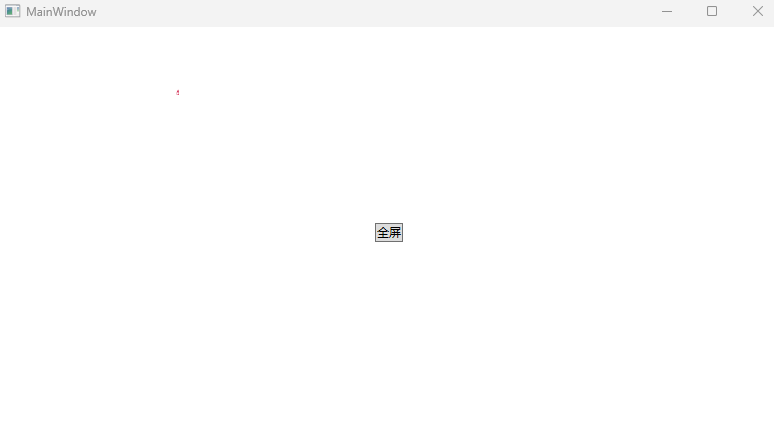

# WPF 稳定的全屏化窗口方法

本文来告诉大家在 WPF 中，设置窗口全屏化的一个稳定的设置方法。在设置窗口全屏的时候，经常遇到的问题就是应用程序虽然设置最大化加无边框，但是此方式经常会有任务栏冒出来，或者说窗口没有贴屏幕的边。本文的方法是基于 Win32 的，由 lsj 提供的方法，当前已在 1000 多万台设备上稳定运行超过三年时间，只有很少的电脑才偶尔出现任务栏不消失的情况

<!--more-->


<!-- CreateTime:2021/8/11 8:39:39 -->

<!-- 发布 -->

简单的 WPF 全屏窗口只需设置 WindowStyle 和 WindowState 属性即可，如以下 XAML 代码

```xml
<Window 
        ...
        Title="MainWindow" Height="450" Width="800"
        WindowStyle="None" WindowState="Maximized">
        ...
</Window>
```

或如下的后台 cs 代码

```csharp
        Window window = xxx;
        window.WindowStyle = WindowStyle.None;
        window.WindowState = WindowState.Maximized;
```

尽管以上的方法足够简单且大部分情况下行之有效，然而在很多用户的设备上都会常遇到任务栏冒出来，或者说窗口没有贴屏幕的边等问题

本文提供了基于 win32 的稳定方法，经过了大量设备的运行测试，基本可以确认本文的方法是非常稳定的全屏窗口的方法，只有很少的电脑才偶尔出现任务栏不消失的情况。本文的所使用的方法由 [lsj](https://blog.sdlsj.net/) 提供，我只是一个记录此技术的工具人

本文的方法核心方式是通过 Hook 的方式获取当前窗口的 Win32 消息，在消息里面获取显示器信息，根据获取显示器信息来设置窗口的尺寸和左上角的值。可以支持在全屏，多屏的设备上稳定设置全屏。支持在全屏之后，窗口可通过 API 方式（也可以用 Win + Shift + Left/Right）移动，调整大小，但会根据目标矩形寻找显示器重新调整到全屏状态

设置全屏在 Windows 的要求就是覆盖屏幕的每个像素，也就是要求窗口盖住整个屏幕、窗口没有WS_THICKFRAME样式、窗口不能有标题栏且最大化

使用本文提供的 FullScreenHelper 类的 StartFullScreen 方法即可进入全屏。进入全屏的窗口必须具备的要求如上文所述，不能有标题栏。如以下的演示例子，设置窗口样式 `WindowStyle="None"` 如下面代码

```xml
<Window x:Class="KenafearcuweYemjecahee.MainWindow"
        xmlns="http://schemas.microsoft.com/winfx/2006/xaml/presentation"
        xmlns:x="http://schemas.microsoft.com/winfx/2006/xaml"
        xmlns:d="http://schemas.microsoft.com/expression/blend/2008"
        xmlns:mc="http://schemas.openxmlformats.org/markup-compatibility/2006"
        xmlns:local="clr-namespace:KenafearcuweYemjecahee"
        mc:Ignorable="d" WindowStyle="None"
        Title="MainWindow" Height="450" Width="800"/>
```

窗口样式不是强行要求，可以根据自己的业务决定。但如果有窗口样式，那将根据窗口的样式决定全屏的行为。我推荐默认设置为 `WindowStyle="None"` 用于解决默认的窗口没有贴边的问题

为了演示如何调用全屏方法，我在窗口添加一个按钮，在点击按钮时，在后台代码进入或退出全屏

```xml
    <ToggleButton HorizontalAlignment="Center" VerticalAlignment="Center" Click="Button_OnClick">全屏</ToggleButton>
```

以下是点击按钮的逻辑

```csharp
        private void Button_OnClick(object sender, RoutedEventArgs e)
        {
            var toggleButton = (ToggleButton)sender;

            if (toggleButton.IsChecked is true)
            {
                FullScreenHelper.StartFullScreen(this);
            }
            else
            {
                FullScreenHelper.EndFullScreen(this);
            }
        }
```

本文其实是将原本团队内部的逻辑抄了一次，虽然我能保证团队内的版本是稳定的，但是我不能保证在抄的过程中，我写了一些逗比逻辑，让这个全屏代码不稳定

以下是具体的实现方法，如不想了解细节，那请到本文最后拷贝代码即可。本文的方法已经合入到 <https://github.com/HandyOrg/HandyControl> 仓库，不想抄代码的伙伴可以直接使用 <https://www.nuget.org/packages/HandyControl> 库

先来聊聊 StartFullScreen 方法的实现。此方法需要实现让没有全屏的窗口进入全屏，已进入全屏的窗口啥都不做。在窗口退出全屏时，还原进入全屏之前的窗口的状态。为此，设置两个附加属性，用来分别记录窗口全屏前位置和样式的附加属性，在进入全屏窗口的方法尝试获取窗口信息设置到附加属性

```csharp
        /// <summary>
        /// 用于记录窗口全屏前位置的附加属性
        /// </summary>
        private static readonly DependencyProperty BeforeFullScreenWindowPlacementProperty =
            DependencyProperty.RegisterAttached("BeforeFullScreenWindowPlacement", typeof(WINDOWPLACEMENT?),
                typeof(Window));

        /// <summary>
        /// 用于记录窗口全屏前样式的附加属性
        /// </summary>
        private static readonly DependencyProperty BeforeFullScreenWindowStyleProperty =
            DependencyProperty.RegisterAttached("BeforeFullScreenWindowStyle", typeof(WindowStyles?), typeof(Window));

        public static void StartFullScreen(Window window)
        {
            //确保不在全屏模式
            if (window.GetValue(BeforeFullScreenWindowPlacementProperty) == null &&
                window.GetValue(BeforeFullScreenWindowStyleProperty) == null)
            {
                var hwnd = new WindowInteropHelper(window).EnsureHandle();
                var hwndSource = HwndSource.FromHwnd(hwnd);

                //获取当前窗口的位置大小状态并保存
                var placement = new WINDOWPLACEMENT();
                placement.Size = (uint) Marshal.SizeOf(placement);
                Win32.User32.GetWindowPlacement(hwnd, ref placement);
                window.SetValue(BeforeFullScreenWindowPlacementProperty, placement);

                //获取窗口样式
                var style = (WindowStyles) Win32.User32.GetWindowLongPtr(hwnd, GetWindowLongFields.GWL_STYLE);
                window.SetValue(BeforeFullScreenWindowStyleProperty, style);
            }
            else
            {
                 // 窗口在全屏，啥都不用做
            }
        }
```

以上代码用到的 Win32 方法和类型定义，都可以在本文最后获取到，在这里就不详细写出

在进入全屏模式时，需要完成的步骤如下

- 需要将窗口恢复到还原模式，在有标题栏的情况下最大化模式下无法全屏。去掉 `WS_MAXIMIZE` 样式，使窗口变成还原状。不能使用 `ShowWindow(hwnd, ShowWindowCommands.SW_RESTORE)` 方法，避免看到窗口变成还原状态这一过程，也避免影响窗口的 `Visible` 状态

- 需要去掉 `WS_THICKFRAME` 样式，在有该样式的情况下不能全屏

- 去掉 `WS_MAXIMIZEBOX` 样式，禁用最大化，如果最大化会退出全屏

```csharp
   style &= (~(WindowStyles.WS_THICKFRAME | WindowStyles.WS_MAXIMIZEBOX | WindowStyles.WS_MAXIMIZE));
   Win32.User32.SetWindowLongPtr(hwnd, GetWindowLongFields.GWL_STYLE, (IntPtr) style);
```

以上写法是 Win32 函数调用的特有方式，习惯就好。在 Win32 的函数设计中，因为当初每个字节都是十分宝贵的，所以恨不得一个字节当成两个来用，这也就是参数为什么通过枚举的二进制方式，看起来很复杂的逻辑设置的原因

全屏的过程，如果有 DWM 动画，将会看到窗口闪烁。因此如果设备上有开启 DWM 那么进行关闭动画。对应的，需要在退出全屏的时候，重新打开 DWM 过渡动画

```csharp
                //禁用 DWM 过渡动画 忽略返回值，若DWM关闭不做处理
                Win32.Dwmapi.DwmSetWindowAttribute(hwnd, DWMWINDOWATTRIBUTE.DWMWA_TRANSITIONS_FORCEDISABLED, 1,
                    sizeof(int));
```

接着就是本文的核心逻辑部分，通过 Hook 的方式修改窗口全屏，使用如下代码添加 Hook 用来拿到窗口消息

```csharp
                //添加Hook，在窗口尺寸位置等要发生变化时，确保全屏
                hwndSource.AddHook(KeepFullScreenHook);

private static IntPtr KeepFullScreenHook(IntPtr hwnd, int msg, IntPtr wParam, IntPtr lParam, ref bool handled)
{
	// 代码忽略，在下文将告诉大家
}       
```

为了触发 KeepFullScreenHook 方法进行实际的设置窗口全屏，可以通过设置一下窗口的尺寸的方法，如下面代码

```csharp
                if (Win32.User32.GetWindowRect(hwnd, out var rect))
                {
                    //不能用 placement 的坐标，placement是工作区坐标，不是屏幕坐标。

                    //使用窗口当前的矩形调用下设置窗口位置和尺寸的方法，让Hook来进行调整窗口位置和尺寸到全屏模式
                    Win32.User32.SetWindowPos(hwnd, (IntPtr) HwndZOrder.HWND_TOP, rect.Left, rect.Top, rect.Width,
                        rect.Height, (int) WindowPositionFlags.SWP_NOZORDER);
                }
```

这就是 StartFullScreen 的所有代码

```csharp
        /// <summary>
        /// 开始进入全屏模式
        /// 进入全屏模式后，窗口可通过 API 方式（也可以用 Win + Shift + Left/Right）移动，调整大小，但会根据目标矩形寻找显示器重新调整到全屏状态。
        /// 进入全屏后，不要修改样式等窗口属性，在退出时，会恢复到进入前的状态
        /// 进入全屏模式后会禁用 DWM 过渡动画
        /// </summary>
        /// <param name="window"></param>
        public static void StartFullScreen(Window window)
        {
            if (window == null)
            {
                throw new ArgumentNullException(nameof(window), $"{nameof(window)} 不能为 null");
            }

            //确保不在全屏模式
            if (window.GetValue(BeforeFullScreenWindowPlacementProperty) == null &&
                window.GetValue(BeforeFullScreenWindowStyleProperty) == null)
            {
                var hwnd = new WindowInteropHelper(window).EnsureHandle();
                var hwndSource = HwndSource.FromHwnd(hwnd);

                //获取当前窗口的位置大小状态并保存
                var placement = new WINDOWPLACEMENT();
                placement.Size = (uint) Marshal.SizeOf(placement);
                Win32.User32.GetWindowPlacement(hwnd, ref placement);
                window.SetValue(BeforeFullScreenWindowPlacementProperty, placement);

                //修改窗口样式
                var style = (WindowStyles) Win32.User32.GetWindowLongPtr(hwnd, GetWindowLongFields.GWL_STYLE);
                window.SetValue(BeforeFullScreenWindowStyleProperty, style);
                //将窗口恢复到还原模式，在有标题栏的情况下最大化模式下无法全屏,
                //这里采用还原，不修改标题栏的方式
                //在退出全屏时，窗口原有的状态会恢复
                //去掉WS_THICKFRAME，在有该样式的情况下不能全屏
                //去掉WS_MAXIMIZEBOX，禁用最大化，如果最大化会退出全屏
                //去掉WS_MAXIMIZE，使窗口变成还原状态，不使用ShowWindow(hwnd, ShowWindowCommands.SW_RESTORE)，避免看到窗口变成还原状态这一过程（也避免影响窗口的Visible状态）
                style &= (~(WindowStyles.WS_THICKFRAME | WindowStyles.WS_MAXIMIZEBOX | WindowStyles.WS_MAXIMIZE));
                Win32.User32.SetWindowLongPtr(hwnd, GetWindowLongFields.GWL_STYLE, (IntPtr) style);

                //禁用 DWM 过渡动画 忽略返回值，若DWM关闭不做处理
                Win32.Dwmapi.DwmSetWindowAttribute(hwnd, DWMWINDOWATTRIBUTE.DWMWA_TRANSITIONS_FORCEDISABLED, 1,
                    sizeof(int));

                //添加Hook，在窗口尺寸位置等要发生变化时，确保全屏
                hwndSource.AddHook(KeepFullScreenHook);

                if (Win32.User32.GetWindowRect(hwnd, out var rect))
                {
                    //不能用 placement 的坐标，placement是工作区坐标，不是屏幕坐标。

                    //使用窗口当前的矩形调用下设置窗口位置和尺寸的方法，让Hook来进行调整窗口位置和尺寸到全屏模式
                    Win32.User32.SetWindowPos(hwnd, (IntPtr) HwndZOrder.HWND_TOP, rect.Left, rect.Top, rect.Width,
                        rect.Height, (int) WindowPositionFlags.SWP_NOZORDER);
                }
            }
        }
```

在 KeepFullScreenHook 方法就是核心的逻辑，通过收到 Win 消息，判断是 `WM_WINDOWPOSCHANGING` 消息，获取当前屏幕范围，设置给窗口

```csharp
        /// <summary>
        /// 确保窗口全屏的Hook
        /// 使用HandleProcessCorruptedStateExceptions，防止访问内存过程中因为一些致命异常导致程序崩溃
        /// </summary>
        [HandleProcessCorruptedStateExceptions]
        private static IntPtr KeepFullScreenHook(IntPtr hwnd, int msg, IntPtr wParam, IntPtr lParam, ref bool handled)
        {
            //处理WM_WINDOWPOSCHANGING消息
            const int WINDOWPOSCHANGING = 0x0046;
            if (msg != WINDOWPOSCHANGING) return IntPtr.Zero;

            // 忽略代码
        }
```

此方法会用到一些 Win32 的内存访问，虽然以上代码在实际测试中和在实际的用户设备上运行没有发现问题，但是当时在写的时候，为了防止访问内存过程中因为一些致命异常导致程序崩溃，就加上了 `HandleProcessCorruptedStateExceptions` 特性。在 dotnet core 下，此 HandleProcessCorruptedStateExceptionsAttribute 特性已失效。详细请看 [升级到 dotnet core 之后 HandleProcessCorruptedStateExceptions 无法接住异常](https://blog.lindexi.com/post/%E5%8D%87%E7%BA%A7%E5%88%B0-dotnet-core-%E4%B9%8B%E5%90%8E-HandleProcessCorruptedStateExceptions-%E6%97%A0%E6%B3%95%E6%8E%A5%E4%BD%8F%E5%BC%82%E5%B8%B8.html )

按照 Win32 消息的定义，可以先获取WINDOWPOS结构体

```csharp
                //得到WINDOWPOS结构体
                var pos = (WindowPosition) Marshal.PtrToStructure(lParam, typeof(WindowPosition));

                if ((pos.Flags & WindowPositionFlags.SWP_NOMOVE) != 0 &&
                    (pos.Flags & WindowPositionFlags.SWP_NOSIZE) != 0)
                {
                    //既然你既不改变位置，也不改变尺寸，我就不管了...
                    return IntPtr.Zero;
                }
```

通过 IsIconic 方法判断当前窗口是否被最小化，如果最小化也不做全屏

```csharp
                if (Win32.User32.IsIconic(hwnd))
                {
                    // 如果在全屏期间最小化了窗口，那么忽略后续的位置调整。
                    // 否则按后续逻辑，会根据窗口在 -32000 的位置，计算出错误的目标位置，然后就跳到主屏了。
                    return IntPtr.Zero;
                }
```

如果在最小化也做全屏，将会因为最小化的窗口的 Y 坐标在 -32000 的位置，在全屏的设备上，如果是在副屏最小化的，将会计算出错误的目标位置，然后就跳到主屏了

获取窗口的现在的矩形，用来计算窗口所在显示器信息，然后将显示器的范围设置给窗口

```csharp
                //获取窗口现在的矩形，下面用来参考计算目标矩形
                if (Win32.User32.GetWindowRect(hwnd, out var rect))
                {
                    var targetRect = rect; //窗口想要变化的目标矩形

                    if ((pos.Flags & WindowPositionFlags.SWP_NOMOVE) == 0)
                    {
                        //需要移动
                        targetRect.Left = pos.X;
                        targetRect.Top = pos.Y;
                    }

                    if ((pos.Flags & WindowPositionFlags.SWP_NOSIZE) == 0)
                    {
                        //要改变尺寸
                        targetRect.Right = targetRect.Left + pos.Width;
                        targetRect.Bottom = targetRect.Top + pos.Height;
                    }
                    else
                    {
                        //不改变尺寸
                        targetRect.Right = targetRect.Left + rect.Width;
                        targetRect.Bottom = targetRect.Top + rect.Height;
                    }

                    //使用目标矩形获取显示器信息
                    var monitor = Win32.User32.MonitorFromRect(targetRect, MonitorFlag.MONITOR_DEFAULTTOPRIMARY);
                    var info = new MonitorInfo();
                    info.Size = (uint) Marshal.SizeOf(info);
                    if (Win32.User32.GetMonitorInfo(monitor, ref info))
                    {
                        //基于显示器信息设置窗口尺寸位置
                        pos.X = info.MonitorRect.Left;
                        pos.Y = info.MonitorRect.Top;
                        pos.Width = info.MonitorRect.Right - info.MonitorRect.Left;
                        pos.Height = info.MonitorRect.Bottom - info.MonitorRect.Top;
                        pos.Flags &= ~(WindowPositionFlags.SWP_NOSIZE | WindowPositionFlags.SWP_NOMOVE |
                                       WindowPositionFlags.SWP_NOREDRAW);
                        pos.Flags |= WindowPositionFlags.SWP_NOCOPYBITS;

                        if (rect == info.MonitorRect)
                        {
                            var hwndSource = HwndSource.FromHwnd(hwnd);
                            if (hwndSource?.RootVisual is Window window)
                            {
                                //确保窗口的 WPF 属性与 Win32 位置一致，防止有逗比全屏后改 WPF 的属性，发生一些诡异的行为
                                //下面这样做其实不太好，会再次触发 WM_WINDOWPOSCHANGING 来着.....但是又没有其他时机了
                                // WM_WINDOWPOSCHANGED 不能用 
                                //（例如：在进入全屏后，修改 Left 属性，会进入 WM_WINDOWPOSCHANGING，然后在这里将消息里的结构体中的 Left 改回，
                                // 使对 Left 的修改无效，那么将不会进入 WM_WINDOWPOSCHANGED，窗口尺寸正常，但窗口的 Left 属性值错误。）
                                var logicalPos =
                                    hwndSource.CompositionTarget.TransformFromDevice.Transform(
                                        new System.Windows.Point(pos.X, pos.Y));
                                var logicalSize =
                                    hwndSource.CompositionTarget.TransformFromDevice.Transform(
                                        new System.Windows.Point(pos.Width, pos.Height));
                                window.Left = logicalPos.X;
                                window.Top = logicalPos.Y;
                                window.Width = logicalSize.X;
                                window.Height = logicalSize.Y;
                            }
                            else
                            {
                                //这个hwnd是前面从Window来的，如果现在他不是Window...... 你信么
                            }
                        }

                        //将修改后的结构体拷贝回去
                        Marshal.StructureToPtr(pos, lParam, false);
                    }
                }
```

这就是在 Hook 里面的逻辑，接下来看退出全屏的方法

在退出全屏需要设置为窗口进入全屏之前的样式等信息

```csharp
        /// <summary>
        /// 退出全屏模式
        /// 窗口会回到进入全屏模式时保存的状态
        /// 退出全屏模式后会重新启用 DWM 过渡动画
        /// </summary>
        /// <param name="window"></param>
        public static void EndFullScreen(Window window)
        {
            if (window == null)
            {
                throw new ArgumentNullException(nameof(window), $"{nameof(window)} 不能为 null");
            }

            //确保在全屏模式并获取之前保存的状态
            if (window.GetValue(BeforeFullScreenWindowPlacementProperty) is WINDOWPLACEMENT placement
                && window.GetValue(BeforeFullScreenWindowStyleProperty) is WindowStyles style)
            {
                var hwnd = new WindowInteropHelper(window).Handle;

                if (hwnd == IntPtr.Zero)
                {
                    // 句柄为 0 只有两种情况：
                    //  1. 虽然窗口已进入全屏，但窗口已被关闭；
                    //  2. 窗口初始化前，在还没有调用 StartFullScreen 的前提下就调用了此方法。
                    // 所以，直接 return 就好。
                    return;
                }

                var hwndSource = HwndSource.FromHwnd(hwnd);

                //去除hook
                hwndSource.RemoveHook(KeepFullScreenHook);

                //恢复保存的状态
                //不要改变Style里的WS_MAXIMIZE，否则会使窗口变成最大化状态，但是尺寸不对
                //也不要设置回Style里的WS_MINIMIZE,否则会导致窗口最小化按钮显示成还原按钮
                Win32.User32.SetWindowLongPtr(hwnd, GetWindowLongFields.GWL_STYLE,
                    (IntPtr) (style & (~(WindowStyles.WS_MAXIMIZE | WindowStyles.WS_MINIMIZE))));

                if ((style & WindowStyles.WS_MINIMIZE) != 0)
                {
                    //如果窗口进入全屏前是最小化的，这里不让窗口恢复到之前的最小化状态，而是到还原的状态。
                    //大多数情况下，都不期望在退出全屏的时候，恢复到最小化。
                    placement.ShowCmd = Win32.ShowWindowCommands.SW_RESTORE;
                }

                if ((style & WindowStyles.WS_MAXIMIZE) != 0)
                {
                    //提前调用 ShowWindow 使窗口恢复最大化，若通过 SetWindowPlacement 最大化会导致闪烁，只靠其恢复 RestoreBounds.
                    Win32.User32.ShowWindow(hwnd, Win32.ShowWindowCommands.SW_MAXIMIZE);
                }

                Win32.User32.SetWindowPlacement(hwnd, ref placement);

                if ((style & WindowStyles.WS_MAXIMIZE) ==
                    0) //如果窗口是最大化就不要修改WPF属性，否则会破坏RestoreBounds，且WPF窗口自身在最大化时，不会修改 Left Top Width Height 属性
                {
                    if (Win32.User32.GetWindowRect(hwnd, out var rect))
                    {
                        //不能用 placement 的坐标，placement是工作区坐标，不是屏幕坐标。

                        //确保窗口的 WPF 属性与 Win32 位置一致
                        var logicalPos =
                            hwndSource.CompositionTarget.TransformFromDevice.Transform(
                                new System.Windows.Point(rect.Left, rect.Top));
                        var logicalSize =
                            hwndSource.CompositionTarget.TransformFromDevice.Transform(
                                new System.Windows.Point(rect.Width, rect.Height));
                        window.Left = logicalPos.X;
                        window.Top = logicalPos.Y;
                        window.Width = logicalSize.X;
                        window.Height = logicalSize.Y;
                    }
                }

                //重新启用 DWM 过渡动画 忽略返回值，若DWM关闭不做处理
                Win32.Dwmapi.DwmSetWindowAttribute(hwnd, DWMWINDOWATTRIBUTE.DWMWA_TRANSITIONS_FORCEDISABLED, 0,
                    sizeof(int));

                //删除保存的状态
                window.ClearValue(BeforeFullScreenWindowPlacementProperty);
                window.ClearValue(BeforeFullScreenWindowStyleProperty);
            }
        }
```

下面是 FullScreenHelper 的核心代码，此类型依赖一些 Win32 方法的定义，这部分我就不在博客中写出，大家可以从本文最后获取所有源代码

```csharp
    /// <summary>
    /// 用来使窗口变得全屏的辅助类
    /// 采用设置窗口位置和尺寸，确保盖住整个屏幕的方式来实现全屏
    /// 目前已知需要满足的条件是：窗口盖住整个屏幕、窗口没有WS_THICKFRAME样式、窗口不能有标题栏且最大化
    /// </summary>
    public static partial class FullScreenHelper
    {
        /// <summary>
        /// 用于记录窗口全屏前位置的附加属性
        /// </summary>
        private static readonly DependencyProperty BeforeFullScreenWindowPlacementProperty =
            DependencyProperty.RegisterAttached("BeforeFullScreenWindowPlacement", typeof(WINDOWPLACEMENT?),
                typeof(Window));

        /// <summary>
        /// 用于记录窗口全屏前样式的附加属性
        /// </summary>
        private static readonly DependencyProperty BeforeFullScreenWindowStyleProperty =
            DependencyProperty.RegisterAttached("BeforeFullScreenWindowStyle", typeof(WindowStyles?), typeof(Window));

        /// <summary>
        /// 开始进入全屏模式
        /// 进入全屏模式后，窗口可通过 API 方式（也可以用 Win + Shift + Left/Right）移动，调整大小，但会根据目标矩形寻找显示器重新调整到全屏状态。
        /// 进入全屏后，不要修改样式等窗口属性，在退出时，会恢复到进入前的状态
        /// 进入全屏模式后会禁用 DWM 过渡动画
        /// </summary>
        /// <param name="window"></param>
        public static void StartFullScreen(Window window)
        {
            if (window == null)
            {
                throw new ArgumentNullException(nameof(window), $"{nameof(window)} 不能为 null");
            }

            //确保不在全屏模式
            if (window.GetValue(BeforeFullScreenWindowPlacementProperty) == null &&
                window.GetValue(BeforeFullScreenWindowStyleProperty) == null)
            {
                var hwnd = new WindowInteropHelper(window).EnsureHandle();
                var hwndSource = HwndSource.FromHwnd(hwnd);

                //获取当前窗口的位置大小状态并保存
                var placement = new WINDOWPLACEMENT();
                placement.Size = (uint) Marshal.SizeOf(placement);
                Win32.User32.GetWindowPlacement(hwnd, ref placement);
                window.SetValue(BeforeFullScreenWindowPlacementProperty, placement);

                //修改窗口样式
                var style = (WindowStyles) Win32.User32.GetWindowLongPtr(hwnd, GetWindowLongFields.GWL_STYLE);
                window.SetValue(BeforeFullScreenWindowStyleProperty, style);
                //将窗口恢复到还原模式，在有标题栏的情况下最大化模式下无法全屏,
                //这里采用还原，不修改标题栏的方式
                //在退出全屏时，窗口原有的状态会恢复
                //去掉WS_THICKFRAME，在有该样式的情况下不能全屏
                //去掉WS_MAXIMIZEBOX，禁用最大化，如果最大化会退出全屏
                //去掉WS_MAXIMIZE，使窗口变成还原状态，不使用ShowWindow(hwnd, ShowWindowCommands.SW_RESTORE)，避免看到窗口变成还原状态这一过程（也避免影响窗口的Visible状态）
                style &= (~(WindowStyles.WS_THICKFRAME | WindowStyles.WS_MAXIMIZEBOX | WindowStyles.WS_MAXIMIZE));
                Win32.User32.SetWindowLongPtr(hwnd, GetWindowLongFields.GWL_STYLE, (IntPtr) style);

                //禁用 DWM 过渡动画 忽略返回值，若DWM关闭不做处理
                Win32.Dwmapi.DwmSetWindowAttribute(hwnd, DWMWINDOWATTRIBUTE.DWMWA_TRANSITIONS_FORCEDISABLED, 1,
                    sizeof(int));

                //添加Hook，在窗口尺寸位置等要发生变化时，确保全屏
                hwndSource.AddHook(KeepFullScreenHook);

                if (Win32.User32.GetWindowRect(hwnd, out var rect))
                {
                    //不能用 placement 的坐标，placement是工作区坐标，不是屏幕坐标。

                    //使用窗口当前的矩形调用下设置窗口位置和尺寸的方法，让Hook来进行调整窗口位置和尺寸到全屏模式
                    Win32.User32.SetWindowPos(hwnd, (IntPtr) HwndZOrder.HWND_TOP, rect.Left, rect.Top, rect.Width,
                        rect.Height, (int) WindowPositionFlags.SWP_NOZORDER);
                }
            }
        }

        /// <summary>
        /// 退出全屏模式
        /// 窗口会回到进入全屏模式时保存的状态
        /// 退出全屏模式后会重新启用 DWM 过渡动画
        /// </summary>
        /// <param name="window"></param>
        public static void EndFullScreen(Window window)
        {
            if (window == null)
            {
                throw new ArgumentNullException(nameof(window), $"{nameof(window)} 不能为 null");
            }

            //确保在全屏模式并获取之前保存的状态
            if (window.GetValue(BeforeFullScreenWindowPlacementProperty) is WINDOWPLACEMENT placement
                && window.GetValue(BeforeFullScreenWindowStyleProperty) is WindowStyles style)
            {
                var hwnd = new WindowInteropHelper(window).Handle;

                if (hwnd == IntPtr.Zero)
                {
                    // 句柄为 0 只有两种情况：
                    //  1. 虽然窗口已进入全屏，但窗口已被关闭；
                    //  2. 窗口初始化前，在还没有调用 StartFullScreen 的前提下就调用了此方法。
                    // 所以，直接 return 就好。
                    return;
                }


                var hwndSource = HwndSource.FromHwnd(hwnd);

                //去除hook
                hwndSource.RemoveHook(KeepFullScreenHook);

                //恢复保存的状态
                //不要改变Style里的WS_MAXIMIZE，否则会使窗口变成最大化状态，但是尺寸不对
                //也不要设置回Style里的WS_MINIMIZE,否则会导致窗口最小化按钮显示成还原按钮
                Win32.User32.SetWindowLongPtr(hwnd, GetWindowLongFields.GWL_STYLE,
                    (IntPtr) (style & (~(WindowStyles.WS_MAXIMIZE | WindowStyles.WS_MINIMIZE))));

                if ((style & WindowStyles.WS_MINIMIZE) != 0)
                {
                    //如果窗口进入全屏前是最小化的，这里不让窗口恢复到之前的最小化状态，而是到还原的状态。
                    //大多数情况下，都不期望在退出全屏的时候，恢复到最小化。
                    placement.ShowCmd = Win32.ShowWindowCommands.SW_RESTORE;
                }

                if ((style & WindowStyles.WS_MAXIMIZE) != 0)
                {
                    //提前调用 ShowWindow 使窗口恢复最大化，若通过 SetWindowPlacement 最大化会导致闪烁，只靠其恢复 RestoreBounds.
                    Win32.User32.ShowWindow(hwnd, Win32.ShowWindowCommands.SW_MAXIMIZE);
                }

                Win32.User32.SetWindowPlacement(hwnd, ref placement);

                if ((style & WindowStyles.WS_MAXIMIZE) ==
                    0) //如果窗口是最大化就不要修改WPF属性，否则会破坏RestoreBounds，且WPF窗口自身在最大化时，不会修改 Left Top Width Height 属性
                {
                    if (Win32.User32.GetWindowRect(hwnd, out var rect))
                    {
                        //不能用 placement 的坐标，placement是工作区坐标，不是屏幕坐标。

                        //确保窗口的 WPF 属性与 Win32 位置一致
                        var logicalPos =
                            hwndSource.CompositionTarget.TransformFromDevice.Transform(
                                new System.Windows.Point(rect.Left, rect.Top));
                        var logicalSize =
                            hwndSource.CompositionTarget.TransformFromDevice.Transform(
                                new System.Windows.Point(rect.Width, rect.Height));
                        window.Left = logicalPos.X;
                        window.Top = logicalPos.Y;
                        window.Width = logicalSize.X;
                        window.Height = logicalSize.Y;
                    }
                }

                //重新启用 DWM 过渡动画 忽略返回值，若DWM关闭不做处理
                Win32.Dwmapi.DwmSetWindowAttribute(hwnd, DWMWINDOWATTRIBUTE.DWMWA_TRANSITIONS_FORCEDISABLED, 0,
                    sizeof(int));

                //删除保存的状态
                window.ClearValue(BeforeFullScreenWindowPlacementProperty);
                window.ClearValue(BeforeFullScreenWindowStyleProperty);
            }
        }

        /// <summary>
        /// 确保窗口全屏的Hook
        /// 使用HandleProcessCorruptedStateExceptions，防止访问内存过程中因为一些致命异常导致程序崩溃
        /// </summary>
        [HandleProcessCorruptedStateExceptions]
        private static IntPtr KeepFullScreenHook(IntPtr hwnd, int msg, IntPtr wParam, IntPtr lParam, ref bool handled)
        {
            //处理WM_WINDOWPOSCHANGING消息
            const int WINDOWPOSCHANGING = 0x0046;
            if (msg == WINDOWPOSCHANGING)
            {
                try
                {
                    //得到WINDOWPOS结构体
                    var pos = (WindowPosition) Marshal.PtrToStructure(lParam, typeof(WindowPosition));

                    if ((pos.Flags & WindowPositionFlags.SWP_NOMOVE) != 0 &&
                        (pos.Flags & WindowPositionFlags.SWP_NOSIZE) != 0)
                    {
                        //既然你既不改变位置，也不改变尺寸，我就不管了...
                        return IntPtr.Zero;
                    }

                    if (Win32.User32.IsIconic(hwnd))
                    {
                        // 如果在全屏期间最小化了窗口，那么忽略后续的位置调整。
                        // 否则按后续逻辑，会根据窗口在 -32000 的位置，计算出错误的目标位置，然后就跳到主屏了。
                        return IntPtr.Zero;
                    }

                    //获取窗口现在的矩形，下面用来参考计算目标矩形
                    if (Win32.User32.GetWindowRect(hwnd, out var rect))
                    {
                        var targetRect = rect; //窗口想要变化的目标矩形

                        if ((pos.Flags & WindowPositionFlags.SWP_NOMOVE) == 0)
                        {
                            //需要移动
                            targetRect.Left = pos.X;
                            targetRect.Top = pos.Y;
                        }

                        if ((pos.Flags & WindowPositionFlags.SWP_NOSIZE) == 0)
                        {
                            //要改变尺寸
                            targetRect.Right = targetRect.Left + pos.Width;
                            targetRect.Bottom = targetRect.Top + pos.Height;
                        }
                        else
                        {
                            //不改变尺寸
                            targetRect.Right = targetRect.Left + rect.Width;
                            targetRect.Bottom = targetRect.Top + rect.Height;
                        }

                        //使用目标矩形获取显示器信息
                        var monitor = Win32.User32.MonitorFromRect(targetRect, MonitorFlag.MONITOR_DEFAULTTOPRIMARY);
                        var info = new MonitorInfo();
                        info.Size = (uint) Marshal.SizeOf(info);
                        if (Win32.User32.GetMonitorInfo(monitor, ref info))
                        {
                            //基于显示器信息设置窗口尺寸位置
                            pos.X = info.MonitorRect.Left;
                            pos.Y = info.MonitorRect.Top;
                            pos.Width = info.MonitorRect.Right - info.MonitorRect.Left;
                            pos.Height = info.MonitorRect.Bottom - info.MonitorRect.Top;
                            pos.Flags &= ~(WindowPositionFlags.SWP_NOSIZE | WindowPositionFlags.SWP_NOMOVE |
                                           WindowPositionFlags.SWP_NOREDRAW);
                            pos.Flags |= WindowPositionFlags.SWP_NOCOPYBITS;

                            if (rect == info.MonitorRect)
                            {
                                var hwndSource = HwndSource.FromHwnd(hwnd);
                                if (hwndSource?.RootVisual is Window window)
                                {
                                    //确保窗口的 WPF 属性与 Win32 位置一致，防止有逗比全屏后改 WPF 的属性，发生一些诡异的行为
                                    //下面这样做其实不太好，会再次触发 WM_WINDOWPOSCHANGING 来着.....但是又没有其他时机了
                                    // WM_WINDOWPOSCHANGED 不能用 
                                    //（例如：在进入全屏后，修改 Left 属性，会进入 WM_WINDOWPOSCHANGING，然后在这里将消息里的结构体中的 Left 改回，
                                    // 使对 Left 的修改无效，那么将不会进入 WM_WINDOWPOSCHANGED，窗口尺寸正常，但窗口的 Left 属性值错误。）
                                    var logicalPos =
                                        hwndSource.CompositionTarget.TransformFromDevice.Transform(
                                            new System.Windows.Point(pos.X, pos.Y));
                                    var logicalSize =
                                        hwndSource.CompositionTarget.TransformFromDevice.Transform(
                                            new System.Windows.Point(pos.Width, pos.Height));
                                    window.Left = logicalPos.X;
                                    window.Top = logicalPos.Y;
                                    window.Width = logicalSize.X;
                                    window.Height = logicalSize.Y;
                                }
                                else
                                {
                                    //这个hwnd是前面从Window来的，如果现在他不是Window...... 你信么
                                }
                            }

                            //将修改后的结构体拷贝回去
                            Marshal.StructureToPtr(pos, lParam, false);
                        }
                    }
                }
                catch
                {
                    // 这里也不需要日志啥的，只是为了防止上面有逗比逻辑，在消息循环里面炸了
                }
            }

            return IntPtr.Zero;
        }
    }
```

本文所有代码在 [github](https://github.com/lindexi/lindexi_gd/tree/5b0440c6617b87cdd9953dc68e706b22c5939ccb/KenafearcuweYemjecahee) 和 [gitee](https://gitee.com/lindexi/lindexi_gd/tree/5b0440c6617b87cdd9953dc68e706b22c5939ccb/KenafearcuweYemjecahee) 上完全开源

不嫌弃麻烦的话，还请自行下载代码，自己构建。可以通过如下方式获取本文的源代码，先创建一个空文件夹，接着使用命令行 cd 命令进入此空文件夹，在命令行里面输入以下代码，即可获取到本文的代码

```
git init
git remote add origin https://gitee.com/lindexi/lindexi_gd.git
git pull origin 5b0440c6617b87cdd9953dc68e706b22c5939ccb
```

以上使用的是 gitee 的源，如果 gitee 不能访问，请替换为 github 的源

```
git remote remove origin
git remote add origin https://github.com/lindexi/lindexi_gd.git
```

获取代码之后，进入 KenafearcuweYemjecahee 文件夹

特别感谢 [lsj](https://blog.sdlsj.net/) 提供的逻辑

---

通过 [lsj](https://blog.sdlsj.net/) 阅读 Avalonia 的[逻辑](https://github.com/AvaloniaUI/Avalonia/blob/7a7bee4cb4fa054d6780acb3b9138b822c3152dc/src/Windows/Avalonia.Win32/WindowImpl.cs#L989)，找到了 [ITaskbarList2::MarkFullscreenWindow](https://learn.microsoft.com/en-us/windows/win32/api/shobjidl_core/nf-shobjidl_core-itaskbarlist2-markfullscreenwindow) 方法，通过此方式可以通知任务栏不要显示到最顶，以下是我测试的行为

当调用 [ITaskbarList2::MarkFullscreenWindow](https://learn.microsoft.com/en-us/windows/win32/api/shobjidl_core/nf-shobjidl_core-itaskbarlist2-markfullscreenwindow) 方法设置给到某个窗口时，如此窗口处于激活状态，此窗口所在的屏幕的任务栏将不会置顶，任务栏将会在其他窗口下方。这里的其他窗口指的是任意的窗口，即任务栏不再具备最顶层的特性。换句话说就是这个方法不会辅助窗口本身进入全屏，仅仅只是用于处理任务栏在全屏窗口的行为，这也符合 ITaskbarList 接口的含义。而至于设置给到的某个窗口，此窗口是否真的全屏，那 MarkFullscreenWindow 方法也管不了了，也就是说即使设置给一个普通的非全屏的窗口，甚至非最大化的窗口，也是可以的

先编写简单的代码，用于测试 [ITaskbarList2::MarkFullscreenWindow](https://learn.microsoft.com/en-us/windows/win32/api/shobjidl_core/nf-shobjidl_core-itaskbarlist2-markfullscreenwindow) 的行为

先定义 ITaskbarList2 这个 COM 接口，代码如下

```csharp
        [ComImport]
        [Guid("602D4995-B13A-429b-A66E-1935E44F4317")]
        [InterfaceType(ComInterfaceType.InterfaceIsIUnknown)]
        private interface ITaskbarList2
        {
            [PreserveSig]
            int HrInit();

            [PreserveSig]
            int AddTab(IntPtr hwnd);

            [PreserveSig]
            int DeleteTab(IntPtr hwnd);

            [PreserveSig]
            int ActivateTab(IntPtr hwnd);

            [PreserveSig]
            int SetActiveAlt(IntPtr hwnd);

            [PreserveSig]
            int MarkFullscreenWindow(IntPtr hwnd, [MarshalAs(UnmanagedType.Bool)] bool fFullscreen);
        }
```

以上代码里面的 InterfaceType 特性是必须的，需要加上 InterfaceIsIUnknown 参数。因为根据[官方文档](https://learn.microsoft.com/en-us/windows/win32/api/shobjidl_core/nn-shobjidl_core-itaskbarlist2)的如下描述可知道 ITaskbarList2 是继承 ITaskbarList 的，而 ITaskbarList 是继承 IUnknown 的

> The ITaskbarList2 interface inherits from ITaskbarList. ITaskbarList2 also has these types of members
> The ITaskbarList interface inherits from the IUnknown interface.

在 dotnet 里面，需要标记 `[InterfaceType(ComInterfaceType.InterfaceIsIUnknown)]` 特性，否则将会缺失 IUnknown 的默认几个方法，导致实际 C# 代码调用的代码非预期，可能导致进程炸掉

以上代码里面，咱需要关注使用的只有 MarkFullscreenWindow 方法。为了更好的进行测试，接下来编辑 MainWindow.xaml 添加一个按钮，用于点击时进入或退出全屏模式，即调用 MarkFullscreenWindow 方法时，传入的 `fFullscreen` 参数的值

```xml
        <ToggleButton HorizontalAlignment="Center" VerticalAlignment="Center" Click="Button_OnClick">全屏</ToggleButton>
```

编辑后台代码，实现 `Button_OnClick` 功能

```csharp
        private void Button_OnClick(object sender, RoutedEventArgs e)
        {
            var toggleButton = (ToggleButton) sender;

            FullScreenHelper.MarkFullscreenWindowTaskbarList(new WindowInteropHelper(this).Handle, toggleButton.IsChecked is true);
        }
```

以上的 FullScreenHelper.MarkFullscreenWindowTaskbarList 封装方法的实现如下

```csharp
    public static partial class FullScreenHelper
    {
        public static void MarkFullscreenWindowTaskbarList(IntPtr hwnd, bool isFullscreen)
        {
            try
            {
                var CLSID_TaskbarList = new Guid("56FDF344-FD6D-11D0-958A-006097C9A090");
                var obj = Activator.CreateInstance(Type.GetTypeFromCLSID(CLSID_TaskbarList));
                (obj as ITaskbarList2)?.MarkFullscreenWindow(hwnd, isFullscreen);
            }
            catch
            {
                //应该不会挂
            }
        }
    }
```

完成以上代码运行的界面如下，可以看到这是一个非全屏也非最大化的窗口

<!--  -->


以上代码放在 [github](https://github.com/lindexi/lindexi_gd/tree/c8b8e6550b38d7fe109da5ed8fc63ab90c4dd7c5/KenafearcuweYemjecahee) 和 [gitee](https://gitee.com/lindexi/lindexi_gd/tree/c8b8e6550b38d7fe109da5ed8fc63ab90c4dd7c5/KenafearcuweYemjecahee) 上，可以使用如下命令行拉取代码

先创建一个空文件夹，接着使用命令行 cd 命令进入此空文件夹，在命令行里面输入以下代码，即可获取到本文的代码

```
git init
git remote add origin https://gitee.com/lindexi/lindexi_gd.git
git pull origin c8b8e6550b38d7fe109da5ed8fc63ab90c4dd7c5
```

以上使用的是 gitee 的源，如果 gitee 不能访问，请替换为 github 的源。请在命令行继续输入以下代码，将 gitee 源换成 github 源进行拉取代码

```
git remote remove origin
git remote add origin https://github.com/lindexi/lindexi_gd.git
git pull origin c8b8e6550b38d7fe109da5ed8fc63ab90c4dd7c5
```

获取代码之后，进入 KenafearcuweYemjecahee 文件夹，即可获取到源代码

接下来可以做一个测试实现，测试其行为

1. 启动进程窗口，即此窗口为主窗口，拖动主窗口在任务栏位置。 此时可见任务栏在主窗口上方
2. 点击 `全屏` 按钮，此时可见主窗口在任务栏上方，即任务栏在主窗口下方不会挡住主窗口
3. 启动记事本，拿到记事本窗口。此时可见主窗口失去焦点，显示在任务栏下方，即任务栏挡住主窗口。此时拖动记事本窗口在任务栏位置，再点击激活主窗口，让主窗口获取焦点，可见任务栏显示在最下方，即任务栏在主窗口和记事本窗口下方

通过以上行为测试，大概可以知道，此 MarkFullscreenWindow 方法的作用只是处理任务栏是否在最顶层而已。只要设置给到 MarkFullscreenWindow 的句柄的窗口处于激活获取焦点状态，那么任务栏就不会处于最顶层，将可能处于其他窗口的下方，即使其他窗口没有调用 MarkFullscreenWindow 方法。因为此时完全就是靠窗口层级处理

另外 MarkFullscreenWindow 方法也没有真的判断传入的窗口句柄对应的窗口是否真的处于全屏状态，仅仅只是判断传入的窗口句柄对应处于激活获取焦点时就将任务栏设置为非最顶层模式而已

估计在微软底层实现是为了规避一些坑而作出如此诡异的行为。在此行为之下反而可以用在某些有趣的情况下，让任务栏不要处于最顶层，和是否全屏需求可能没有强关系。但此方法也可以更好的处理全屏窗口时，任务栏冒出来的问题

欢迎大家获取我的代码进行更多的测试

在双屏设备下的 MarkFullscreenWindow 方法就更有趣了，简单说就是双屏模式下 MarkFullscreenWindow 只影响主窗口所在的屏幕的任务栏的状态，另一个屏幕不受影响

在有双屏的设备上可以继续上述测试行为，即上述测试行为在屏幕1上进行，现在还有屏幕2另一个屏幕

1. 记原本启动的记事本窗口为记事本1窗口，在屏幕1 启动新的记事本，获取记事本2窗口。此时主窗口自然丢失焦点，前台窗口为刚启动的记事本2窗口。任务栏在最上层，即任务栏盖住主窗口
2. 拖动记事本2窗口，从屏幕1 拖动到屏幕2 上，且沿着任务栏拖动。可见当记事本2窗口拖动到屏幕2 时，屏幕1 的任务栏回到主窗口下方，即屏幕1 的任务栏没有挡住主窗口和记事本1窗口。再将记事本2窗口从屏幕2 拖回屏幕1 上，可见当记事本2窗口拖回屏幕1 时，屏幕1 的任务栏回到了最顶层状态，即使任务栏盖住主窗口和两个记事本的窗口
3. 将记事本2窗口拖到屏幕2 上，点击屏幕1 的主窗口，让屏幕1 的主窗口获取焦点。此时符合预期的是主窗口在任务栏之上，任务栏没有处于最顶层状态。接着再点击屏幕2 的记事本2窗口，让记事本2窗口获取焦点激活作为前台窗口。此时可见屏幕1 的任务栏依旧处于非最上层状态，即主窗口在任务栏之上，任务栏没有挡住主窗口。在以上过程中，屏幕2 的任务栏都是保持最上层，即会挡住记事本2窗口。再将主窗口从屏幕1 拖动到屏幕2 上，可以看到当主窗口从屏幕1 拖动到屏幕2 时，屏幕1 的任务栏处于最顶层状态，可以挡住记事本1窗口，屏幕2 的任务栏没有处于最顶层状态，在记事本2窗口下方

通过以上的测试可以看到，在 MarkFullscreenWindow 方法的判断，其实只是判断当前屏幕的激活顺序最高的窗口是否设置了 MarkFullscreenWindow 方法。如果是则让此屏幕的任务栏处于非最顶层的模式，相对来说多个屏幕下的逻辑会更加的复杂，从这个方面也能想象微软在这个方法实现上有多少坑

基于 MarkFullscreenWindow 的机制，优化 FullScreenHelper 的代码，优化之后的代码如下

```csharp
    /// <summary>
    /// 用来使窗口变得全屏的辅助类
    /// 采用设置窗口位置和尺寸，确保盖住整个屏幕的方式来实现全屏
    /// 目前已知需要满足的条件是：窗口盖住整个屏幕、窗口没有WS_THICKFRAME样式、窗口不能有标题栏且最大化
    /// </summary>
    public static partial class FullScreenHelper
    {
        public static void MarkFullscreenWindowTaskbarList(IntPtr hwnd, bool isFullscreen)
        {
            try
            {
                var CLSID_TaskbarList = new Guid("56FDF344-FD6D-11D0-958A-006097C9A090");
                var obj = Activator.CreateInstance(Type.GetTypeFromCLSID(CLSID_TaskbarList));
                (obj as ITaskbarList2)?.MarkFullscreenWindow(hwnd, isFullscreen);
            }
            catch
            {
                //应该不会挂
            }
        }

        /// <summary>
        /// 用于记录窗口全屏前位置的附加属性
        /// </summary>
        private static readonly DependencyProperty BeforeFullScreenWindowPlacementProperty =
            DependencyProperty.RegisterAttached("BeforeFullScreenWindowPlacement", typeof(WINDOWPLACEMENT?),
                typeof(Window));

        /// <summary>
        /// 用于记录窗口全屏前样式的附加属性
        /// </summary>
        private static readonly DependencyProperty BeforeFullScreenWindowStyleProperty =
            DependencyProperty.RegisterAttached("BeforeFullScreenWindowStyle", typeof(WindowStyles?), typeof(Window));

        /// <summary>
        /// 开始进入全屏模式
        /// 进入全屏模式后，窗口可通过 API 方式（也可以用 Win + Shift + Left/Right）移动，调整大小，但会根据目标矩形寻找显示器重新调整到全屏状态。
        /// 进入全屏后，不要修改样式等窗口属性，在退出时，会恢复到进入前的状态
        /// 进入全屏模式后会禁用 DWM 过渡动画
        /// </summary>
        /// <param name="window"></param>
        public static void StartFullScreen(Window window)
        {
            if (window == null)
            {
                throw new ArgumentNullException(nameof(window), $"{nameof(window)} 不能为 null");
            }

            //确保不在全屏模式
            if (window.GetValue(BeforeFullScreenWindowPlacementProperty) == null &&
                window.GetValue(BeforeFullScreenWindowStyleProperty) == null)
            {
                var hwnd = new WindowInteropHelper(window).EnsureHandle();
                var hwndSource = HwndSource.FromHwnd(hwnd);

                //获取当前窗口的位置大小状态并保存
                var placement = new WINDOWPLACEMENT();
                placement.Size = (uint) Marshal.SizeOf(placement);
                Win32.User32.GetWindowPlacement(hwnd, ref placement);
                window.SetValue(BeforeFullScreenWindowPlacementProperty, placement);

                //修改窗口样式
                var style = (WindowStyles) Win32.User32.GetWindowLongPtr(hwnd, GetWindowLongFields.GWL_STYLE);
                window.SetValue(BeforeFullScreenWindowStyleProperty, style);
                //将窗口恢复到还原模式，在有标题栏的情况下最大化模式下无法全屏,
                //这里采用还原，不修改标题栏的方式
                //在退出全屏时，窗口原有的状态会恢复
                //去掉WS_THICKFRAME，在有该样式的情况下不能全屏
                //去掉WS_MAXIMIZEBOX，禁用最大化，如果最大化会退出全屏
                //去掉WS_MAXIMIZE，使窗口变成还原状态，不使用ShowWindow(hwnd, ShowWindowCommands.SW_RESTORE)，避免看到窗口变成还原状态这一过程（也避免影响窗口的Visible状态）
                style &= (~(WindowStyles.WS_THICKFRAME | WindowStyles.WS_MAXIMIZEBOX | WindowStyles.WS_MAXIMIZE));
                Win32.User32.SetWindowLongPtr(hwnd, GetWindowLongFields.GWL_STYLE, (IntPtr) style);

                //禁用 DWM 过渡动画 忽略返回值，若DWM关闭不做处理
                Win32.Dwmapi.DwmSetWindowAttribute(hwnd, DWMWINDOWATTRIBUTE.DWMWA_TRANSITIONS_FORCEDISABLED, 1,
                    sizeof(int));

                //添加Hook，在窗口尺寸位置等要发生变化时，确保全屏
                hwndSource.AddHook(KeepFullScreenHook);

                if (Win32.User32.GetWindowRect(hwnd, out var rect))
                {
                    //不能用 placement 的坐标，placement是工作区坐标，不是屏幕坐标。

                    //使用窗口当前的矩形调用下设置窗口位置和尺寸的方法，让Hook来进行调整窗口位置和尺寸到全屏模式
                    Win32.User32.SetWindowPos(hwnd, (IntPtr) HwndZOrder.HWND_TOP, rect.Left, rect.Top, rect.Width,
                        rect.Height, (int) WindowPositionFlags.SWP_NOZORDER);
                }

                MarkFullscreenWindowTaskbarList(hwnd, true);
            }
        }

        /// <summary>
        /// 退出全屏模式
        /// 窗口会回到进入全屏模式时保存的状态
        /// 退出全屏模式后会重新启用 DWM 过渡动画
        /// </summary>
        /// <param name="window"></param>
        public static void EndFullScreen(Window window)
        {
            if (window == null)
            {
                throw new ArgumentNullException(nameof(window), $"{nameof(window)} 不能为 null");
            }

            //确保在全屏模式并获取之前保存的状态
            if (window.GetValue(BeforeFullScreenWindowPlacementProperty) is WINDOWPLACEMENT placement
                && window.GetValue(BeforeFullScreenWindowStyleProperty) is WindowStyles style)
            {
                var hwnd = new WindowInteropHelper(window).Handle;

                if (hwnd == IntPtr.Zero)
                {
                    // 句柄为 0 只有两种情况：
                    //  1. 虽然窗口已进入全屏，但窗口已被关闭；
                    //  2. 窗口初始化前，在还没有调用 StartFullScreen 的前提下就调用了此方法。
                    // 所以，直接 return 就好。
                    return;
                }

                var hwndSource = HwndSource.FromHwnd(hwnd);

                //去除hook
                hwndSource.RemoveHook(KeepFullScreenHook);

                //恢复保存的状态
                //不要改变Style里的WS_MAXIMIZE，否则会使窗口变成最大化状态，但是尺寸不对
                //也不要设置回Style里的WS_MINIMIZE,否则会导致窗口最小化按钮显示成还原按钮
                Win32.User32.SetWindowLongPtr(hwnd, GetWindowLongFields.GWL_STYLE,
                    (IntPtr) (style & (~(WindowStyles.WS_MAXIMIZE | WindowStyles.WS_MINIMIZE))));

                if ((style & WindowStyles.WS_MINIMIZE) != 0)
                {
                    //如果窗口进入全屏前是最小化的，这里不让窗口恢复到之前的最小化状态，而是到还原的状态。
                    //大多数情况下，都不期望在退出全屏的时候，恢复到最小化。
                    placement.ShowCmd = Win32.ShowWindowCommands.SW_RESTORE;
                }

                if ((style & WindowStyles.WS_MAXIMIZE) != 0)
                {
                    //提前调用 ShowWindow 使窗口恢复最大化，若通过 SetWindowPlacement 最大化会导致闪烁，只靠其恢复 RestoreBounds.
                    Win32.User32.ShowWindow(hwnd, Win32.ShowWindowCommands.SW_MAXIMIZE);
                }

                Win32.User32.SetWindowPlacement(hwnd, ref placement);

                if ((style & WindowStyles.WS_MAXIMIZE) ==
                    0) //如果窗口是最大化就不要修改WPF属性，否则会破坏RestoreBounds，且WPF窗口自身在最大化时，不会修改 Left Top Width Height 属性
                {
                    if (Win32.User32.GetWindowRect(hwnd, out var rect))
                    {
                        //不能用 placement 的坐标，placement是工作区坐标，不是屏幕坐标。

                        //确保窗口的 WPF 属性与 Win32 位置一致
                        var logicalPos =
                            hwndSource.CompositionTarget.TransformFromDevice.Transform(
                                new System.Windows.Point(rect.Left, rect.Top));
                        var logicalSize =
                            hwndSource.CompositionTarget.TransformFromDevice.Transform(
                                new System.Windows.Point(rect.Width, rect.Height));
                        window.Left = logicalPos.X;
                        window.Top = logicalPos.Y;
                        window.Width = logicalSize.X;
                        window.Height = logicalSize.Y;
                    }
                }

                //重新启用 DWM 过渡动画 忽略返回值，若DWM关闭不做处理
                Win32.Dwmapi.DwmSetWindowAttribute(hwnd, DWMWINDOWATTRIBUTE.DWMWA_TRANSITIONS_FORCEDISABLED, 0,
                    sizeof(int));

                //删除保存的状态
                window.ClearValue(BeforeFullScreenWindowPlacementProperty);
                window.ClearValue(BeforeFullScreenWindowStyleProperty);
                MarkFullscreenWindowTaskbarList(hwnd, false);
            }
        }

        /// <summary>
        /// 确保窗口全屏的Hook
        /// 使用HandleProcessCorruptedStateExceptions，防止访问内存过程中因为一些致命异常导致程序崩溃
        /// </summary>
        [HandleProcessCorruptedStateExceptions]
        private static IntPtr KeepFullScreenHook(IntPtr hwnd, int msg, IntPtr wParam, IntPtr lParam, ref bool handled)
        {
            //处理WM_WINDOWPOSCHANGING消息
            const int WINDOWPOSCHANGING = 0x0046;
            if (msg == WINDOWPOSCHANGING)
            {
                try
                {
                    //得到WINDOWPOS结构体
                    var pos = (WindowPosition) Marshal.PtrToStructure(lParam, typeof(WindowPosition));

                    if ((pos.Flags & WindowPositionFlags.SWP_NOMOVE) != 0 &&
                        (pos.Flags & WindowPositionFlags.SWP_NOSIZE) != 0)
                    {
                        //既然你既不改变位置，也不改变尺寸，我就不管了...
                        return IntPtr.Zero;
                    }

                    if (Win32.User32.IsIconic(hwnd))
                    {
                        // 如果在全屏期间最小化了窗口，那么忽略后续的位置调整。
                        // 否则按后续逻辑，会根据窗口在 -32000 的位置，计算出错误的目标位置，然后就跳到主屏了。
                        return IntPtr.Zero;
                    }

                    //获取窗口现在的矩形，下面用来参考计算目标矩形
                    if (Win32.User32.GetWindowRect(hwnd, out var rect))
                    {
                        var targetRect = rect; //窗口想要变化的目标矩形

                        if ((pos.Flags & WindowPositionFlags.SWP_NOMOVE) == 0)
                        {
                            //需要移动
                            targetRect.Left = pos.X;
                            targetRect.Top = pos.Y;
                        }

                        if ((pos.Flags & WindowPositionFlags.SWP_NOSIZE) == 0)
                        {
                            //要改变尺寸
                            targetRect.Right = targetRect.Left + pos.Width;
                            targetRect.Bottom = targetRect.Top + pos.Height;
                        }
                        else
                        {
                            //不改变尺寸
                            targetRect.Right = targetRect.Left + rect.Width;
                            targetRect.Bottom = targetRect.Top + rect.Height;
                        }

                        //使用目标矩形获取显示器信息
                        var monitor = Win32.User32.MonitorFromRect(targetRect, MonitorFlag.MONITOR_DEFAULTTOPRIMARY);
                        var info = new MonitorInfo();
                        info.Size = (uint) Marshal.SizeOf(info);
                        if (Win32.User32.GetMonitorInfo(monitor, ref info))
                        {
                            //基于显示器信息设置窗口尺寸位置
                            pos.X = info.MonitorRect.Left;
                            pos.Y = info.MonitorRect.Top;
                            pos.Width = info.MonitorRect.Right - info.MonitorRect.Left;
                            pos.Height = info.MonitorRect.Bottom - info.MonitorRect.Top;
                            pos.Flags &= ~(WindowPositionFlags.SWP_NOSIZE | WindowPositionFlags.SWP_NOMOVE |
                                           WindowPositionFlags.SWP_NOREDRAW);
                            pos.Flags |= WindowPositionFlags.SWP_NOCOPYBITS;

                            if (rect == info.MonitorRect)
                            {
                                var hwndSource = HwndSource.FromHwnd(hwnd);
                                if (hwndSource?.RootVisual is Window window)
                                {
                                    //确保窗口的 WPF 属性与 Win32 位置一致，防止有逗比全屏后改 WPF 的属性，发生一些诡异的行为
                                    //下面这样做其实不太好，会再次触发 WM_WINDOWPOSCHANGING 来着.....但是又没有其他时机了
                                    // WM_WINDOWPOSCHANGED 不能用 
                                    //（例如：在进入全屏后，修改 Left 属性，会进入 WM_WINDOWPOSCHANGING，然后在这里将消息里的结构体中的 Left 改回，
                                    // 使对 Left 的修改无效，那么将不会进入 WM_WINDOWPOSCHANGED，窗口尺寸正常，但窗口的 Left 属性值错误。）
                                    var logicalPos =
                                        hwndSource.CompositionTarget.TransformFromDevice.Transform(
                                            new System.Windows.Point(pos.X, pos.Y));
                                    var logicalSize =
                                        hwndSource.CompositionTarget.TransformFromDevice.Transform(
                                            new System.Windows.Point(pos.Width, pos.Height));
                                    window.Left = logicalPos.X;
                                    window.Top = logicalPos.Y;
                                    window.Width = logicalSize.X;
                                    window.Height = logicalSize.Y;
                                }
                                else
                                {
                                    //这个hwnd是前面从Window来的，如果现在他不是Window...... 你信么
                                }
                            }

                            //将修改后的结构体拷贝回去
                            Marshal.StructureToPtr(pos, lParam, false);
                        }
                    }
                }
                catch
                {
                    // 这里也不需要日志啥的，只是为了防止上面有逗比逻辑，在消息循环里面炸了
                }
            }

            return IntPtr.Zero;
        }
    }
```

以上代码放在 [github](https://github.com/lindexi/lindexi_gd/tree/46e400d9d4601730c1f5c974ea568416453fe48d/KenafearcuweYemjecahee) 和 [gitee](https://gitee.com/lindexi/lindexi_gd/tree/46e400d9d4601730c1f5c974ea568416453fe48d/KenafearcuweYemjecahee) 上，可以使用如下命令行拉取代码

先创建一个空文件夹，接着使用命令行 cd 命令进入此空文件夹，在命令行里面输入以下代码，即可获取到本文的代码

```
git init
git remote add origin https://gitee.com/lindexi/lindexi_gd.git
git pull origin 46e400d9d4601730c1f5c974ea568416453fe48d
```

以上使用的是 gitee 的源，如果 gitee 不能访问，请替换为 github 的源。请在命令行继续输入以下代码，将 gitee 源换成 github 源进行拉取代码

```
git remote remove origin
git remote add origin https://github.com/lindexi/lindexi_gd.git
git pull origin 46e400d9d4601730c1f5c974ea568416453fe48d
```

获取代码之后，进入 KenafearcuweYemjecahee 文件夹，即可获取到源代码


<a rel="license" href="http://creativecommons.org/licenses/by-nc-sa/4.0/"></a><br />本作品采用<a rel="license" href="http://creativecommons.org/licenses/by-nc-sa/4.0/">知识共享署名-非商业性使用-相同方式共享 4.0 国际许可协议</a>进行许可。欢迎转载、使用、重新发布，但务必保留文章署名[林德熙](http://blog.csdn.net/lindexi_gd)(包含链接:http://blog.csdn.net/lindexi_gd )，不得用于商业目的，基于本文修改后的作品务必以相同的许可发布。如有任何疑问，请与我[联系](mailto:lindexi_gd@163.com)。