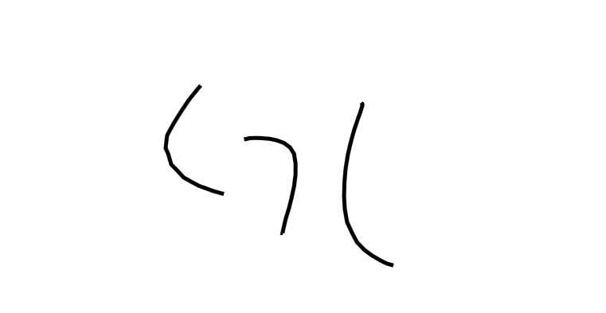
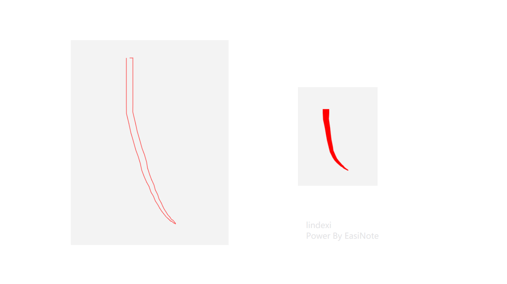
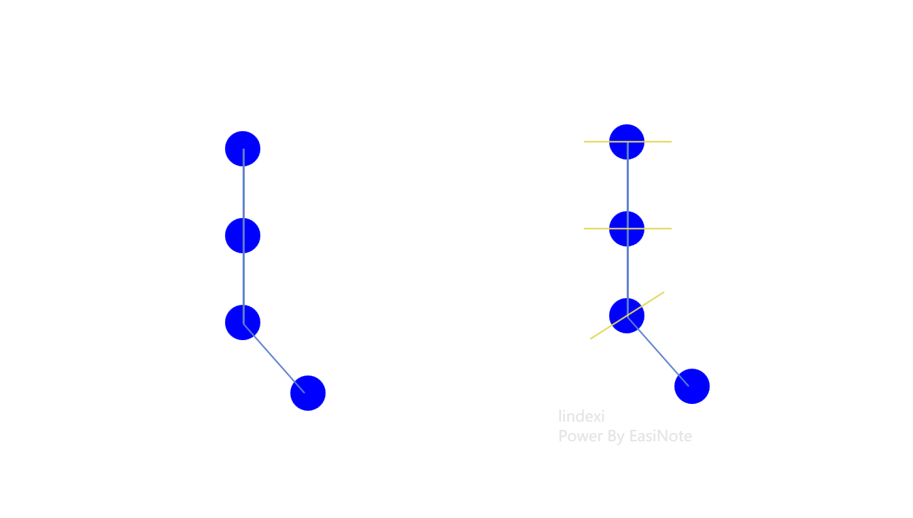
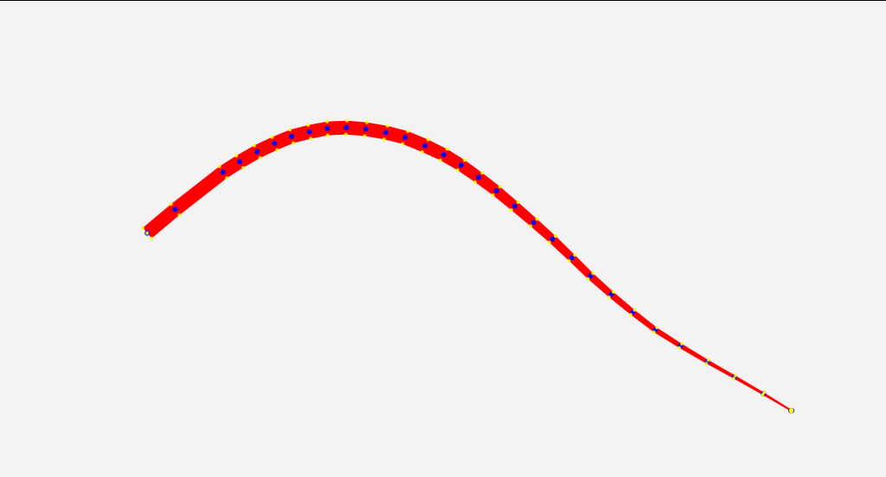
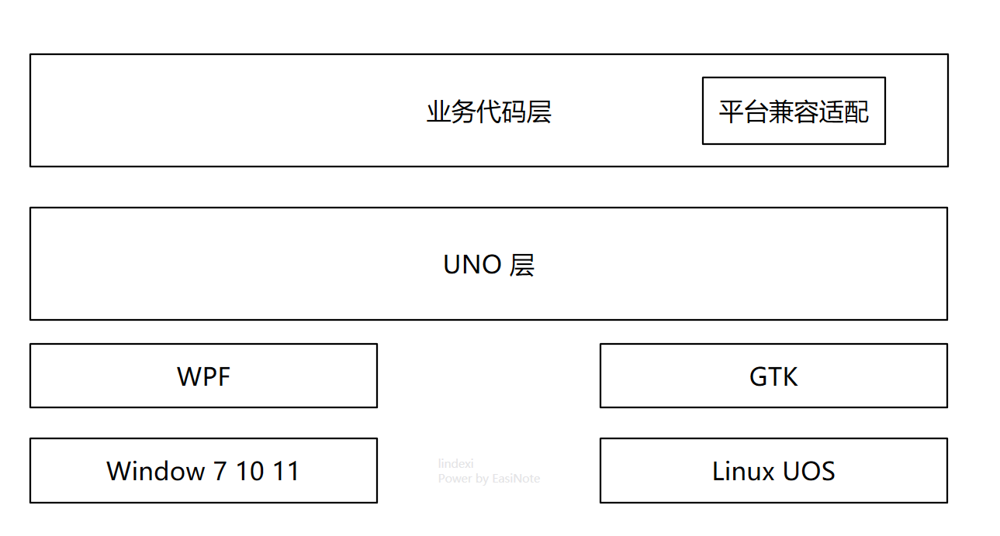

# WPF 笔迹算法 从点集转笔迹轮廓

本文将告诉大家一些笔迹算法，从用户输入的点集，即鼠标轨迹点或触摸轨迹点等，转换为一个可在界面绘制显示笔迹画面的基础数学算法。尽管本文标记的是 WPF 的笔迹算法，然而实际上本文更侧重基础数学计算，理论上可以适用于任何能够支持几何绘制的 UI 框架上，包括 UWP 或 WinUI 或 UNO 或 MAUI 或 Eto 等框架

<!--more-->


<!-- CreateTime:2023/10/10 8:49:27 -->

<!-- 草稿 -->

我将从简单到复杂的顺序描述笔迹算法，本文属于比较偏算法底层，阅读之前请先确保初中的数学知识还没忘了

本文适合于想要了解笔迹绘制更多细节的伙伴，以及期望自己设计出更好看的笔迹的伙伴，以及没事干摸鱼看博客的伙伴

## 最简单的笔迹轨迹算法

大家都知道，无论是鼠标还是触摸还是笔，所产生的数据基本都是点数据。根据点集创建一条笔迹轨迹的一个实现方式是创建一条几何图形，将几何图形绘制到界面上。在 UI 框架的底层里，是不存在笔迹的概念的，只有画图、画文本、画几何图形等基础绘制原语而已。从点集构建出一条几何轨迹最简单的方法是构建一条折线，代码也非常简单，只是将所有的输入点当成折线即可

也就是创建一个 Polyline 对象，不断将输出的点集加入到折线里面。以下是例子代码，先新建一个空 WPF 项目，在 MainWindow.xaml 里添加事件监听，如以下代码

```xml
<Window x:Class="YegeenurcairwheBeahealelbewe.MainWindow"
        xmlns="http://schemas.microsoft.com/winfx/2006/xaml/presentation"
        xmlns:x="http://schemas.microsoft.com/winfx/2006/xaml"
        xmlns:d="http://schemas.microsoft.com/expression/blend/2008"
        xmlns:mc="http://schemas.openxmlformats.org/markup-compatibility/2006"
        xmlns:local="clr-namespace:YegeenurcairwheBeahealelbewe"
        mc:Ignorable="d"
        Title="MainWindow" Height="450" Width="800" StylusDown="MainWindow_OnStylusDown" StylusMove="MainWindow_OnStylusMove" StylusUp="MainWindow_OnStylusUp">
    <Canvas x:Name="InkCanvas">

    </Canvas>
</Window>
```

在后台代码里面，实现事件，以下的代码很简单，相信大家一看就明白

```csharp
public partial class MainWindow : Window
{
    public MainWindow()
    {
        InitializeComponent();
    }

    private void MainWindow_OnStylusDown(object sender, StylusDownEventArgs e)
    {
        var polyline = new Polyline()
        {
            Stroke = Brushes.Black,
            StrokeThickness = 5
        };
        InkCanvas.Children.Add(polyline);

        _pointCache[e.StylusDevice.Id] = polyline;

        foreach (var stylusPoint in e.GetStylusPoints(this))
        {
            polyline.Points.Add(stylusPoint.ToPoint());
        }
    }

    private void MainWindow_OnStylusMove(object sender, StylusEventArgs e)
    {
        if (_pointCache.TryGetValue(e.StylusDevice.Id,out var polyline))
        {
            foreach (var stylusPoint in e.GetStylusPoints(this))
            {
                polyline.Points.Add(stylusPoint.ToPoint());
            }
        }
    }

    private void MainWindow_OnStylusUp(object sender, StylusEventArgs e)
    {
        if (_pointCache.Remove(e.StylusDevice.Id, out var polyline))
        {
            foreach (var stylusPoint in e.GetStylusPoints(this))
            {
                polyline.Points.Add(stylusPoint.ToPoint());
            }
        }
    }

    private readonly Dictionary<int/*StylusDeviceId*/, Polyline> _pointCache=new Dictionary<int, Polyline>();
}
```

以上的代码放在[github](https://github.com/lindexi/lindexi_gd/tree/d76fffd214ed5b3aeb99f3593c441b7a12f10d55/HallgaiwhiyiwaLejucona/YegeenurcairwheBeahealelbewe) 和 [gitee](https://gitee.com/lindexi/lindexi_gd/tree/d76fffd214ed5b3aeb99f3593c441b7a12f10d55/HallgaiwhiyiwaLejucona/YegeenurcairwheBeahealelbewe) 欢迎访问

可以通过如下方式获取本文的源代码，先创建一个空文件夹，接着使用命令行 cd 命令进入此空文件夹，在命令行里面输入以下代码，即可获取到本文的代码

```
git init
git remote add origin https://gitee.com/lindexi/lindexi_gd.git
git pull origin d76fffd214ed5b3aeb99f3593c441b7a12f10d55
```

以上使用的是 gitee 的源，如果 gitee 不能访问，请替换为 github 的源。请在命令行继续输入以下代码

```
git remote remove origin
git remote add origin https://github.com/lindexi/lindexi_gd.git
git pull origin d76fffd214ed5b3aeb99f3593c441b7a12f10d55
```

获取代码之后，进入 HallgaiwhiyiwaLejucona\YegeenurcairwheBeahealelbewe 文件夹

尽管以上的代码很简单，但是大家将会发现笔迹不够顺滑，至少比 [WPF 最简逻辑实现多指顺滑的笔迹书写](https://blog.lindexi.com/post/WPF-%E6%9C%80%E7%AE%80%E9%80%BB%E8%BE%91%E5%AE%9E%E7%8E%B0%E5%A4%9A%E6%8C%87%E9%A1%BA%E6%BB%91%E7%9A%84%E7%AC%94%E8%BF%B9%E4%B9%A6%E5%86%99.html) 调用 WPF 自带的笔迹绘制的方法不顺滑好多，而且绘制速度也差好多

<!--  -->


先忘掉 WPF 的上层调用，假如现在咱想要自己编写算法来画一条比 WPF 不会差太多的笔迹轨迹，可以如何做呢。接下来我将继续从简单到复杂的顺序告诉大家不同的算法

## 用两条折线绘制笔迹

上文使用折线的方式可以很简单绘制出笔迹，但是无法实现一条粗细变化的笔迹轨迹。笔迹的粗细变更一般来说和触摸压感相关，换句话说，想要实现跟随触摸压感变更而变更粗细的笔迹轨迹轮廓就需要用到至少比折线更加复杂的方式

接下来介绍的方式是用两条线段绘制笔迹，可以将笔迹元素理解为一个由两条折线构成的闭合 Path 几何形状。如下图所示，笔迹轨迹就是一个 Path 几何形状的填充

<!--  -->


这里如果看完还没理解的话，推荐先暂停下来，先想一想。因为这里有点难描述哈

在这个的基础上，咱的问题就转换为根据输入的点集转换为 Path 几何形状

接下来我将介绍根据输入的点集转换为 Path 几何形状的最简单方法之一，期望以下的方法能够给大家带来一些启示。我将快速给出一些图和文字描述给到大家，方便快速理解整体的思想。然后再给出具体的实现

下图的蓝色的点表示的是当前所输入收到的点集

<!--  -->


接下来求每个点与下一个点相连的射线向量，再算出射线向量的法线方向，在此法线方向上以触摸点的中心向法线两端延伸线段，延伸的线段长度由笔迹粗细配置以及当前触摸点的压感系数决定，如下图，蓝色的线就是射线向量，黄色的线是射线向量的法线方向延伸的线段

<!--  -->


再获取线段的两个端点，如下图，红色的圆点就是延伸的线段的两个端点

<!--  -->


接着将各个线段的端点按照如下图的方式连接起来，各个线段的两个端点分别按照两边连接成两条折线，再将这两条折线和起始点和结束点连接到一起，构成闭合的 Path 几何形状，红色的折线就可以被当成笔迹轨迹的 Path 几何形状

<!--  -->


最后将红色的折线组成的笔迹轨迹的 Path 几何形状填充，填充之后看起来的效果还行

<!--  -->


相信大家看到这里就理解了用两条折线绘制笔迹的方法

接下来我将告诉大家如何使用具体的代码实现用两条折线绘制笔迹

原本我是想继续采用 WPF 项目完成此步骤的演示，但刚好我打开了一个 UNO 框架的项目，于是我就使用 UNO 框架项目作为演示。这里需要说明的是 UNO 和 WPF 之间的关系不是重复的存在，而是相互引用的关系，如下图可以看到 UNO 可以处于 WPF 的上层，换句话说就是使用 UNO 框架时可以将 WPF 当成底层，从这个方面来说，最后构建输出的也依然是一个 WPF 应用

<!--  -->


新建一个 UNO 项目，在 MainPage.xaml 里面监听事件，制作一些准备辅助笔迹绘制的界面逻辑，简单的代码如下

```xml
<Canvas x:Name="InkCanvas" Background="Transparent" PointerPressed="InkCanvas_OnPointerPressed" PointerMoved="InkCanvas_OnPointerMoved" PointerReleased="InkCanvas_OnPointerReleased" PointerCanceled="InkCanvas_OnPointerCanceled"/>
```

在 MainPage.xaml.cs 后台代码里面，根据输入事件的监听，获取到当前的输入点集。这部分代码预计大家一看就明白，我这里就快速跳过

```csharp
    private void InkCanvas_OnPointerPressed(object sender, PointerRoutedEventArgs e)
    {
        var pointerPoint = e.GetCurrentPoint(InkCanvas);
        Point position = pointerPoint.Position;

        var inkInfo = new InkInfo();
        _inkInfoCache[e.Pointer.PointerId] = inkInfo;
        inkInfo.PointList.Add(position);

        DrawStroke(inkInfo);
    }


    private void InkCanvas_OnPointerMoved(object sender, PointerRoutedEventArgs e)
    {
        if (_inkInfoCache.TryGetValue(e.Pointer.PointerId, out var inkInfo))
        {
            var pointerPoint = e.GetCurrentPoint(InkCanvas);
            Point position = pointerPoint.Position;

            inkInfo.PointList.Add(position);
            DrawStroke(inkInfo);
        }
    }

    private void InkCanvas_OnPointerReleased(object sender, PointerRoutedEventArgs e)
    {
        if (_inkInfoCache.Remove(e.Pointer.PointerId, out var inkInfo))
        {
            var pointerPoint = e.GetCurrentPoint(InkCanvas);
            Point position = pointerPoint.Position;
            inkInfo.PointList.Add(position);
            DrawStroke(inkInfo);
        }
    }

    private void InkCanvas_OnPointerCanceled(object sender, PointerRoutedEventArgs e)
    {
        if (_inkInfoCache.Remove(e.Pointer.PointerId, out var inkInfo))
        {
            RemoveInkElement(inkInfo.InkElement);
        }
    }

    private void RemoveInkElement(FrameworkElement? inkElement)
    {
        if (inkElement != null)
        {
            InkCanvas.Children.Remove(inkElement);
        }
    }

    private readonly Dictionary<uint /*PointerId*/, InkInfo> _inkInfoCache = new Dictionary<uint, InkInfo>();

public class InkInfo
{
    public FrameworkElement? InkElement { set; get; }
    public List<StrokePoint> PointList { get; } = new List<StrokePoint>();
}

public readonly record struct StrokePoint(Point Point, float Pressure = 0.5f)
{
    public static implicit operator StrokePoint(Point point) => new StrokePoint(point);
}
```

以上代码没给出的 DrawStroke 则是核心算法，在 InkInfo 里面存放了 PointList 点集。在 DrawStroke 需要根据此点集信息构建出一个 FrameworkElement 类型的对象，这个对象就是笔迹元素对象。按照本文以上的算法原理描述，这个笔迹对象就是在数学上由两段折线组合而成的闭合 Path 几何形状。这里为了简单使用，就使用了内建的 `Microsoft.UI.Xaml.Shapes.Polygon` 类型

使用 Polygon 类型时，最重要的就是获取按照预期顺序的笔迹轮廓点，也就是上文的各个线段的两个端点，也就是如下图里黄色的点

<!--  -->


为了计算笔迹轮廓点集，以下代码封装了 GetOutlinePointList 方法，这个方法需要传入 InkInfo 的 PointList 点集，也就是输入的点集，以及笔迹的大小

```csharp
    public static Point[] GetOutlinePointList(List<StrokePoint> pointList, int inkSize)
    {
        ... // 忽略代码
    }
```

由于咱需要计算射线向量方向，这就意味着至少需要两个点才能计算，于是先加上如下判断逻辑

```csharp
    public static Point[] GetOutlinePointList(List<StrokePoint> pointList, int inkSize)
    {
        if (pointList.Count < 2)
        {
            throw new ArgumentException("小于两个点的无法应用算法");
        }

        ... // 忽略代码
    }
```

如上文的算法，可以看到输出的笔迹轮廓点集，也就是 GetOutlinePointList 的返回值，的元素个数将会是 `pointList` 点集的两倍加二。为什么会是 `pointList` 点集的两倍加二的值？因为如上文的算法，每个原始输入点都可以算出两个端点，再加上最后将首末两个点一共就是两倍加二的值

```csharp
        var pointCount = pointList.Count * 2 /*两边的笔迹轨迹*/ + 1 /*首点重复*/ + 1 /*末重复*/;

        var outlinePointList = new Point[pointCount];
```

接着进行输入的原始点集的循环，计算每个点的射线向量

```csharp
        for (var i = 0; i < pointList.Count; i++)
        {
            var currentPoint = pointList[i];
            var nextPoint = pointList[i + 1]; // 先忽略最后一个点的错误计算

            var x = nextPoint.Point.X - currentPoint.Point.X;
            var y = nextPoint.Point.Y - currentPoint.Point.Y;

            // 拿着纸笔自己画一下吧，这个是简单的数学计算
            double angle = Math.Atan2(y, x) - Math.PI / 2;
        }
```

以上代码的 angle 就是向量角度，于是再计算端点距离输入原始点的距离，即可算出端点坐标

```csharp
            // 笔迹粗细的一半，一边用一半，合起来就是笔迹粗细了
            var halfThickness = inkSize / 2d;

            // 压感这里是直接乘法而已
            halfThickness *= currentPoint.Pressure;
            // 不能让笔迹粗细太小
            halfThickness = Math.Max(0.01, halfThickness);

            var leftX = currentPoint.Point.X + (Math.Cos(angle) * halfThickness);
            var leftY = currentPoint.Point.Y + (Math.Sin(angle) * halfThickness);

            var rightX = currentPoint.Point.X - (Math.Cos(angle) * halfThickness);
            var rightY = currentPoint.Point.Y - (Math.Sin(angle) * halfThickness);

            outlinePointList[i + 1] = new Point(leftX, leftY);
            outlinePointList[pointCount - i - 1] = new Point(rightX, rightY);
```

以上代码只是简单的初中函数计算，相信大家一看就知道

以上的代码实际上是不能运行的，因为最后一个点的计算还没有加上。这里就简单将最后一个点的向量方向记录为前一个点的方向，修改之后的代码如下

```csharp
        double angle = 0.0;
        for (var i = 0; i < pointList.Count; i++)
        {
            var currentPoint = pointList[i];

            // 如果不是最后一点，那就可以和笔迹当前轨迹点的下一点进行计算向量角度
            if (i < pointList.Count - 1)
            {
                var nextPoint = pointList[i + 1];

                var x = nextPoint.Point.X - currentPoint.Point.X;
                var y = nextPoint.Point.Y - currentPoint.Point.Y;

                // 拿着纸笔自己画一下吧，这个是简单的数学计算
                angle = Math.Atan2(y, x) - Math.PI / 2;
            }

            // 笔迹粗细的一半，一边用一半，合起来就是笔迹粗细了
            var halfThickness = inkSize / 2d;

            // 压感这里是直接乘法而已
            halfThickness *= currentPoint.Pressure;
            // 不能让笔迹粗细太小
            halfThickness = Math.Max(0.01, halfThickness);

            var leftX = currentPoint.Point.X + (Math.Cos(angle) * halfThickness);
            var leftY = currentPoint.Point.Y + (Math.Sin(angle) * halfThickness);

            var rightX = currentPoint.Point.X - (Math.Cos(angle) * halfThickness);
            var rightY = currentPoint.Point.Y - (Math.Sin(angle) * halfThickness);

            outlinePointList[i + 1] = new Point(leftX, leftY);
            outlinePointList[pointCount - i - 1] = new Point(rightX, rightY);
        }
```

接着再加上首末两个点就完成了方法

```csharp
    public static Point[] GetOutlinePointList(List<StrokePoint> pointList, int inkSize)
    {
        if (pointList.Count < 2)
        {
            throw new ArgumentException("小于两个点的无法应用算法");
        }

        var pointCount = pointList.Count * 2 /*两边的笔迹轨迹*/ + 1 /*首点重复*/ + 1 /*末重复*/;

        var outlinePointList = new Point[pointCount];

        // 用来计算笔迹点的两点之间的向量角度
        double angle = 0.0;
        for (var i = 0; i < pointList.Count; i++)
        {
            var currentPoint = pointList[i];

            // 如果不是最后一点，那就可以和笔迹当前轨迹点的下一点进行计算向量角度
            if (i < pointList.Count - 1)
            {
                var nextPoint = pointList[i + 1];

                var x = nextPoint.Point.X - currentPoint.Point.X;
                var y = nextPoint.Point.Y - currentPoint.Point.Y;

                // 拿着纸笔自己画一下吧，这个是简单的数学计算
                angle = Math.Atan2(y, x) - Math.PI / 2;
            }

            // 笔迹粗细的一半，一边用一半，合起来就是笔迹粗细了
            var halfThickness = inkSize / 2d;

            // 压感这里是直接乘法而已
            halfThickness *= currentPoint.Pressure;
            // 不能让笔迹粗细太小
            halfThickness = Math.Max(0.01, halfThickness);

            var leftX = currentPoint.Point.X + (Math.Cos(angle) * halfThickness);
            var leftY = currentPoint.Point.Y + (Math.Sin(angle) * halfThickness);

            var rightX = currentPoint.Point.X - (Math.Cos(angle) * halfThickness);
            var rightY = currentPoint.Point.Y - (Math.Sin(angle) * halfThickness);

            outlinePointList[i + 1] = new Point(leftX, leftY);
            outlinePointList[pointCount - i - 1] = new Point(rightX, rightY);
        }

        outlinePointList[0] = pointList[0].Point;
        outlinePointList[pointList.Count + 1] = pointList[^1].Point;
        return outlinePointList;
    }
```


本文的代码放在[github](https://github.com/lindexi/lindexi_gd/tree/8d59a96e0d4e390ae78946ff556a759901961856/HallgaiwhiyiwaLejucona) 和 [gitee](https://gitee.com/lindexi/lindexi_gd/tree/8d59a96e0d4e390ae78946ff556a759901961856/HallgaiwhiyiwaLejucona) 欢迎访问

可以通过如下方式获取本文的源代码，先创建一个空文件夹，接着使用命令行 cd 命令进入此空文件夹，在命令行里面输入以下代码，即可获取到本文的代码

```
git init
git remote add origin https://gitee.com/lindexi/lindexi_gd.git
git pull origin 8d59a96e0d4e390ae78946ff556a759901961856
```

以上使用的是 gitee 的源，如果 gitee 不能访问，请替换为 github 的源。请在命令行继续输入以下代码

```
git remote remove origin
git remote add origin https://github.com/lindexi/lindexi_gd.git
git pull origin 8d59a96e0d4e390ae78946ff556a759901961856
```

获取代码之后，进入 HallgaiwhiyiwaLejucona 文件夹


<a rel="license" href="http://creativecommons.org/licenses/by-nc-sa/4.0/"></a><br />本作品采用<a rel="license" href="http://creativecommons.org/licenses/by-nc-sa/4.0/">知识共享署名-非商业性使用-相同方式共享 4.0 国际许可协议</a>进行许可。欢迎转载、使用、重新发布，但务必保留文章署名[林德熙](http://blog.csdn.net/lindexi_gd)(包含链接:http://blog.csdn.net/lindexi_gd )，不得用于商业目的，基于本文修改后的作品务必以相同的许可发布。如有任何疑问，请与我[联系](mailto:lindexi_gd@163.com)。