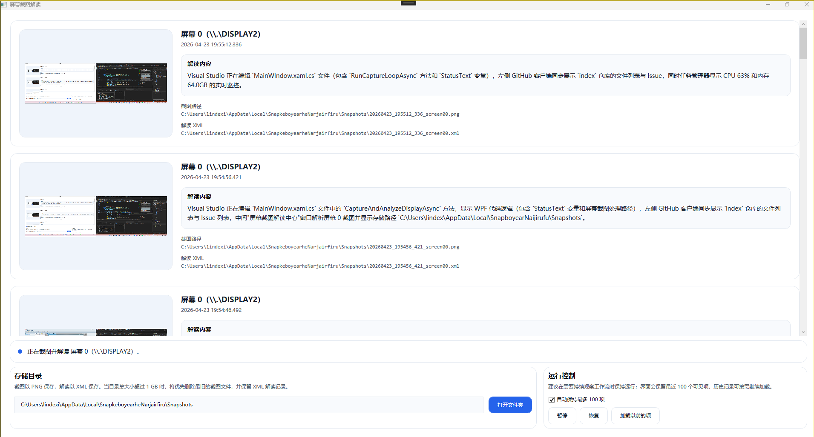

# WPF 结合本地 Ollama 千问多模态实现离线屏幕使用记录工具

本文将告诉大家如何基于 WPF 框架、Windows.Graphics 截图能力和本地部署的千问多模态大模型，实现一款完全离线的屏幕使用记录工具，自动定时截图并解读当前屏幕内容，方便自己回溯一天的工作内容，全程无需联网，完全保障隐私安全。

<!--more-->


<!-- 发布 -->
<!-- 博客 -->

本文内容由 AI 辅助编写

## 界面

以下是在我电脑上跑出来的效果图

<!--  -->


## 背景

我之前一直想统计自己每天的时间分配，清晰了解大部分时间花在哪些应用、哪些任务上，但市面上的同类工具要么需要上传截图到云端，隐私得不到保障，要么只能统计前台应用的驻留时长，没办法知道具体在操作什么内容。同时为了测试本地多模态大模型的能力是否足够成熟，于是就做了这么一款完全离线的屏幕记录工具。

## 技术细节

1. **截图能力**：采用 Windows.Graphics API 实现截图，相比传统 GDI 截图性能更好，资源占用极低，再加上 10 秒截一次，对整机性能几乎没有影响，天然支持多屏幕同时适配。
2. **大模型**：使用本地 Ollama 部署的 qwen3-vl:8b 多模态模型，完全离线运行，不需要把截图传到任何第三方服务器，隐私完全可控，8B 参数的模型在普通消费级显卡上就能流畅运行，一次解读仅需 2-3 秒。
3. **上下文逻辑**：每次解读时会带上最近 10 张截图的历史解读内容，保证上下文连贯性，同时明确要求模型优先信任当前截图的内容，避免历史内容误导解读结果。

## 核心实现

### 1. 大模型解读服务

解读服务的核心是 Prompt 设计，我专门限制了模型的输出规则，避免返回泛泛而谈的无效内容，要求必须明确指出当前打开的应用、文档/页面名称、正在执行的操作，核心代码如下：

```csharp
public ScreenshotAnalysisService(Uri ollamaEndpoint, string modelId)
{
    var ollamaApiClient = new OllamaApiClient(ollamaEndpoint, modelId);
    _agent = new ChatClientAgent(
        ollamaApiClient,
        instructions:
        """
        You analyze desktop screenshots.
        Reply in Chinese with 1-2 sentences.
        Name the visible application, page, or document whenever it can be identified.
        Describe the current task and include only details that are actually visible.
        If a detail is unclear, say so instead of guessing.
        """);
}
```

以上提示词由 GitHub Copilot 编写

调用时需要传入当前截图的字节流、截图时间和最近 10 条历史解读上下文，核心调用逻辑如下：

```csharp
public async Task<string> AnalyzeAsync(
    string imagePath,
    DateTimeOffset capturedAt,
    IReadOnlyCollection<SnapshotAnalysisContext> recentContexts,
    CancellationToken cancellationToken = default)
{
    var imageBytes = await File.ReadAllBytesAsync(imagePath, cancellationToken);
    var message = new ChatMessage
    {
        Role = ChatRole.User,
        Contents =
        [
            new TextContent(BuildPrompt(capturedAt, recentContexts)),
            new DataContent(imageBytes, GetImageMimeType(imagePath))
        ]
    };
    var response = await _agent.RunAsync(message);
    return response.Text?.Trim() ?? "模型没有返回可用的解读内容。";
}
```

这里的 `BuildPrompt` 方法会把最近 10 条历史记录按时间顺序拼接到提示词中，同时明确告知模型历史内容仅作为参考，优先级低于当前截图。

### 2. 定时截图循环

默认 10 秒截图一次，支持多屏幕依次处理，避免同时截图造成性能波动，核心循环逻辑如下：

```csharp
private async Task RunCaptureLoopAsync(CancellationToken cancellationToken)
{
    while (!cancellationToken.IsCancellationRequested)
    {
        foreach (var display in _screenSnapshotProvider.GetDisplays())
        {
            var stopwatch = Stopwatch.StartNew();
            await CaptureAndAnalyzeDisplayAsync(display, cancellationToken);
            // 保证两次截图间隔至少10秒
            var remainingDelay = MinimumCaptureInterval - stopwatch.Elapsed;
            if (remainingDelay > TimeSpan.Zero)
            {
                await Task.Delay(remainingDelay, cancellationToken);
            }
        }
    }
}
```

如果有多块屏幕，会依次处理每块屏幕的截图和解读，处理完所有屏幕后再等待剩余的间隔时间，避免截图频率过高。

### 3. 存储自动清理逻辑

所有截图默认存到 `%LocalAppData%\SnapkeboyearheNarjairfiru\Snapshots` 目录下，截图存 PNG 格式，解读结果存 XML 格式，当目录总大小超过 1G 时，会自动删除最旧的截图文件，但保留 XML 解读记录，既不占用过多磁盘空间，也能保留所有历史解读内容，核心清理代码如下：

```csharp
private async Task<StorageCleanupResult> CleanupStorageIfNeededAsync(CancellationToken cancellationToken)
{
    return await Task.Run(() =>
    {
        var directoryInfo = new DirectoryInfo(StorageFolderPath);
        var totalSize = directoryInfo.EnumerateFiles().Sum(file => file.Length);
        if (totalSize <= 1024L * 1024 * 1024) // 1G存储上限
        {
            return StorageCleanupResult.Empty;
        }
        // 按创建时间升序，优先删除最旧的截图
        var filesToDelete = directoryInfo.EnumerateFiles()
            .Where(file => SnapshotImageExtensions.Contains(file.Extension))
            .OrderBy(file => file.CreationTimeUtc)
            .ToList();
        long releasedBytes = 0;
        int deletedCount = 0;
        foreach (var file in filesToDelete)
        {
            if (totalSize <= 1024L * 1024 * 1024) break;
            var length = file.Length;
            file.Delete();
            totalSize -= length;
            releasedBytes += length;
            deletedCount++;
        }
        return new StorageCleanupResult(deletedCount, releasedBytes);
    }, cancellationToken);
}
```

### 4. 界面实现

界面采用 WPF 开发，使用虚拟化 ListView 展示历史记录，默认最多显示 100 条最近记录，也可以手动加载更多历史，支持暂停/恢复截图、打开存储目录等功能，每个条目显示截图缩略图、截图时间、解读内容、文件路径，如果截图已经被清理，会显示「截图已清理，仅保留 XML 解读」的提示。

## 使用注意事项

1. 首先需要安装 Ollama，官网地址：<https://ollama.com/>，安装完成后执行 `ollama pull qwen3-vl:8b` 拉取千问3多模态模型，如果你的显存小于 8G，可以拉取 `qwen3-vl:4b` 版本，占用显存更小，仅性能略降。
2. 代码中的 `OllamaEndpoint` 需要改成你自己的 Ollama 服务地址，本地部署默认是 `http://localhost:11434`，如果部署在局域网其他设备上也可以填写对应的局域网地址，依然完全内网运行不会泄露数据。
3. 截图间隔可以自行修改 `MinimumCaptureInterval` 常量，默认 10 秒，觉得太频繁可以改成 30 秒或者 1 分钟，进一步降低资源占用。
4. 存储上限可以自行修改 `StorageLimitBytes` 常量，默认 1G，不够用可以改成更大的值。

我自己使用了半天，全程后台运行几乎感知不到性能影响，下班之后（不存在）翻一遍历史记录就能清晰看到一天的时间分配，非常方便，且全程离线完全不用担心隐私泄露问题。还可以在此基础上扩展统计功能，比如自动统计每天花在每个应用上的时长、生成周日报等。

## 代码

本文以上代码放在 [github](https://github.com/lindexi/lindexi_gd/tree/f71fb96117919accc639260f122c819cfbc2890e/SemanticKernelSamples/SnapkeboyearheNarjairfiru) 和 [gitee](https://gitee.com/lindexi/lindexi_gd/tree/f71fb96117919accc639260f122c819cfbc2890e/SemanticKernelSamples/SnapkeboyearheNarjairfiru) 上，可以使用如下命令行拉取代码。我整个代码仓库比较庞大，使用以下命令行可以进行部分拉取，拉取速度比较快

先创建一个空文件夹，接着使用命令行 cd 命令进入此空文件夹，在命令行里面输入以下代码，即可获取到本文的代码

```
git init
git remote add origin https://gitee.com/lindexi/lindexi_gd.git
git pull origin f71fb96117919accc639260f122c819cfbc2890e
```

以上使用的是国内的 gitee 的源，如果 gitee 不能访问，请替换为 github 的源。请在命令行继续输入以下代码，将 gitee 源换成 github 源进行拉取代码。如果依然拉取不到代码，可以发邮件向我要代码

```
git remote remove origin
git remote add origin https://github.com/lindexi/lindexi_gd.git
git pull origin f71fb96117919accc639260f122c819cfbc2890e
```

获取代码之后，进入 SemanticKernelSamples/SnapkeboyearheNarjairfiru 文件夹，即可获取到源代码


<a rel="license" href="http://creativecommons.org/licenses/by-nc-sa/4.0/"></a><br />本作品采用<a rel="license" href="http://creativecommons.org/licenses/by-nc-sa/4.0/">知识共享署名-非商业性使用-相同方式共享 4.0 国际许可协议</a>进行许可。欢迎转载、使用、重新发布，但务必保留文章署名[林德熙](http://blog.csdn.net/lindexi_gd)(包含链接:http://blog.csdn.net/lindexi_gd )，不得用于商业目的，基于本文修改后的作品务必以相同的许可发布。如有任何疑问，请与我[联系](mailto:lindexi_gd@163.com)。