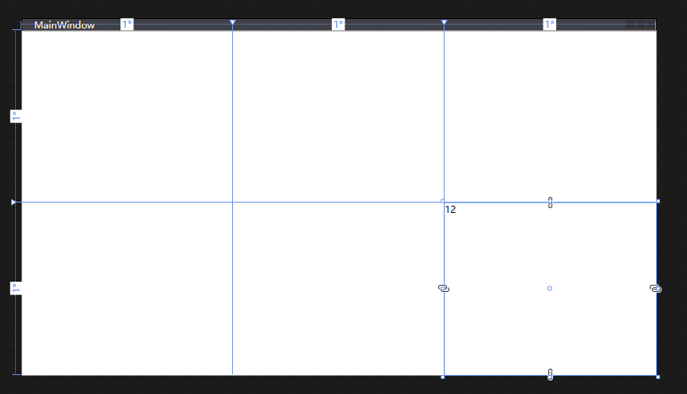

# WPF 给 Grid 的辅助方法 添加行列名称绑定

有一些设计师喜欢改改改，界面的整体布局总是变更，如给 Grid 加一列删一行等，每次这样的更改的时候，都需要小心修改 Grid 里面的元素设置的行列序号。我认为在 Grid 简单的时候，当然大多数时候都应该让 Grid 不那么复杂，那么序号的可读性不错。如果 Grid 行列数量比较多，那么此时行列的序号的可读性将会降低，本文来告诉大家一个简单的方法，可以给 Grid 的行列添加名称绑定，让元素绑定到行列可以不使用序号，而是使用名称

<!--more-->


<!-- 发布 -->

在开始之前让大家看一下效果，我有一个 Grid 的定义如下

```xml
  <Grid>
    <Grid.RowDefinitions>
      <RowDefinition local:GridExtensions.Name="R0" />
      <RowDefinition local:GridExtensions.Name="R1" />
    </Grid.RowDefinitions>
    <Grid.ColumnDefinitions>
      <ColumnDefinition />
      <ColumnDefinition />
      <ColumnDefinition local:GridExtensions.Name="C1" />
    </Grid.ColumnDefinitions>
  </Grid>
```

可以看到我在 Grid 上都附加了属性 GridExtensions.Name 属性，这就是本文的核心，通过附加属性实现让 Grid 的行列名称绑定。给 Grid 的行列一个命名，就可以让元素绑定命名而不是序号

```xml
    <TextBlock local:GridExtensions.RowName="R1" local:GridExtensions.ColumnName="C1" Text="12" />
```

添加一个 TextBlock 绑定行名为 `R1` 的行布局，绑定列是 `C1` 上，在 VisualStudio 设计器上可以看到效果如下

<!--  -->


通过此方法就可以在给 Grid 加行列或删除行列的时候，减少修改一些元素的行列布局。因为元素绑定的是行列的名而不是序号，因此顺序修改的时候不会影响

这个附加属性的实现也非常简单，请看下面代码

```csharp
    public class GridExtensions
    {
        public static readonly DependencyProperty NameProperty = DependencyProperty.RegisterAttached(
            "Name", typeof(string), typeof(GridExtensions), new PropertyMetadata(default(string)));

        public static void SetName(DependencyObject element, string value)
        {
            element.SetValue(NameProperty, value);
        }

        public static string GetName(DependencyObject element)
        {
            return (string) element.GetValue(NameProperty);
        }

        public static readonly DependencyProperty RowNameProperty = DependencyProperty.RegisterAttached(
            "RowName", typeof(string), typeof(GridExtensions),
            new PropertyMetadata(default(string), RowName_PropertyChanged));

        private static void RowName_PropertyChanged(DependencyObject d, DependencyPropertyChangedEventArgs e)
        {
            if (d is FrameworkElement frameworkElement)
            {
                if (e.NewValue is string rowName)
                {
                    if (string.IsNullOrEmpty(rowName))
                    {
                        return;
                    }

                    if (frameworkElement.Parent is Grid grid)
                    {
                        for (var i = 0; i < grid.RowDefinitions.Count; i++)
                        {
                            var gridRowDefinition = grid.RowDefinitions[i];
                            var gridRowName = GetName(gridRowDefinition);
                            if (!string.IsNullOrEmpty(gridRowName) &&
                                gridRowName.Equals(rowName, StringComparison.Ordinal))
                            {
                                Grid.SetRow(frameworkElement, i);
                                return;
                            }
                        }
                    }
                    else
                    {
                        throw new ArgumentException("只有在Grid容器内才能设置 RowName 附加属性");
                    }
                }
            }
        }

        public static void SetRowName(DependencyObject element, string value)
        {
            element.SetValue(RowNameProperty, value);
        }

        public static string GetRowName(DependencyObject element)
        {
            return (string) element.GetValue(RowNameProperty);
        }

        public static readonly DependencyProperty ColumnNameProperty = DependencyProperty.RegisterAttached(
            "ColumnName", typeof(string), typeof(GridExtensions),
            new PropertyMetadata(default(string), ColumnName_PropertyChanged));

        private static void ColumnName_PropertyChanged(DependencyObject d, DependencyPropertyChangedEventArgs e)
        {
            if (d is FrameworkElement frameworkElement)
            {
                if (e.NewValue is string columnName)
                {
                    if (string.IsNullOrEmpty(columnName))
                    {
                        return;
                    }

                    if (frameworkElement.Parent is Grid grid)
                    {
                        for (var i = 0; i < grid.ColumnDefinitions.Count; i++)
                        {
                            var gridColumnDefinition = grid.ColumnDefinitions[i];
                            var gridColumnName = GetName(gridColumnDefinition);
                            if (!string.IsNullOrEmpty(gridColumnName) &&
                                gridColumnName.Equals(columnName, StringComparison.Ordinal))
                            {
                                Grid.SetColumn(frameworkElement, i);
                                return;
                            }
                        }
                    }
                    else
                    {
                        throw new ArgumentException("只有在Grid容器内才能设置 ColumnName 附加属性");
                    }
                }
            }
        }

        public static void SetColumnName(DependencyObject element, string value)
        {
            element.SetValue(ColumnNameProperty, value);
        }

        public static string GetColumnName(DependencyObject element)
        {
            return (string) element.GetValue(ColumnNameProperty);
        }
    }
```

本文所有代码放在 [github](https://github.com/lindexi/lindexi_gd/tree/00e0d126/JurgekebowhawiNofeerileji) 和 [gitee](https://gitee.com/lindexi/lindexi_gd/tree/00e0d126/JurgekebowhawiNofeerileji) 欢迎小伙伴访问

更多请看 [Alias for Grid‘s RowDefinition and ColumnDefinition · Issue #2844 · dotnet/wpf](https://github.com/dotnet/wpf/issues/2844 )


<a rel="license" href="http://creativecommons.org/licenses/by-nc-sa/4.0/"></a><br />本作品采用<a rel="license" href="http://creativecommons.org/licenses/by-nc-sa/4.0/">知识共享署名-非商业性使用-相同方式共享 4.0 国际许可协议</a>进行许可。欢迎转载、使用、重新发布，但务必保留文章署名[林德熙](http://blog.csdn.net/lindexi_gd)(包含链接:http://blog.csdn.net/lindexi_gd )，不得用于商业目的，基于本文修改后的作品务必以相同的许可发布。如有任何疑问，请与我[联系](mailto:lindexi_gd@163.com)。