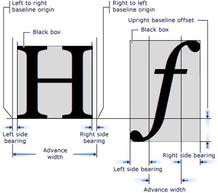

# WPF 获取本机所有字体拿到每个字符的宽度和高度

本文主要采用 GlyphTypeface 类尝试获取每个字符的宽度和高度的值，尽管这个方法和最终 WPF 布局使用的文本的宽度和高度是不相同的，但是依然可以作为参考

<!--more-->


<!-- CreateTime:6/8/2020 11:35:42 AM -->

<!-- 发布 -->

## 获取系统字体文件夹的文件

系统字体文件夹放在 `@"C:\Windows\Fonts"` 本文不讨论用户的系统盘放在其他盘里面

使用 Directory.GetFiles 可以获取所有字体文件

```csharp
   var fileList = Directory.GetFiles(@"C:\Windows\Fonts", "*.ttf");
```

通过 `*.ttf` 可以限定只获取 ttf 文件

## 创建 GlyphTypeface 对象

通过 Uri 传入文件路径可以创建

```csharp
            foreach (var font in fileList)
            {
                var uri = new Uri(font);
                GlyphTypeface g = new GlyphTypeface(uri);
            }
```

## 获取定义的字符的宽度和高度比例

需要注意的是一个字体文件也许会包含多个不同的 FontFamily 因此 FontFamily 创建的时候还需要传入名字进去

```csharp
            foreach (var font in fileList)
            {
                var uri = new Uri(font);
                GlyphTypeface g = new GlyphTypeface(uri);

                var charList = g.AdvanceHeights.Keys;

                foreach (var fontName in g.FamilyNames.Values)
                {
                    var fontFamily = new FontFamily(uri, fontName);

                    var fontSize = 10;

                    foreach (var c in charList)
                    {
                        var w = g.AdvanceWidths[c];
                        var h = g.AdvanceHeights[c];

                    }
                }
            }
```

这里拿到的 w 和 h 就是宽度和高度比例

<!--  -->


注意，这个值和最终文本渲染字符大小没有很本质的关系

以下是我提供的一些测试的值，我隐藏了最终渲染字符的大小计算方法，此方法是团队内部 文本框3.0 计算方法，此库可以做出比 PPT 文本框差的多的效果

<!--  -->


```csharp
		size	{1.95666666666667,11.84}	System.Windows.Size
		w	0.466796875	double
		h	0.9443359375	double
		hw	6.0511073253833052	double
		wh	0.165259009009009	double
```

其中 hw 和 wh 的计算方法如下

```csharp
var hw = size.Height / size.Width;
var wh = size.Width / size.Height;
```

[GlyphTypeface Class (System.Windows.Media) ](https://docs.microsoft.com/en-us/dotnet/api/system.windows.media.glyphtypeface?view=netcore-3.1 )


<a rel="license" href="http://creativecommons.org/licenses/by-nc-sa/4.0/"></a><br />本作品采用<a rel="license" href="http://creativecommons.org/licenses/by-nc-sa/4.0/">知识共享署名-非商业性使用-相同方式共享 4.0 国际许可协议</a>进行许可。欢迎转载、使用、重新发布，但务必保留文章署名[林德熙](http://blog.csdn.net/lindexi_gd)(包含链接:http://blog.csdn.net/lindexi_gd )，不得用于商业目的，基于本文修改后的作品务必以相同的许可发布。如有任何疑问，请与我[联系](mailto:lindexi_gd@163.com)。