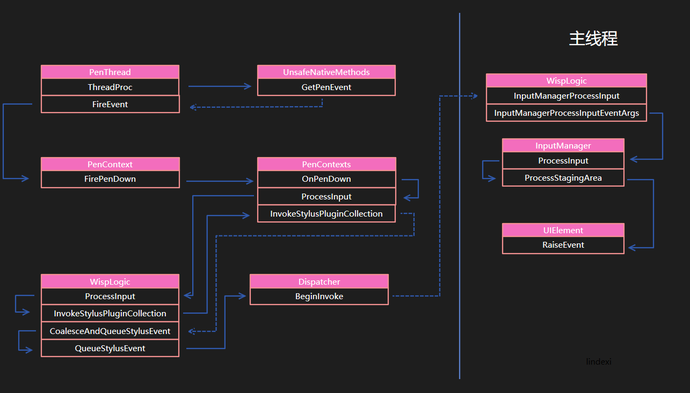
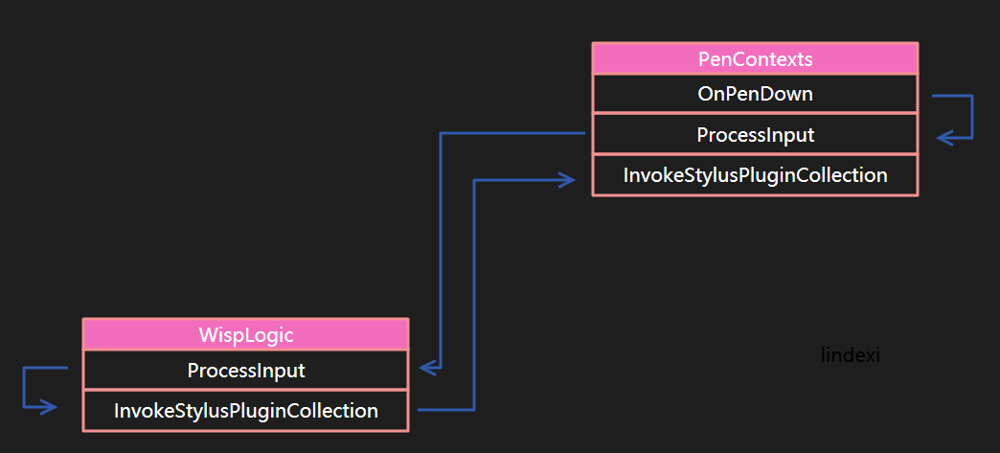
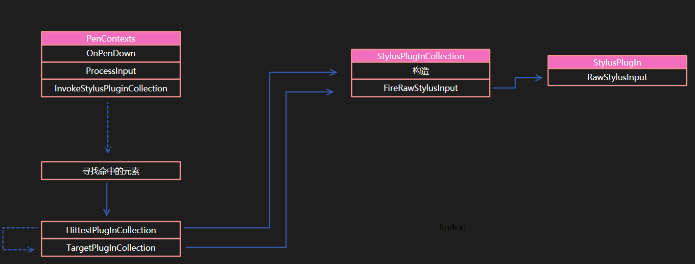
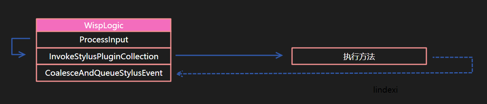
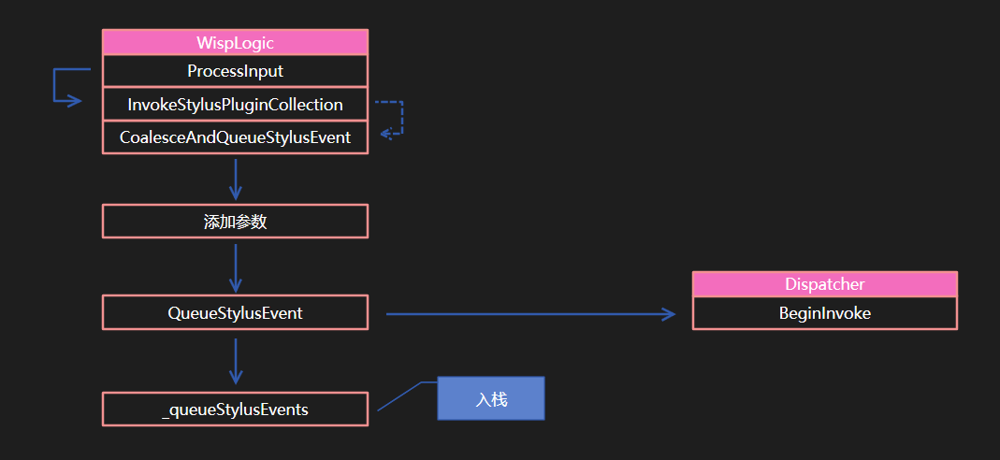
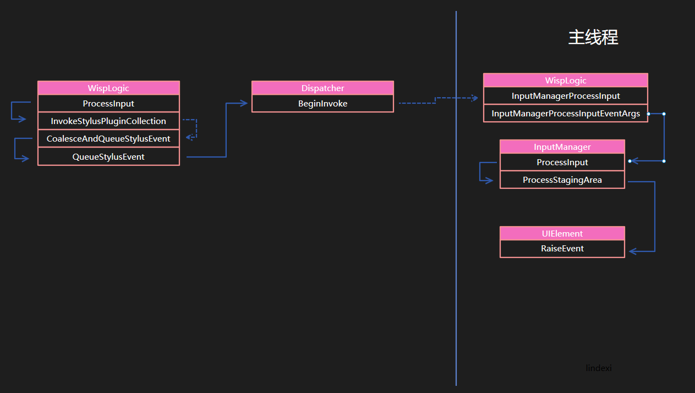
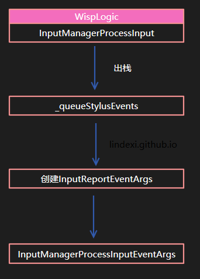
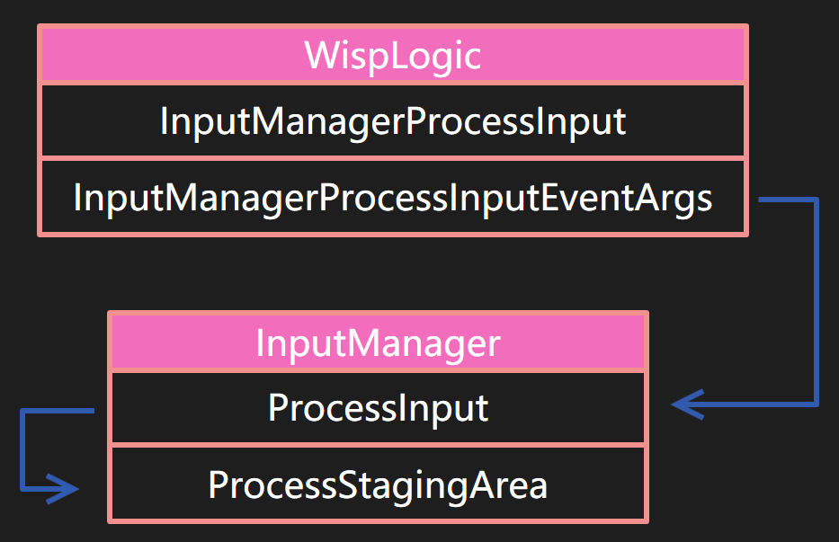
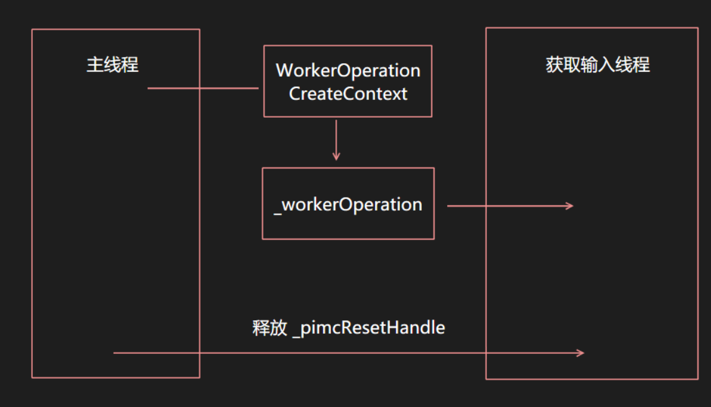
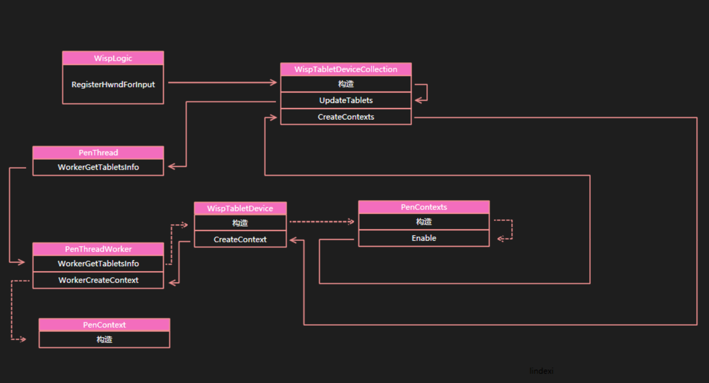

# WPF 触摸到事件

本文从代码底层告诉大家，在触摸屏幕之后是如何拿到触摸点并且转换为事件

<!--more-->


<!-- csdn -->
<!-- 标签：WPF，触摸 -->

在 WPF 需要使用一个线程去获取触摸的信息，这个线程是在 `PenThreadWorker` 创建，在 `PenThreadWorker` 的构造函数有下面代码

```csharp
			new Thread(new ThreadStart(this.ThreadProc))
			{
				IsBackground = true
			}.Start();
```

通过这个方法就可以创建线程运行 `ThreadProc` 这个函数是一个无限循环，请看代码

```csharp
while (!this.__disposed)
{
	// 忽略代码
}
```

这个函数的底层实际上是包括了另一个循环来从 `penimc2_v0400.dll` 拿到触摸信息

如果插入的设备有一个，就会运行 `penimc2_v0400.dll` 里 `GetPenEvent` 拿到触摸的信息。如果有多个就会调用 `GetPenEventMultiple` 方法。这里先不用理会底层的实现，只需要知道底层实现的代码大概就是下面代码

```csharp
		internal void ThreadProc()
		{
			Thread.CurrentThread.Name = "Stylus Input";
			while (!this.__disposed)
			{
				// 初始化的代码
				for (;;)
				{
					// 有一个触摸设备，就进入 GetPenEvent 拿到触摸
					if (this._handles.Length == 1)
					{
						UnsafeNativeMethods.GetPenEvent(一些参数)
						num2 = 0;
					}
					else
					{
						// 有多个触摸设备，就会进入 GetPenEventMultiple 在用户触摸
						UnsafeNativeMethods.GetPenEventMultiple(参数)
					}
					PenContext penContext = xx; // 在触摸对应的 PenContext 是通过判断用户触摸
				
					this.FireEvent(penContext, 参数);
				}
			}
		}
```

通过这个方法可以知道触摸的设备的 id 和触摸的数据，触摸的事件

在拿到触摸信息之后，会调用 `FireEvent` 转换事件，在拿到的信息包括了表示是什么事件，因为触摸的事件是传入一个数值，需要通过这个数值转换为对应的事件

 - 707：PenInRange
 - 708：PenOutOfRange
 - 709：PenDown
 - 710：PenUp
 - 711：Packets

如收到的是 709 事件，就会进入 `FireEvent` 在下面代码使用 `penContext.FirePenDown` 告诉现在是触摸按下

在 FirePenDown 函数会先判断这个触摸是否初始化，每个触摸都有 StylusPointDescription 这个值是使用 `IPimcContext2` 获取 `GetPacketPropertyInfo` 拿到，是触摸屏的设备描述信息里告诉程序这个触摸的精度和触摸宽度

在 `penContext` 传入事件给 `PenContexts.OnPenDown` 这个是在 `PenContexts` 的三个主要事件的一个，可以从代码知道都是调用 `ProcessInput` 只是第一个参数不相同

```csharp
		internal void OnPenDown(PenContext penContext, int tabletDeviceId, int stylusPointerId, int[] data, int timestamp)
		{
			this.ProcessInput(RawStylusActions.Down, penContext, tabletDeviceId, stylusPointerId, data, timestamp);
		}

		internal void OnPenUp(PenContext penContext, int tabletDeviceId, int stylusPointerId, int[] data, int timestamp)
		{
			this.ProcessInput(RawStylusActions.Up, penContext, tabletDeviceId, stylusPointerId, data, timestamp);
		}

		internal void OnPackets(PenContext penContext, int tabletDeviceId, int stylusPointerId, int[] data, int timestamp)
		{
			this.ProcessInput(RawStylusActions.Move, penContext, tabletDeviceId, stylusPointerId, data, timestamp);
		}
```

上面代码传入的 stylusPointerId 、data 都是从刚才的底层拿到的值，这里的 tabletDeviceId 是从 PenContext 拿到，一个触摸的设备都有设备的 id 也就是 tabletDeviceId 的值。触摸的时候会给这个触摸一个 id 就是 stylusPointerId 通过这个在进行移动的时候就知道是哪个触摸点在移动。这个技术是用来解决多点触摸，如果用户有多个点触摸，就需要使用 stylusPointerId 来拿到这个点之前的做法

先告诉大家调用的顺序，不然大家看到下面忘记了点就不知道我在说的是什么了，本文图片画的实线表示方法在方法内调用了下一个方法，使用虚线表示在外面调用完成这个方法之后再调用下一个方法。

```csharp
	
	void A()
	{
		B(); // A和B连接用实线表示
	}

	void C()
	{
		A();
		B(); // A和B连接需要虚线表示 
	}

```

<!--  -->


现在就将事件传入到 ProcessInput 并且告诉 `RawStylusActions` 这个函数会调用 `WispLogic` 的 ProcessInput 在这里使用函数的原因是为了传入的时候加上 `_inputSource` 这里的 `WispLogic` 可能是 StylusLogic 现在的代码就到了比较熟悉的 StylusLogic 函数

在 `WispLogic` 的 `ProcessInput` 会包装输入的参数为 `RawStylusInputReport` 现在这个参数还不需要知道是按下还是移动

```csharp
		internal void ProcessInput(RawStylusActions actions, PenContext penContext, int tabletDeviceId, int stylusDeviceId, int[] data, int timestamp, PresentationSource inputSource)
		{
			RawStylusInputReport inputReport = new RawStylusInputReport(InputMode.Foreground, timestamp, inputSource, penContext, actions, tabletDeviceId, stylusDeviceId, data);
			this.ProcessInputReport(inputReport);
		}
```

这里的第一个参数 `InputMode` 表示的是当前的应用是不是处于前台

然后调用 `WispLogic` 的 `ProcessInput` 传入参数，从这里可以看到，如果一个函数的参数太多，建议创建一个类来传参数。微软在这里做的还是不错

在 `ProcessInput` 需要继续处理参数，使用 StylusDeviceId 找到 `WispStylusDevice` 这个 `WispStylusDevice` 是在 `WispLogic` 的 `RegisterStylusDeviceCore` 注册

<!--  -->


在处理完参数会调用 `InvokeStylusPluginCollection` 这个函数会回到 PenContexts 请看代码

```csharp
		internal void InvokeStylusPluginCollection(RawStylusInputReport inputReport)
		{
			if (inputReport.StylusDevice != null)
			{
				inputReport.PenContext.Contexts.InvokeStylusPluginCollection(inputReport);
			}
		}
```

<!--  -->


这里需要告诉大家，从读微软的源代码一个很重要的就是学习微软的写法。在这里这样写是可以做到写出尽量短的代码，将一个功能拆到一个函数。如上面的代码，在 `WispLogic` 的 `ProcessInput` 将多个参数转换为一个类，然后再调用重载的 `ProcessInput` 方法。在重载的 `WispLogic` 的 `ProcessInput` 只是用来添加参数，添加完成就调用本地的 `InvokeStylusPluginCollection` 方法，同时 `InvokeStylusPluginCollection` 也只做调用 `PenContexts` 的函数

看到这里也许会认为 PenContexts 和 PenContext 相同的，实际上是两个不同的类。

```csharp
internal sealed class PenContext
{
		internal PenContext( PenContexts contexts /*忽略参数*/)
		{
			this._contexts = contexts;
			
			// 忽略代码
		}

		internal PenContexts Contexts
		{
			[SecurityCritical]
			get
			{
				return this._contexts;
			}
		}
		private PenContexts _contexts;
}
```

```csharp
internal sealed class PenContexts
{
		private PenContext[] _contexts;

		internal void AddContext(uint index)
		{
			PenContext[] array = _contexts;
			PenContext penContext = this._stylusLogic.TabletDevices[(int)index].As<WispTabletDevice>().CreateContext(this._inputSource.Value.CriticalHandle, this);
			array[(int)index] = penContext;
		}		
}
```

如果想知道 `PenContext` 是如何被创建的，请到下一节，因为这里的代码很多

在 PenContexts 的 `InvokeStylusPluginCollection` 就是调用 StylusPlugIn 的核心代码。在触摸的过程会调用 StylusPlugIn 是 WPF 提供的快速拿到触摸的方法，如果是从路由事件，需要等待主线程和其他的代码，这样无法做到比较快拿到触摸。

在 WispLogic 和 PenContexts 都有相同的 `InvokeStylusPluginCollection` 函数，但是 WispLogic 没有实际代码，请看 WispLogic 的代码

```csharp
		internal void InvokeStylusPluginCollection(RawStylusInputReport inputReport)
		{
		    // 忽略代码
			inputReport.PenContext.Contexts.InvokeStylusPluginCollection(inputReport);
			
		}
```

实际上调用了的过程是回到原来的 PenContexts 如果看了下面的图会比较容易知道这个调用的过程，因为刚刚讲了 `PenContext` 担心已经不记得说到 `InvokeStylusPluginCollection` 的调用。

<!--  -->


在 PenContexts 的 InvokeStylusPluginCollection 函数有一个重要的过程就是找到 `StylusPlugIn` 调用

在 PenContexts 有一个数组 `List<StylusPlugInCollection> _plugInCollectionList` 只要在界面添加了 `StylusPlugIn` 就会添加到这个列表，于是通过下面的方法判断是否存在命中测试，如果存在命中测试就调用对应的类

如我在一个 Grid 添加了 `StylusPlugIn` 如果点击了 Grid 所在的范围，那么就会调用对应的类

```csharp
		private StylusPlugInCollection HittestPlugInCollection(Point pt)
		{
			foreach (StylusPlugInCollection stylusPlugInCollection in this._plugInCollectionList)
			{
				if (stylusPlugInCollection.IsHit(pt))
				{
					return stylusPlugInCollection;
				}
			}
			return null;
		}
```

从上面的代码可以知道，找到命中测试的方法是拿到所有的 `StylusPlugIn` 判断命中测试，所以如果一个被其他元素挡住的元素命中测试返回 true 就可以成功被调用。

这个是非常重要的，也就是即使在 WPF 命中测试到元素，而在这个元素下面的元素就不会被命中，但是在 `StylusPlugIn` 依旧会被命中。这里这样做是为了提高性能，因为不能等 WPF 的布局，如果使用元素的布局因为触摸是在另一个线程，所以需要到主线程才可以做到。

为什么触摸一定要在另一个线程，我可以告诉大家是因为笔迹，在用户的笔迹很重要的就是笔迹的从触摸到显示，主线程经常在做很多的事情无法将整个主线程来计算用户的笔画，所以这里就使用了 `StylusPlugIn` 不在主线程，可以用来处理触摸

在 TargetPlugInCollection 函数也就是 InvokeStylusPluginCollection 的核心调用完成之后，如果判断存在值就调用对应的 stylusPlugInCollection 的 FireRawStylusInput 函数，请看 FireRawStylusInput 的实现

```csharp
internal void FireRawStylusInput(RawStylusInput args)
{
	for (int i = 0; i < this.Count; i++)
	{
		StylusPlugIn stylusPlugIn = this[i];
		args.CurrentNotifyPlugIn = stylusPlugIn;
		stylusPlugIn.RawStylusInput(args);
	}
}
```

这里的 stylusPlugInCollection 也就是经过 TargetPlugInCollection 判断命中测试找到的所有 StylusPlugIn 放在一起，通过调用 `RawStylusInput` 的方法调用了 StylusPlugIn 的方法，通过这个方法来调用继承 StylusPlugIn 的类的方法

<!--  -->


具体 StylusPlugIn 的调用本文就不多讲，在调用完成 InvokeStylusPluginCollection 也就是先告诉了很多类触摸了，现在就到了告诉路由事件的时候了。在 WispLogic 的 ProcessInputReport 函数调用 InvokeStylusPluginCollection 完成就会调用 CoalesceAndQueueStylusEvent 这个方法就是从触摸消息转路由的第一个方法，从上面代码可以说明 StylusPlugIn 的执行是比路由事件快，所以要做到比较快的触摸就需要使用这个方法

<!--  -->


函数 CoalesceAndQueueStylusEvent 主要是添加一些参数，然后调用 QueueStylusEvent 函数将触摸的参数放在 `_queueStylusEvents` 也就是一个队列。在将参数放在队列之后通过下面代码告诉主线程

```csharp
		private void QueueStylusEvent(RawStylusInputReport report)
		{
			object stylusEventQueueLock = _stylusEventQueueLock;
			lock(stylusEventQueueLock)
			{
				_queueStylusEvents.Enqueue(report);
			}
			Dispatcher.BeginInvoke(DispatcherPriority.Input, this._dlgInputManagerProcessInput, null);
		}
```

<!--  -->


这里的 `_dlgInputManagerProcessInput` 就是调用 `InputManagerProcessInput` 方法

在 InputManagerProcessInput 就是主线程开始获取触摸的参数

<!--  -->


在 InputManagerProcessInput 主要就是创建 InputReportEventArgs 然后传入 InputManagerProcessInputEventArgs 通过这个函数调用 `InputManager` 的 ProcessInput 从上面图片可以看到是如何调用

```csharp
		public bool ProcessInput(InputEventArgs input)
		{
			if (input == null)
			{
				throw new ArgumentNullException("input");
			}
			this.PushMarker();
			this.PushInput(input, null);
			this.RequestContinueProcessingStagingArea();
			return this.ProcessStagingArea();
		}
```

在 ProcessStagingArea 就会调用 UIElement 的 RaiseEvent 也就是到了路由事件，这里有一些细节，如在触摸传入的数据是如何拿出来，如何从触摸的点找到对应的元素进行路由。

在 WispLogic 的 InputManagerProcessInput 就是主线程从`QueueStylusEvent`放在`_queueStylusEvents`的参数拿出来的函数。下面就是去掉了细节代码

```csharp
		internal object InputManagerProcessInput(object oInput)
		{
			RawStylusInputReport rawStylusInputReport = null;
			WispTabletDevice wispTabletDevice = null;
			object stylusEventQueueLock = this._stylusEventQueueLock;
			lock (stylusEventQueueLock)
			{
				rawStylusInputReport = this._queueStylusEvents.Dequeue();
				wispTabletDevice = rawStylusInputReport.StylusDevice.TabletDevice..As<WispTabletDevice>();
				InputReportEventArgs inputReportEventArgs = new InputReportEventArgs(null, rawStylusInputReport);
				inputReportEventArgs.RoutedEvent = InputManager.PreviewInputReportEvent;
				InputManagerProcessInputEventArgs(inputReportEventArgs);
			}
		}
```

<!--  -->


在 InputManagerProcessInputEventArgs 主要就是调用 InputManager 的 ProcessInput 实际是没有代码

```csharp
		internal void InputManagerProcessInputEventArgs(InputEventArgs input)
		{
			this._inputManager.Value.ProcessInput(input);
		}
```

在  ProcessInput 主要是调用了 ProcessStagingArea 找到元素，然后使用 UIElement.RaiseEvent 从触摸到路由

<!--  -->


在 ProcessStagingArea 函数相对还是比较复杂的，因为  InputManager 负责协调整个 WPF 的输入，包括键盘、鼠标、触摸输入。

因为 InputManager 在 WPF 是非常重要的类，需要重新来讲一下 InputManager 所做的内容。在 WPF 中通过消息循环将不同的消息发送到不同的处理，而 InputManager 就是处理输入相关，这个类会除了从底层的消息和参数转换为路由事件，并且告诉 WPF 触发的是哪个元素的事件。因为 InputManager 是属于整个输入的处理而不是仅触摸，所以本文只告诉大家会在 InputManager 的 ProcessStagingArea 调用 UIElement.RaiseEvent 触发了路由事件。

关于路由事件是如何到触摸对应的元素，就需要大家去看下[InputManager](https://referencesource.microsoft.com/#PresentationCore/Core/CSharp/System/Windows/Input/InputManager.cs,886d7ccef1bb2675 ) 是如何做的

下面来告诉大家触摸的初始化

## 初始化触摸

初始化触摸需要从 Window 的创建开始说，在 Window 类的 Visibility 修改时触发 `_OnVisibilityChanged` 在这个函数就使用 Dispatcher 调用 ShowHelper 而这个函数就是开始初始化

需要吐槽垃圾微软的函数命名，这里的 `_OnVisibilityChanged` 命名一点都不好，建议方法的命名第一个字符大写，不要使用 `_` 开始。

在 ShowHelper 可以忽略很多代码，因为这里没有明显初始化触摸，初始化的代码是调用 `SafeCreateWindowDuringShow` 调用这个函数可以知道这个函数还不是靠近初始化触摸的代码

中间调用的代码大家可以自己看，这里就直接告诉大家函数调用

 - Window.CreateSourceWindowDuringShow
 - Window.CreateSourceWindow
 - HwndSource.HwndSource
 - HwndSource.Initialize
 - HwndStylusInputProvider.HwndStylusInputProvider
 - WispLogic.RegisterHwndForInput

在 HwndSource.Initialize 的初始化是进行判断，如果设置了 `Switch.System.Windows.Input.Stylus.DisableStylusAndTouchSupport` 就可以根据用户设置打开或不打开，如果是为了学习，建议是打开。这个值默认是 false 也就是打开

然后判断 `StylusLogic.IsPointerStackEnabled` 现在在 dotnet framework 4.7 在 win10 可以使用 Pointer 消息，所以创建的是 `HwndPointerInputProvider` 本文使用的是 `HwndStylusInputProvider` 因为在 Pointer 消息就不用使用本文的逻辑

原来的 WPF 是存在很多的触摸的问题，在 win10 的 UWP 解决了很多的触摸问题的原因是使用了 Pointer 消息。原来的 WPF 是无法收到触摸的消息，需要使用 `penimc2_v0400.dll` 使用一个新的线程去拿到触摸的消息，也就是本文在告诉大家的流程。这个方法存在一些问题，参见[WPF 插拔触摸设备触摸失效](https://lindexi.github.io/lindexi/post/WPF-%E6%8F%92%E6%8B%94%E8%A7%A6%E6%91%B8%E8%AE%BE%E5%A4%87%E8%A7%A6%E6%91%B8%E5%A4%B1%E6%95%88.html )所以建议是使用 Pointer 消息可以解决很多触摸的问题


在 WispLogic.RegisterHwndForInput 就是初始化的函数在开始初始化之前需要 `HwndStylusInputProvider.HwndStylusInputProvider` 初始化 StylusLogic 这个类有一个静态属性


```csharp
	internal abstract class StylusLogic
	{

		internal static StylusLogic CurrentStylusLogic
		{
			get
			{
				if (_currentStylusLogic == null)
				{
					StylusLogic.Initialize();
				}
				
				// 忽略代码

				return _currentStylusLogic;
			}
		}
	}
```

在 `StylusLogic.Initialize` 函数会判断当前是不是使用 Pointer 初始化不同的类

```csharp
       if (StylusLogic.IsPointerStackEnabled)
		{
			StylusLogic._currentStylusLogic = new PointerLogic(InputManager.UnsecureCurrent);
		}
		else
		{
			StylusLogic._currentStylusLogic = new WispLogic(InputManager.UnsecureCurrent);
		}
```

本文不告诉大家 PointerLogic 相关的方法，这里假如是创建 `WispLogic` 就会进入构造，这里只是简单的初始化属性

在 HwndStylusInputProvider.HwndStylusInputProvider 除了创建 StylusLogic 还调用 RegisterHwndForInput 这里传入的是 InputManager HwndSource 通过这两个创建 WispTabletDevices 、 PenContexts 并且通过 IPimcManager2 拿到值

在这个函数调用 `penContexts.Enable()` 就可以创建 PenContext 并且使用，如何创建 PenContext 的过程请看下面

## 创建 PenContext 方法

在触摸的时候很重要的就是 PenContext 在 [WPF 插拔触摸设备触摸失效](https://lindexi.github.io/lindexi/post/WPF-%E6%8F%92%E6%8B%94%E8%A7%A6%E6%91%B8%E8%AE%BE%E5%A4%87%E8%A7%A6%E6%91%B8%E5%A4%B1%E6%95%88.html ) 有告诉了大家，如果拿到 `TabletDeviceInfo` 为空就无法创建 PenContext 那么 这两个有什么联系

创建 PenContext 的核心代码是 WispTabletDevice 类的 CreateContext 创建需要 penContextInfo 而这个值是从 `_penThread.WorkerCreateContext` 拿到，在 WispTabletDevice 这个类可以拿到 PenThread 和 tabletInfo 这两个值都是构造传入

在 WispTabletDeviceCollection 是通过 UpdateTablets 更新 `_tablets` 这个函数在  HwndStylusInputProvider.HwndStylusInputProvider 就已经调用

在窗口打开的过程就通过 HwndStylusInputProvider.HwndStylusInputProvider 调用 `penContexts.Enable()` 创建 PenContext 而 PenContext 的创建需要 PenContextInfo 参数，这个参数需要通过 `_penThread.WorkerCreateContext` 创建

调用 `_penThread.WorkerCreateContext` 不是直接在主线程运行而是在 `PenThreadWorker` 的 Stylus Input 线程运行。

调用 `_penThread.WorkerCreateContext` 时，先在 `_workerOperation` 创建 `WorkerOperationCreateContext` 然后释放 `_pimcResetHandle` 等待 Stylus Input 线程运行。

在 Stylus Input 线程会在 `GetPenEventMultiple` 或 `GetPenEventMultiple`  等待 `_pimcResetHandle` 只有在用户触摸或释放 `_pimcResetHandle` 线程才会继续

<!--  -->


这样就创建了 penContext 但是这时还需要将 penContext 加入到 PenThreadWorker 加入的方法是调用 `PenContext.Enable` 通过下面的流程调用 PenThreadWorker.WorkerAddPenContext 添加

```csharp
 	System.Windows.Input.PenThreadWorker.WorkerAddPenContext
 	System.Windows.Input.PenThread.AddPenContext
 	System.Windows.Input.PenThreadPool.GetPenThreadForPenContextHelper
 	System.Windows.Input.PenThreadPool.GetPenThreadForPenContext

```

在 `PenThreadWorker.WorkerAddPenContext` 实际上是添加 `_workerOperation` 的一个值 `WorkerOperationAddContext` 进行添加，也是通过释放 `_pimcResetHandle` 让获得输入的线程运行

在 `WorkerOperationAddContext` 会调用 `PenThreadWorker.AddPenContext` 作为实际添加，通过 `PenThreadWorker.AddPenContext` 会从 PenContext 创建 `_handles` 在触摸线程就是通过判断 `_handles` 数量调用不同的函数

在创建 PenContext 时需要知道创建 PenContext 数量，通过 `WispTabletDeviceCollection.CreateContexts` 遍历从 `UpdateTablets` 更新的 `_tablets` 进行创建。

创建 PenContext 的过程是比较复杂，所以本渣就画了图

<!--  -->


图片的实线就是表示直接在方法内调用，而虚线表示是在这个方法执行完的下一步，也就是不是方法直接调用。

创建 PenContext 需要 penContextInfo 是从 WorkerOperationCreateContext 拿到，底层是调用 IPimcTablet2 拿到需要的值

```csharp
	internal interface IPimcTablet2
	{
		// 其他代码

		void CreateContext(IntPtr handle, [MarshalAs(UnmanagedType.Bool)] bool fEnable, uint timeout, out IPimcContext2 IPimcContext, out int key, out long commHandle);
	}
```

```csharp
					// 下面 _pimcTablet 是 IPimcTablet2
					this._pimcTablet.CreateContext(this._hwnd, true, 250u, out var pimcContext, out var contextId, out var num);
					PenContextInfo result;// 这是结构体
					result.ContextId = contextId;
					result.PimcContext = new SecurityCriticalDataClass<IPimcContext2>(pimcContext);
					result.CommHandle = new SecurityCriticalDataClass<IntPtr>(new IntPtr(num));
					result.WispContextKey = UnsafeNativeMethods.QueryWispContextKey(pimcContext);
					this._result = result;
```


这里很重要的两个值是 `IPimcContext` 和 `commHandle` 在创建 PenContext 主要就需要这两个值，在 PenContext 的字段是 `_pimcContext` `_commHandle` 在上面的获得触摸的过程就需要这两个值

触摸的代码很重要就是拿到 `_handle` 的值，这个值在 `PenThreadWorker.AddPenContext` 创建，实际就是拿 PenContext 的值，请看代码

```csharp
		internal bool AddPenContext(PenContext penContext)
		{
		 	var list = _penContexts;	
		 	list.Add(penContext);
			UnsafeNativeMethods.CheckedLockWispObjectFromGit(penContext.WispContextKey);
			_pimcContexts = new IPimcContext2[list.Count];
			_penContexts = new WeakReference[list.Count];
			_handles = new IntPtr[list.Count];
			_wispContextKeys = new uint[list.Count];
			foreach(var temp in list)
			{				
				_handles[i] = temp.CommHandle;
				_pimcContexts[i] = temp._pimcContext.Value;
				_penContexts[i] = new WeakReference(temp);
				_wispContextKeys[i] = temp.WispContextKey;
			}
		}
```

课件请点击：[https://r302.cc/1eXyB8](https://r302.cc/1eXyB8 )


参见：[WPF应用程序中输入系统介绍 - CSDN博客](https://blog.csdn.net/tanmengwen/article/details/8128992 )

[一站式WPF--Window（一） - 周永恒 - 博客园](https://www.cnblogs.com/Zhouyongh/archive/2009/11/30/1613628.html )


<a rel="license" href="http://creativecommons.org/licenses/by-nc-sa/4.0/"></a><br />本作品采用<a rel="license" href="http://creativecommons.org/licenses/by-nc-sa/4.0/">知识共享署名-非商业性使用-相同方式共享 4.0 国际许可协议</a>进行许可。欢迎转载、使用、重新发布，但务必保留文章署名[林德熙](http://blog.csdn.net/lindexi_gd)(包含链接:http://blog.csdn.net/lindexi_gd )，不得用于商业目的，基于本文修改后的作品务必以相同的许可发布。如有任何疑问，请与我[联系](mailto:lindexi_gd@163.com)。