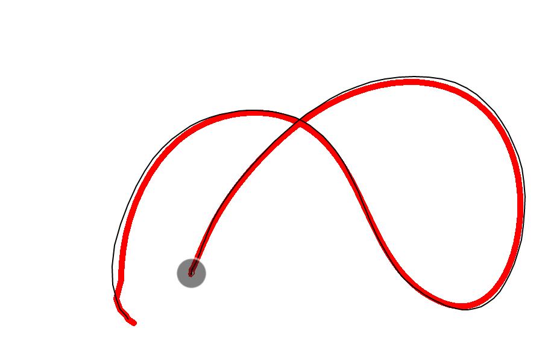
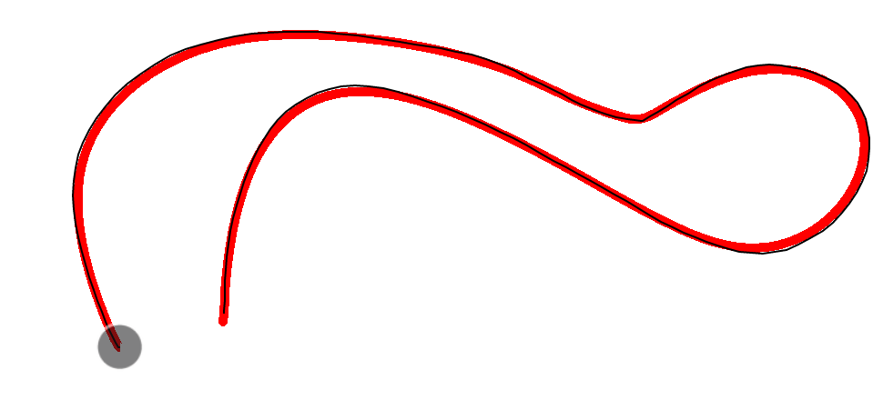
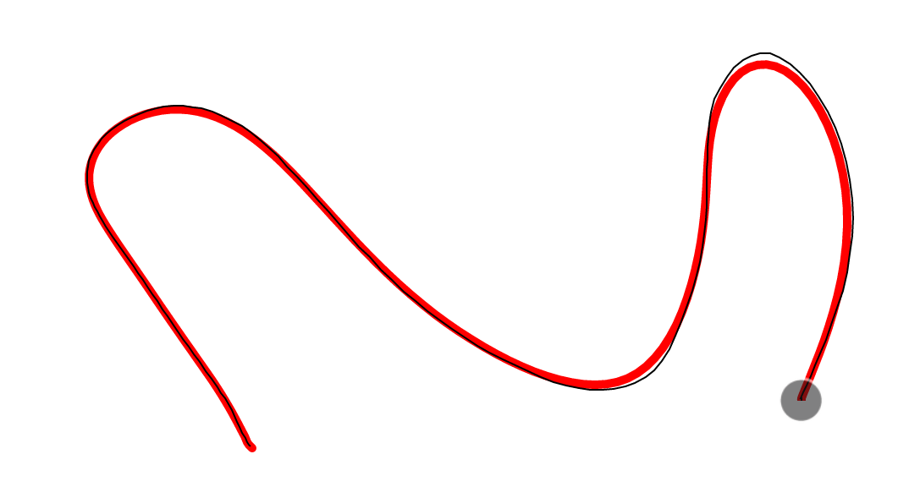

# WPF 记一个特别简单的点集滤波平滑方法

本文记录我想要解决自己从窗口接收 WM_Pointer 消息时，获取到的触摸点不平滑的问题而使用的特别简单且性能垃圾的点集滤波平滑方法

<!--more-->


<!-- CreateTime:2024/08/30 07:07:55 -->

<!-- 发布 -->
<!-- 博客 -->

我的本质错误是使用 WM_POINTER 消息的 [ptPixelLocationRaw](https://learn.microsoft.com/en-us/windows/win32/api/winuser/ns-winuser-pointer_info) 字段而不是 ptHimetricLocationRaw 字段

由于后面在 [walterlv](https://blog.walterlv.com) 的帮助之下修复了触摸点收集，于是就没有真的使用本文提供的点集滤波平滑方法，这就导致了本文提供的代码属于乱遭遭的代码。感谢 [walterlv](https://blog.walterlv.com) 帮忙解决了平滑问题，附带他也给 Avalonia 做了贡献，详细请看 <https://github.com/AvaloniaUI/Avalonia/pull/16850>

故事的开始是我看 Avalonia 使用的是 WM_Pointer 的 [ptPixelLocation](https://learn.microsoft.com/en-us/windows/win32/api/winuser/ns-winuser-pointer_info) 字段，此字段是带预测的，这不符合我预期。为了减少 Avalonia 的干扰，我就写了一个简单的 WPF 程序去接收 WM_Pointer 消息，自己处理消息。然而这个过程里面我发现写出来的笔迹不平滑，远远不如从 Touch 事件里面收到的点平滑

以下是微软 [官方文档](https://learn.microsoft.com/en-us/windows/win32/api/winuser/ns-winuser-pointer_info) 对 [ptPixelLocation](https://learn.microsoft.com/en-us/windows/win32/api/winuser/ns-winuser-pointer_info) 的描述

```
ptPixelLocation

Type: POINT

The predicted screen coordinates of the pointer, in pixels.

The predicted value is based on the pointer position reported by the digitizer and the motion of the pointer. This correction can compensate for visual lag due to inherent delays in sensing and processing the pointer location on the digitizer. This is applicable to pointers of type PT_TOUCH. For other pointer types, the predicted value will be the same as the non-predicted value (see ptPixelLocationRaw).
```

如果做一个笔迹应用，那自然带触摸的点不能作为最终的笔迹的构成，否则会出现毛刺问题。但是根据我的印象，在 Win10 或 Win11 下，笔迹预测不是在 WM_Pointer 层做的，也不知道为什么会在这里放这样的字段。印象里面是在 Ink 模块才会做预测

一般在触摸框硬件层面会做一次平滑算法，但这只是比较粗略的平滑算法，受限于触摸框的计算芯片的性能，也不会做比较复杂的平滑。在 Windows 10 或 11 的 WISP 模块也会做一次平滑，过滤一些杂点，然后就通过 WM_Pointer 扔给应用

这时候理论上应用收到的点应该就是平滑的了，只不过我错误使用了 ptPixelLocationRaw 字段，此字段是 int 类型的，丢失了精度，导致了写出来的笔迹有锯齿

本文是在此基础上进行的优化，编写了一个简单的平滑滤波算法。算法就是当前点的 X 和 Y 分开计算，当前点的 X 取前后各 5 个点的 X 的平均值，然后 Y 也取前后各 5 个点的 Y 的平均值

为了方便我编写这个简单的算法，我从 WM_Pointer 收到的触摸点信息存放到 txt 文件里面，这个文件被我放在 [github](https://github.com/lindexi/lindexi_gd/blob/68654061ac8cced2abe6736141c37bbb6303ccdb/WPFDemo/FalwhekaylearchaKuhiyehakemchaije/output.txt) 上。接下来我的代码将根据这个 [output.txt](https://github.com/lindexi/lindexi_gd/blob/68654061ac8cced2abe6736141c37bbb6303ccdb/WPFDemo/FalwhekaylearchaKuhiyehakemchaije/output.txt) 文件编写算法

算法代码十分简单，代码如下

```csharp
    public static List<double> ApplyMeanFilter(List<double> list, int step)
    {
        var newList = new List<double>(list.Take(step / 2));
        for (int i = step / 2; i < list.Count - step + step / 2; i++)
        {
            newList.Add(list.Skip(i - step / 2).Take(step).Sum() / step);
        }
        newList.AddRange(list.Skip(list.Count - (step - step / 2)));
        return newList;
    }
```

相信这个代码大家一下就看明白了，就是传入一个 list 数组，这个数组是其中一个分量，即使 X 分量或 Y 分量。然后这个 step 在我调用代码里面会传入 10 的值，也就是中间的点应该使用前后各 5 个点的平均值，也就是核心的 `list.Skip(i - step / 2).Take(step).Sum() / step` 代码的含义

以上核心代码就是先使用 Skip 跳过当前的点倒数 step 的一半，也就是之前的 5 个点开始，再使用 Take 取 step 个点，也就是 10 个点，最后调用 Sum 方法获取这 step 个点的和的值，除以 step 获取平均值

前后的 `var newList = new List<double>(list.Take(step / 2));` 和 `newList.AddRange(list.Skip(list.Count - (step - step / 2)));` 仅仅只是因为平滑每个点需要取前后 `step / 2` 个点，即 5 个点，在最前面的 5 个点和最后面的 5 个点没有地方可以取，于是就简单直接加入好了

再对此方法进行封装，允许传入 Point 类型，自动拆分 X 和 Y 分量，代码如下

```csharp
    public static List<Point> ApplyMeanFilter(List<Point> pointList, int step = 10)
    {
        var xList = ApplyMeanFilter(pointList.Select(t => t.X).ToList(), step);
        var yList = ApplyMeanFilter(pointList.Select(t => t.Y).ToList(), step);

        var newPointList = new List<Point>();
        for (int i = 0; i < xList.Count && i < yList.Count; i++)
        {
            newPointList.Add(new Point(xList[i], yList[i]));
        }

        return newPointList;
    }
```

上面代码的性能是比较差的，如果大家想要使用，还请自行优化

我从文件读取了点的信息，然后应用了上面的算法，可以直接使用折线画出比较好看的界面效果

```csharp
    public MainWindow()
    {
        InitializeComponent();

        Loaded += MainWindow_Loaded;
    }

    private void MainWindow_Loaded(object sender, RoutedEventArgs e)
    {
        var file = "output.txt";
        var lines = System.IO.File.ReadAllLines(file);
        var pointList = new List<Point>();
        foreach (var line in lines)
        {
            var match = Regex.Match(line, @"(\d+),(\d+)");
            if (match.Success)
            {
                pointList.Add(new Point(double.Parse(match.Groups[1].ValueSpan), double.Parse(match.Groups[2].ValueSpan)));
            }
        }

        var applyMeanFilter = ApplyMeanFilter(pointList);

        var polyline = new Polyline();
        polyline.Stroke = Brushes.Black;
        polyline.StrokeThickness = 2;
        polyline.Points = new PointCollection(applyMeanFilter);

        RootCanvas.Children.Add(polyline);
    }
```

大家可以自行注释掉平滑过滤，测试前后的平滑度变化

效果图：

<!--  -->


<!--  -->


带边缘采样：

<!--  -->


在实际的大尺寸触摸屏的效果：

<!--  -->


上图的黑色的线就是一条直接从 Move 事件收到的点绘制的折线，红色的线是经过平滑之后的线

本文代码放在 [github](https://github.com/lindexi/lindexi_gd/tree/68654061ac8cced2abe6736141c37bbb6303ccdb/WPFDemo/FalwhekaylearchaKuhiyehakemchaije) 和 [gitee](https://gitee.com/lindexi/lindexi_gd/tree/68654061ac8cced2abe6736141c37bbb6303ccdb/WPFDemo/FalwhekaylearchaKuhiyehakemchaije) 上，可以使用如下命令行拉取代码。我整个代码仓库比较庞大，使用以下命令行可以进行部分拉取，拉取速度比较快

先创建一个空文件夹，接着使用命令行 cd 命令进入此空文件夹，在命令行里面输入以下代码，即可获取到本文的代码

```
git init
git remote add origin https://gitee.com/lindexi/lindexi_gd.git
git pull origin 68654061ac8cced2abe6736141c37bbb6303ccdb
```

以上使用的是国内的 gitee 的源，如果 gitee 不能访问，请替换为 github 的源。请在命令行继续输入以下代码，将 gitee 源换成 github 源进行拉取代码。如果依然拉取不到代码，可以发邮件向我要代码

```
git remote remove origin
git remote add origin https://github.com/lindexi/lindexi_gd.git
git pull origin 68654061ac8cced2abe6736141c37bbb6303ccdb
```

获取代码之后，进入 WPFDemo/FalwhekaylearchaKuhiyehakemchaije 文件夹，即可获取到源代码

更多触摸请看 [WPF 触摸相关](https://blog.lindexi.com/post/WPF-%E8%A7%A6%E6%91%B8%E7%9B%B8%E5%85%B3.html )

更多技术博客，请参阅 [博客导航](https://blog.lindexi.com/post/%E5%8D%9A%E5%AE%A2%E5%AF%BC%E8%88%AA.html )


<a rel="license" href="http://creativecommons.org/licenses/by-nc-sa/4.0/"></a><br />本作品采用<a rel="license" href="http://creativecommons.org/licenses/by-nc-sa/4.0/">知识共享署名-非商业性使用-相同方式共享 4.0 国际许可协议</a>进行许可。欢迎转载、使用、重新发布，但务必保留文章署名[林德熙](http://blog.csdn.net/lindexi_gd)(包含链接:http://blog.csdn.net/lindexi_gd )，不得用于商业目的，基于本文修改后的作品务必以相同的许可发布。如有任何疑问，请与我[联系](mailto:lindexi_gd@163.com)。