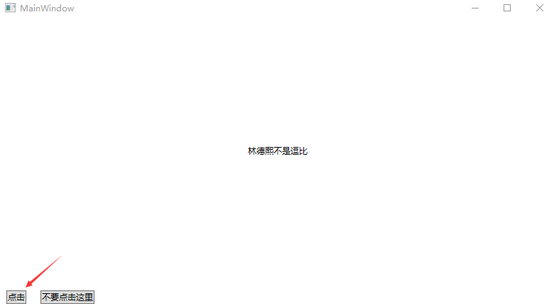
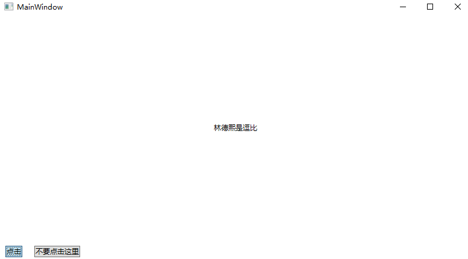

# WPF 调试因为对象不同而绑定失效问题

在 WPF 使用绑定的时候，发现绑定不上，也许是因为绑定的对象不是当前作用的对象的原因。也许是绑定错了对象，或者对象被变更了。本文来告诉大家这个调试思路和方法

<!--more-->


<!-- 发布 -->

使用一个简单的例子来告诉大家，这样比较直观

我有一个简单的应用，这个应用的字符串显示绑定了一个 ToggleButton 也就是下图的写着 点击 的按钮

<!--  -->


在 ToggleButton 的 IsChecked 变化的时候，将会自动更改 TextBlock 的内容

<!--  -->


大概的效果如下图

<!--  -->


界面的代码大概如下

```xml
    <Window.Resources>
        <local:FooConverter x:Key="FooConverter" />
    </Window.Resources>
    <Grid>
        <Grid.RowDefinitions>
            <RowDefinition />
            <RowDefinition Height="Auto" />
        </Grid.RowDefinitions>
        <TextBlock x:Name="TextBlock" HorizontalAlignment="Center" VerticalAlignment="Center"
                   Text="{Binding ElementName=ToggleButton,Path=IsChecked,Converter={StaticResource FooConverter}}" />
        <StackPanel x:Name="Panel" Grid.Row="1" Orientation="Horizontal">
            <ToggleButton x:Name="ToggleButton" Margin="10,10,10,10" Content="点击" Click="ToggleButton_OnClick" />
            <Button Margin="10,10,10,10" Content="不要点击这里" Click="Button_OnClick" />
        </StackPanel>
    </Grid>
```

而 FooConverter 的代码如下

```csharp
    public class FooConverter : IValueConverter
    {
        public object Convert(object value, Type targetType, object parameter, CultureInfo culture)
        {
            if (value is true)
            {
                return "林德熙是逗比";
            }

            return "林德熙不是逗比";
        }

        public object ConvertBack(object value, Type targetType, object parameter, CultureInfo culture)
        {
            throw new NotImplementedException();
        }
    }
```

细心的小伙伴可以看到在上面动态图片的点击里面，在点击了 `不要点击这里` 按钮之后，再次点击 ToggleButton 时，就不会更改 TextBlock 的内容了

看起来就是 TextBlock 的绑定失效了

其中的一个调试思路就是判断绑定的对象是否更改，在后台代码里面，可以在对象状态变更的时候，如 ToggleButton 的 Click 事件，进行绑定对象的判断

通过以下代码可以读取某个对象的某个依赖属性的绑定表达式的值

```csharp
        private void ToggleButton_OnClick(object sender, RoutedEventArgs e)
        {
            var bindingExpression = TextBlock.GetBindingExpression(TextBlock.TextProperty);
        }
```

如果读取不到绑定表达式，那么可以证明这个绑定表达式没替换了，如后台代码给依赖属性赋值，如以下代码

```csharp
    TextBlock.Text = "123";
```

此时的赋值将会替换掉原先的绑定表达式，因此尝试获取绑定表达式将会返回空的值

而如果在获取绑定表达式的时候，可以看到有值，那么也许是绑定的对象不对，可以通过 `bindingExpression.DataItem` 进行判断，如下面代码

```csharp
        private void ToggleButton_OnClick(object sender, RoutedEventArgs e)
        {
            var bindingExpression = TextBlock.GetBindingExpression(TextBlock.TextProperty);
            var toggleButton = (ToggleButton) sender;
            if (ReferenceEquals(toggleButton, bindingExpression.DataItem))
            {
            }
        }
```

此时如果作用的 ToggleButton 和绑定表达式的绑定对象是相同的，那么 ReferenceEquals 将会进入分支

在实际调试的时候，可以看到默认都会进入 ReferenceEquals 返回 true 的分支。而在点击了 `不要点击这里` 按钮之后，将不会进入 ReferenceEquals 返回 true 的分支

这就证明了绑定表达式绑定的对象更改了

而为什么对象更改了，在这个例子里面是谁更改了 ToggleButton 对象，这就需要其他调试手段了。如本文的更改实际是逗比的代码，在 `不要点击这里` 按钮的点击事件里面写了下面代码

```csharp
        private void Button_OnClick(object sender, RoutedEventArgs e)
        {
            var fakeToggleButton = new ToggleButton()
            {
                Margin = new Thickness(10),
                Content = "点击"
            }.Do(button => button.Click += ToggleButton_OnClick);

            Panel.Children.RemoveAt(0);
            Panel.Children.Insert(0, fakeToggleButton);
        }
```

本文代码放在[github](https://github.com/lindexi/lindexi_gd/tree/a196ef71/NairnubalkunuhaJurquneedu)欢迎小伙伴访问


<a rel="license" href="http://creativecommons.org/licenses/by-nc-sa/4.0/"></a><br />本作品采用<a rel="license" href="http://creativecommons.org/licenses/by-nc-sa/4.0/">知识共享署名-非商业性使用-相同方式共享 4.0 国际许可协议</a>进行许可。欢迎转载、使用、重新发布，但务必保留文章署名[林德熙](http://blog.csdn.net/lindexi_gd)(包含链接:http://blog.csdn.net/lindexi_gd )，不得用于商业目的，基于本文修改后的作品务必以相同的许可发布。如有任何疑问，请与我[联系](mailto:lindexi_gd@163.com)。