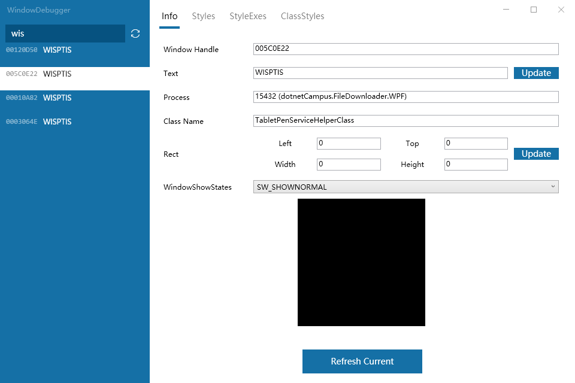

# Win10 的 WPF 程序的 wisptis 服务是附加到进程的窗口

在 Win10 下，没有 WISPTIS 服务进程，和 win7 不相同。但是 WPF 依然通过 PENIMC 从 COM 获取实时触摸消息，那么 WPF 是从哪里获取

<!--more-->
<!-- 发布 -->

通过 [WindowDebugger](https://github.com/kkwpsv/WindowDebugger ) 调试工具可以了解在 win10 将会给每个 WPF 进程添加 WISPTIS 窗口，窗口的 Class Name 是 TabletPenServiceHelperClass 请看下图

<!--  -->

更多关于 WPF 触摸请看

[WPF 触摸底层 PenImc 是如何工作的](https://blog.lindexi.com/post/WPF-%E8%A7%A6%E6%91%B8%E5%BA%95%E5%B1%82-PenImc-%E6%98%AF%E5%A6%82%E4%BD%95%E5%B7%A5%E4%BD%9C%E7%9A%84.html)

[WPF 触摸相关](https://blog.lindexi.com/post/WPF-%E8%A7%A6%E6%91%B8%E7%9B%B8%E5%85%B3.html)